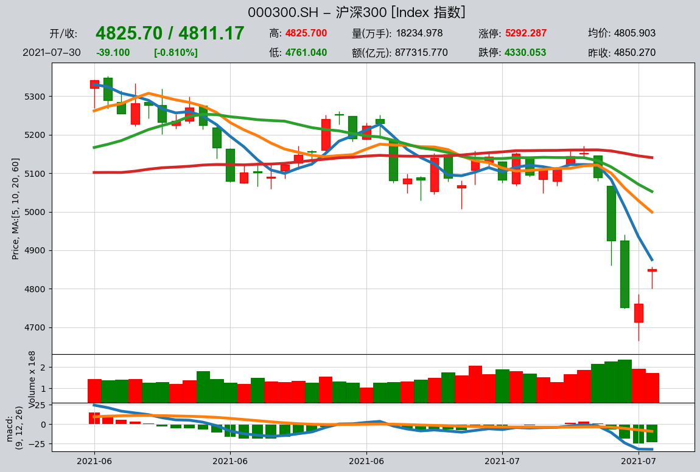
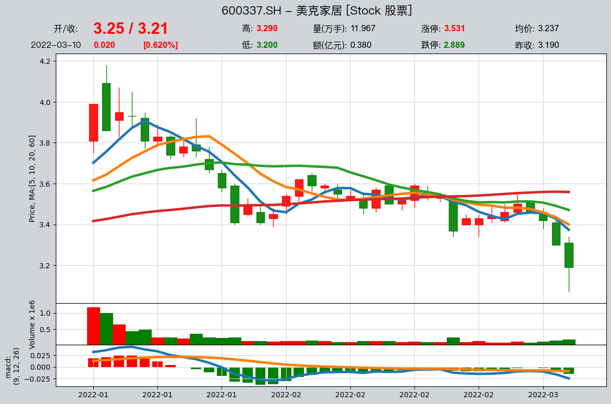
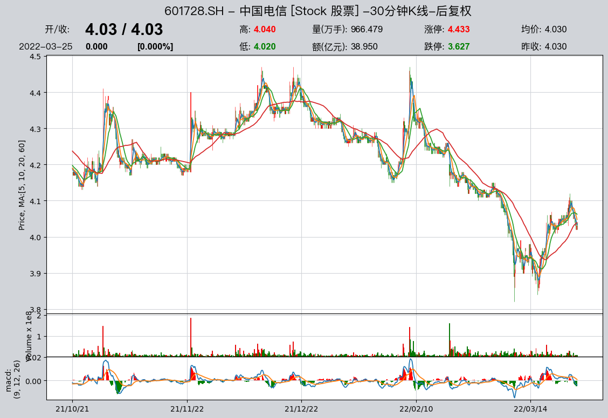
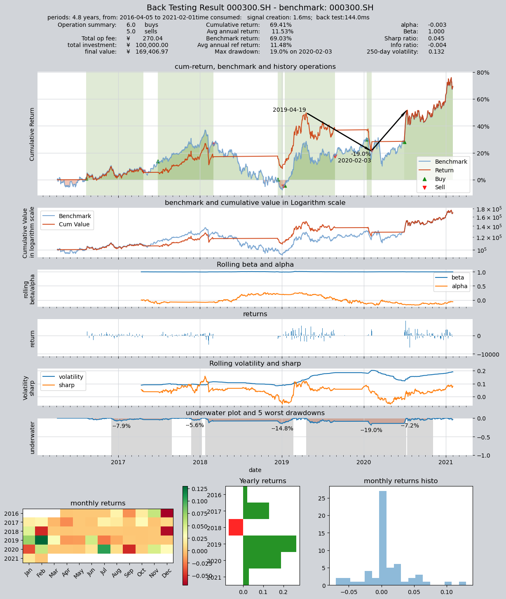

# qteasy -- a python-based fast quantitative investment utility module 一个基于Python的高效量化投资工具包

- Author: **Jackie PENG**

- email: *jackie_pengzhao@163.com* 

- Project created on: 2019, July, 16

## Installation and dependencies 安装及依赖包
This project requires and depends on following packages:
- *`pandas` version 0.25*
- *`numpy` version 0.19*
- *`TA-lib` version 0.4*
- *`tushare pro` version 1.24.1*
- *`matplotlib.mplfinance` version 0.12*

## Introductions 介绍

This project is aiming at a fast quantitative investment package for python, with following functions:

本项目旨在开发一套基于python的本地运行的量化交易策略回测和开发工具，包含以下基本功能

1. Historical stock data acquiring and bundling, visualization 金融历史数据的获取、清洗、整理、可视化及应用
2. Investment strategy creation, backtesting, assessment and optimization 投资交易策略的创建、回测、性能评价及优化
3. Live stock trading: trading operation submission, withdrawal, status checking and feedback reporting 交易策略的部署、实时运行，未来还将实现与自动化交易系统连接、实现自动化交易

The target of this module is to provide effective vectorized backtesting and assessment of investment 
strategies, with highly versertility and flexibility

开发本模块的目标是为量化交易人员提供一套策略开发框架，回测速度快、回测精度高、评价指标全，而且可以非常灵活地实现各种自定义交易策略

##  Gets to know qteasy in 10 Min, 10分钟了解qteasy的功能

- Import the module 模块的导入
- data acquiring 数据的获取和可视化  
- strategy creation 投资策略的创建
- Back-test of strategies 投资策略的回测
- Strategy Optimization 投资策略的优化

The convensional way of importing this package is following:
基本的模块导入方法如下


```python
import qteasy as qt
import matplotlib as mpl
```

Then the classes and functions can be used 模块导入后，工具包中的函数及对象即可以使用了:


```python
ht = qt.HistoryPanel()
op = qt.Operator()
```

### Load and visualize Stock prices 下载股票价格数据并将其可视化 
To use `qteasy`, lots of historical financial data should be prepared and saved locally for back testing and optimizing trading strategies created through a DataSource object defined in qteasy.  Fortunately, these data can be easily loaded through tushare module.

为了使用`qteasy`，需要大量的金融历史数据，所有的历史数据都必须首先保存在本地，通过一个DataSource对象来获取。这些数据可以生成投资策略所需要的历史数据组合，也可以通过简单的命令生成股票的K线图，如果本地没有历史数据，那么qteasy的许多功能就无法执行。

为了使用历史数据，qteasy支持通过tushare金融数据包来获取大量的金融数据，用户需要自行获取相应的权限和积分（详情参考：https://tushare.pro/document/2）
一旦拥有足够的权限，可以通过下面的命令批量拉取所有金融数据并保存在本地，以确保qteasy的相关功能可以正常使用（请注意，由于数据量较大，下载时间较长，建议分批下载。建议使用数据库保存本地数据，不包括分钟数据时，所有数据将占用大约10G的磁盘空间）。关于DataSource对象的更多详细介绍，请参见详细文档。

```python
qt.QT_DATA_SOURCE.refill_data_source('all')
```

股票的数据下载后，使用`candle`命令，如果K线图显示成功，表明价格数据下载成功。


```python
data = qt.candle('000300.SH', start='2021-06-01', end='2021-8-01', asset_type='IDX')
```


    

qteasy的K线图函数candle支持通过六位数股票/指数代码查询准确的证券代码，也支持通过股票、指数名称显示K线图：


```python
data = qt.candle('600337')
```



    

```python
data = qt.candle('招商银行')
```



    


a dynamic candle chart of stock 000300 will be displayed, you can drag the candle plots over to view wider span of data, zoom
in and out with scrolling of your mouse, and switching bewteen multiple indicator lines by double-clicking the chart

生成的K线图可以是一个交互式动态K线图（请注意，K线图基于matplotlib绘制，在使用不同的终端时，显示功能有所区别，某些终端并不支持动态图表，详情请参阅https://matplotlib.org/stable/users/explain/backends.html），在使用动态K线图时，用户可以用鼠标和键盘控制K线图的显示范围：

- 鼠标在图表上左右拖动：可以移动K线图显示更早或更晚的K线
- 鼠标滚轮在图表上滚动，可以缩小或放大K线图的显示范围
- 通过键盘左右方向键，可以移动K线图的显示范围显示更早或更晚的K线
- 通过键盘上下键，可以缩小或放大K线图的显示范围
- 在K线图上双击鼠标，可以切换不同的均线类型
- 在K线图的指标区域双击，可以切换不同的指标类型：MACD，RSI，DEMA


### Create and running of investment strategy sessions  创建一个投资策略，进行回测评价并优化其表现

There are multiple internally preset strategies such as crossline timing strategy or DMA timing strategy provided in
 `qteasy`, a strategy should be created with an `Operator` object, the `Operator` is the container of strategies, and provides
 multiple methods to utilize and operate on these strategies.

`queasy`提供了多种内置交易策略可供用户使用，因此用户不需要手工创建这些策略，可以直接使用内置策略（关于所有内置策略的介绍，请参见详细文档）。复合策略可以通过多个简单的策略混合而成。当复合策略无法达到预计的效果时，可以通过`qteasy.Strategy`类来自定义一个策略。

### Create a DMA timing strategy  生成一个DMA均线择时交易策略

`qteasy`中的所有交易策略都是通过`qteast.Operator`对象来实现回测和运行的，每一个`Operator`对象均包含三种不同的交易策略用途，每一种用途用于生成不同类型的交易信号，以便用于交易的模拟，例如选股信号、择时信号或者风控信号，每种信号类型都可以由一个或多个交易策略来生成，在后面的章节中我们可以详细介绍每一种信号类型以及交易策略，在这里，我们将使用一个内置的DMA均线择时策略来生成一个择时信号，忽略选股和风控信号。

创建一个`Operator`对象，并在创建时传入参数：`strategies='DMA'`，新建一个DMA双均线择时交易策略。


```python
op = qt.Operator(strategies='dma')
```

DMA是一个内置的均线择时策略，它通过计算股票每日收盘价的快、慢两根移动均线的差值DMA与其移动平均值AMA之间的交叉情况来确定多空或买卖
点，这个策略需要三个参数`(s,l,d)`，公式如下：

- DMA = 股价的s日均线 - 股价的l日均线
- AMA = DMA的d日均线

交易规则：

        1， DMA在AMA上方时，多头区间，即DMA线自下而上穿越AMA线，由空变多，产生买入信号
        2， DMA在AMA下方时，空头区间，即DMA线自上而下穿越AMA线，由多变空，产生卖出信号

在默认情况下，三个参数为：`(12,26,9)`, 但我们可以给出任意大于2小于250的三个整数作为策略的参数，以适应不同交易活跃度的股票、或者适应
不同的策略运行周期。除了DMA策略以外，`qteasy`还提供了其他择时策略，详细的列表可以参见`qteasy`的手册。

传递策略参数到op对象中：


```python
op.set_parameter('dma', pars=(23, 166, 196))
```

上面的带把把参数`pars=(23, 166, 196)`传递给DMA策略，`op.set_parameter()`的详细使用方法见手册。


### Back-test strategy  回测并评价交易策略的性能表现

使用默认参数回测策略在历史数据上的表现，请使用`qteasy.run()`，`mode=1`表示进入回测模式，传入参数`visual=False`以文本形式打印结果
`qteasy.run()`的其他可选参数参见手册


```python
res = qt.run(op, mode=1, visual=True)
```

 输出结果如下：
 ```
 ====================================
 |                                  |
 |       BACK TESTING RESULT        |
 |                                  |
 ====================================
 qteasy running mode: 1 - History back testing
 time consumption for operate signal creation: 1.6ms
 time consumption for operation back looping:  144.0ms
 
 investment starts on      2016-04-05 00:00:00
 ends on                   2021-02-01 00:00:00
 Total looped periods:     4.8 year
 -------------operation summary:----------
             Sell     Buy   Total Long pct Short pct Empty pct
 000300.SH    5        6      11   55.6%      0.0%     44.4%   
 
 Total operation fee:     ¥      270.04
 total investment amount: ¥  100,000.00
 final value:              ¥  169,406.97
 Total return:                    69.41% 
 Avg Yearly return:               11.53%
 Skewness:                         -0.47
 Kurtosis:                         14.06
 Benchmark return:                69.03% 
 Benchmark Yearly return:         11.48%
 
 ------strategy loop_results indicators------ 
 alpha:                           -0.003
 Beta:                             1.000
 Sharp ratio:                      0.045
 Info ratio:                      -0.004
 250 day volatility:               0.132
 Max drawdown:                    18.97% 
     peak / valley:        2019-04-19 / 2020-02-03
     recovered on:         2020-07-09
 ===========END OF REPORT=============
 ```

整个回测过程耗时150ms左右，其中交易信号生成共耗费1.6ms，交易回测耗时144ms

根据上面结果，系统使用了沪深300指数从2016年到2021年共4.2年的历史数据来测试策略，在这段时间内，模拟2016年4月5日投入10万元投资于沪深300指数，共产生了6次买入信号和6次卖出信号。在`qteasy`模拟的交易过程中，可以设置丰富的参数，例如：

- 投入资金的数量、日期、或者设置分批多次投入资金；
- 买入和卖出交易的费用、包括佣金费率、最低费用、固定费用、以及滑点。各种费率都可以针对买入和卖出分别设定
- 买入和卖出交易的交割时间，也就是T+N日交割制度
- 买入和卖出交易的最小批量，例如是否允许分数份额交易、还是必须整数份额、甚至整百份交易

最终打印的回测结果是考虑上述所有交易参数之后的最终结果，因此可以看到总交易成本。详细的交易参数设置请参见详细文档。

到2021年2月1日为止，投资总收益为84.05%，年化收益率为15.63%，而同期沪深300指数本身的涨幅为65%，该策略最终是跑赢了大盘的。

另外，`qteasy`还给给出了关于策略表现的几个指标：
如alpha和beta分别是0.026和0.982，而夏普率为0.524。最大回撤发生在2019年4月19日到2020年2月3日，回撤了17.8%，且到了2020年7月6日才翻盘。

在上面的回测结果中我们给出了参数`visual=False`，如果令`visual=True`，就能得到可视化的回测结果，以图表的形式给出：

   
qteasy提供了丰富的策略回测选项，例如：
- 回测开始结束日期
- 回测结果评价指标
- 回测时是否允许持有负数仓位（用于模拟期货交易卖空行为，也可以使用专门的期货交易模拟算法）

更多的选项请参见详细文档

### Optimize strategy  回测并优化交易策略

交易策略的表现往往与参数有关，例如上个例子中的DMA择时策略，如果输入不同的参数，策略回报相差会非常大。qteasy提供了多种不同的策略参数优化算法，帮助搜索最优的策略参数，并且提供多种不同的策略参数检验方法，为策略参数的表现提供独立检验。

要使用策略优化功能，需要设置交易策略的优化标记为1`opt_tag=1`：然后运行`qt.run()`,并使用参数`mode=2`即可:

```python
op.set_parameter('dma', opt_tag=1)
res = qt.run(op, mode=2, visual=True)
```

运行结果如下：

```
Progress: [########################################] 256/256. 100.0%  est performance: 166678.477
Optimization completed, total time consumption: 22"356
Progress: [########################################] 30/30. 100.0%  best performance: 166678.477

==================================== 
|                                  |
|       OPTIMIZATION RESULT        |
|                                  |
====================================

qteasy running mode: 2 - Strategy Parameter Optimization

investment starts on 2016-04-05 00:00:00
ends on 2019-12-31 00:00:00
Total looped periods: 3.7 years.
total investment amount: ¥   100,000.00
Reference index type is 000300.SH at IDX
Total reference return: 25.49% 
Average Yearly reference return rate: 6.26%
statistical analysis of optimal strategy messages indicators: 
total return:        51.12% ± 5.37%
annual return:       11.66% ± 1.05%
alpha:               0.073 ± 0.015
Beta:                1.001 ± 0.001
Sharp ratio:         -60243.641 ± 4426.076
Info ratio:          -0.002 ± 0.005
250 day volatility:  0.116 ± 0.006
other messages indicators are listed in below table

    Strategy items  Sell-outs Buy-ins Total fee Final value  ROI  Reference return  MDD 
0    (50, 140, 168)     3.0      3.0     137.87  144,400.99 44.4%      25.5%       18.2%
1    (77, 187, 114)     3.0      3.0     138.90  144,401.33 44.4%      25.5%       13.5%
2     (71, 97, 179)     5.0      5.0     243.52  144,402.57 44.4%      25.5%       16.3%
3    (64, 179, 113)     3.0      3.0     134.85  144,945.93 44.9%      25.5%       14.3%
4    (68, 140, 119)     4.0      4.0     215.71  145,549.31 45.5%      25.5%       17.3%
5   (112, 181, 134)     3.0      3.0     134.20  145,683.24 45.7%      25.5%       13.5%
6    (15, 158, 238)     3.0      3.0     132.54  145,710.11 45.7%      25.5%       13.5%
7    (121, 147, 94)     4.0      4.0     207.10  145,727.34 45.7%      25.5%       13.5%
8    (46, 148, 235)     3.0      3.0     133.92  148,387.96 48.4%      25.5%       13.5%
9      (41, 12, 96)    19.0     19.0     934.00  148,440.76 48.4%      25.5%       13.3%
10   (42, 242, 116)     3.0      3.0     133.69  149,391.37 49.4%      25.5%       13.5%
11   (77, 226, 130)     3.0      3.0     136.90  149,528.15 49.5%      25.5%       13.5%
12    (77, 129, 27)     8.0      9.0     415.32  149,571.13 49.6%      25.5%       16.1%
13   (118, 185, 99)     4.0      4.0     172.80  150,075.14 50.1%      25.5%       13.5%
14    (103, 25, 31)    12.0     12.0     578.93  150,189.08 50.2%      25.5%       14.6%
15   (67, 187, 103)     3.0      3.0     137.92  150,916.02 50.9%      25.5%       13.5%
16    (50, 59, 240)    11.0     11.0     542.44  150,988.51 51.0%      25.5%       15.9%
17   (40, 151, 205)     3.0      3.0     136.06  151,632.23 51.6%      25.5%       13.5%
18     (23, 16, 90)    27.0     27.0   1,354.92  151,907.72 51.9%      25.5%       13.7%
19   (68, 108, 188)     4.0      4.0     186.28  152,019.68 52.0%      25.5%       13.5%
20    (86, 239, 66)     3.0      3.0     140.18  152,181.50 52.2%      25.5%       13.5%
21   (127, 189, 15)     7.0      7.0     334.07  152,593.38 52.6%      25.5%       13.5%
22   (75, 189, 141)     3.0      3.0     137.54  152,918.85 52.9%      25.5%       13.5%
23     (44, 35, 46)    17.0     18.0     872.20  153,782.77 53.8%      25.5%       13.5%
24    (93, 98, 199)    10.0     11.0     579.22  157,509.64 57.5%      25.5%       13.5%
25   (83, 115, 187)     5.0      5.0     252.18  157,964.73 58.0%      25.5%       13.5%
26   (99, 172, 125)     3.0      3.0     139.78  158,081.82 58.1%      25.5%       13.5%
27    (98, 105, 53)    15.0     16.0     833.06  158,845.97 58.8%      25.5%       13.5%
28   (109, 218, 71)     4.0      4.0     182.44  159,163.17 59.2%      25.5%       13.5%
29    (96, 112, 75)     9.0     10.0     487.25  166,678.48 66.7%      25.5%       13.5%

===========END OF REPORT=============

Progress: [########################################] 30/30. 100.0%  best performance: 125224.605
==================================== 
|                                  |
|       OPTIMIZATION RESULT        |
|                                  |
====================================

qteasy running mode: 2 - Strategy Parameter Optimization

investment starts on 2020-01-06 00:00:00
ends on 2021-02-01 00:00:00
Total looped periods: 1.1 years.
total investment amount: ¥   100,000.00
Reference index type is 000300.SH at IDX
Total reference return: 31.20% 
Average Yearly reference return rate: 28.77%
statistical analysis of optimal strategy messages indicators: 
total return:        7.81% ± 11.54%
annual return:       7.21% ± 10.70%
alpha:               -0.232 ± 0.118
Beta:                0.998 ± 0.004
Sharp ratio:         -41741.003 ± 7294.791
Info ratio:          -0.019 ± 0.044
250 day volatility:  0.156 ± 0.024
other messages indicators are listed in below table

    Strategy items  Sell-outs Buy-ins Total fee Final value  ROI   Reference return  MDD 
0    (50, 140, 168)    1.0      2.0      65.57   102,541.11   2.5%      31.2%       16.6%
1    (77, 187, 114)    1.0      2.0      64.23    99,041.90  -1.0%      31.2%       19.1%
2     (71, 97, 179)    2.0      3.0     104.74    94,039.98  -6.0%      31.2%       16.1%
3    (64, 179, 113)    2.0      3.0     107.47    96,011.43  -4.0%      31.2%       16.3%
4    (68, 140, 119)    2.0      1.0      74.20    90,766.85  -9.2%      31.2%       19.9%
5   (112, 181, 134)    0.0      1.0      30.08   115,385.65  15.4%      31.2%        5.8%
6    (15, 158, 238)    0.0      1.0      30.07   112,976.93  13.0%      31.2%        6.3%
7    (121, 147, 94)    2.0      1.0      75.28   101,439.49   1.4%      31.2%       17.3%
8    (46, 148, 235)    0.0      1.0      30.07   116,268.48  16.3%      31.2%        7.2%
9      (41, 12, 96)    5.0      5.0     209.95   113,151.97  13.2%      31.2%       13.6%
10   (42, 242, 116)    0.0      1.0      30.07   125,224.60  25.2%      31.2%        7.2%
11   (77, 226, 130)    0.0      1.0      30.07   116,037.58  16.0%      31.2%        5.8%
12    (77, 129, 27)    3.0      3.0     145.45    95,443.70  -4.6%      31.2%       12.3%
13   (118, 185, 99)    1.0      2.0      67.92   109,429.65   9.4%      31.2%       16.1%
14    (103, 25, 31)    2.0      2.0      80.05   106,074.92   6.1%      31.2%       16.1%
15   (67, 187, 103)    3.0      4.0     148.01    96,235.64  -3.8%      31.2%       16.6%
16    (50, 59, 240)    2.0      3.0     114.14   121,688.82  21.7%      31.2%        7.2%
17   (40, 151, 205)    0.0      1.0      30.07   125,224.60  25.2%      31.2%        7.2%
18     (23, 16, 90)    6.0      6.0     263.30   121,708.24  21.7%      31.2%        7.1%
19   (68, 108, 188)    2.0      3.0     101.68    89,855.78 -10.1%      31.2%       17.3%
20    (86, 239, 66)    0.0      1.0      30.07   119,494.77  19.5%      31.2%        5.8%
21   (127, 189, 15)    3.0      2.0     123.93   124,645.12  24.6%      31.2%       12.3%
22   (75, 189, 141)    0.0      1.0      30.07   116,037.58  16.0%      31.2%        5.8%
23     (44, 35, 46)    4.0      4.0     156.96   107,524.56   7.5%      31.2%       16.1%
24    (93, 98, 199)    4.0      5.0     199.70   108,731.22   8.7%      31.2%        5.8%
25   (83, 115, 187)    1.0      2.0      72.69   103,731.77   3.7%      31.2%        5.8%
26   (99, 172, 125)    2.0      2.0      77.28   104,081.48   4.1%      31.2%       16.1%
27    (98, 105, 53)    5.0      4.0     199.70   113,791.91  13.8%      31.2%       12.3%
28   (109, 218, 71)    1.0      2.0      66.84   105,845.03   5.8%      31.2%       16.1%
29    (96, 112, 75)    4.0      3.0     139.80    81,794.85 -18.2%      31.2%       25.5%

===========END OF REPORT=============
```

默认情况下，qteasy将在同一段历史数据上反复回测，找到结果最好的30组参数，并把这30组参数在另一段历史数据上进行独立测试，并显示独立测试的结果，同时输出可视化结果如下：
关于策略优化结果的更多解读、以及更多优化参数的介绍，请参见详细文档

   