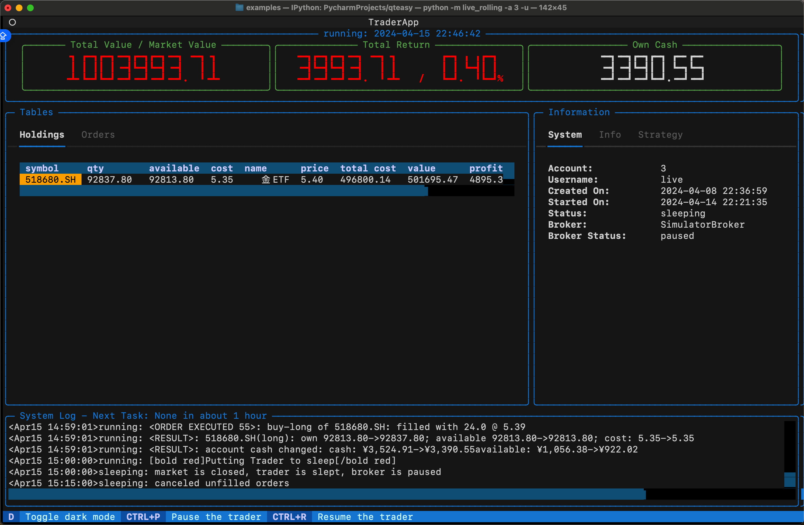
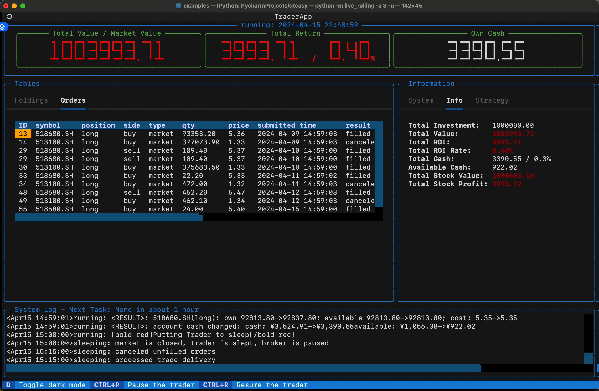
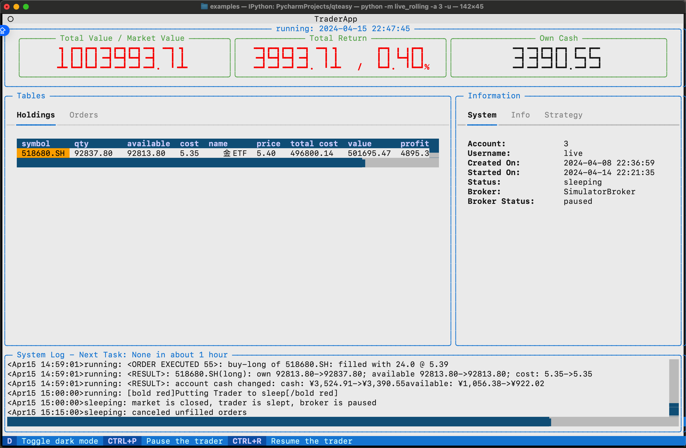
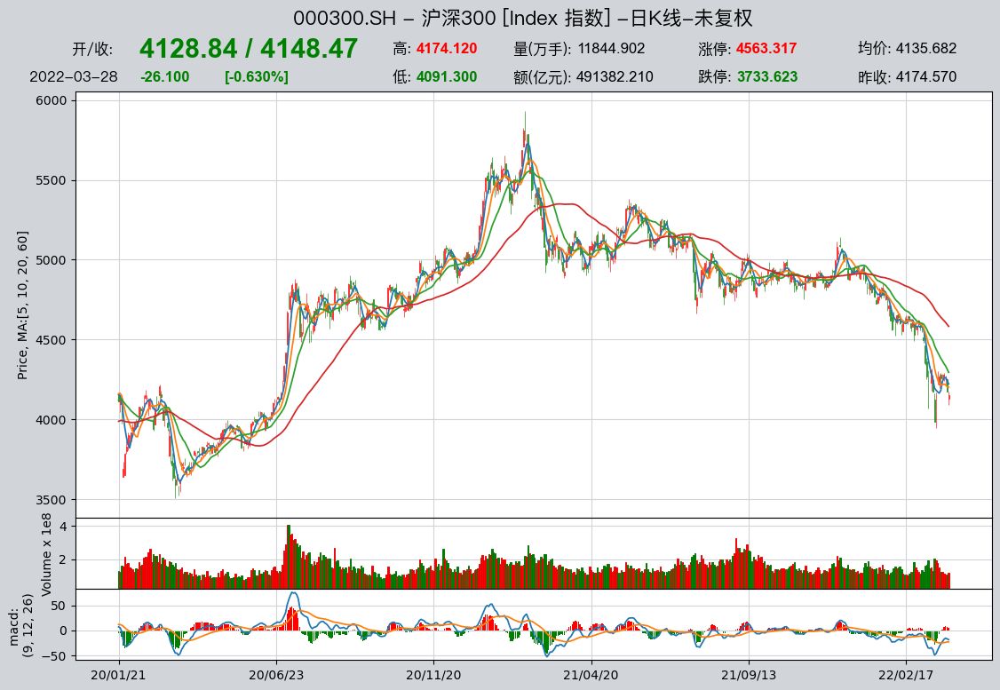
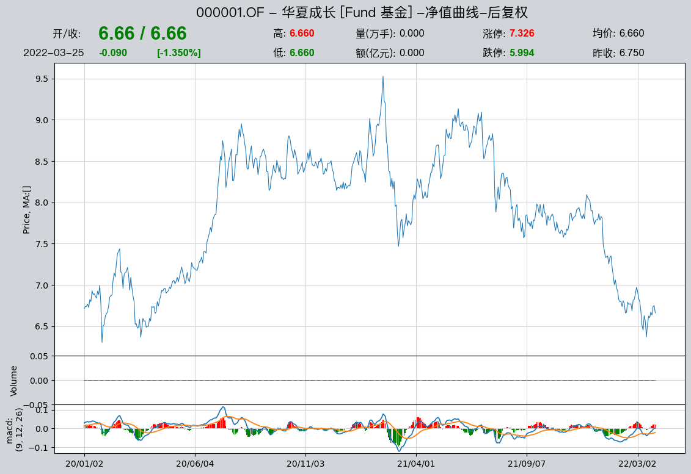
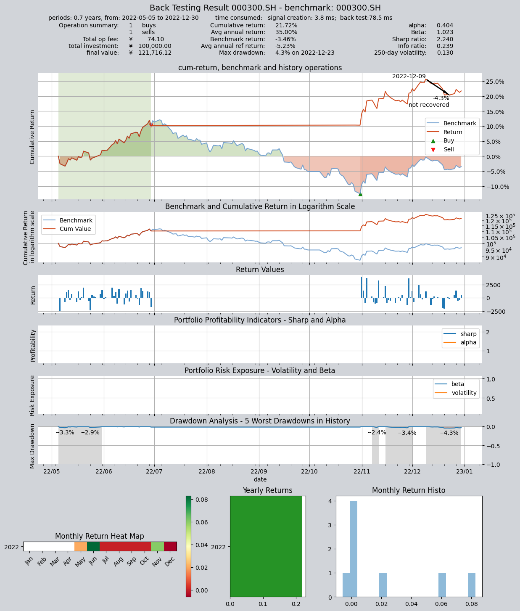
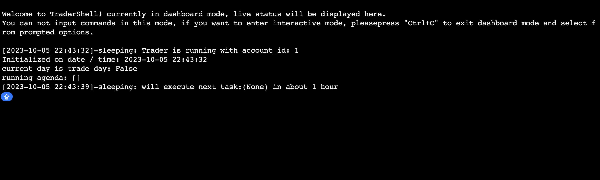
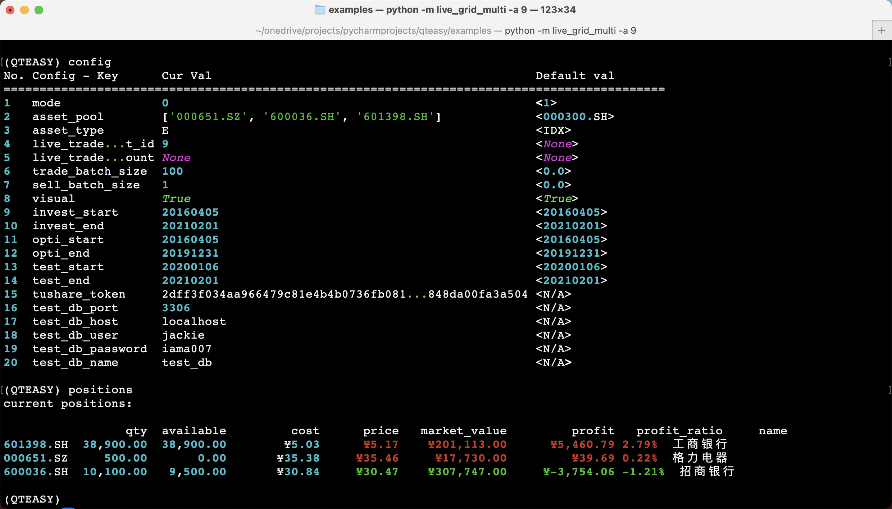

# `qteasy` -- 一个本地化、灵活易用的高效量化投资工具包


[](https://app.travis-ci.com/shepherdpp/qteasy)
[](https://qteasy.readthedocs.io/zh/latest/?badge=latest)


- [`qteasy`能做什么](#qteasy能做什么？)
- [安装](#安装)
- [QTEASY文档](#文档)
- [10分钟了解Qteasy的功能](#10分钟了解QTEASY的功能)
  - [初始配置——本地数据源](#配置本地数据源)
  - [下载股票价格并可视化](#下载金融历史数据)
  - [创建投资策略](#创建一个投资策略)
  - [投资策略的回测和评价](#回测并评价交易策略的性能表现)
  - [投资策略的优化](#交易策略的参数调优)
  - [投资策略的实盘运行](#部署并开始交易策略的实盘运行)

> Note:
> 
> 目前`qteays`正处于密集开发测试阶段，软件中不免存在一些漏洞和bug，如果大家使用中出现问题，欢迎[Issue-报告bug](https://github.com/shepherdpp/qteasy/issues/new?assignees=&labels=&projects=&template=bug-report---bug报告.md&title=)或者[提交新功能需求](https://github.com/shepherdpp/qteasy/issues/new?assignees=&labels=&projects=&template=feature-request---新功能需求.md&title=)给我，也可以进入[讨论区](https://github.com/shepherdpp/qteasy/discussions)参与讨论。也欢迎各位贡献代码！
>
> 我会尽快修复问题并回复大家的问题。

## 关于`qteasy`

- 作者: **Jackie PENG**
- email: *jackie_pengzhao@163.com*
- Created: 2019, July, 16
- Latest Version: `1.2.12`
- License: BSD 3-Clause License

`qteasy`是为量化交易人员开发的一套量化交易工具包，特点如下：

1. **全流程覆盖** 从金融数据获取、存储，到交易策略的开发、回测、优化、实盘运行
2. **完全本地化** 所有的金融数据、策略运算和优化过程完全本地化，不依赖于任何云端服务
3. **使用简单** 提供大量内置交易策略，用户可以搭积木式地创建自己的交易策略
4. **灵活多变** 使用`qteasy`提供的策略类，用户可以自行创建自己的交易策略，灵活设置可调参数

## `qteasy`能做什么？


### **金融历史数据**: 

- 获取、清洗、本地存储大量金融历史数据
- 检索、处理、调用本地数据
- 本地金融数据可视化


### **创建交易策略**

- 提供几十种内置交易策略，可以直接搭积木式使用
- 快速创建自定义交易策略，灵活设置可调参数
- 交易策略的回测、优化、评价，可视化输出回测结果


### **实盘交易模拟**
- 读取实时市场数据，实盘运行交易策略
- 生成交易信号，模拟交易结果
- 跟踪记录交易日志、股票持仓、账户资金变化等信息
- 随时查看交易过程，检查盈亏情况
- 手动控制交易进程、调整交易参数，手动下单

  
  
 

## 安装

```bash
$ pip install qteasy
```

## 文档

关于`QTEASY`系统的更多详细解释和使用方法，请参阅[QTEASY文档](https://qteasy.readthedocs.io/zh/latest/)：


### python 版本
- *`python` version >= 3.6, < 3.13* 

### 安装可选依赖包

`qteasy`所有必要的依赖包都可以在`pip`安装的同时安装好，但某些特殊情况下，您需要在安装时指定可选依赖包，以便在安装`qteasy`时同时安装，或者手动安装依赖包：

- **`pymysql`**, 用于连接`MySQL`数据库,将本地数据存储到`MySQL`数据库（`qteasy`默认使用`csv`文件作为本地数据源，但数据量大时推荐使用`mysql`数据库，详情参见[qteasy使用教程](https://qteasy.readthedocs.io)）
`pymysql`可以在安装`qteasy`时自动安装，也可以手动安装：
    ```bash
    $ pip install 'qteasy[database]'  # 安装qteasy时自动安装pymysql
    $ pip install pymysql  # 手动安装pymysql
    ```
- **`pyarrow`**, 用于操作`feather`文件，将本地数据存储为`feather`文件，`pyarrow`可以在安装`qteasy`时自动安装，也可以手动安装：
    ```bash
    $ pip install 'qteasy[feather]'  # 安装qteasy时自动安装pyarrow
    $ pip install pyarrow  # 手动安装pyarrow
    ```
- **`pytables`**, 用于操作`HDF`文件，将本地数据存储到`HDF`文件，`pytables`不能自动安装，需要使用`conda`手动安装`pytables`：
    ```bash
    $ conda install pytables  # 安装pytables
    ```
- **`ta-lib`**, 以便使用所有的内置交易策略，下面的方法可以安装`ta-lib API`，但它还依赖C语言的`TA-Lib`包，安装方法请参考[FAQ](https://qteasy.readthedocs.io/zh/latest/faq.html#id2)
    ```bash
    $ pip install 'qteasy[talib]'  # 安装qteasy时自动安装ta-lib
    $ pip install ta-lib  # 手动安装ta-lib
    ```

##  10分钟了解qteasy的功能

### 导入`qteasy`
基本的模块导入方法如下

```python
import qteasy as qt
qt.__version__
```

### 配置本地数据源

为了使用`qteasy`，需要大量的金融历史数据，所有的历史数据都必须首先保存在本地，如果本地没有历史数据，那么`qteasy`的许多功能就无法执行。

`qteasy`默认通过`tushare`金融数据包来获取大量的金融数据，用户需要自行申请API Token，获取相应的权限和积分（详情参考：https://tushare.pro/document/2）

因此，在使用`qteasy`之前需要对本地数据源和`tushare`进行必要的配置。在`QT_ROOT_PATH/qteasy/`路径下打开配置文件`qteasy.cfg`，可以看到下面内容：

```
# qteasy configuration file
# following configurations will be loaded when initialize qteasy

# example:
# local_data_source = database
```
#### 配置`tushare token`

将你获得的tushare API token添加到配置文件中，如下所示：


``` commandline
tushare_token = <你的tushare API Token> 
```
#### 配置本地数据源 —— 用MySQL数据库作为本地数据源
默认情况下`qteasy`使用存储在`data/`路径下的`.csv`文件作为数据源，不需要特殊设置。
如果设置使用`mysql`数据库作为本地数据源，在配置文件中添加以下配置：

```text
local_data_source = database  

local_db_host = <host name>
local_db_port = <port number>
local_db_user = <user name>
local_db_password = <password>
local_db_name = <database name>
```

关闭并保存好配置文件后，重新导入`qteasy`，就完成了数据源的配置，可以开始下载数据到本地了。

### 下载金融历史数据 

要下载金融价格数据，使用`qt.refill_data_source()`函数。下面的代码下载2021及2022两年内所有股票、所有指数的日K线数据，同时下载所有的股票和基金的基本信息数据。
（根据网络速度，下载数据可能需要十分钟左右的时间，如果存储为csv文件，将占用大约200MB的磁盘空间）：

```python
qt.refill_data_source(
        tables=['stock_daily',   # 股票的日线价格
                'index_daily',   # 指数的日线价格
                'basics'],       # 股票和基金的基本信息
        start_date='20210101',  # 下载数据的起止时间
        end_date='20221231',  
)
```

数据下载到本地后，可以使用`qt.get_history_data()`来获取数据，如果同时获取多个股票的历史数据，每个股票的历史数据会被分别保存到一个`dict`中。

```python
qt.get_history_data(htypes='open, high, low, close', 
                    shares='000001.SZ, 000300.SH',
                    start='20210101',
                    end='20210115')
```
运行上述代码会得到一个`Dict`对象，包含两个股票"000001.SZ"以及"000005.SZ"的K线数据（数据存储为`DataFrame`）：
```
{'000001.SZ':
              open   high    low  close
 2021-01-04  19.10  19.10  18.44  18.60
 2021-01-05  18.40  18.48  17.80  18.17
 2021-01-06  18.08  19.56  18.00  19.56
 ... 
 2021-01-13  21.00  21.01  20.40  20.70
 2021-01-14  20.68  20.89  19.95  20.17
 2021-01-15  21.00  21.95  20.82  21.00,
 
 '000300.SH':
                  open       high        low      close
 2021-01-04  5212.9313  5284.4343  5190.9372  5267.7181
 2021-01-05  5245.8355  5368.5049  5234.3775  5368.5049
 2021-01-06  5386.5144  5433.4694  5341.4304  5417.6677
 ...
 2021-01-13  5609.2637  5644.7195  5535.1435  5577.9711
 2021-01-14  5556.2125  5568.0179  5458.6818  5470.4563
 2021-01-15  5471.3910  5500.6348  5390.2737  5458.0812}
```
除了价格数据以外，`qteasy`还可以下载并管理包括财务报表、技术指标、基本面数据等在内的大量金融数据，详情请参见[qteasy文档](https://qteasy.readthedocs.io)

股票的数据下载后，使用`qt.candle()`可以显示股票数据K线图。

```python
import qteasy as qt
data = qt.candle('000300.SH', start='2021-06-01', end='2021-8-01', asset_type='IDX')
```


    
`qteasy`的K线图函数`candle`支持通过六位数股票/指数代码查询准确的证券代码，也支持通过股票、指数名称显示K线图
`qt.candle()`支持功能如下：
- 显示股票、基金、期货的K线
- 显示复权价格
- 显示分钟、 周或月K线 
- 显示不同移动均线以及MACD/KDJ等指标

详细的用法请参考文档，示例如下(请先使用`qt.refill_data_source()`下载相应的历史数据)：


```python
import qteasy as qt
# 场内基金的小时K线图
qt.candle('159601', start = '20220121', freq='h')
# 沪深300指数的日K线图
qt.candle('000300', start = '20200121')
# 股票的30分钟K线，复权价格
qt.candle('中国电信', start = '20211021', freq='30min', adj='b')
# 期货K线，三条移动均线分别为9天、12天、26天
qt.candle('沪铜主力', start = '20211021', mav=[9, 12, 26])
# 场外基金净值曲线图，复权净值，不显示移动均线
qt.candle('000001.OF', start='20200101', asset_type='FD', adj='b', mav=[])
```






    

生成的K线图可以是一个交互式动态K线图（请注意，K线图基于`matplotlib`绘制，在使用不同的终端时，显示功能有所区别，某些终端并不支持
动态图表，详情请参阅 [matplotlib文档](https://matplotlib.org/stable/users/explain/backends.html)


在使用动态K线图时，用户可以用鼠标和键盘控制K线图的显示范围：

- 鼠标在图表上左右拖动：可以移动K线图显示更早或更晚的K线
- 鼠标滚轮在图表上滚动，可以缩小或放大K线图的显示范围
- 通过键盘左右方向键，可以移动K线图的显示范围显示更早或更晚的K线
- 通过键盘上下键，可以缩小或放大K线图的显示范围
- 在K线图上双击鼠标，可以切换不同的均线类型
- 在K线图的指标区域双击，可以切换不同的指标类型：MACD，RSI，DEMA


关于`DataSource`对象的更多详细介绍，请参见[qteasy文档](https://qteasy.readthedocs.io)


###  创建一个投资策略

`qteasy`中的所有交易策略都是由`qteast.Operator`（交易员）对象来实现回测和运行的，`Operator`对象是一个策略容器，一个交易员可以同时
管理多个不同的交易策略。

`qteasy`提供了两种方式创建交易策略，详细的说明请参见使用教程：

- **使用内置交易策略组合**
- **通过策略类自行创建策略**

#### 生成一个DMA均线择时交易策略
在这里，我们将使用一个内置的`DMA`均线择时策略来生成一个最简单的大盘择时交易系统。所有内置交易策略的清单和详细说明请参见文档。

创建`Operator`对象时传入参数：`strategies='DMA'`，可以新建一个`DMA`双均线择时交易策略。
创建好`Operator`对象后，可以用`op.info()`来查看它的信息。

```python
import qteasy as qt

op = qt.Operator(strategies='dma')
op.info()
```
现在可以看到`op`中有一个交易策略，ID是`dma`，我们在`Operator`层面设置或修改策略的参数
时，都需要引用这个`ID`。

`DMA`是一个内置的均线择时策略，它通过计算股票每日收盘价的快、慢两根移动均线的差值`DMA`与其移动平均值`AMA`之间的交叉情况来确定多空或买卖点。：

使用`qt.built_ins()`函数可以查看DMA策略的详情，例如：
```python
import qteasy as qt
qt.built_ins('dma')
```
得到：

```
 DMA择时策略

    策略参数：
        s, int, 短均线周期
        l, int, 长均线周期
        d, int, DMA周期
    信号类型：
        PS型：百分比买卖交易信号
    信号规则：
        在下面情况下产生买入信号：
        1， DMA在AMA上方时，多头区间，即DMA线自下而上穿越AMA线后，输出为1
        2， DMA在AMA下方时，空头区间，即DMA线自上而下穿越AMA线后，输出为0
        3， DMA与股价发生背离时的交叉信号，可信度较高

    策略属性缺省值：
    默认参数：(12, 26, 9)
    数据类型：close 收盘价，单数据输入
    采样频率：天
    窗口长度：270
    参数范围：[(10, 250), (10, 250), (8, 250)]
    策略不支持参考数据，不支持交易数据
```
在默认情况下，策略有三个**可调参数**：`(12,26,9)`, 但我们可以给出任意大于2小于250的三个整数作为策略的参数，以适应不同交易活跃度的股票、或者适应
不同的策略运行周期。


### 回测并评价交易策略的性能表现
`qteasy`可以使用历史数据回测策略表现并输出图表如下：


使用默认参数回测刚才建立的DMA策略在历史数据上的表现，可以使用`op.run()`。

```python
import qteasy as qt

op = qt.Operator(strategies='dma')
res = op.run(
        mode=1,                         # 历史回测模式
        asset_pool='000300.SH',         # 投资资产池，即允许投资的股票或指数，此处为沪深300指数
        asset_type='IDX',               # 投资资产类型，IDX表示指数，E表示股票
        invest_cash_amounts=[100000],   # 初始投资资金，此处为10万元
        invest_start='20220501',        # 投资回测开始日期
        invest_end='20221231',          # 投资回测结束日期
        cost_rate_buy=0.0003,           # 买入费率，此处为0.03%
        cost_rate_sell=0.0001,          # 卖出费率，此处为0.01%
        visual=True,                    # 打印可视化回测图表
        trade_log=True                  # 打印交易日志
)
```
输出结果如下：
```
     ====================================
     |                                  |
     |       BACK TESTING RESULT        |
     |                                  |
     ====================================

qteasy running mode: 1 - History back testing
time consumption for operate signal creation: 4.4 ms
time consumption for operation back looping:  82.5 ms

investment starts on      2022-05-05 00:00:00
ends on                   2022-12-30 00:00:00
Total looped periods:     0.7 years.

-------------operation summary:------------
Only non-empty shares are displayed, call 
"loop_result["oper_count"]" for complete operation summary

          Sell Cnt Buy Cnt Total Long pct Short pct Empty pct
000300.SH    6        6      12   56.4%      0.0%     43.6%   

Total operation fee:     ¥      257.15
total investment amount: ¥  100,000.00
final value:              ¥  105,773.09
Total return:                     5.77% 
Avg Yearly return:                8.95%
Skewness:                          0.58
Kurtosis:                          3.54
Benchmark return:                -3.46% 
Benchmark Yearly return:         -5.23%

------strategy loop_results indicators------ 
alpha:                            0.142
Beta:                             1.003
Sharp ratio:                      0.637
Info ratio:                       0.132
250 day volatility:               0.138
Max drawdown:                    11.92% 
    peak / valley:        2022-08-17 / 2022-10-31
    recovered on:         Not recovered!

===========END OF REPORT=============
```


### 交易策略的参数调优

交易策略的表现与参数有关，如果输入不同的参数，策略回报相差会非常大。`qteasy`可以用多种不同的优化算法，帮助搜索最优的策略参数，

要使用策略优化功能，需要设置交易策略的优化标记`opt_tag=1`，并配置环境变量`mode=2`即可:

```python
import qteasy as qt

op = qt.Operator(strategies='dma')
op.set_parameter('dma', opt_tag=1)
res = op.run(mode=2,                    # 优化模式
             opti_start='20220501',     # 优化区间开始日期
             opti_end='20221231',       # 优化区间结束日期
             test_start='20220501',     # 测试区间开始日期
             test_end='20221231',       # 测试区间结束日期
             opti_sample_count=1000,    # 优化样本数量
             visual=True,               # 打印优化结果图表
             parallel=False)            # 不使用并行计算
```

`qteasy`将在同一段历史数据（优化区间）上反复回测，找到结果最好的30组参数，并把这30组参数在另一段历史数据（测试区间）上进行独立测试，并显
示独立测试的结果：
```commandline
==================================== 
|                                  |
|       OPTIMIZATION RESULT        |
|                                  |
====================================

qteasy running mode: 2 - Strategy Parameter Optimization

... # 省略部分输出

# 以下是30组优化的策略参数及其结果（部分结果省略）
    Strategy items Sell-outs Buy-ins ttl-fee     FV      ROI  Benchmark rtn MDD 
0     (35, 69, 60)     1.0      2.0    71.45 106,828.20  6.8%     -3.5%     9.5%
1   (124, 104, 18)     3.0      2.0   124.86 106,900.59  6.9%     -3.5%     7.4%
2   (126, 120, 56)     1.0      1.0    72.38 107,465.86  7.5%     -3.5%     7.5%
...
27   (103, 84, 70)     1.0      1.0    74.84 114,731.44 14.7%     -3.5%     8.8%
28  (143, 103, 49)     1.0      1.0    74.33 116,453.26 16.5%     -3.5%     4.3%
29   (129, 92, 56)     1.0      1.0    74.55 118,811.58 18.8%     -3.5%     4.3%

===========END OF REPORT=============
```

   
将优化后的参数应用到策略中，并再次回测，可以看到结果明显提升：

```python
op.set_parameter('dma', pars=(143, 99, 32))
res = op.run(
        mode=1,                         # 历史回测模式
        asset_pool='000300.SH',         # 投资资产池
        asset_type='IDX',               # 投资资产类型
        invest_cash_amounts=[100000],   # 投资资金
        invest_start='20220501',        # 投资回测开始日期
        invest_end='20221231',          # 投资回测结束日期
        cost_rate_buy=0.0003,           # 买入费率
        cost_rate_sell=0.0001,          # 卖出费率
        visual=True,                    # 打印可视化回测图表
        trade_log=True,                 # 打印交易日志
)
```
结果如下：

   


关于策略优化结果的更多解读、以及更多优化参数的介绍，请参见详细文档

### 部署并开始交易策略的实盘运行

在配置好`Operator`对象并设置好策略后，`qteasy`可以自动定期运行、自动盯盘、自动下载实时数据并根据策略结果生成交易指令，模拟交易过程并记录交易结果。

`Qteasy`的实盘一旦启动，就会在terminal中启动一个单独的线程在后台运行，运行的时机也是跟真实的股票市场一致的，股票市场收市的时候不运行，交易日早上9点15分唤醒系统开始拉取实时股价，9点半开始运行交易策略，交易策略的运行时机和运行频率在策略的属性中设置。如果策略运行的结果产生交易信号，则根据交易信号模拟挂单，挂单成交后修改响应账户资金和股票持仓，交易费用按照设置中的费率扣除。如果资金不足或持仓不足会导致交易失败，当天买入的股票同真实市场一样T+1交割，第二个交易日开始前交割完毕。

```python
import qteasy as qt

# 创建一个交易策略alpha
alpha = qt.get_built_in_strategy('ndayrate')  # 创建一个N日股价涨幅交易策略

# 设置策略的运行参数
alpha.strategy_run_freq = 'd'  # 每日运行
alpha.data_freq = 'd' # 策略使用日频数据
alpha.window_length = 20  # 数据窗口长度
alpha.sort_ascending = False  # 优先选择涨幅最大的股票
alpha.condition = 'greater'  # 筛选出涨幅大于某一个值的股票
alpha.ubound = 0.005  # 筛选出涨幅大于0.5%的股票
alpha.sel_count = 7  # 每次选出7支股票

# 创建一个交易员对象，运行alpha策略
op = qt.Operator(alpha, signal_type='PT', op_type='step')

# 设置策略运行参数
# 交易股票池包括所有的银行股和家用电器股
asset_pool = qt.filter_stock_codes(industry='银行, 家用电器', exchange='SSE, SZSE')

qt.configure(
        mode=0,  # 交易模式为实盘运行
        asset_type='E',  # 交易的标的类型为股票
        asset_pool=asset_pool,  # 交易股票池为所有银行股和家用电器股
        trade_batch_size=100,  # 交易批量为100股的整数倍
        sell_batch_size=1,  # 卖出数量为1股的整数倍
)
```
完成上述设置后，使用下面的代码运行交易策略。

`Qteasy`的实盘运行有一个“账户”的概念，就跟您在股票交易市场开户一样，一个账户可以有自己的持有资金，股票持仓，单独计算盈亏。运行过程中您可以随时终止程序，这时所有的交易记录都会保存下来，下次重新启动时，只要引用上一次运行使用的账户ID（account ID）就可以从上次中断的地方继续运行了，因此启动时需要指定账户，如果不想继续上次的账户，可以新开一个账户运行。

在启动实盘时可以通过`qteasy`的系统配置变量`live_trade_account_name`来指定使用的账户名，系统会自动创建一个新的账户并赋予账户ID；如果想要使用已有的账户，可以在启动时通过`live_trade_account_id`指定账户ID。

```python
qt.run(
        op,
        live_trade_account_id=None,  # 不指定实盘交易账户，给出账户名称并创建一个新的账户
        live_trade_account_name='new_account'
        # 如果想要使用已有的账户，应该指定账户ID同时不给出account_name：
        # live_trade_account_id=1
        # live_trade_account_name=None
        live_trade_ui_type='tui',  # 使用TUI界面监控实盘交易，默认使用CLI界面
)
```

为了对策略运行过程进行监控，同时与`qteasy`进行互动，`qteasy`提供了两种不同的交互界面：

- **`TraderShell`** 交互式命令行界面，可以在命令行中输入命令，查看交易日志、查看持仓、查看账户资金变化等信息：
  
 
- **`TraderApp`** (v1.2.0新增) 交互式图形界面，可以在图形界面中查看交易日志、查看持仓、查看账户资金变化等信息
 
 

上面两种方式都可以在实盘运行时使用，根据`qteasy`的配置参数进入不同的交互界，关于更多实盘运行的介绍，请参见[`QTEASY`文档](https://qteasy.readthedocs.io)
