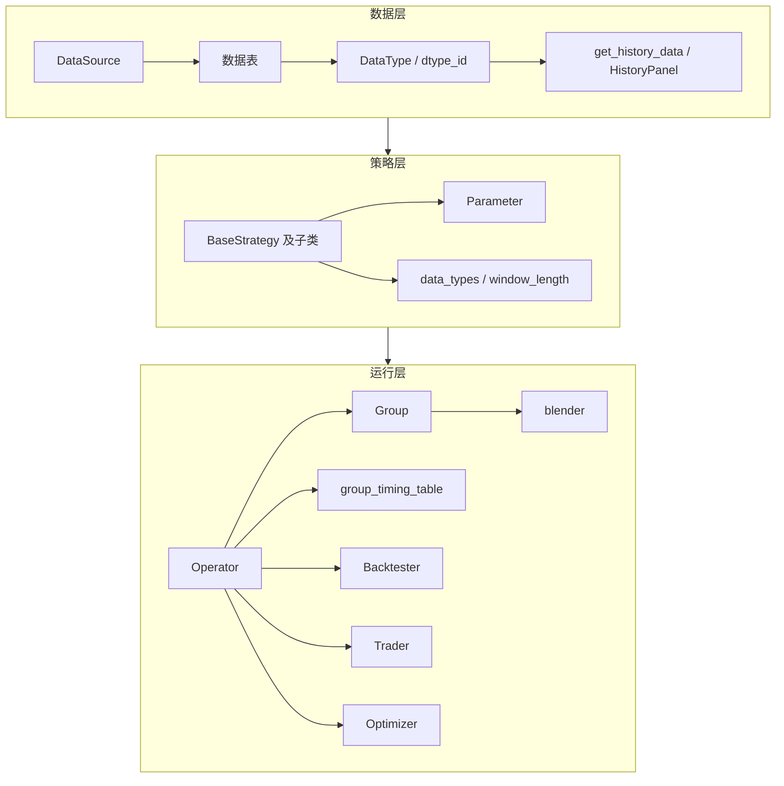
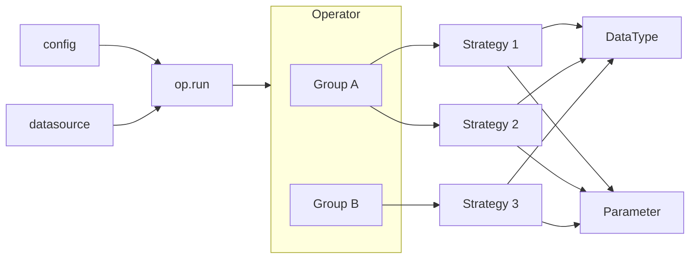
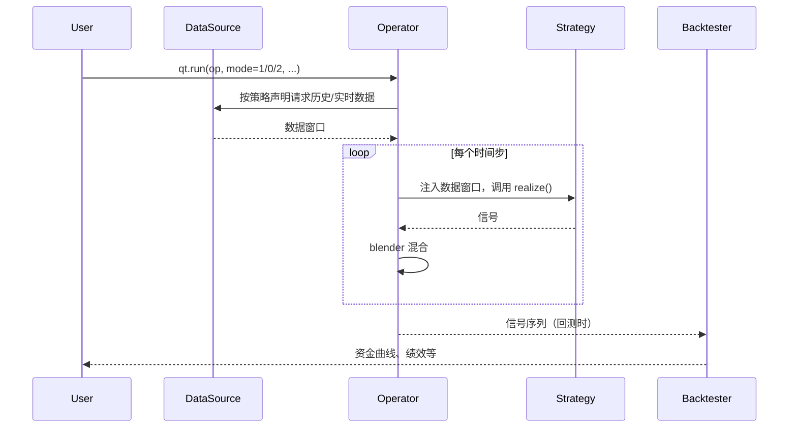

# qteasy 总体架构与设计思路

## 1. 引言：为什么需要从“架构”理解 qteasy

qteasy 是一套本地化、可复现的量化交易工具包。在使用教程和 API 文档之外，若能从**系统架构**和**设计思路**理解各模块如何分层、如何协作，可以更准确地使用接口、排查问题，并在扩展自定义策略或数据时少走弯路。本章从整体上概括 qteasy 的架构与三条设计主线，后续各章再分模块展开。

## 2. 三条设计主线（简述）

### 2.1 数据：从“原始表”到“类型化信息”（DataType）

原始行情、财务等数据经拉取与清洗后，以统一表结构存入 **DataSource**（文件或数据库）。qteasy 并不让策略直接读写这些表，而是把“可被策略使用的信息”抽象成 **DataType**（由 name、freq、asset_type 等构成，对应唯一的 **dtype_id**）。策略只**声明**自己需要哪些 DataType 以及多长的历史窗口（window_length），运行时由引擎按声明从 DataSource 取出数据、整理成**数据窗口**并注入策略。这样做的目的包括：回测与实盘使用同一套数据视图、策略接口统一、从机制上避免“未来函数”（策略只能看到引擎按时间步注入的过去数据）。

### 2.2 策略：四大要素与统一的 realize()

一个策略在概念上包含四类要素：

- **运行时机**：何时、以何频率运行（如每日收盘）——在 qteasy 2.0 中由策略所属的 **Group** 管理，不在策略类内部写死。
- **所需数据**：需要哪些 DataType、多长窗口（data_types、window_length 等），在策略初始化时声明。
- **可调参数**：由 **Parameter** 定义，运行前通过 `set_parameter` 等设置，优化时由 Optimizer 在参数空间中搜索。
- **逻辑**：通过无参的 **realize()** 实现；在方法内通过 `get_pars()`、`get_data(dtype_id)` 获取当前步的参数与数据，计算并返回交易信号。

同一段 `realize()` 在回测与实盘中复用，保证行为一致。

### 2.3 运行：Operator 与 Group、按时间步驱动、统一 run(config)

**Operator** 既是策略的容器，也是运行的入口：它持有多个 **Group**，每个 Group 是一组具有相同 **run_freq**、**run_timing**（以及 signal_type、blender）的策略。**group_timing_table** 是一张“时间步 × Group”的表，表示每个时间步有哪些 Group 需要运行。单步流程可以概括为：根据当前步查表得到要运行的 Group → 为这些 Group 内的每个策略准备数据窗口并注入 → 调用各策略的 `generate()`（内部调用 `realize()`）→ 用 Group 的 **blender** 混合同组信号 → 得到该步的合并信号。回测、实盘、优化都基于同一套“按 group_timing_table 逐步运行 Operator”的机制；差异仅在于数据来源（历史 vs 实时）和结果处理（模拟成交 vs 真实下单 vs 参数搜索）。

## 3. 总体架构图（三层）

qteasy 从职责上可划分为三层，如下图所示（文字版）：

- **数据层**：DataSource、数据表、DataType、以及面向外部的 get_history_data / HistoryPanel，为策略与运行层提供“按类型、按窗口”的历史信息。
- **策略层**：BaseStrategy 及子类（如 RuleIterator、FactorSorter、GeneralStg）、Parameter、data_types / window_length，负责声明需求并实现 realize()。
- **运行层**：Operator、Group、group_timing_table、blender，以及 Backtester / Trader / Optimizer，负责按时间驱动策略、汇总信号并执行回测/实盘/优化。

## 4. 核心对象关系图

- Operator 包含多个 Group，每个 Group 包含多个 Strategy。
- 每个 Strategy 声明自己依赖的 DataType（及 window_length），并通过 Parameter 定义可调参数。
- 运行入口为 `op.run(config, datasource, logger)`，由 config 与 datasource 驱动。

## 5. 数据与信号的大致流向

从数据源到策略再到回测/实盘/优化，整体流向可简化为：

- 用户通过 `qt.run(op, mode=...)` 进入回测（1）、实盘（0）或优化（2）。
- Operator 根据 config 与策略声明向 DataSource 请求数据，再按 group_timing_table 逐步调用策略并混合信号。
- 回测时，信号序列交给 Backtester 做模拟成交与评价；实盘时交给 Trader/Broker 执行；优化时由 Optimizer 多次回测并汇总。

## 6. 本系列各章与教程、API、示例的阅读顺序建议

- **本系列（架构与设计）**：建议先读本章（00）和 [核心概念速览](01-concepts.md)，再按需阅读 [数据层](02-data-layer.md)、[策略中的数据](03-data-in-strategies.md)、[Operator 与 Group](04-operator-and-groups.md)、[Strategy 运行与参数](05-strategy-lifecycle.md)、[回测/实盘/优化](06-backtest-live-optimization.md)，以建立整体图景。
- **使用教程**：侧重“手把手”操作，适合在了解架构后按需选读，用于完成具体任务（如下载数据、编写策略、运行回测）。
- **下载并管理金融历史数据**、**API 参考**：用于查询数据配置、接口参数与返回值；本系列只讲“结构与机制”，不替代 API 文档。
- **示例**：提供完整可运行示例，可与教程、本系列配合使用。
