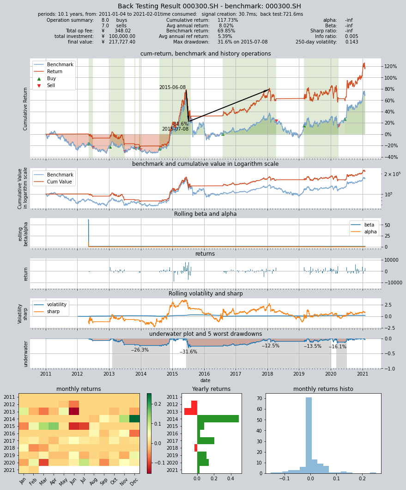

# 双均线择时策略

本策略根据交易目标的其日K线数据建立简单移动平均线的双均线交易模型，
交易策略如下：

策略包含两个参数：短周期天数S、长周期天数L
分别以两个不同的周期计算交易标的日K线收盘价的移动平均线，得到两根移动均线，以S为周期计算的均线为快均线，以L为周期计算的均线为慢均线，根据快慢均线的交叉情况产生交易信号：
1. 当快均线由下向上穿越慢均线时全仓买入交易标的
2. 当快均线由上向下穿越短均线时平仓

**模拟回测交易：**

- 回测数据为:沪深300指数（000300.SH)
- 回测周期为2011年1月1日到2020年12月31日
- 生成交易结果图表

**策略参数优化：**

- 同样使用HS300指数，在2011年至2020年共十年的历史区间上搜索最佳策略参数
- 并在2020年至2022年的数据上进行验证
- 输出30组最佳参数的测试结果


### 首先导入qteasy模块
```python
import qteasy as qt
```

### 创建一个新的策略
使用`qt.RuleIterator`策略基类，可以创建规则迭代策略，
这种策略可以把相同的规则迭代应用到投资组合中的所有股票上，适合在一个投资组合
中的所有股票上应用同一种择时规则。

```python
from qteasy import RuleIterator
# 创建双均线交易策略类
class Cross_SMA_PS(RuleIterator):
    """自定义双均线择时策略策略，产生的信号类型为交易信号
        这个均线择时策略有两个参数：
            - FMA 快均线周期
            - SMA 慢均线周期
        策略跟踪上述两个周期产生的简单移动平均线，当两根均线发生交叉时
        直接产生交易信号。
    """
    def __init__(self):
        """
        初始化交易策略的参数信息和基本信息
        """
        super().__init__(
            pars=(30, 60),  # 策略默认参数是快均线周期30， 慢均线周期60
            par_count=2,  # 策略只有长短周期两个参数
            par_types=['int', 'int'],  # 策略两个参数的数据类型均为整型变量
            par_range=[(10, 100), (10, 200)],  # 两个策略参数的取值范围
            name='CROSSLINE',  # 策略的名称
            description='快慢双均线择时策略',  # 策略的描述
            data_types='close',  # 策略基于收盘价计算均线，因此数据类型为'close'
            window_length=200,  # 历史数据窗口长度为200，每一次交易信号都是由它之前前200天的历史数据决定的
        )

    # 策略的具体实现代码写在策略的realize()函数中
    # 这个函数接受多个参数： h代表历史数据， r为参考数据， t为交易数据，pars代表策略参数
    # 请参阅doc_string或qteasy文档获取更多信息
    def realize(self, h, r=None, t=None, pars=None):
        """策略的具体实现代码：
         - f: fast, 短均线计算日期；
         - s: slow: 长均线计算日期;
        """
        from qteasy.tafuncs import sma
        # 获取传入的策略参数
        f, s= pars
        # 计算长短均线的当前值和昨天的值
        # 由于h是一个M行N列的ndarray，包含多种历史数据类型
        # 使用h[:, N]获取第N种数据类型的全部窗口历史数据
        # 由于策略的历史数据类型为‘close’（收盘价），
        # 因此h[:, 0]可以获取股票在窗口内的所有收盘价
        close = h[:, 0]
        # 使用qt.sma计算简单移动平均价
        s_ma = sma(close, s)
        f_ma = sma(close, f)
        
        # 为了考察两条均线的交叉, 计算两根均线昨日和今日的值，以便判断
        s_today, s_last = s_ma[-1], s_ma[-2]
        f_today, f_last = f_ma[-1], f_ma[-2]
        
        # 根据观望模式在不同的点位产生交易信号
        # 在PS信号类型下，1表示全仓买入，-1表示卖出全部持有股份
        # 关于不同模式下不同信号的含义和表示方式，请查阅
        # qteasy的文档。
        
        # 当快均线自下而上穿过上边界，发出全仓买入信号
        if (f_last < s_last) and (f_today > s_today):  
            return 1
        # 当快均线自上而下穿过上边界，发出全部卖出信号
        elif (f_last > s_last) and (f_today < s_today):  
            return -1
        else:  # 其余情况不产生任何信号
            return 0
```

### 回测交易策略，查看结果
使用历史数据回测交易策略，使用历史数据生成交易信号后进行模拟交易，记录并分析交易结果

```python
# 定义好策略后，定一个交易员对象，引用刚刚创建的策略，根据策略的规则
# 设定交易员的信号模式为PS
# PS表示比例交易信号，此模式下信号在-1到1之间，1表示全仓买入，-1表示
# 全部卖出，0表示不操作。
op = qt.Operator([Cross_SMA_PS()], signal_type='PS')

# 设置op的策略参数
op.set_parameter(0, 
                 pars= (20, 60)  # 设置快慢均线周期分别为10天、166天
                )

# 设置基本回测参数，开始运行模拟交易回测
res = qt.run(op, 
             mode=1,  # 运行模式为回测模式
             asset_pool='000300.SH',  # 投资标的为000300.SH即沪深300指数
             invest_start='20110101',  # 回测开始日期
             visual=True  # 生成交易回测结果分析图
            )
```
交易结果如下；

    
         ====================================
         |                                  |
         |       BACK TESTING RESULT        |
         |                                  |
         ====================================
    
    qteasy running mode: 1 - History back testing
    time consumption for operate signal creation: 36.2ms
    time consumption for operation back looping:  718.5ms
    
    investment starts on      2011-01-04 00:00:00
    ends on                   2021-02-01 00:00:00
    Total looped periods:     10.1 years.
    
    -------------operation summary:------------
    
              Sell Cnt Buy Cnt Total Long pct Short pct Empty pct
    000300.SH    24       25     49   52.8%      0.0%     47.2%   
    
    Total operation fee:     ¥      861.65
    total investment amount: ¥  100,000.00
    final value:              ¥  117,205.20
    Total return:                    17.21% 
    Avg Yearly return:                1.59%
    Skewness:                         -1.11
    Kurtosis:                         13.19
    Benchmark return:                69.85% 
    Benchmark Yearly return:          5.39%
    
    ------strategy loop_results indicators------ 
    alpha:                           -0.044
    Beta:                             1.001
    Sharp ratio:                     -0.029
    Info ratio:                      -0.020
    250 day volatility:               0.153
    Max drawdown:                    47.88% 
        peak / valley:        2015-06-08 / 2017-06-16
        recovered on:         Not recovered!
    
    
    ===========END OF REPORT=============
    

从上面的交易结果可以看到，十年间买入25次卖出24次，持仓时间为52%，最终收益率只有17.2%。

下面是交易结果的可视化图表展示
    

    

交叉线交易策略的长短周期选择很重要，可以使用`qteasy`来搜索最优的策略参数：


```python
# 策略参数的优化
# 
# 设置op的策略参数
op.set_parameter(0, 
                 opt_tag=1  # 将op中的策略设置为可优化，如果不这样设置，将无法优化策略参数
                )
res = qt.run(op, mode=2, 
             opti_start='20110101',  # 优化区间开始日期
             opti_end='20200101',  # 优化区间结束日期
             test_start='20200101',  # 独立测试开始日期
             test_end='20220101',  # 独立测试结束日期
             opti_sample_count=1000  # 一共进行1000次搜索
            )
```
策略优化可能会花很长时间，qt会显示一个进度条：

    [########################################]1000/1000-100.0%  best performance: 226061.246
    Optimization completed, total time consumption: 28"964
    [########################################]30/30-100.0%  best performance: 226061.246

优化完成，显示最好的30组参数及其相关信息：

    ==================================== 
    |                                  |
    |       OPTIMIZATION RESULT        |
    |                                  |
    ====================================
    
    qteasy running mode: 2 - Strategy Parameter Optimization
    
    investment starts on 2011-01-04 00:00:00
    ends on 2021-12-31 00:00:00
    Total looped periods: 11.0 years.
    total investment amount: ¥   100,000.00
    Reference index type is 000300.SH at IDX
    Total Benchmark rtn: 54.89% 
    Average Yearly Benchmark rtn rate: 4.06%
    statistical analysis of optimal strategy messages indicators: 
    total return:        98.11% ± 8.85%
    annual return:       6.41% ± 0.42%
    alpha:               -inf ± nan
    Beta:                -inf ± nan
    Sharp ratio:         -inf ± nan
    Info ratio:          0.004 ± 0.002
    250 day volatility:  0.150 ± 0.005
    other messages indicators are listed in below table
    
       Strategy items Sell-outs Buy-ins ttl-fee      FV      ROI   Benchmark rtn  MDD 
    0     (13, 153)      14.0     14.0    687.05 190,792.39  90.8%     54.9%     32.8%
    1     (22, 173)       8.0      8.0    395.88 190,814.17  90.8%     54.9%     31.6%
    2     (39, 153)       9.0      9.0    472.15 192,264.81  92.3%     54.9%     32.4%
    3     (40, 161)      11.0     11.0    560.40 191,355.89  91.4%     54.9%     31.6%
    4     (25, 117)      12.0     13.0    628.58 192,098.97  92.1%     54.9%     31.6%
    5     (28, 177)       7.0      7.0    330.99 192,535.14  92.5%     54.9%     31.6%
    6     (19, 183)       8.0      8.0    393.19 191,723.19  91.7%     54.9%     31.6%
    7     (19, 185)       7.0      7.0    321.65 192,112.23  92.1%     54.9%     31.6%
    8     (16, 165)       8.0      8.0    367.36 192,663.11  92.7%     54.9%     31.6%
    9     (37, 170)       8.0      8.0    406.04 192,756.35  92.8%     54.9%     31.6%
    10    (24, 167)       9.0      9.0    434.69 193,170.89  93.2%     54.9%     31.6%
    11    (33, 173)       6.0      6.0    296.75 194,352.40  94.4%     54.9%     31.6%
    12    (35, 172)       6.0      6.0    296.42 194,090.45  94.1%     54.9%     31.6%
    13     (81, 82)      66.0     67.0  4,074.64 193,209.43  93.2%     54.9%     43.3%
    14    (18, 192)       8.0      8.0    375.54 194,179.11  94.2%     54.9%     32.0%
    15    (39, 149)       7.0      7.0    330.31 194,549.12  94.5%     54.9%     31.6%
    16     (17, 21)      90.0     91.0  5,375.15 195,955.66  96.0%     54.9%     27.9%
    17    (27, 168)       8.0      8.0    356.07 194,993.23  95.0%     54.9%     31.6%
    18     (59, 70)      27.0     28.0  1,517.79 196,081.66  96.1%     54.9%     41.0%
    19    (20, 181)       7.0      7.0    324.45 196,273.52  96.3%     54.9%     31.6%
    20    (11, 175)       9.0      9.0    441.25 196,223.57  96.2%     54.9%     31.6%
    21    (10, 178)      12.0     12.0    592.85 198,623.15  98.6%     54.9%     31.6%
    22    (28, 104)      13.0     14.0    766.09 200,232.97 100.2%     54.9%     31.8%
    23    (23, 170)       8.0      8.0    412.78 203,044.62 103.0%     54.9%     31.6%
    24    (11, 160)      17.0     17.0    859.76 204,142.24 104.1%     54.9%     31.6%
    25     (80, 85)      33.0     34.0  2,102.59 210,103.70 110.1%     54.9%     43.4%
    26    (25, 166)       9.0      9.0    450.67 205,575.49 105.6%     54.9%     31.6%
    27    (10, 162)      17.0     17.0  1,002.46 214,217.37 114.2%     54.9%     31.6%
    28     (61, 66)      42.0     43.0  2,630.56 219,235.18 119.2%     54.9%     36.9%
    29     (19, 24)      77.0     78.0  4,899.88 226,061.25 126.1%     54.9%     25.0%
    
    ===========END OF REPORT=============

这三十组参数会被用于独立测试，以检验它们是否过拟合：
    
    [########################################]30/30-100.0%  best performance: 133297.532
    ==================================== 
    |                                  |
    |       OPTIMIZATION RESULT        |
    |                                  |
    ====================================
    
    qteasy running mode: 2 - Strategy Parameter Optimization
    
    investment starts on 2020-01-02 00:00:00
    ends on 2021-12-31 00:00:00
    Total looped periods: 2.0 years.
    total investment amount: ¥   100,000.00
    Reference index type is 000300.SH at IDX
    Total Benchmark rtn: 18.98% 
    Average Yearly Benchmark rtn rate: 9.09%
    statistical analysis of optimal strategy messages indicators: 
    total return:        22.91% ± 9.01%
    annual return:       10.80% ± 4.25%
    alpha:               -0.015 ± 0.041
    Beta:                1.000 ± 0.000
    Sharp ratio:         0.857 ± 0.200
    Info ratio:          0.022 ± 0.021
    250 day volatility:  0.178 ± 0.007
    other messages indicators are listed in below table
    
       Strategy items Sell-outs Buy-ins ttl-fee     FV      ROI  Benchmark rtn  MDD 
    0     (13, 153)       4.0      4.0   182.60 124,409.92 24.4%     19.0%     15.9%
    1     (40, 161)       3.0      3.0   138.74 118,359.00 18.4%     19.0%     17.0%
    2     (22, 173)       2.0      2.0    93.49 126,071.63 26.1%     19.0%     15.2%
    3     (19, 183)       2.0      2.0    93.90 129,292.01 29.3%     19.0%     15.2%
    4     (25, 117)       1.0      2.0    81.75 129,142.22 29.1%     19.0%     15.2%
    5     (39, 153)       3.0      3.0   143.88 128,106.78 28.1%     19.0%     15.2%
    6     (19, 185)       1.0      1.0    42.70 126,797.97 26.8%     19.0%     15.2%
    7     (28, 177)       1.0      1.0    42.66 126,448.59 26.4%     19.0%     15.2%
    8     (16, 165)       1.0      1.0    42.64 126,241.62 26.2%     19.0%     15.2%
    9      (81, 82)      16.0     17.0   621.41  91,210.11 -8.8%     19.0%     20.3%
    10    (37, 170)       2.0      2.0    93.28 126,103.26 26.1%     19.0%     15.2%
    11    (24, 167)       2.0      2.0    92.94 123,720.72 23.7%     19.0%     15.2%
    12    (35, 172)       1.0      1.0    42.86 128,377.96 28.4%     19.0%     15.2%
    13    (18, 192)       2.0      2.0    84.91 133,297.53 33.3%     19.0%     15.2%
    14    (33, 173)       1.0      1.0    42.97 129,519.55 29.5%     19.0%     15.2%
    15    (39, 149)       1.0      1.0    42.53 125,231.92 25.2%     19.0%     15.2%
    16    (27, 168)       1.0      1.0    42.78 127,628.65 27.6%     19.0%     15.2%
    17     (17, 21)      19.0     20.0   886.06 110,117.03 10.1%     19.0%     16.4%
    18     (59, 70)       5.0      6.0   276.46 128,273.29 28.3%     19.0%     20.1%
    19    (20, 181)       1.0      1.0    42.78 127,628.65 27.6%     19.0%     15.2%
    20    (11, 175)       2.0      2.0    82.10 125,706.51 25.7%     19.0%     15.2%
    21    (28, 104)       2.0      3.0   131.99 125,189.61 25.2%     19.0%     15.2%
    22    (10, 178)       3.0      3.0   132.35 127,100.60 27.1%     19.0%     15.2%
    23    (23, 170)       2.0      2.0    93.52 126,385.21 26.4%     19.0%     15.2%
    24    (11, 160)       4.0      4.0   179.66 124,113.04 24.1%     19.0%     15.4%
    25    (25, 166)       2.0      2.0    93.23 126,539.86 26.5%     19.0%     15.2%
    26     (80, 85)       8.0      9.0   342.77 100,764.28  0.8%     19.0%     18.9%
    27    (10, 162)       7.0      7.0   291.80 113,699.46 13.7%     19.0%     16.2%
    28     (61, 66)       9.0     10.0   428.25 117,497.81 17.5%     19.0%     22.6%
    29     (19, 24)      17.0     18.0   774.83 114,216.87 14.2%     19.0%     15.6%
    
    ===========END OF REPORT=============
    
参数优化结果以及各个指标的可视化图表展示：
    

    
优化之后我们可以检验一下找到的最佳参数：

```python
# 从优化结果中取出一组参数试验一下：
op.set_parameter(0, 
                 pars= (25, 166)  # 修改策略参数，改为短周期25天，长周期166天
                )

# 重复一次测试，除策略参数意外，其他设置不变
res = qt.run(op, 
             mode=1,  
             asset_pool='000300.SH',  
             invest_start='20110101',  
             visual=True  
            )
```

    
         ====================================
         |                                  |
         |       BACK TESTING RESULT        |
         |                                  |
         ====================================
    
    qteasy running mode: 1 - History back testing
    time consumption for operate signal creation: 30.7ms
    time consumption for operation back looping:  721.6ms
    
    investment starts on      2011-01-04 00:00:00
    ends on                   2021-02-01 00:00:00
    Total looped periods:     10.1 years.
    
    -------------operation summary:------------
    
              Sell Cnt Buy Cnt Total Long pct Short pct Empty pct
    000300.SH    7        8      15   50.7%      0.0%     49.3%   
    
    Total operation fee:     ¥      348.02
    total investment amount: ¥  100,000.00
    final value:              ¥  217,727.40
    Total return:                   117.73% 
    Avg Yearly return:                8.02%
    Skewness:                         -0.98
    Kurtosis:                         14.70
    Benchmark return:                69.85% 
    Benchmark Yearly return:          5.39%
    
    ------strategy loop_results indicators------ 
    alpha:                             -inf
    Beta:                              -inf
    Sharp ratio:                       -inf
    Info ratio:                       0.005
    250 day volatility:               0.143
    Max drawdown:                    31.58% 
        peak / valley:        2015-06-08 / 2015-07-08
        recovered on:         2018-01-22
    
    
    ===========END OF REPORT=============
    
优化后总回报率达到了117%，比优化前的参数好很多。

优化后的结果可视化图表如下：

    

    

