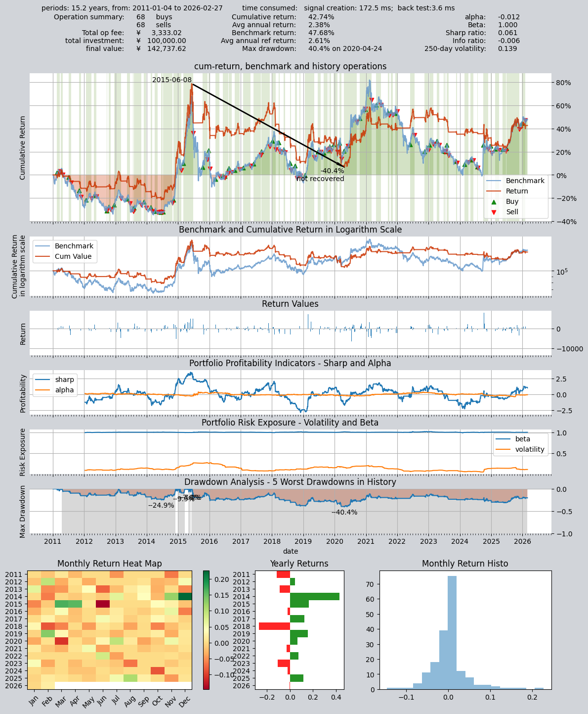
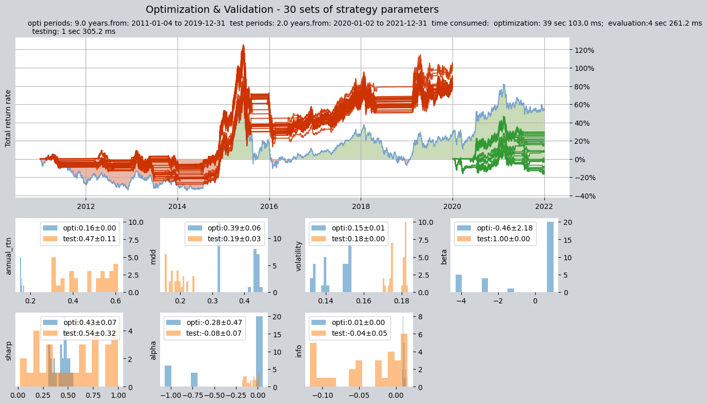
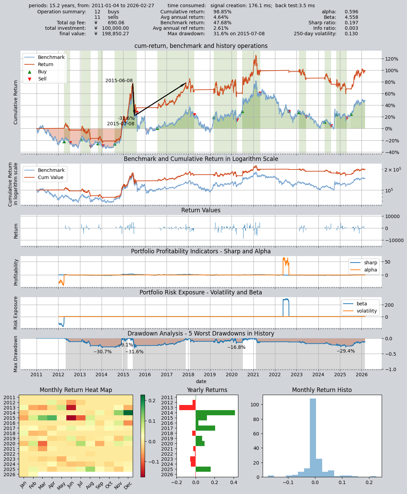

# 双均线择时策略

本策略根据交易目标的其日K线数据建立简单移动平均线的双均线交易模型，
交易策略如下：

策略包含两个参数：短周期天数S、长周期天数L
分别以两个不同的周期计算交易标的日K线收盘价的移动平均线，得到两根移动均线，以S为周期计算的均线为快均线，以L为周期计算的均线为慢均线，根据快慢均线的交叉情况产生交易信号：
1. 当快均线由下向上穿越慢均线时全仓买入交易标的
2. 当快均线由上向下穿越短均线时平仓

**模拟回测交易：**

- 回测数据为:沪深300指数（000300.SH)
- 回测周期为2011年1月1日到2020年12月31日
- 生成交易结果图表

**策略参数优化：**

- 同样使用HS300指数，在2011年至2020年共十年的历史区间上搜索最佳策略参数
- 并在2020年至2022年的数据上进行验证
- 输出30组最佳参数的测试结果


## 首先导入`qteasy`模块
```python
import qteasy as qt
```

## 创建一个新的策略
使用`qt.RuleIterator`策略基类，可以创建规则迭代策略，
这种策略可以把相同的规则迭代应用到投资组合中的所有股票上，适合在一个投资组合
中的所有股票上应用同一种择时规则。

```python
from qteasy import Parameter, StgData
from qteasy import RuleIterator
# 创建双均线交易策略类
class Cross_SMA_PS(RuleIterator):
    """自定义双均线择时策略策略，产生的信号类型为交易信号
        这个均线择时策略有两个参数：
            - FMA 快均线周期
            - SMA 慢均线周期
        策略跟踪上述两个周期产生的简单移动平均线，当两根均线发生交叉时
        直接产生交易信号。
    """
    def __init__(self, **kwargs):
        """
        初始化交易策略的参数信息和基本信息
        """
        super().__init__(
            pars=[Parameter((10, 100), name='fast', par_type='int', value=10),
                  Parameter((30, 180), name='slow', par_type='int', value=160)],
            # 策略只有长短周期两个参数, 均为整型变量
            name='CROSSLINE',  # 策略的名称
            description='快慢双均线择时策略',  # 策略的描述
            data_types=StgData('close', freq='d', asset_type='ANY', window_length=200),  # 策略基于收盘价计算均线，因此数据类型为'close', 历史数据窗口长度为200
            **kwargs,
        )

    def realize(self):
        """策略的具体实现代码：
         - f: fast, 短均线计算日期；
         - s: slow: 长均线计算日期;
        """
        from qteasy.tafuncs import sma
        # 获取传入的策略参数
        f, s = self.get_pars('fast', 'slow')
        # 获取历史数据日频收盘价，计算长短均线的当前值和昨天的值
        close = self.get_data('close_ANY_d')
        # 使用qt.sma计算简单移动平均价
        s_ma = sma(close, s)
        f_ma = sma(close, f)
        
        # 为了考察两条均线的交叉, 计算两根均线昨日和今日的值，以便判断
        s_today, s_last = s_ma[-1], s_ma[-2]
        f_today, f_last = f_ma[-1], f_ma[-2]
        
        # 根据观望模式在不同的点位产生交易信号
        # 在PS信号类型下，1表示全仓买入，-1表示卖出全部持有股份
        # 当快均线自下而上穿过上边界，发出全仓买入信号
        if (f_last <= s_last) and (f_today >= s_today):  
            return 1
        # 当快均线自上而下穿过上边界，发出全部卖出信号
        elif (f_last >= s_last) and (f_today <= s_today):  
            return -1
        else:  # 其余情况不产生任何信号
            return 0
```

## 回测交易策略，查看结果

定义好策略后，定一个`Operator`交易员对象，引用刚刚创建的策略，根据策略的规则设定交易员的信号模式为PS
PS表示比例交易信号，此模式下信号在-1到1之间，1表示全仓买入，-1表示全部卖出，0表示不操作。
使用历史数据回测交易策略，使用历史数据生成交易信号后进行模拟交易，记录并分析交易结果

```python
stg = Cross_SMA_PS()
op = qt.Operator([stg], signal_type='PS')

# 设置op的策略参数
op.set_parameter(0, par_values= (10, 160))  # 设置快慢均线周期分别为10天、166天
op.set_group_parameters('Group_1', blender_str='s0')
# 设置基本回测参数，开始运行模拟交易回测
res = qt.run(op, 
             mode=1,  # 运行模式为回测模式
             asset_pool='000300.SH',  # 投资标的为000300.SH即沪深300指数
             invest_start='20110101',  # 回测开始日期
             visual=True,  # 生成交易回测结果分析图
             trade_batch_size=0.01,
             sell_batch_size=0.01,
            )
```
交易结果如下；

```text
====================================
|                                  |
|         BACKTEST REPORT          |
|                                  |
====================================
qteasy running mode: 1 - History back testing
time consumption for operate signal creation: 172.5 ms
time consumption for operation back testing:  3.6 ms
investment starts on      2011-01-04 15:00:00
ends on                   2026-02-27 15:00:00
Total looped periods:     15.2 years.
-------------operation summary:------------
Only non-empty shares are displayed, call 
"loop_result["oper_count"]" for complete operation summary
          Sell Cnt Buy Cnt Total Long pct Short pct Empty pct
000300.SH    68       68    136   55.2%     -0.0%     44.8%  

Total operation fee:     ¥    3,333.02
total investment amount: ¥  100,000.00
final value:              ¥  142,737.62
Total return:                    42.74% 
Avg Yearly return:                2.38%
Skewness:                         -0.91
Kurtosis:                         13.80
Benchmark return:                47.68% 
Benchmark Yearly return:          2.61%

------strategy loop_results indicators------ 
alpha:                           -0.012
Beta:                             1.000
Sharp ratio:                      0.061
Info ratio:                      -0.006
250 day volatility:               0.139
Max drawdown:                    40.45% 
    peak / valley:        2015-06-08 / 2020-04-24
    recovered on:         Not recovered!


==================END OF REPORT===================
```


从上面的交易结果可以看到，十年间买入68次卖出68次，持仓时间为55%，最终收益率只有42.7%。

下面是交易结果的可视化图表展示
    

    

交叉线交易策略的长短周期选择很重要，可以使用`qteasy`来搜索最优的策略参数：

## 策略参数的优化
 
我们可以在历史数据上搜索最优的策略参数，找到在历史数据上表现最好的参数组合，并检验它们在独立测试区间上的表现，以检验是否过拟合。

```python

op.set_parameter(0, 
                 opt_tag=1  # 将op中的策略设置为可优化，如果不这样设置，将无法优化策略参数
                )
res = qt.run(op, 
             mode=2, 
             opti_start='20110101',  # 优化区间开始日期
             opti_end='20200101',  # 优化区间结束日期
             test_start='20200101',  # 独立测试开始日期
             test_end='20220101',  # 独立测试结束日期
             opti_sample_count=1000,  # 一共进行1000次搜索
             opti_method='SA',  # 优化方法为模拟退火算法
             parallel=False,  # 不启用并行搜索
            )
```
策略优化可能会花很长时间，qt会显示一个进度条：

```text
Epoch:1/5->175917.941: 100%|█████████████████████████████████████████████████| 128/128 [00:08<00:00, 15.94it/s]
Epoch:2/5->183493.313: 100%|█████████████████████████████████████████████████| 128/128 [00:07<00:00, 16.43it/s]
Epoch:3/5->203089.648: 100%|█████████████████████████████████████████████████| 128/128 [00:07<00:00, 16.59it/s]
Epoch:4/5->187650.270: 100%|█████████████████████████████████████████████████| 128/128 [00:07<00:00, 16.46it/s]
Epoch:5/5->205538.237: 100%|█████████████████████████████████████████████████| 128/128 [00:07<00:00, 16.57it/s]
Epoch:1/1->411083.340: 100%|███████████████████████████████████████████████████| 30/30 [00:04<00:00,  7.04it/s]
```
优化完成，显示最好的30组参数及其相关信息：

```text
====================================
|                                  |
|       OPTIMIZATION REPORT        |
|                                  |
====================================
qteasy running mode: 2 - Strategy Parameter Optimization
time consumption for optimization: 39 sec 103.0 ms
time consumption for evaluation:   4 sec 261.2 ms
investment starts on 2011-01-04 15:00:00
ends on 2019-12-31 15:00:00
Total looped periods: 9.0 years.
total investment amount: ¥   100,000.00
Benchmark type is 000300.SH
Total Benchmark rtn: 28.43% 
Average Yearly Benchmark rtn rate: 2.82%
Statistical analysis of optimal strategy messages indicators: 
Total return:        270.25% ± 13.73%
Annual return:       15.66% ± 0.46%
Alpha:               -0.277 ± 0.466
Beta:                -0.459 ± 2.175
Sharp ratio:         0.434 ± 0.069
Info ratio:          0.011 ± 0.002
250 day volatility:  0.145 ± 0.008
Other messages indicators are listed in below table
   Strategy items Sell-outs Buy-ins ttl-fee      FV      ROI    MDD 
0     (43, 144)       5.0      6.0    509.43 358,315.55 258.3% 31.6%
1     (29, 171)       5.0      6.0    498.98 358,659.37 258.7% 31.6%
2      (72, 84)      17.0     18.0  1,786.90 359,602.66 259.6% 43.8%
3      (72, 84)      17.0     18.0  1,786.90 359,602.66 259.6% 43.8%
4     (35, 151)       5.0      6.0    510.77 360,689.42 260.7% 31.6%
5      (77, 81)      29.0     30.0  3,111.64 362,208.28 262.2% 44.0%
6      (77, 81)      29.0     30.0  3,111.64 362,208.28 262.2% 44.0%
7      (80, 91)      15.0     16.0  1,519.87 362,252.85 262.3% 45.8%
8     (24, 176)       5.0      6.0    505.68 362,696.68 262.7% 31.6%
9     (24, 176)       5.0      6.0    505.68 362,696.68 262.7% 31.6%
10    (36, 150)       5.0      6.0    510.71 362,666.50 262.7% 31.6%
11    (11, 156)      11.0     12.0  1,005.55 362,714.28 262.7% 31.9%
12     (58, 83)      12.0     13.0  1,218.41 363,195.61 263.2% 43.2%
13    (31, 169)       6.0      7.0    566.80 363,756.82 263.8% 31.6%
14    (36, 151)       5.0      6.0    514.33 364,408.58 264.4% 31.6%
15    (28, 173)       5.0      6.0    505.27 365,648.99 265.6% 31.6%
16     (73, 83)      16.0     17.0  1,678.20 366,055.42 266.1% 43.6%
17    (32, 171)       4.0      5.0    452.30 366,955.25 267.0% 31.6%
18    (13, 156)      10.0     11.0    903.07 367,001.52 267.0% 31.8%
19     (73, 84)      17.0     18.0  1,767.40 368,221.99 268.2% 43.8%
20     (77, 82)      25.0     26.0  2,725.38 368,871.74 268.9% 44.7%
21     (77, 82)      25.0     26.0  2,725.38 368,871.74 268.9% 44.7%
22     (81, 91)      15.0     16.0  1,560.50 374,068.95 274.1% 44.4%
23     (76, 81)      25.0     26.0  2,730.01 375,311.56 275.3% 43.9%
24     (73, 85)      16.0     17.0  1,708.08 379,569.28 279.6% 44.0%
25    (12, 155)      11.0     12.0    992.25 381,190.46 281.2% 31.6%
26     (76, 84)      21.0     22.0  2,181.56 382,247.74 282.2% 44.6%
27     (77, 86)      16.0     17.0  1,719.80 400,385.81 300.4% 43.2%
28     (78, 85)      22.0     23.0  2,393.91 406,202.21 306.2% 43.2%
29     (80, 86)      21.0     22.0  2,386.87 411,083.34 311.1% 41.6%

==================END OF REPORT===================
```

这三十组参数会被用于独立测试，以检验它们是否过拟合：
    
```text
Epoch:1/1->259292.734: 100%|███████████████████████████████████████████████████████████| 30/30 [00:01<00:00, 23.02it/s]

====================================
|                                  |
|        VALIDATION REPORT         |
|                                  |
====================================
qteasy running mode: 2 - Strategy Parameter Optimization
time consumption for optimization: 39 sec 103.0 ms
time consumption for evaluation:   4 sec 261.2 ms
investment starts on 2020-01-02 15:00:00
ends on 2021-12-31 15:00:00
Total looped periods: 2.0 years.
total investment amount: ¥   100,000.00
Benchmark type is 000300.SH
Total Benchmark rtn: 18.98% 
Average Yearly Benchmark rtn rate: 9.09%
Statistical analysis of optimal strategy messages indicators: 
Total return:        115.83% ± 31.89%
Annual return:       46.59% ± 10.98%
Alpha:               -0.081 ± 0.066
Beta:                0.999 ± 0.000
Sharp ratio:         0.545 ± 0.322
Info ratio:          -0.038 ± 0.047
250 day volatility:  0.178 ± 0.004
Other messages indicators are listed in below table
   Strategy items Sell-outs Buy-ins ttl-fee     FV      ROI    MDD 
0     (43, 144)       1.0      1.0    84.86 248,458.67 148.5% 15.2%
1     (29, 171)       1.0      1.0    85.88 258,545.09 158.5% 15.2%
2      (72, 84)       2.0      3.0   224.59 195,264.51  95.3% 20.8%
3      (72, 84)       2.0      3.0   224.59 195,264.51  95.3% 20.8%
4     (35, 151)       3.0      3.0   282.50 241,963.33 142.0% 17.0%
5      (77, 81)      10.0     11.0   792.08 168,647.51  68.6% 24.3%
6      (77, 81)      10.0     11.0   792.08 168,647.51  68.6% 24.3%
7      (80, 91)       4.0      5.0   412.29 218,152.13 118.2% 16.7%
8     (24, 176)       1.0      1.0    85.21 251,880.99 151.9% 15.2%
9     (24, 176)       1.0      1.0    85.21 251,880.99 151.9% 15.2%
10    (36, 150)       3.0      3.0   279.96 238,065.57 138.1% 17.3%
11    (11, 156)       5.0      5.0   448.16 231,744.72 131.7% 19.1%
12     (58, 83)       3.0      4.0   346.95 230,754.45 130.8% 19.8%
13    (31, 169)       1.0      1.0    85.55 255,239.86 155.2% 15.2%
14    (36, 151)       3.0      3.0   279.98 238,344.64 138.3% 17.2%
15    (28, 173)       1.0      1.0    85.59 255,731.20 155.7% 15.2%
16     (73, 83)       6.0      7.0   503.93 183,585.71  83.6% 18.5%
17    (32, 171)       1.0      1.0    85.96 259,292.73 159.3% 15.2%
18    (13, 156)       4.0      4.0   362.38 243,928.41 143.9% 17.5%
19     (73, 84)       5.0      6.0   427.50 176,000.45  76.0% 20.8%
20     (77, 82)       8.0      9.0   642.96 173,471.06  73.5% 22.4%
21     (77, 82)       8.0      9.0   642.96 173,471.06  73.5% 22.4%
22     (81, 91)       5.0      6.0   491.77 217,222.67 117.2% 16.7%
23     (76, 81)       8.0      9.0   643.36 171,211.45  71.2% 24.4%
24     (73, 85)       2.0      3.0   220.90 194,837.49  94.8% 19.9%
25    (12, 155)       4.0      4.0   358.07 234,517.54 134.5% 18.5%
26     (76, 84)       7.0      8.0   572.56 181,243.30  81.2% 20.5%
27     (77, 86)       6.0      7.0   564.34 217,678.26 117.7% 18.9%
28     (78, 85)       7.0      8.0   598.97 201,469.22 101.5% 19.2%
29     (80, 86)       8.0      9.0   672.51 198,322.07  98.3% 19.4%

==================END OF REPORT===================
```
    
参数优化结果以及各个指标的可视化图表展示：
    

    
优化之后我们可以检验一下找到的最佳参数：

```python
# 从优化结果中取出一组参数试验一下：
op.set_parameter(0, 
                 pars= (43, 144)  # 修改策略参数，改为短周期25天，长周期166天
                )

# 重复一次测试，除策略参数意外，其他设置不变
res = qt.run(op, 
             mode=1,  
             asset_pool='000300.SH',  
             invest_start='20110101',  
             visual=True  
            )
```
得到结果：

```text
====================================
|                                  |
|         BACKTEST REPORT          |
|                                  |
====================================
qteasy running mode: 1 - History back testing
time consumption for operate signal creation: 176.1 ms
time consumption for operation back testing:  3.5 ms
investment starts on      2011-01-04 15:00:00
ends on                   2026-02-27 15:00:00
Total looped periods:     15.2 years.
-------------operation summary:------------
Only non-empty shares are displayed, call 
"loop_result["oper_count"]" for complete operation summary
          Sell Cnt Buy Cnt Total Long pct Short pct Empty pct
000300.SH    11       12     23   69.7%     -0.0%     30.3%  

Total operation fee:     ¥      690.06
total investment amount: ¥  100,000.00
final value:              ¥  198,850.27
Total return:                    98.85% 
Avg Yearly return:                4.64%
Skewness:                         -0.97
Kurtosis:                         15.94
Benchmark return:                47.68% 
Benchmark Yearly return:          2.61%

------strategy loop_results indicators------ 
alpha:                            0.596
Beta:                             4.558
Sharp ratio:                      0.197
Info ratio:                       0.003
250 day volatility:               0.130
Max drawdown:                    31.58% 
    peak / valley:        2015-06-08 / 2015-07-08
    recovered on:         2017-11-21


==================END OF REPORT===================
```
    
优化后总回报率达到了98.85%，比优化前的参数好很多。

优化后的结果可视化图表如下：

    

    

