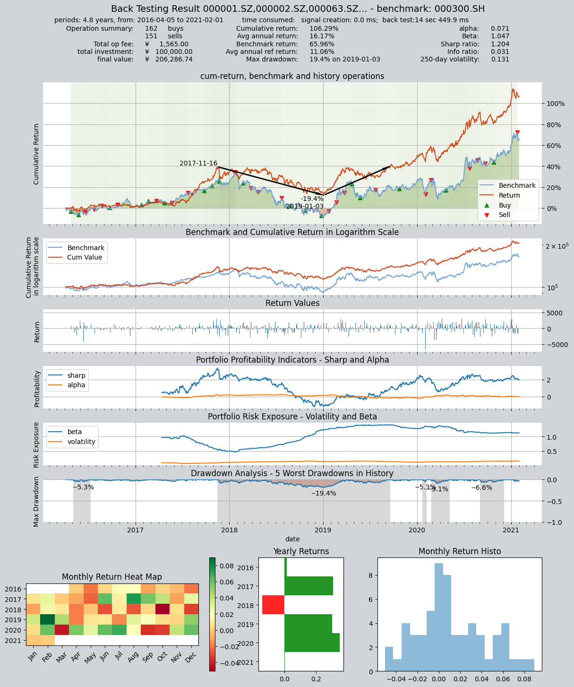
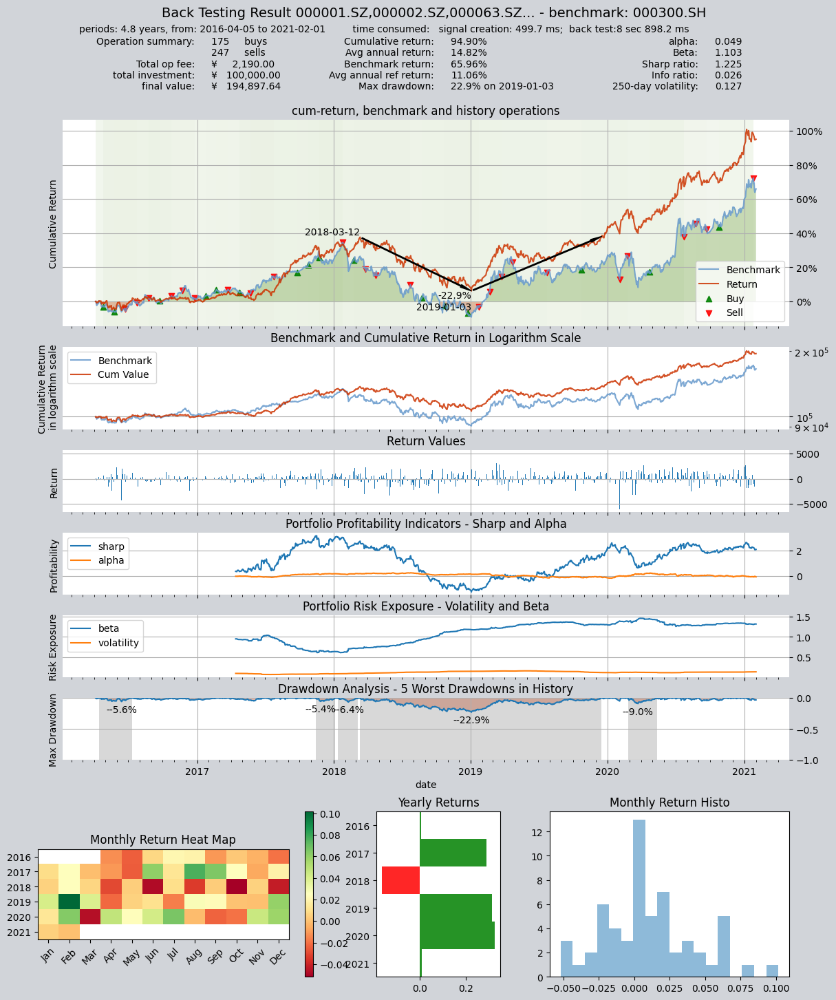

# 示例策略2: Alpha选股交易策略

本策略每隔1个月定时触发计算SHSE.000300成份股的过去的EV/EBITDA并选取EV/EBITDA大于0的股票，随后平掉排名EV/EBITDA不在最小的30的股票持仓并等权购买EV/EBITDA最小排名在前30的股票

回测数据为:SHSE.000300沪深300指数成份股

回测时间为:2016-04-05 到 2021-02-01


首先导入`qteasy`模块
```python
>>> import qteasy as qt
```

在选股之前，需要检查需要的历史数据

EV/EBITDA数据并不直接存在于qteasy定义的数据类型中，需要通过几个数据组合计算出来

EV/EBITDA = (Market Capitalization + Total Debt - Total Cash) / EBITDA

上面几个数据分别代表总市值、总负债、总现金及现金等价物，这些数据需要从qteasy内置的数据类型中分别提取，并使用上面的公式计算后，作为选股因子。排除掉小于0的因子后，将所有选股因子从小到大排列，选出因子排在最前的30支股票，将手中的全部资金平均分配投入到所有选中的股票中持有一个月，直到下一次选股为止。


```python
>>> htypes = 'total_mv, total_liab, c_cash_equ_end_period, ebitda'
>>> shares = qt.filter_stock_codes(index='000300.SH', date='20220131')
>>> print(shares[0:50])
>>> dt = qt.get_history_data(htypes, shares=shares, asset_type='any', freq='m')
>>> one_share = shares[24]
>>> df = dt[one_share]
>>> df['ev_to_ebitda'] = (df.total_mv + df.total_liab - df.c_cash_equ_end_period) / df.ebitda
```

输出如下：

```

['000001.SZ', '000002.SZ', '000063.SZ', '000066.SZ', '000069.SZ', '000100.SZ', '000157.SZ', '000166.SZ', '000301.SZ', '000333.SZ', '000338.SZ', '000425.SZ', '000538.SZ', '000568.SZ', '000596.SZ', '000625.SZ', '000651.SZ', '000661.SZ', '000703.SZ', '000708.SZ', '000725.SZ', '000768.SZ', '000776.SZ', '000783.SZ', '000786.SZ', '000800.SZ', '000858.SZ', '000876.SZ', '000895.SZ', '000938.SZ', '000963.SZ', '000977.SZ', '001979.SZ', '002001.SZ', '002007.SZ', '002008.SZ', '002024.SZ', '002027.SZ', '002032.SZ', '002044.SZ', '002049.SZ', '002050.SZ', '002064.SZ', '002120.SZ', '002129.SZ', '002142.SZ', '002157.SZ', '002179.SZ', '002202.SZ', '002230.SZ']
```
## 第一种自定义策略设置方法: 使用持仓数据和选股数据直接生成比例交易信号PS信号：

使用GeneralStrategy策略类，计算选股因子后，去掉所有小于零的因子，排序后提取排名前三十的股票
按以下逻辑生成交易信号：
1，检查当前持仓，如果持仓的股票不在选中的30个中间，则全数卖出
2，检查当前持仓，如果新选中的股票没有持仓，则等权买入新增选中的股票

设置交易信号类型为PS，生成交易信号
由于生成交易信号需要用到持仓数据，因此不能使用批量生成模式，只能使用realtime模式


```python
>>> class AlphaPS(qt.GeneralStg):
>>>     def realize(self, h, r=None, t=None, pars=None):
>>>         # 从历史数据编码中读取四种历史数据的最新数值
>>>         total_mv = h[:, -1, 0]  # 总市值
>>>         total_liab = h[:, -1, 1]  # 总负债
>>>         cash_equ = h[:, -1, 2]  # 现金及现金等价物总额
>>>         ebitda = h[:, -1, 3]  # ebitda，息税折旧摊销前利润
>>>         # 从持仓数据中读取当前的持仓数量，并找到持仓股序号
>>>         own_amounts = t[:, 0]
>>>         owned = np.where(own_amounts > 0)[0]  # 所有持仓股的序号
>>>         not_owned = np.where(own_amounts == 0)[0]  # 所有未持仓的股票序号
>>>         # 选股因子为EV/EBIDTA，使用下面公式计算
>>>         factors = (total_mv + total_liab - cash_equ) / ebitda
>>>         # 处理交易信号，将所有小于0的因子变为NaN
>>>         factors = np.where(factors < 0, np.nan, factors)
>>>         # 选出数值最小的30个股票的序号
>>>         arg_partitioned = factors.argpartition(30)
>>>         selected = arg_partitioned[:30]  # 被选中的30个股票的序号
>>>         not_selected = arg_partitioned[30:]  # 未被选中的其他股票的序号（包括因子为NaN的股票）
>>>         # 开始生成交易信号
>>>         signal = np.zeros_like(factors)
>>>         # 如果持仓为正，且未被选中，生成全仓卖出交易信号
>>>         own_but_not_selected = np.intersect1d(owned, not_selected)
>>>         signal[own_but_not_selected] = -1  # 在PS信号模式下 -1 代表全仓卖出
>>>         # 如果持仓为零，且被选中，生成全仓买入交易信号
>>>         selected_but_not_own = np.intersect1d(not_owned, selected)
>>>         signal[selected_but_not_own] = 0.0333  # 在PS信号模式下，+1 代表全仓买进 （如果多只股票均同时全仓买进，则会根据资金总量平均分配资金）
>>>         return signal
```
定义好交易策略之后，就可以开始创建Operator对象并启动回测了：


```python
>>> alpha = AlphaPS(pars=[],
>>>                  name='AlphaPS',
>>>                  description='本策略每隔1个月定时触发计算SHSE.000300成份股的过去的EV/EBITDA并选取EV/EBITDA大于0的股票',
>>>                  data_types='total_mv, total_liab, c_cash_equ_end_period, ebitda',
>>>                  strategy_run_freq='m',
>>>                  data_freq='d',
>>>                  window_length=100)
>>> op = qt.Operator(alpha, signal_type='PS')
>>> op.op_type = 'stepwise'
>>> op.run(mode=1,
>>>        asset_type='E',
>>>        asset_pool=shares,
>>>        trade_batch_size=100,
>>>        sell_batch_size=1,
>>>        trade_log=True)
>>> print()
```

输出如下：

```


     ====================================
     |                                  |
     |       BACK TESTING RESULT        |
     |                                  |
     ====================================

qteasy running mode: 1 - History back testing
time consumption for operate signal creation: 0.0 ms
time consumption for operation back looping:  14 sec 449.9 ms

investment starts on      2016-04-05 00:00:00
ends on                   2021-02-01 00:00:00
Total looped periods:     4.8 years.

-------------operation summary:------------
Only non-empty shares are displayed, call 
"loop_result["oper_count"]" for complete operation summary

          Sell Cnt Buy Cnt Total Long pct Short pct Empty pct
000301.SZ    1        1      2    10.3%      0.0%     89.7%  
000786.SZ    2        2      4    24.3%      0.0%     75.7%  
000895.SZ    2        3      5    66.6%      0.0%     33.4%  
002001.SZ    3        3      6    55.5%      0.0%     44.5%  
002007.SZ    1        2      3    62.4%      0.0%     37.6%  
002027.SZ    2        2      4    41.1%      0.0%     58.9%  
002032.SZ    1        1      2     3.6%      0.0%     96.4%  
002044.SZ    1        1      2     3.6%      0.0%     96.4%  
002049.SZ    1        1      2     3.0%      0.0%     97.0%  
002050.SZ    3        3      6    12.7%      0.0%     87.3%  
...            ...     ...   ...      ...       ...       ...
300223.SZ    1        1      2     5.3%      0.0%     94.7%  
300496.SZ    1        1      2     5.1%      0.0%     94.9%  
600219.SH    0        1      1     5.9%      0.0%     94.1%  
603185.SH    1        1      2     5.1%      0.0%     94.9%  
688005.SH    1        1      2     5.1%      0.0%     94.9%  
002756.SZ    2        2      4    58.3%      0.0%     41.7%  
600233.SH    2        2      4    36.0%      0.0%     64.0%  
600674.SH    2        2      4     7.0%      0.0%     93.0%  
601689.SH    2        2      4    20.9%      0.0%     79.1%  
600732.SH    1        1      2     5.5%      0.0%     94.5%   

Total operation fee:     ¥    1,565.00
total investment amount: ¥  100,000.00
final value:              ¥  206,286.74
Total return:                   106.29% 
Avg Yearly return:               16.17%
Skewness:                         -0.54
Kurtosis:                          2.78
Benchmark return:                65.96% 
Benchmark Yearly return:         11.06%

------strategy loop_results indicators------ 
alpha:                            0.071
Beta:                             1.047
Sharp ratio:                      1.204
Info ratio:                       0.031
250 day volatility:               0.131
Max drawdown:                    19.42% 
    peak / valley:        2017-11-16 / 2019-01-03
    recovered on:         2019-09-19

===========END OF REPORT=============
```

    


    


## 第二种自定义策略设置方法：设置交易信号类型为PT，生成持仓目标信号，在回测过程中自动生成交易信号


```python
>>> class AlphaPT(qt.GeneralStg):
>>>     def realize(self, h, r=None, t=None, pars=None):
>>>         # 从历史数据编码中读取四种历史数据的最新数值
>>>         total_mv = h[:, -1, 0]  # 总市值
>>>         total_liab = h[:, -1, 1]  # 总负债
>>>         cash_equ = h[:, -1, 2]  # 现金及现金等价物总额
>>>         ebitda = h[:, -1, 3]  # ebitda，息税折旧摊销前利润
>>>         # 选股因子为EV/EBIDTA，使用下面公式计算
>>>         factors = (total_mv + total_liab - cash_equ) / ebitda
>>>         # 处理交易信号，将所有小于0的因子变为NaN
>>>         factors = np.where(factors < 0, np.nan, factors)
>>>         # 选出数值最小的30个股票的序号
>>>         arg_partitioned = factors.argpartition(30)
>>>         selected = arg_partitioned[:30]  # 被选中的30个股票的序号
>>>         not_selected = arg_partitioned[30:]  # 未被选中的其他股票的序号（包括因子为NaN的股票）
>>>         # 开始生成PT交易信号
>>>         signal = np.zeros_like(factors)
>>>         # 所有被选中的股票的持仓目标被设置为0.03，表示持有3.3%
>>>         signal[selected] = 0.0333
>>>         # 其余未选中的所有股票持仓目标在PT信号模式下被设置为0，代表目标仓位为0
>>>         signal[not_selected] = 0
>>>         return signal
```
使用同样的方法创建一个Operator对象并启动回测。


```python
>>> alpha = AlphaPT(pars=(),
>>>                  par_count=0,
>>>                  par_types=[],
>>>                  par_range=[],
>>>                  name='AlphaSel',
>>>                  description='本策略每隔1个月定时触发计算SHSE.000300成份股的过去的EV/EBITDA并选取EV/EBITDA大于0的股票',
>>>                  data_types='total_mv, total_liab, c_cash_equ_end_period, ebitda',
>>>                  strategy_run_freq='m',
>>>                  data_freq='d',
>>>                  window_length=100)
>>> op = qt.Operator(alpha, signal_type='PT')
>>> res = op.run(mode=1,
>>>              asset_type='E',
>>>              asset_pool=shares,
>>>              PT_buy_threshold=0.00,  # 如果设置PBT=0.00，PST=0.03，最终收益会达到30万元
>>>              PT_sell_threshold=0.00,
>>>              trade_batch_size=100,
>>>              sell_batch_size=1,
>>>              trade_log=True
>>>             )
```

输出如下：

```


     ====================================
     |                                  |
     |       BACK TESTING RESULT        |
     |                                  |
     ====================================

qteasy running mode: 1 - History back testing
time consumption for operate signal creation: 499.7 ms
time consumption for operation back looping:  8 sec 898.2 ms

investment starts on      2016-04-05 00:00:00
ends on                   2021-02-01 00:00:00
Total looped periods:     4.8 years.

-------------operation summary:------------
Only non-empty shares are displayed, call 
"loop_result["oper_count"]" for complete operation summary

          Sell Cnt Buy Cnt Total Long pct Short pct Empty pct
000301.SZ    2        1       3   10.3%      0.0%     89.7%  
000786.SZ    2        3       5   24.3%      0.0%     75.7%  
000895.SZ    2        2       4   67.8%      0.0%     32.2%  
002001.SZ    3        3       6   56.7%      0.0%     43.3%  
002007.SZ    2        2       4   62.4%      0.0%     37.6%  
002027.SZ    4        8      12   41.1%      0.0%     58.9%  
002032.SZ    2        0       2    6.4%      0.0%     93.6%  
002044.SZ    1        2       3    3.6%      0.0%     96.4%  
002049.SZ    1        1       2    1.3%      0.0%     98.7%  
002050.SZ    3        3       6   12.7%      0.0%     87.3%  
...            ...     ...   ...      ...       ...       ...
300223.SZ    1        1       2    5.3%      0.0%     94.7%  
300496.SZ    1        1       2    5.1%      0.0%     94.9%  
600219.SH    1        1       2    5.9%      0.0%     94.1%  
603185.SH    1        1       2    5.1%      0.0%     94.9%  
688005.SH    1        1       2    5.1%      0.0%     94.9%  
002756.SZ    3        4       7   58.3%      0.0%     41.7%  
600233.SH    3        3       6   36.0%      0.0%     64.0%  
600674.SH    2        1       3    8.2%      0.0%     91.8%  
601689.SH    2        2       4   20.9%      0.0%     79.1%  
600732.SH    1        1       2    5.5%      0.0%     94.5%   

Total operation fee:     ¥    2,190.00
total investment amount: ¥  100,000.00
final value:              ¥  194,897.64
Total return:                    94.90% 
Avg Yearly return:               14.82%
Skewness:                         -0.48
Kurtosis:                          2.82
Benchmark return:                65.96% 
Benchmark Yearly return:         11.06%

------strategy loop_results indicators------ 
alpha:                            0.049
Beta:                             1.103
Sharp ratio:                      1.225
Info ratio:                       0.026
250 day volatility:               0.127
Max drawdown:                    22.90% 
    peak / valley:        2018-03-12 / 2019-01-03
    recovered on:         2019-12-17

===========END OF REPORT=============
```

    


## 第三种自定义策略设置方法：使用FactorSorter策略类
使用FactorSorter策略类，直接生成交易策略的选股因子，再根据
FactorSorter策略的选股参数实现选股

设置交易信号类型为PT，生成持仓目标，自动生成交易信号


```python
>>> class AlphaFac(qt.FactorSorter):
>>>     def realize(self, h, r=None, t=None, pars=None):
>>>         # 从历史数据编码中读取四种历史数据的最新数值
>>>         total_mv = h[:, -1, 0]  # 总市值
>>>         total_liab = h[:, -1, 1]  # 总负债
>>>         cash_equ = h[:, -1, 2]  # 现金及现金等价物总额
>>>         ebitda = h[:, -1, 3]  # ebitda，息税折旧摊销前利润
>>>         # 选股因子为EV/EBIDTA，使用下面公式计算
>>>         factor = (total_mv + total_liab - cash_equ) / ebitda
>>>         # 由于使用因子排序选股策略，因此直接返回选股因子即可，策略会自动根据设置条件选股
>>>         return factor
```
使用同样的方法创建一个Operator对象并启动回测。


```python
>>> alpha = AlphaFac(pars=(),
>>>                  par_count=0,
>>>                  par_types=[],
>>>                  par_range=[],
>>>                  name='AlphaSel',
>>>                  description='本策略每隔1个月定时触发计算SHSE.000300成份股的过去的EV/EBITDA并选取EV/EBITDA大于0的股票',
>>>                  data_types='total_mv, total_liab, c_cash_equ_end_period, ebitda',
>>>                  strategy_run_freq='m',
>>>                  data_freq='d',
>>>                  window_length=100,
>>>                  max_sel_count=30,  # 设置选股数量，最多选出30个股票
>>>                  condition='greater',  # 设置筛选条件，仅筛选因子大于ubound的股票
>>>                  ubound=0.0,  # 设置筛选条件，仅筛选因子大于0的股票
>>>                  weighting='even',  # 设置股票权重，所有选中的股票平均分配权重
>>>                  sort_ascending=True)  # 设置排序方式，因子从小到大排序选择头30名
>>> op = qt.Operator(alpha, signal_type='PT')
>>> res = op.run(mode=1,
>>>        asset_type='E',
>>>        asset_pool=shares,
>>>        PT_buy_threshold=0.0,
>>>        PT_sell_threshold=0.0,
>>>        trade_batch_size=100,
>>>        sell_batch_size=1)
```

输出如下：

```


     ====================================
     |                                  |
     |       BACK TESTING RESULT        |
     |                                  |
     ====================================

qteasy running mode: 1 - History back testing
time consumption for operate signal creation: 10.9 ms
time consumption for operation back looping:  6 sec 200.0 ms

investment starts on      2016-04-05 00:00:00
ends on                   2021-02-01 00:00:00
Total looped periods:     4.8 years.

-------------operation summary:------------
Only non-empty shares are displayed, call 
"loop_result["oper_count"]" for complete operation summary

          Sell Cnt Buy Cnt Total Long pct Short pct Empty pct
000301.SZ    2        1       3   10.3%      0.0%     89.7%  
000786.SZ    2        3       5   24.3%      0.0%     75.7%  
000895.SZ    2        2       4   67.8%      0.0%     32.2%  
002001.SZ    3        3       6   56.7%      0.0%     43.3%  
002007.SZ    2        2       4   62.4%      0.0%     37.6%  
002027.SZ    4        8      12   41.1%      0.0%     58.9%  
002032.SZ    2        0       2    6.4%      0.0%     93.6%  
002044.SZ    1        2       3    3.6%      0.0%     96.4%  
002049.SZ    1        1       2    1.3%      0.0%     98.7%  
002050.SZ    3        3       6   12.7%      0.0%     87.3%  
...            ...     ...   ...      ...       ...       ...
300223.SZ    1        1       2    5.3%      0.0%     94.7%  
300496.SZ    1        1       2    5.1%      0.0%     94.9%  
600219.SH    1        1       2    5.9%      0.0%     94.1%  
603185.SH    1        1       2    5.1%      0.0%     94.9%  
688005.SH    1        1       2    5.1%      0.0%     94.9%  
002756.SZ    3        4       7   58.3%      0.0%     41.7%  
600233.SH    3        3       6   36.0%      0.0%     64.0%  
600674.SH    2        1       3    8.2%      0.0%     91.8%  
601689.SH    2        2       4   20.9%      0.0%     79.1%  
600732.SH    1        1       2    5.5%      0.0%     94.5%   

Total operation fee:     ¥    2,195.00
total investment amount: ¥  100,000.00
final value:              ¥  194,976.99
Total return:                    94.98% 
Avg Yearly return:               14.82%
Skewness:                         -0.48
Kurtosis:                          2.82
Benchmark return:                65.96% 
Benchmark Yearly return:         11.06%

------strategy loop_results indicators------ 
alpha:                            0.049
Beta:                             1.103
Sharp ratio:                      1.225
Info ratio:                       0.026
250 day volatility:               0.127
Max drawdown:                    22.90% 
    peak / valley:        2018-03-12 / 2019-01-03
    recovered on:         2019-12-17

===========END OF REPORT=============
```

    
