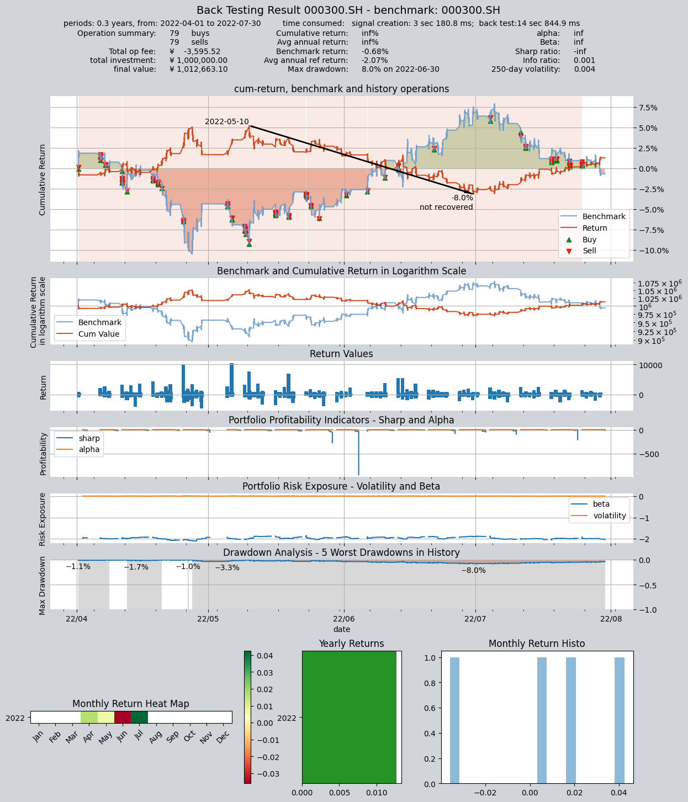

# 示例策略5: 类网格交易策略

- 本策略首先计算过去300个价格数据的均值和标准差 (天数是一个可调参数)
- 并根据均值加减1和2个标准差得到网格的区间分界线,（加减标准差的倍数是可调参数)
- 并分别配以0.3和0.5的仓位权重 (仓位权重是可调参数）
- 然后根据价格所在的区间来配置仓位(+/-40为上下界,无实际意义):
(-40,-3],(-3,-2],(-2,2],(2,3],(3,40](具体价格等于均值+数字倍标准差)
[-0.5, -0.3, 0.0, 0.3, 0.5](资金比例,此处负号表示开空仓，回测时设置为允许持有空头仓位)

回测数据为:HS300指数的1min数据
回测时间为:2022-03-01 09:30:00到2022-07-31 15:00:00


```python
import qteasy as qt
print(qt.__version__)
```
## 定义交易策略

```python
import numpy as np
class GridTrading(qt.GeneralStg):
    
    def __init__(self, pars: tuple = (2.0, 3.0, 0.3, 0.5, 300)):
        super().__init__(
                pars=pars,
                par_count=5,
                par_types=['float', 'float', 'float', 'float', 'int'],  # 仓位配置的阈值：参数1:低仓位阈值，参数2: 高仓位阈值，参数3：低仓位比例，参数4:高仓位比例，参数5:计算天数
                par_range=[(0.5, 3.0), (2.0, 10.), (0.01, 0.5), (0.5, 0.99), (10, 300)],
                name='GridTrading',
                description='根据过去300份钟的股价均值和标准差，改变投资金额的仓位',
                strategy_run_timing='close',  # 在周期结束（收盘）时运行
                strategy_run_freq='1min',  # 每份钟执行一次调整
                strategy_data_types='close',  # 使用份钟收盘价调整
                data_freq='1min',  # 数据频率（包括股票数据和参考数据）
                window_length=300,
                use_latest_data_cycle=False,  # 高频数据不需要使用当前数据区间
                reference_data_types='',  # 不需要使用参考数据
        )
    
    def realize(self, h, r=None, t=None, pars=None):
        """策略输出PT信号，即仓位目标信号"""

        low_threshold, high_threshold, low_pos, hi_pos, days = self.pars

        # 读取最近N天的收盘价
        close = h[:, - days:, 0]  # 最新连续收盘价
        current_close = h[:, -1, 0]  # 当天的收盘价

        # 计算N天的平均价和标准差，并计算仓位阈值
        close_mean = np.nanmean(close, axis=1)
        close_std = np.nanstd(close, axis=1)
        hi_positive = close_mean + high_threshold * close_std
        low_positive = close_mean + low_threshold * close_std
        low_negative = close_mean - low_threshold * close_std
        hi_negative = close_mean - high_threshold * close_std

        # 根据当前的实际价格确定目标仓位，并将目标仓位作为信号输出
        pos = np.zeros_like(close_mean)
        pos = np.where(current_close > hi_positive, hi_pos, pos)
        pos = np.where(hi_positive >= current_close > low_positive, low_pos, pos)
        pos = np.where(low_positive >= current_close > low_negative, 0, pos)
        pos = np.where(low_negative >= current_close > hi_negative, - low_pos, pos)
        pos = np.where(current_close >= hi_negative, - hi_pos, pos)

        return pos
```
## 设定交易员对象，并且设置交易配置，实施交易回测

```python
alpha = GridTrading()
op = qt.Operator(alpha, signal_type='PT')
op.op_type = 'batch'
op.set_blender("1.0*s0", 'close')
op.run(
        mode=1,
        invest_start='20220401',
        invest_end='20220731',
        invest_cash_amounts=[1000000],
        asset_type='IDX',
        asset_pool=['000300.SH'],
        trade_batch_size=0,
        sell_batch_size=0,
        trade_log=True,
        allow_sell_short=True,
)

```

    
         ====================================
         |                                  |
         |       BACK TESTING RESULT        |
         |                                  |
         ====================================
    
    qteasy running mode: 1 - History back testing
    time consumption for operate signal creation: 3 sec 180.8 ms
    time consumption for operation back looping:  14 sec 844.9 ms
    
    investment starts on      2022-04-01 09:30:00
    ends on                   2022-07-30 15:00:00
    Total looped periods:     0.3 years.
    
    -------------operation summary:------------
    Only non-empty shares are displayed, call 
    "loop_result["oper_count"]" for complete operation summary
    
              Sell Cnt Buy Cnt Total Long pct Short pct Empty pct
    000300.SH    79       79    158    0.0%     98.1%      1.9%   
    
    Total operation fee:     ¥   -3,595.52
    total investment amount: ¥1,000,000.00
    final value:              ¥1,012,663.10
    Total return:                      inf% 
    Avg Yearly return:                 inf%
    Skewness:                          3.34
    Kurtosis:                        116.90
    Benchmark return:                -0.68% 
    Benchmark Yearly return:         -2.07%
    
    ------strategy loop_results indicators------ 
    alpha:                              inf
    Beta:                               inf
    Sharp ratio:                       -inf
    Info ratio:                       0.001
    250 day volatility:               0.004
    Max drawdown:                     7.95% 
        peak / valley:        2022-05-10 / 2022-06-30
        recovered on:         Not recovered!
    
    ===========END OF REPORT=============
    

    

    
