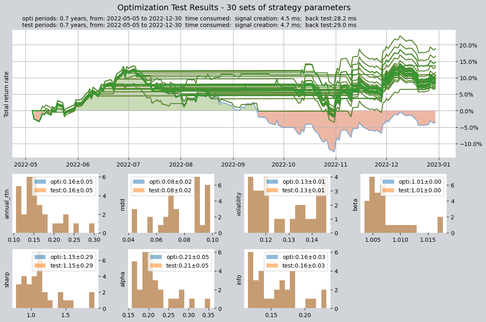
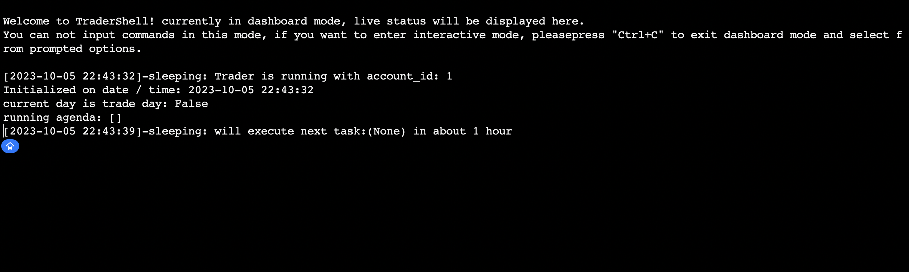

# QTEASY 快速上手指南

## 安装与导入

使用 pip 安装（要求 Python >= 3.6, <3.13）：

```bash
pip install qteasy
```

部分功能（如全部内置策略、数据库存储等）需要可选依赖，详见 [FAQ](https://qteasy.readthedocs.io/zh-cn/latest/faq.html) 与安装说明。

```python
import qteasy as qt
print(qt.__version__)
```

---

## 一分钟跑通

本节将带您完成：配置 tushare Token → 下载沪深 300 十年指数数据 → 查看数据与 K 线 → 使用内置 DMA 策略对 000300.SH 做择时回测，并得到一份可用的回测结果。

### 1. 配置 tushare Token

qteasy 默认使用本地 `data/` 目录存储数据。若要从网络下载数据，需要先配置 [tushare](https://tushare.pro/document/2) 的 API Token（请先在 tushare 官网注册并获取 Token）。

**方式一：配置文件**  
在 qteasy 安装目录下的 `qteasy/qteasy.cfg` 中增加一行（可通过 `qt.view_config_files()` 查看配置文件路径）：

```text
tushare_token = 你的tushare_API_Token
```

**方式二：代码中配置**  
在首次下载数据前执行一次：

```python
import qteasy as qt
qt.configure(tushare_token='你的tushare_API_Token')
```

### 2. 下载 000300.SH 十年指数数据

配置好 Token 后，下载沪深 300 指数（000300.SH）的日线数据。建议先下载交易日历与指数基础信息，再下载指数日线（约十年）：

```python
import qteasy as qt

# 若未在 cfg 中配置 token，可在此设置
# qt.configure(tushare_token='你的Token')

# 下载交易日历与指数基础信息（首次使用建议执行）
qt.refill_data_source(tables=['trade_calendar', 'index_basics'])

# 下载 000300.SH 近十年日线数据
qt.refill_data_source(
    tables=['index_daily'],
    start_date='20140101',
    end_date='20241231',
    symbols=['000300.SH'],
)
```

### 3. 查看数据与 K 线图

数据落地后，可用 `get_history_data` 取数、用 `candle` 画 K 线，确认数据与行情是否正常：

```python
# 获取近一年日线（2.0 推荐使用 htype_names）
hp = qt.get_history_data(
    htype_names='open, high, low, close',
    shares='000300.SH',
    start='20230101',
    end='20231231',
)
print(hp)  # 查看数据结构与范围

# 绘制 K 线（支持交互缩放与切换指标）
qt.candle('000300.SH', start='2023-06-01', end='2023-12-01', asset_type='IDX')
```


### 4. 使用 DMA 策略做择时回测

使用内置 **DMA** 均线择时策略，以 000300.SH 为交易标的，在已下载的十年数据上做回测。下面使用一组常用且表现较稳的参数（短均线 20、长均线 60、DMA 周期 10），直接得到回测结果与图表：

```python
op = qt.Operator(strategies='dma')
op.set_parameter('dma', pars=(20, 60, 10))  # 已验证的一组参数

res = op.run(
    mode=1,
    asset_pool='000300.SH',
    asset_type='IDX',
    invest_cash_amounts=[100000],
    invest_start='20150101',
    invest_end='20241231',
    cost_rate_buy=0.0003,
    cost_rate_sell=0.0001,
    visual=True,
    trade_log=True,
)
```

运行后将得到收益曲线、最大回撤、夏普比等评价指标及可视化图表。若要尝试其他参数或优化区间，可参考下一节「qteasy 能做什么」中的参数优化与 [回测文档](references/3-back-test-strategy.md)。

---

## qteasy 能做什么

### 回测与评价

所有交易策略由 `Operator`（交易员）管理。使用内置 DMA 均线择时策略，即可在历史数据上回测并得到收益曲线、最大回撤、夏普比等评价指标及图表。

- 向量化回测，支持日/周/月及分钟级频率，运行高效。
- 内置 70+ 策略，一行代码即可组合、回测；支持自定义策略与多策略混合（blender）。
- 输出完整交易清单与多维度评价（收益、回撤、夏普、信息比等），并生成可视化图表。

内置策略说明见 [内置策略文档](references/4-build-in-strategy-blender.md)。

```python
op = qt.Operator(strategies='dma')
op.info()

res = op.run(
    mode=1,
    asset_pool='000300.SH',
    asset_type='IDX',
    invest_cash_amounts=[100000],
    invest_start='20220501',
    invest_end='20221231',
    visual=True,
    trade_log=True,
)
```


### 参数优化

设置策略的优化标记后，在 `mode=2` 下运行，qteasy 会在优化区间内搜索表现较好的参数，并在测试区间验证；优化结果可写回策略参数用于后续回测。

- 多种优化算法可选（网格、随机、遗传算法、贝叶斯等），适应不同参数规模与耗时。
- 优化区间与测试区间分离，避免过拟合，结果更可依赖。
- 一次运行得到多组候选参数及排名，便于比较与择优选入实盘。

详细参数与解读见 [策略优化](references/5-optimize-strategy.md)。

```python
op.set_parameter('dma', opt_tag=1)
res = op.run(
    mode=2,
    opti_start='20220501',
    opti_end='20221231',
    test_start='20220501',
    test_end='20221231',
    opti_sample_count=1000,
    visual=True,
)
```



### 实盘与监控界面

qteasy 支持实盘或模拟运行：先配置交易标的与运行参数，再通过 `qt.run(op, ...)` 或命令行启动。使用账户 ID 可断点续跑。

- 与交易所节奏一致：按交易日定时拉取行情、运行策略、模拟成交，支持 T+1 与费率设置。
- 账户与交易记录持久化，断点续跑不丢状态；多账户可分别管理资金与持仓。
- **TraderShell**：命令行界面，查看持仓、资金与交易日志，适合服务器与脚本化使用。
- **TraderApp**：图形界面，实时查看交易日志、持仓与资金变化，操作更直观。

详细配置与启动方式见 [模拟运行概览](references/1-simulation-overview.md)。




极简启动示例（需已配置资产池等）：

```python
qt.run(op, live_trade_account_name='new_account', live_trade_ui_type='tui')
```

或使用示例脚本：`python -m live_example --account 1 --ui tui`（参见 `examples/` 目录）。

---

## 接下来

- [教程：获取数据](tutorials/2-get-data.md) — 配置数据源与下载更多数据
- [教程：第一个策略](tutorials/3-start-first-strategy.md) — 使用内置策略与回测
- [回测与评价](references/3-back-test-strategy.md) — 回测参数与结果解读
- [API 参考](api/use_qteasy.rst) — 完整接口说明
