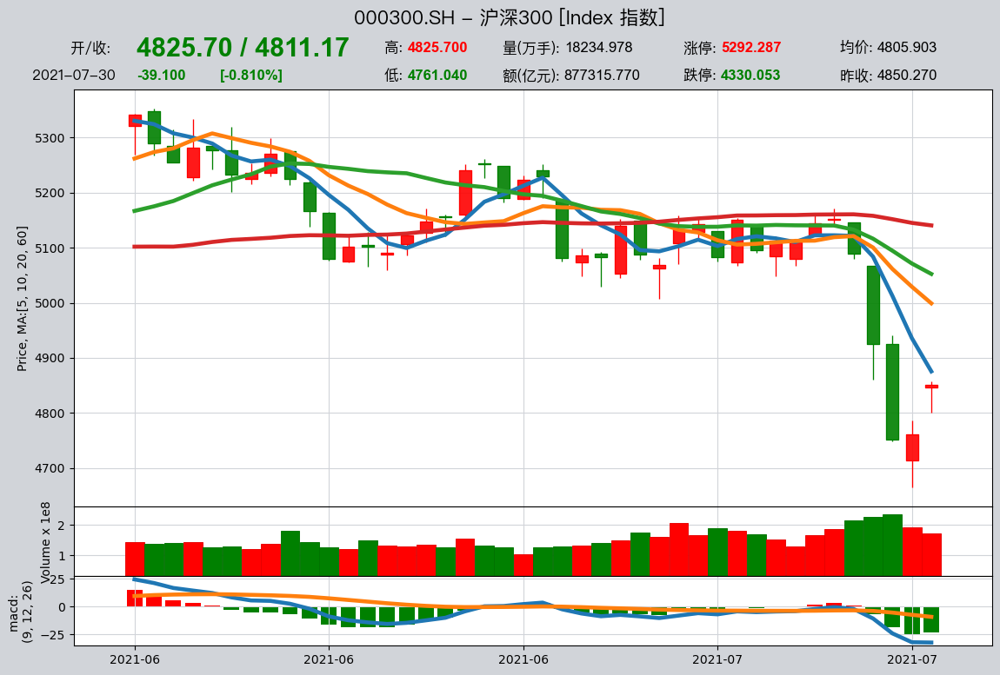
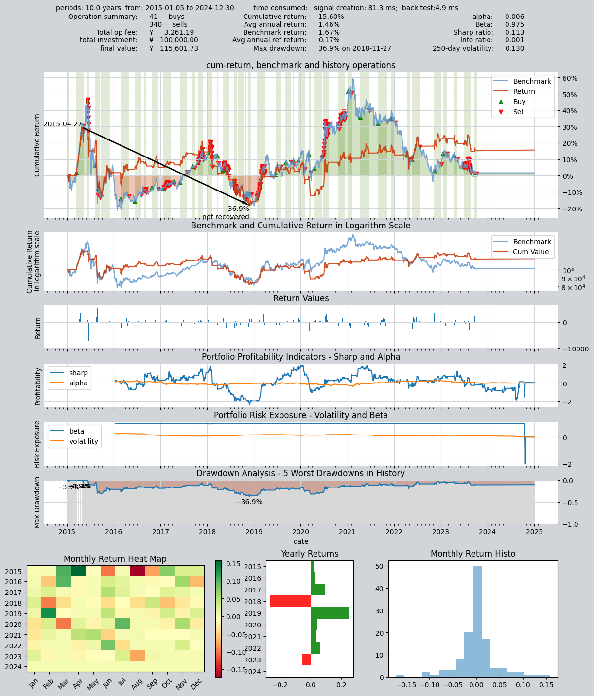
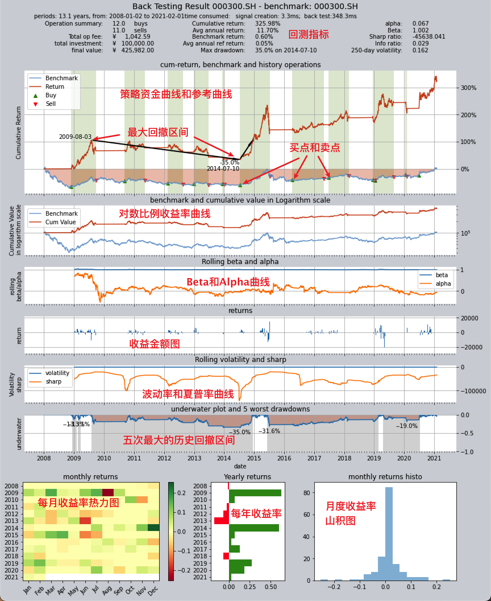
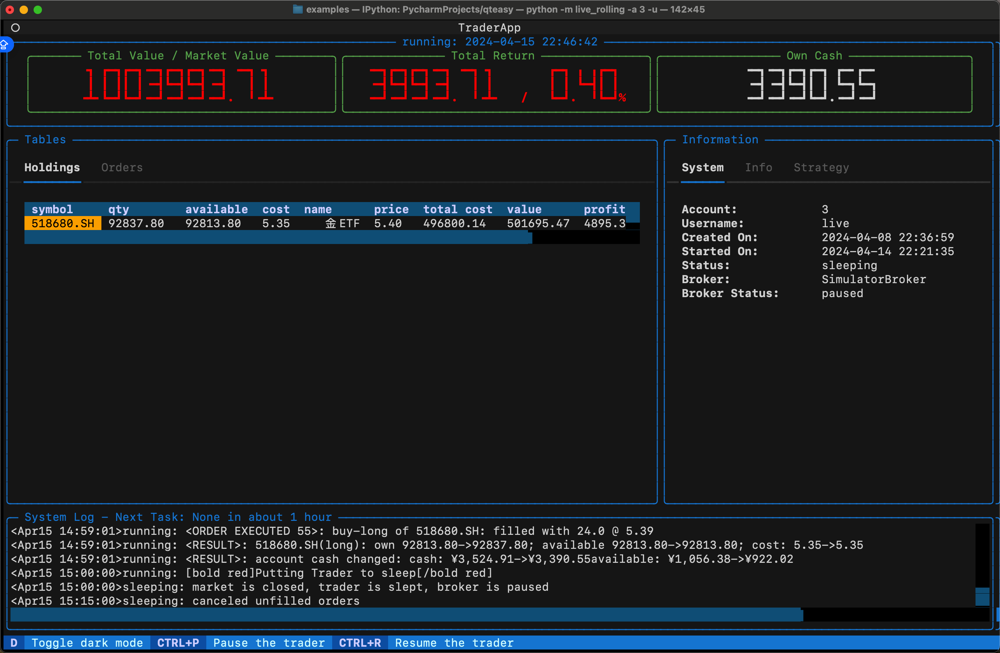
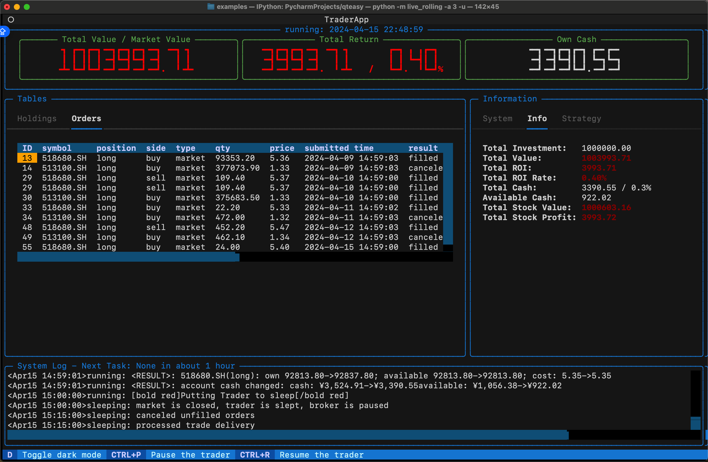
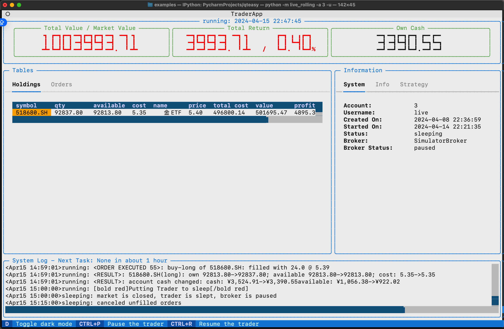

# QTEASY 快速上手指南

## 安装与导入

使用 `pip` 安装（要求 `Python >= 3.9, <3.13`）：部分功能（如全部内置策略、数据库存储等）需要可选依赖，详见 [FAQ](https://qteasy.readthedocs.io/zh-cn/latest/faq.html) 与安装说明。

```bash
pip install qteasy
```
启动后即可导入 `qteasy` 并查看版本号：

```python
>>> import qteasy as qt
>>> print(qt.__version__)
```

输出如下：

```
2.4.0
```
---

## 一分钟跑通

本节将带您完成：配置 `tushare Token` → 下载沪深 300 十年指数数据 → 查看数据与 K 线 → 使用内置 DMA 策略对 000300.SH 做择时回测，并得到一份可用的回测结果。

### 1. 配置 tushare Token

`qteasy` 默认使用 `Tushare` 下载金融数据。若要下载数据，需要先在系统的启动配置文件中配置 `tushare` 的 API Token（请先在 [`tushare` 官网](https://tushare.pro)注册并获取 Token）。

有两种方式修改启动配置文件：

**方式一：在代码中设置启动配置**  
在首次下载数据前执行`update_start_up_setting()`修改启动配置并自动将其保存到启动配置文件中：

```python
>>> qt.update_start_up_setting(tushare_token='你的tushare_API_Token')  # 启动配置将被保存到启动配置文件中
>>> qt.start_up_settings()  # 查看启动配置文件的内容
```

输出如下：

```
Start up settings:
--------------------
tushare_token = <你的tushare_API_token>
...
```

**方式二：直接修改启动配置文件**  
启动配置文件 `qteasy.cfg` 保存在 qteasy 根目录下（可通过 `qt.QT_ROOT_PATH` 查看配置文件路径），使用任意文本编辑器打开该文件并在其中增加一行：

```text
tushare_token = 你的tushare_API_Token  # 直接打开文件并在其中新增配置，字符串配置不需要使用双引号
```

### 2. 下载 000300.SH 十年指数数据

配置好 `tushare` Token 后，下载沪深 300 指数（000300.SH）的日线数据。建议先下载交易日历与指数基础信息，再下载指数日线（约十年）：

使用`qteasy.refill_data_source()`函数，`qteasy`会自动从配置好的数据下载渠道下载数据，当数据量太大时，会自动分块下载数据、完成数据检查和清洗并存储到数据库中。


```python
>>> # 下载交易日历与指数基础信息
>>> qt.refill_data_source(tables=['trade_calendar', 'index_basics'])
>>> # 下载 000300.SH 近十年日线数据
>>> qt.refill_data_source(
...     tables=['index_daily'],
...     start_date='20140101',
...     end_date='20241231',
...     symbols=['000300.SH'],
... )
```

输出如下：

```
Filling data source file://csv@qt_root/data/ ...
into 1 table(s) (parallely): {'trade_calendar'}
<trade_calendar> 35000 wrn: 100%|████████████████████████████████████████████████████████████████████████████████████| 8/8 [00:05<00:00,  1.58task/s]
Data refill completed! 35000 rows written into 1/1 table(s)!

Filling data source file://csv@qt_root/data/ ...
into 2 table(s) (parallely): {'index_daily', 'index_basic'}
<index_daily> 152760 wrn: 100%|██████████████████████████████████████████████████████████████████████████████████████| 2/2 [00:05<00:00,  2.51s/task]
<index_basic> 1327 wrn: 100%|████████████████████████████████████████████████████████████████████████████████████████| 8/8 [00:05<00:00,  1.58task/s]
Data refill completed! 154087 rows written into 2/2 table(s)!
```


### 3. 查看数据与 K 线图

数据落地后，可用 `get_history_data` 取数、用 `HistoryPanel.plot` 和 `qt.candle` 画 K 线，确认数据与行情是否正常：

```python
>>> # 获取近一年日线，直接返回 HistoryPanel
>>> hp = qt.get_history_data(
...     htypes='open, high, low, close',  # 需要获取的数据类型分别为开盘价、最高价、最低价、收盘价
...     shares='000300.SH',  # 资产类型为沪深300指数
...     start='20230101',  # 数据起始日期
...     end='20231231',  # 数据结束日期
... )
>>> print(hp)  # 查看数据结构与范围
>>> # 在 HistoryPanel 上绘制静态 K 线 + 成交量
>>> hp.plot(interactive=False)
>>> # 或者使用 qt.candle 快速绘制 K 线（内部同样基于 HistoryPanel）
>>> qt.candle('000300.SH', start='2023-06-01', end='2023-12-01', asset_type='IDX')
```

#### 3.1 交互式图表（Plotly）与依赖

如果你希望在 Notebook 里缩放、平移并查看每根 K 线/指标对应的具体数值，可以使用交互式绘图：

```python
>>> hp.plot(interactive=True)
```

交互式图表依赖 Plotly。建议按你的使用环境选择安装：

- **基础交互（Plotly Figure）**：

```bash
pip install plotly
```

- **Notebook 更完整交互（FigureWidget + 回调）**：

```bash
pip install ipywidgets anywidget
```

在 Notebook 中，qteasy 会优先尝试提供更完整的 FigureWidget 体验；如果当前内核/依赖不满足，则会回退到 HTML 方式展示。若未安装 Plotly，`interactive=True` 会直接抛出英文错误提示（通常包含 “requires plotly”）。

#### 3.2 最常用的交互参数

- `plotly_backend_app='auto'|'FigureWidget'|'html'`：在 Notebook 中选择输出方式（默认 `'auto'`）。
- `layout='auto'|'overlay'|'stack'`：多标的布局。`'overlay'` 仅对 **两标的**叠加对比最常用；`'auto'` 会在“两标的 → overlay，其余 → stack”间自动选择。
- `highlight='max'|'min'`：高亮最大/最小值点（静态与交互均可用）。


输出如下：

```
{'000300.SH':
               open     high      low    close
2023-01-03  3864.84  3893.99  3831.25  3887.90
2023-01-04  3886.25  3905.90  3873.65  3892.95
2023-01-05  3913.49  3974.88  3912.26  3968.58
...             ...      ...      ...      ...
2023-10-10  3696.25  3701.26  3655.59  3657.13
2023-10-11  3674.75  3689.53  3658.35  3667.55
2023-10-12  3697.93  3711.50  3682.84  3702.38

[186 rows x 4 columns]
}
```



### 3.5 操作历史数据（HistoryPanel）

在实际研究中，很多时候我们不仅需要“看 K 线”，还需要**在代码里对历史数据做统计、生成因子**。  
`get_history_data()` 除了可以返回 `DataFrame` 外，还可以直接返回一个三维的 `HistoryPanel`，便于对多标的、多指标做统一计算：

```python
>>> # 获取 000300.SH 的 OHLCV 历史数据，并返回 HistoryPanel
>>> hp = qt.get_history_data(
...     htypes='open, high, low, close, vol',
...     shares='000300.SH',
...     start='20230101',
...     end='20231231',
...     as_data_frame=False,          # 关键：返回 HistoryPanel
... )
>>> print(hp.shape, hp.shares, hp.htypes)

>>> # 1) 计算简单收益率矩阵（时间 × 股票）
>>> ret = hp.returns(price_htype='close', method='simple')
>>> print(ret.head())

>>> # 2) 计算 20 日滚动波动率
>>> vol = hp.volatility(window=20, price_htype='close', annualize=True)
>>> print(vol.tail())

>>> # 3) 生成 K 线技术指标（如 20 日均线、MACD）
>>> hp_ma = hp.kline.sma(window=20)              # 在 htypes 中新增 'sma_20'
>>> hp_ma_macd = hp_ma.kline.macd()              # 再追加 MACD 指标
>>> print(hp_ma_macd.htypes)

>>> # 4) 识别蜡烛形态（如锤头线）
>>> hammer = hp.candle_pattern('cdlhammer')      # 返回 DataFrame，非 0 代表出现形态
>>> print(hammer[hammer['000300.SH'] != 0].head())

>>> # 5) 单只股票切片成 DataFrame，方便与 pandas / sklearn 等联动
>>> df_300 = hp_ma_macd.to_share_frame('000300.SH')
>>> print(df_300.tail())
```

上面的例子演示了从 `get_history_data(..., as_data_frame=False)` 得到 `HistoryPanel` 之后，如何在一两行代码内完成**收益率、波动率、技术指标与形态信号**的计算，并随时切回熟悉的 `DataFrame` 做进一步分析。

更系统的 HistoryPanel 用法可以参考「使用教程」中“历史数据的操作和分析”一章，以及 [HistoryPanel API 参考](api/HistoryPanel.rst)。

### 4. 使用 DMA 策略做择时回测

使用内置 **DMA** 均线择时策略，以 000300.SH 为交易标的，在已下载的十年数据上做回测。下面使用一组常用且表现较稳的参数（短均线 20、长均线 60、DMA 周期 10），直接得到回测结果与图表：

```python
>>> # 设置qteasy的运行配置参数
>>> qt.configure(
...     asset_pool='000300.SH',  # 交易资产池包括沪深300指数
...     asset_type='IDX',  # 投资资产类型为IDX-指数
...     invest_cash_amounts=[100000],  # 回测初始投资金额为十万元
...     invest_start='20150101',  # 回测投资初始日期
...     invest_end='20241231',  # 回测投资结束日期
...     cost_rate_buy=0.0003,  # 交易费率：买入手续费万分之三
...     cost_rate_sell=0.0001,  # 交易费率：卖出手续费万分之一
...     visual=True,  # 是否输出回测结果可视化图表：是
...     trade_log=True,  # 是否输出回测记录：是
... )
>>> op = qt.Operator(strategies='dma')  # 创建一个交易员对象，执行一个DMA交易策略
>>> op.set_parameter('dma', par_values=(20, 60, 10))  # 设置交易策略的参数
>>> res = qt.run(op, mode=1)  # 启动交易，运行模式为1（回测交易）
```
输出如下：

```
====================================
|                                  |
|         BACKTEST REPORT          |
|                                  |
====================================
qteasy running mode: 1 - History back testing
time consumption for operate signal creation: 81.3 ms
time consumption for operation back testing:  4.9 ms
investment starts on      2015-01-05 15:00:00
ends on                   2024-12-30 15:00:00
Total looped periods:     10.0 years.
-------------operation summary:------------
Only non-empty shares are displayed, call 
"loop_result["oper_count"]" for complete operation summary
          Sell Cnt Buy Cnt Total Long pct Short pct Empty pct
000300.SH   340       41    381   44.7%     -0.0%     55.3%  

Total operation fee:     ¥    3,261.19
total investment amount: ¥  100,000.00
final value:              ¥  115,601.73
Total return:                    15.60% 
Avg Yearly return:                1.46%
Skewness:                         -1.16
Kurtosis:                         16.95
Benchmark return:                 1.67% 
Benchmark Yearly return:          0.17%

------strategy loop_results indicators------ 
alpha:                            0.006
Beta:                             0.975
Sharp ratio:                      0.113
Info ratio:                       0.001
250 day volatility:               0.130
Max drawdown:                    36.85% 
    peak / valley:        2015-04-27 / 2018-11-27
    recovered on:         Not recovered!


==================END OF REPORT===================

```


运行后将得到收益曲线、最大回撤、夏普比等评价指标及可视化图表。若要尝试其他参数或优化区间，可参考下一节「`qteasy` 能做什么」中的参数优化与 [回测文档](references/3-back-test-strategy.md)。

---

## `qteasy` 能做什么

### **获取并管理金融历史数据**: 

- 方便地从多渠道获取大量金融历史数据，进行数据清洗后以统一格式进行本地存储
- 通过`DataType`对象结构化管理金融数据中的可用信息，即便是复权价格、指数成份等复杂信息，也只需要一行代码即可获取
- 基于`DataType`对象的金融数据可视化、统计分析以及分析结果可视化
- 数据本地存储、按需取用，为回测与实盘提供一致的数据基础，便于复现


### **以简单、安全的方式创建交易策略**

- 通过`BaseStrategy`类，交易策略定义方法直观、逻辑清晰
- 内置超过70种策略开箱即用，独特的策略混合和组机制，复杂策略可以通过简单策略拼装而来，过程如同搭积木
- 交易策略的数据输入和使用方法完全封装且安全，完全避免无意中导致未来函数、数据泄露等问题，保证策略运行结果的真实性和可靠性
- 同一套策略逻辑既用于回测也用于实盘，减少「回测漂亮、实盘走样」的落差



### **交易策略的回测评价、优化和模拟自动化交易**

- 通过`Operator`交易员类管理策略运行，按照真实市场交易节奏回测策略，对交易结果进行多维度全方位评价，生成交易报告和结果图表
- 提供多种优化算法，包括模拟退火、遗传算法、贝叶斯优化等在大参数空间中优化策略性能
- 获取实时市场数据，运行策略模拟自动化交易，跟踪记录交易日志、股票持仓、账户资金变化等信息
- 回测、优化与实盘使用同一套运行机制，写一次策略即可全模式运行，配置清晰，便于复现与排查
- 未来将通过QMT接口接入券商提供的实盘交易接口，实现自动化交易

  
  
 


---

## 端到端路线图 / 教程

若希望按完整流程走通「从配置到回测、优化、模拟/实盘」，可依下列顺序阅读教程与文档，每步均有对应章节与示例：

1. **配置数据源与 Token** → [教程：入门](tutorials/1-get-started.md)、[教程：获取数据](tutorials/2.0-get-data.md)
2. **下载数据** → [教程：获取数据](tutorials/2.0-get-data.md)、[下载并管理金融历史数据](manage_data/1.%20overview.md)
3. **定义策略并回测** → [教程：第一个策略](tutorials/3-start-first-strategy.md)、[教程：内置策略](tutorials/4-build-in-strategies.md)、[教程：自定义策略](tutorials/5-first-self-defined-strategy.md)、[如何运行回测](back_testing/2.%20run_backtest.md)
4. **参数优化** → [教程：交易策略的优化](tutorials/Tutorial%2006%20-%20交易策略的优化.md)、[优化交易策略](optimization/1.%20overview.md)
5. **模拟/实盘运行** → [教程：交易策略的部署及运行](tutorials/Tutorial%2007%20-%20交易策略的部署及运行.md)、[模拟实盘运行概览](references/1-simulation-overview.md)

上述教程已覆盖从配置到回测、优化与模拟/实盘的完整链路；遇到问题时可在 [FAQ](faq.md) 中查找「如何跑通」「为何慢」「防未来函数」等常见说明。

---

## 接下来

- [教程：获取数据](tutorials/2.0-get-data.md) — 配置数据源与下载更多数据
- [教程：第一个策略](tutorials/3-start-first-strategy.md) — 使用内置策略与回测
- [回测与评价](references/3-back-test-strategy.md) — 回测参数与结果解读
- [API 参考](api/use_qteasy.rst) — 完整接口说明
