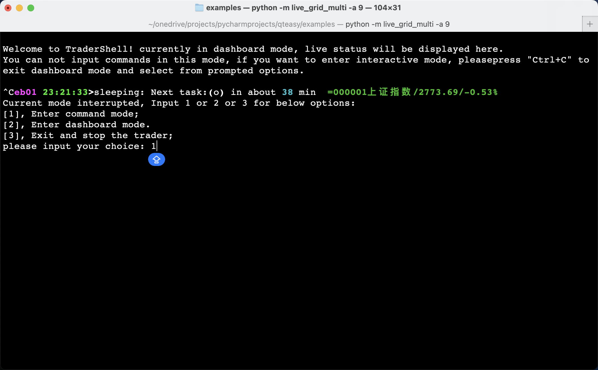

.. qteasy documentation master file, created by
   sphinx-quickstart on Sun Nov 19 21:52:20 2023.
   You can adapt this file completely to your liking, but it should at least
   contain the root `toctree` directive.

欢迎使用QTEASY文档!
================================

.. note::

   This project is under active development. Please feel free to contribute to this project, or report any issues you find.

- Author: **Jackie PENG**
- email: *jackie_pengzhao@163.com*
- Created: 2019, July, 16
- Latest Version: `1.0.23`
- License: CC0 1.0 Universal (CC0 1.0) Public Domain Dedication

Why QTEASY?
-----------

1. **全流程覆盖** 从金融数据获取、存储，到交易策略的开发、回测、优化、实盘运行
2. **完全本地化** 所有的金融数据、策略运算和优化过程完全本地化，不依赖于任何云端服务
3. **使用简单** 提供大量内置交易策略，用户可以搭积木式地创建自己的交易策略
4. **灵活多变** 使用qteasy提供的策略类，用户可以自行创建自己的交易策略，灵活设置可调参数

What Can You Do with QTEASY？
----------------------------

下载金融历史数据
~~~~~~~~~~~~~~~~~~~~

- 获取、清洗、本地存储大量金融历史数据
- 检索、处理、调用本地数据
- 本地金融数据可视化

.. image:: img/output_3_4.png

创建交易策略
~~~~~~~~~~~~~~~~~~~~

- 提供近七十种内置交易策略，可以直接搭积木式使用
- 快速创建自定义交易策略，灵活设置可调参数
- 交易策略的回测、优化、评价，可视化输出回测结果

.. image:: img/output_14_3.png

实盘交易模拟
~~~~~~~~~~~~~~~~~~~~

- 读取实时市场数据，实盘运行交易策略
- 生成交易信号，模拟交易结果
- 跟踪记录交易日志、股票持仓、账户资金变化等信息
- 随时查看交易过程，检查盈亏情况
- 手动控制交易进程、调整交易参数，手动下单

.. image:: img/output_27_1.png

.. image:: img/output_27_3.png

Getting Started
---------------

.. toctree::
   :maxdepth: 1
   :glob:

   getting_started
   help

.. toctree::
   :caption: Tutorials qteasy教程
   :maxdepth: 1
   :glob:

   tutorials/Tutorial 01 - basics
   tutorials/Tutorial 02 - data
   tutorials/Tutorial 03 - create_strategy
   tutorials/Tutorial 04 - built_ins
   tutorials/Tutorial 05 - 创建自定义交易策略
   tutorials/Tutorial 06 - 交易策略的优化
   tutorials/Tutorial 07 - 交易策略的部署及运行
   tutorials/Tutorial 08 - 历史数据的操作和分析

.. toctree::
    :caption: References 参考文档
    :maxdepth: 1
    :glob:

    tutorials/Reference 01 - 内置交易策略的回测结果
    tutorials/Reference 02 - 创建及回测交易策略
    tutorials/Reference 03 - 内置交易策略清单

.. toctree::
    :caption: Examples 自定义交易策略示例
    :maxdepth: 1
    :glob:

    examples/*

.. toctree::
   :caption: API Reference API参考
   :maxdepth: 1
   :glob:

   api_reference
   use_qteasy
   History_Data
   Built_In
   Strategies
   HistoryPanel
   Operators

.. toctree::
   :caption: Release History 发行版本历史
   :maxdepth: 1
   :glob:

   RELEASE_HISTORY

.. license::
   :caption: License
   :doc: LICENSE

.. toctree::
   :caption: About 关于
   :maxdepth: 1
   :glob:

   about

.. toctree::
   :caption: FAQ 常见问题
   :maxdepth: 1
   :glob:

   faq
