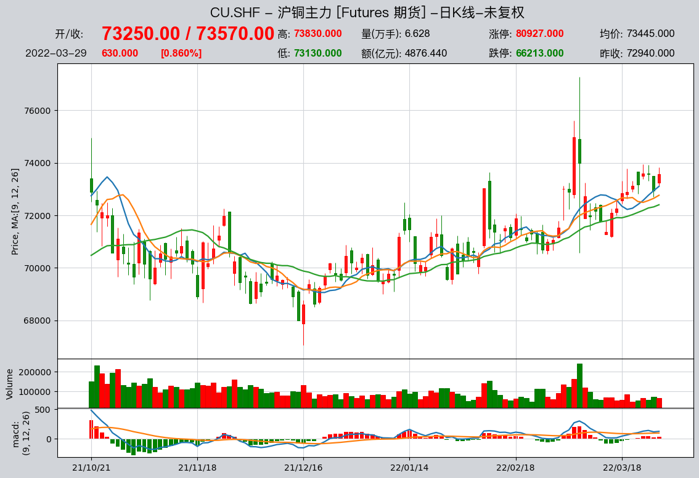

.. qteasy documentation master file, created by
   sphinx-quickstart on Sun Nov 19 21:52:20 2023.
   You can adapt this file completely to your liking, but it should at least
   contain the root `toctree` directive.

欢迎使用 ``QTEASY`` 文档!
================================

.. note::

   `qteasy`已经升级到2.0版本，使得交易策略能更加灵活有效地使用历史数据、同时简化了交易策略的定义过程、提高了效率。
   由于 ``QTEASY`` 仍处于测试中，软件中不免存在一些漏洞和bug，如果大家使用中出现问题，欢迎 `报告Issue`_ 或者提交 `新功能需求`_ 给我，也可以进入 `讨论区`_ 参与讨论。欢迎各位贡献代码！

.. _报告Issue: https://github.com/shepherdpp/qteasy/issues/new?assignees=&labels=&projects=&template=bug-report---bug报告.md&title=
.. _新功能需求: https://github.com/shepherdpp/qteasy/issues/new?assignees=&labels=&projects=&template=feature-request--功能需求.md&title=
.. _讨论区: https://github.com/shepherdpp/qteasy/discussions

- 作者: **Jackie PENG**
- email: *jackie_pengzhao@163.com*
- 创建日期: 2019, July, 16
- 最新版本: `2.2.5`
- License: BSD 3-Clause

简介
------------

``QTEASY`` 是为量化交易人员开发的一套量化交易策略开发工具包，其特点如下：

1. **全流程覆盖** 从金融数据获取、存储，到交易策略的开发、回测、优化、实盘运行，一站式完成
2. **完全本地化** 数据、回测与实盘运行均在本地完成，不依赖云端服务，配置清晰、结果可复现
3. **回测可信、实盘一致** 策略逻辑在回测与实盘中同一套运行，数据按「当时能看到的」历史严格注入，从机制上避免未来函数与数据泄露，减少「回测漂亮、实盘走样」的落差
4. **灵活易用** 多策略可像搭积木一样组合并自定义信号合并方式；内置超过70种策略开箱即用，涵盖常见技术指标、均线、突破、反转等

**高性能回测与防未来函数**：回测核心采用向量化 + Numba，时间维顺序、标的维单步向量化，多进程并行优化；每步仅向策略注入当时可见的数据窗口，从机制上防未来函数。详见《架构与设计》中的 :doc:`回测引擎与性能 <design/07-backtest-engine-and-performance>`、:doc:`设计初衷与独特优势 <design/08-design-rationale-and-advantages>`，以及《回测并评价交易策略》目录下的「回测引擎与性能」章节。

``QTEASY`` 能做什么?
------------------------------------

获取并管理金融历史数据
~~~~~~~~~~~~~~~~~~~~~~~~~~~~~~~~~~~~~~~~

- 方便地从多渠道获取大量金融历史数据，进行数据清洗后以统一格式进行本地存储
- 通过`DataType`对象结构化管理金融数据中的可用信息，即便是复权价格、指数成份等复杂信息，也只需要一行代码即可获取
- 基于`DataType`对象的金融数据可视化、统计分析以及分析结果可视化
- 数据本地存储、按需取用，为回测与实盘提供一致的数据基础，便于复现

以简单、安全的方式创建交易策略
~~~~~~~~~~~~~~~~~~~~~~~~~~~~~~~~~~~~~~~~~~~~~~~

- 通过`BaseStrategy`类，交易策略定义方法直观、逻辑清晰
- 内置超过70种策略开箱即用，独特的策略混合和组机制，复杂策略可以通过简单策略拼装而来，过程如同搭积木
- 交易策略的数据输入和使用方法完全封装且安全，完全避免无意中导致未来函数、数据泄露等问题，保证策略运行结果的真实性和可靠性
- 同一套策略逻辑既用于回测也用于实盘，减少「回测漂亮、实盘走样」的落差

.. image:: img/output_14_3.png
    :width: 900px
    :align: center

交易策略的回测评价、优化和模拟自动化交易
~~~~~~~~~~~~~~~~~~~~~~~~~~~~~~~~~~~~~~~~~~~~~~~~~~~~~~~~~

- 通过`Operator`交易员类管理策略运行，按照真实市场交易节奏回测策略，对交易结果进行多维度全方位评价，生成交易报告和结果图表
- 提供多种优化算法，包括模拟退火、遗传算法、贝叶斯优化等在大参数空间中优化策略性能
- 获取实时市场数据，运行策略模拟自动化交易，跟踪记录交易日志、股票持仓、账户资金变化等信息
- 回测、优化与实盘使用同一套运行机制，写一次策略即可全模式运行，配置清晰，便于复现与排查
- 未来将通过QMT接口接入券商提供的实盘交易接口，实现自动化交易

.. image:: examples/img/trader_app_1.png
    :width: 900px
    :align: center

.. image:: examples/img/trader_app_light_theme.png
    :width: 900px
    :align: center

.. toctree::
   :caption:  ``qteasy`` 快速入门
   :maxdepth: 1
   :glob:

   getting_started

.. toctree::
   :caption:  ``qteasy`` 使用教程
   :numbered: 2
   :maxdepth: 1
   :glob:

   tutorials/*

.. toctree::
   :caption:  ``qteasy`` 架构与设计
   :numbered: 2
   :maxdepth: 1
   :glob:

   design/*

.. toctree::
    :caption: 下载并管理金融历史数据
    :numbered: 2
    :maxdepth: 1
    :glob:

    manage_data/*

.. toctree::
    :caption: 创建并操作交易策略
    :numbered: 2
    :maxdepth: 1
    :glob:

    manage_strategies/*

.. toctree::
    :caption: 交易策略的回测并评价
    :numbered: 2
    :maxdepth: 1
    :glob:

    back_testing/*

.. toctree::
    :caption: 优化交易策略
    :numbered: 2
    :maxdepth: 1
    :glob:

    optimization/*

.. toctree::
    :caption: 模拟实盘运行交易策略
    :numbered: 2
    :maxdepth: 1
    :glob:

    references/1-simulation-overview.md
    references/5-simulate-operation-in-CLI.md
    references/6-simulate-operation-in-TUI.md

.. toctree::
    :caption: QTEASY交易策略示例
    :numbered: 2
    :maxdepth: 1
    :glob:

    examples/*

.. toctree::
   :caption: API参考
   :numbered: 1
   :maxdepth: 1
   :glob:

   api/api_reference.rst
   api/history_data.rst
   api/data_source.rst
   api/HistoryPanel.rst
   api/data_types.rst
   api/built_in_strategies.rst
   api/Operators.rst
   api/Strategies.rst
   api/Backtest.rst
   api/Optimization.rst
   api/use_qteasy.rst

.. toctree::
   :caption: LICENSE

   LICENSE

.. toctree::
   :caption: 关于 ``qteasy``
   :maxdepth: 1
   :glob:

   about
   help
   roadmap.rst
   CONTRIBUTING
   CODE_OF_CONDUCT
   RELEASE_HISTORY

.. toctree::
   :caption: 常见问题
   :maxdepth: 1
   :glob:

   faq

