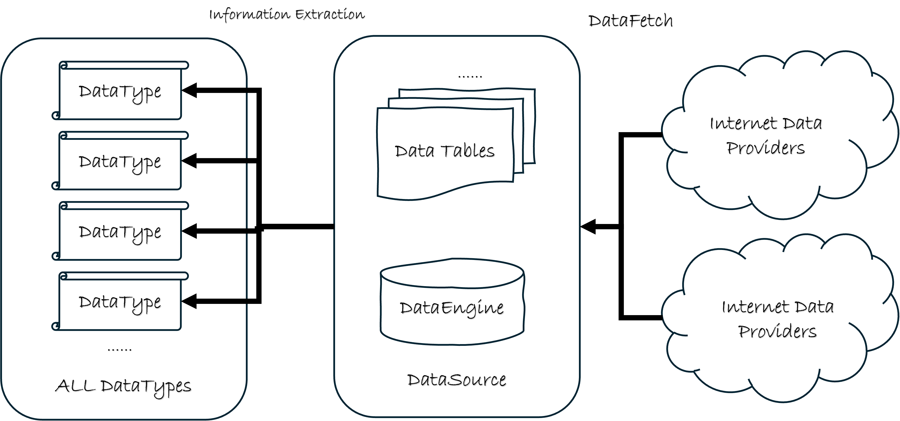

# qteasy金融历史数据管理

`qteasy` 是一套功能全面的量化交易工具包，金融数据的获取和使用是`qteasy`提供的核心功能之一。

## 总体介绍

目前，网上有很多不同的金融数据获取渠道，可供量化交易者下载金融数据，但是直接从网上下载数据，有许多缺点：

- 数据格式不统一：同样的数据，例如交易量数据，有些渠道提供的数据单位为“手”，而另一些提供的数据为“股”
- 可提取的数据量有限：尤其是通过爬虫获取的数据，高频K线数据往往只有过去几天的数据，更久以前的数据无法提供
- 数据提取不稳定：数据提取速度和成功率不能保证，受网络连接影响很大
- 下载成本较高：收费数据渠道往往能提供更全面的数据，但是一般都有流量限制，而免费渠道提供的数据不全，也提高成本
- 信息提取不易：获得原始数据以后，还需要进一步将数据转化为需要的信息，这个过程费力且不直观

`qteasy`就是为了解决上面提到的这些痛点而设计的。

`qteasy`的金融数据管理模块提供了三个主要的功能，这三个功能的设计，着眼点都是为了

- **数据拉取**：从多个不同的网络数据提供商拉取多种金融数据，满足不同用户的使用习惯：

  `qteasy`提供的数据拉取API具备强大的多线程并行下载、数据分块下载、下载流量控制和错误延时重试功能，以适应不同数据供应商各种变态的流量限制，同时数据拉取API可以方便地定期自动运行完成数据批量下载任务，不用担心错过高频数据。
  
- **数据清洗和存储**：标准化定义本地数据存储，将从网络拉取的数据清洗、整理后保存到本地数据库中：

  `qteasy`定义了一个专门用于存储金融历史数据的`DataSource`类，并以标准化的形式预定义了大量金融历史数据存储表，不管数据的来源如何，最终存储的数据始终会被清洗后以统一的格式存储在`DataSource`中，避免不同时期不同来源的数据产生偏差，确保数据高质量存储。同时提供多种存储引擎，满足不同用户的使用习惯。

  
- **信息提取和使用**：区分“数据“和”信息，“提供接口将集中在数据表中的真正有意义的信息提取出来，从而直接用于交易策略或数据分析：

  我们知道”数据“并不等于”信息“，光是将数据表保存在本地不代表立即就能使用其中的信息。而`qteasy`特意将数据表中的可用“信息”定义为稳定的 **DataType 信息 ID**（用户日常写字符串；专家层才构造对象），并按 History / Reference / Static 三种形状提供浅入口，简化策略声明与数据分析。

总体来说，`qteasy`的数据获取模块的结构可以用下面的示意图来表示：

`QTEASY`数据管理模块: 

如图所示，`qteasy`的数据功能分为三层：第一层从网络渠道拉取数据（`DataFetching`）；第二层是本地 `DataSource` 与标准化数据表；第三层是信息提取——用 DataType ID 从本地表取出可用信息。创建交易策略、做面板分析与可视化，都以这些信息 ID 与对应入口为基础。

### 建议阅读顺序（按任务）

不必按文件名硬背。更实用的顺序是：

1. **要什么信息？** — 用 `find_history_data` 或 [完整清单](../references/datatypes/index.md) 找到 ID，看 `kind` / `usable_in`
2. **用哪个入口？** — History → `get_history_data` / `get_kline`；宏观与基准 → `get_reference_data`；行业/上市日等 → `get_static_data`（详见 [DataType 概念章](02.%20datatypes.md)）
3. **本地没有？** — 看清单中的 `table_name`，用 `refill_data_source` 补表（DataSource 与数据表章节）

章节索引（与文件名编号一致，便于查阅）：

- **2. DataType（信息 ID）**——三形状、四条工作路径、双 ID、精选类型；完整清单见 [references/datatypes](../references/datatypes/index.md)
- **2.5. HistoryPanel**——多标的、多指标、时间对齐的三维容器（只吃 History）
- **2.6. HistoryPanel 可视化**——静态图与交互图
- **3. 本地数据源 DataSource**——存储与基本操作
- **4.～9. 内置数据表**——表结构与用途（存储层，≠ DataType）
- **10. 数据拉取与渠道**——从不同渠道填充数据

**实操最短路径**（偏「玩数据」而非回测）：先跟 [获取数据](../tutorials/2.0-get-data.md) 下载最小数据集，再读 [HistoryPanel 基础操作](../tutorials/2.4-historypanel-basics.md) → [玩数据与因子分析](../tutorials/2.5-historypanel-data-analysis.md) 与 `examples/data_playground_e2e.py`；本 manage_data 章节作参考查阅即可。
