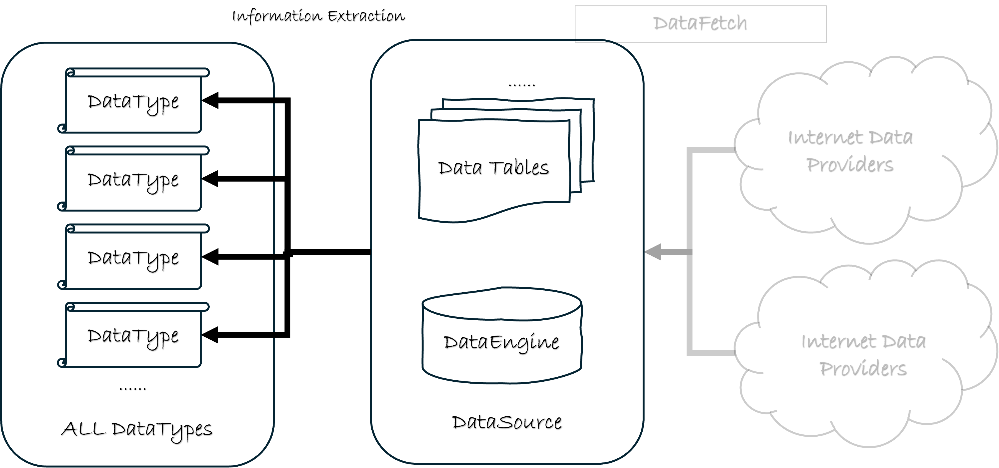

# 用稳定的信息 ID 取数（DataType）

前面的章节介绍了数据源，以及如何往数据源中填充金融数据。本章回答另一件事：您真正要用的，往往不是「表里的某一列」，而是**策略和分析可直接消费的信息**。`qteasy` 用一套稳定的 **信息 ID** 来命名这些信息；存储可以换表、换渠道，ID 尽量不变。

`QTEASY`数据管理模块: 

> **关于 DataType**：它是「可以从本地数据表提取、并直接用于策略或分析」的一类信息的稳定 ID，外加形状约定（时间 × 标的、仅时间、仅标的）。日常您写的是**字符串**（如 `close`、`close|b`、`close_E_d`），不必手写 `DataType(...)`。它不是数据表列名，也不是又一个下载器。
>
> **本篇覆盖**：
>
> - 为什么「信息 ≠ 表里的一行」；
> - 三种形状：History / Reference / Static；
> - 四条工作路径（写策略、研究、宏观与基准、证券属性）；
> - 两种字符串 ID：宽匹配名与完整 id；
> - 如何发现类型，以及按业务分类的精选表。
>
> **完整罗列**（一千余条）见 [内置 DataType 完整清单](../references/datatypes/index.md)；API 签名见 [DataType API](../api/data_types.rst)。

> **入口怎么用（请先读这一段）**：路径 2 的 `get_kline` / `get_history_data`，路径 3 的 `get_reference_data`，以及路径 4 的 `get_static_data`，是当前稳定的公开入口（需已按 [获取数据](../tutorials/2.0-get-data.md) 准备本地数据）。宏观与基准走 Reference，证券属性走 Static，**不要**用 `get_history_data`「顺便」取。

---

## 信息 ≠ 表里的一行

在量化交易中，我们需要准备大量金融数据，但数据不是最终目的——我们需要从数据中提取有用的**信息**，并据此做决策。

信息不等于数据，常见原因有：

1. 某些数据本身意义不足，需要与其他数据结合才成为可用信息；
2. 同一份数据可能包含多重信息，可以从不同角度提取；
3. 信息的定义是动态的：同样的原始列，经过不同加工可以有不同解读。

因此，把「数据表里的某一列」直接等同于「策略要用的信息」往往过于草率：数据只是信息的载体。

有些信息可以直接从表中读出，例如股票的开盘价、收盘价。有些必须通过多表组合才能得到——最典型的是**复权价格**：需要价格表与复权因子表，再经计算得到。同一张行情表里，也可以读出昨收、涨跌幅等不同信息。

例如，策略需要后复权收盘价时，原始数据分别在：

- `stock_daily`：股票日 K 线行情（开高低收等）；
- `stock_adj_factor`：复权因子。

表中已有「数据」，但还不是策略可直接消费的「信息」。若每次用到复权价都要手写多表对齐与换算，甚至还要把日线升成小时线，策略代码会迅速变复杂且易错。

为此，`qteasy` 把这类提取与换算封装为信息 ID：您只写 `close|b`，框架负责从表中取出、换算并对齐成统一形态，供策略、分析与可视化使用。存储层以后若换表、换渠道，只要映射还在，您的策略字符串不必改。

> **提示**：存储层的「数据表」与应用层的「信息 ID」不是同一概念。表结构见后续 [数据表章节](04.%20data_tables_10.md)；能提取哪些信息见本章与 [完整清单](../references/datatypes/index.md)。

---

## 三种形状：History / Reference / Static

同一套信息 ID，按**消费时长什么样**分成三种形状。选错形状，就会把宏观序列硬塞进股票面板，或把「行业」当成每天都在变的行情。

| 形状 | 长什么样 | 典型问题 | 典型 ID |
| --- | --- | --- | --- |
| **History** | 时间 × 标的 | 这几只股票这段时间的收盘价 / PE / 是否停牌？ | `close`、`pe`、`close\|b`、`is_suspended` |
| **Reference** | 仅时间（与资产池无一一对应） | 这段时间的 GDP、北向资金，或把沪深 300 当基准？ | `cn_gdp`、`north_money`、`close-000300.SH` |
| **Static** | 仅标的（无时间轴） | 这些股票属于哪个行业、何时上市？ | `industry`、`list_date`、`stock_name` |

您可以这样理解：History 是「面板」；Reference 是「一条跟池子无关的时间序列」；Static 是「股票的户口本」，用来看属性、筛股票池，而不是在 `realize()` 里按时间窗去取「行业字符串」。

### History：跟标的有关，时间对齐

研究时编成 `HistoryPanel`（或多只标的的 DataFrame）；策略里是时间 × 标的的窗口。标准 K 线用 `get_kline`，其它 History 类型用 `get_history_data`。

```python
import qteasy as qt

# as_data_frame=False → HistoryPanel；True（默认）→ dict[str, DataFrame]
hp = qt.get_history_data(
    htype_names='close, pe',
    shares='000001.SZ, 000002.SZ',
    start='20230101',
    end='20230131',
    as_data_frame=False,
)
print(hp.shape, hp.htypes)
```

### Reference：跟资产池无一一对应

宏观、利率、资金流向是原生的 Reference；另外一种官方造法是从 History **抽出单列**，例如把沪深 300 收盘价当成策略里的市场基准：`close-000300.SH`（连字符，不是冒号）。两种都走 Reference 入口，不要把它们当成 HistoryPanel 的「第三维标的」。

```python
import qteasy as qt

# 宏观序列不需要 shares；基准写在 ID 里（完整 id 或宽名+asset_type）
gdp = qt.get_reference_data('cn_gdp', start='20100101', end='20231231')
bench = qt.get_reference_data(
    'close-000300.SH_IDX_d', start='20230101', end='20230131',
)
# 等价：qt.get_reference_data('close-000300.SH', freq='d', asset_type='IDX', ...)
```

### Static：跟标的有关，但没有时间

行业、名称、上市日这类截面属性用于看标签、筛股票池。本阶段**不要**写「在 `realize()` 里 `get_data('industry')`」——字符串户口本塞不进时间窗。过滤用 pandas 即可；完整选股器不是本章的交付范围。

```python
import qteasy as qt

# 返回按证券代码索引的表；list_date 等多资产宽名需 asset_type 消歧
basics = qt.get_static_data(
    names='industry, list_date',
    shares='000001.SZ, 000002.SZ, 600000.SH',
    asset_type='E',
)
bank = basics[basics['industry'] == '银行']
```

---

## 四条工作路径（按您要做什么）

了解三种形状以后，日常不必先想「构造哪个对象」，按任务选入口即可。

### 路径 1：写策略

声明需要哪些信息 ID，框架按窗口注入；在 `realize()` 里用 `get_data` 取数组。策略里更稳妥的是写**完整 id**（如 `close_E_d`），避免同名多版本绑错表。无歧义时也可以用宽名，但一旦报错列出多个候选，就改成完整 id。

```python
# realize() 内按完整 id 取窗口（须与策略声明的信息一致）
close = self.get_data('close_E_d')
```

Reference 可以出现在策略声明里（窗口是时间序列，不是「每只股票一列」）。Static **不要**放进 `data_types` / `get_data`。声明与窗口的细节见 [教程 3](../tutorials/3-start-first-strategy.md) 与设计文档 [策略如何声明与使用数据](../design/03-data-in-strategies.md)。

### 路径 2：研究 / 因子

在 Notebook 里玩面板、算因子、画图：标准 OHLCV 用 `get_kline`；估值、财务、复权价等用 `get_history_data`。`get_kline` 只是 K 线语法糖，底层仍是 History 管线，不是第四个入口。

```python
import qteasy as qt

hp = qt.get_kline(
    shares='000300.SH, 000001.SZ',
    start='20230101',
    end='20230131',
    freq='D',
    as_panel=True,              # True：HistoryPanel；False：dict[str, DataFrame]
)
print(hp.htypes)

data = qt.get_history_data(
    htype_names='close|b, pe, pb',
    shares='000001.SZ',
    start='20230101',
    end='20230131',
    as_data_frame=True,
)
print(list(data.keys()))
```

面板怎么切片、扩列、算收益，见下一章 [HistoryPanel](02.5.%20historypanel.md) 与教程 [2.4](../tutorials/2.4-historypanel-basics.md) / [2.5](../tutorials/2.5-historypanel-data-analysis.md)。

### 路径 3：宏观与基准

GDP、北向资金、SHIBOR，以及 `close-000300.SH` 这类「把某标的行情当成参考」，走 `get_reference_data`。这里**不传股票池**（基准已经写在 ID 里）。不要用 `get_history_data` 去「顺便」取宏观。

### 路径 4：证券属性与股票池

行业、上市日、证券名称走 `get_static_data`，得到按代码索引的表，再用 pandas 筛选。这不是回测里的时间窗，也不是 `filter_universe` 一类完整选股器。

---

## 两种字符串 ID

每种内置类型在内部由「名称 + 频率 + 资产类型」唯一确定；您日常写的字符串有两种形态，**都要会用**。

| 形态 | 样子 | 典型场景 | 解析直觉 |
| --- | --- | --- | --- |
| **宽匹配名** | `close`、`pe`、`close\|b` | 研究、`htype_names`、检索 | 框架按频率与资产类型规则挑一条；对不上或有多条候选时会报错，而不是静默抓第一项 |
| **完整 id** | `close_E_d`、`close\|b_E_d`、`pe_E_d` | 策略 `get_data`、需要消歧、Operator 缓冲键 | 从**右边**拆：最后一段是频率，倒数第二段是资产类型，余下全部是宽名（宽名里可以含 `\|`） |

对照：

- `close` → 研究里说「我要收盘价」，让框架按日线股票等规则匹配；
- `close_E_d` → 明确说「股票、日频收盘价」，策略里不会绑到指数的 `close`。

**何时必须写完整 id**

- 同一宽名对应多个资产类型或频率（例如 `pe` 既有股票也有指数）；
- 策略 `get_data` 需要强约束；
- 报错已经列出候选完整 id 时——按提示改，不要再猜。

**书写符号（三套，不要混）**

- 类型参数用竖线：`close|b`（后复权）、`close|f`（前复权）；
- 把某标的抽成 Reference 用连字符：`close-000300.SH`；
- 完整 id 用下划线连接资产类型与频率：`close_E_d`。

请不要写 `wt_id:000300.SH` 这种冒号语法。

常见取值备忘：`freq` 如 `d` / `w` / `m` / `q` / `1min`，`None` 表示与频率无关（多为 Static）；`asset_type` 如 `E` 股票、`IDX` 指数、`FD` 基金、`FT` 期货、`OPT` 期权。

---

## 如何找到需要的 ID

完整表有一千余条，不必背。推荐顺序：

1. **按中文或名称检索** `find_history_data`；
2. 看描述，判断它是 History、Reference 还是 Static，再选对应入口——**不要**假定检索到的每一条都能 `get_history_data`；
3. 需要浏览时打开 [完整清单](../references/datatypes/index.md)（将按业务分册，并标注可用性；当前分册仍可能按内部获取方式排列，以清单页说明为准）。

```python
import qteasy as qt

qt.find_history_data('pe')
qt.find_history_data('每股收益')
qt.find_history_data('ep*', fuzzy=True)

df = qt.find_history_data('close', as_data_frame=True)
print(df.columns.tolist())
print(df.head())
```

交互环境中也可以拉完整映射表：

```python
from qteasy import datatypes

dtype_map = datatypes.get_dtype_map()
print(len(dtype_map))
print(dtype_map.head(20))
```

清单由 `docs/scripts/generate_datatype_catalog.py` 生成并入库；发版或变更内置映射后需重跑脚本。**请勿手改** `_generated/` 下的正文。

---

## 常用类型精选

下列为手写维护的**精选**表，便于入门。范围是常用子集，不是一千余条的全量。列含义：`name` 是您在字符串里写的宽匹配名；「典型入口」告诉您该走哪条工作路径。查表方式：先按业务找节，再拿 `name` 去 `find_history_data` 或清单核对频率与资产类型。

完整列表见 [内置 DataType 完整清单](../references/datatypes/index.md)。

### 行情与复权

典型入口：`get_kline`（OHLCV）或 `get_history_data`。

| name | 简述 |
| --- | --- |
| `open` / `high` / `low` / `close` | 开高低收 |
| `vol` | 成交量 |
| `amount` | 成交额（以清单描述为准） |
| `close\|b` / `close\|f` | 后复权 / 前复权收盘价 |
| `open\|b` / `high\|b` / `low\|b` | 后复权开高低 |

例如：研究后复权收盘价时，直接写 `close|b`，不必自己去拼价格表和复权因子。

### 估值与财务

典型入口：`get_history_data`。

| name | 简述 |
| --- | --- |
| `pe` / `pe_2` | 市盈率及相关（股票与指数可能各有一条，策略里建议完整 id） |
| `pb` | 市净率 |
| `eps` | 每股收益 |
| `total_mv` | 总市值（注意单位版本，见清单描述） |

### 宏观、利率与资金

典型入口：`get_reference_data`。不要用 `get_history_data`。

| name | 简述 |
| --- | --- |
| `cn_gdp` | GDP 累计值 |
| `north_money` | 北向资金 |
| `shibor\|%` | SHIBOR（参数为期限，以清单为准） |
| `close-000300.SH` | 把沪深 300 收盘价当成 Reference（造法，不是原生宏观表） |

### 交易行为与事件

典型入口：`get_history_data`（仍是时间 × 标的）。事件类条目多，建议用中文关键词检索。

| name | 简述 |
| --- | --- |
| `is_suspended` | 停复牌类型 |
| `up_limit` | 涨停价 |

### 指数成分与权重

典型入口：研究用 `get_history_data`；也适合用来过滤/加权股票池（不是本章的选股器 API）。

| name | 简述 |
| --- | --- |
| `wt_idx\|%` | 股票在指数中的权重（通配键以清单为准） |

### 静态证券信息

典型入口：`get_static_data`。不要放进策略 `get_data`。

| name | 简述 |
| --- | --- |
| `stock_symbol` / `stock_name` | 代码 / 名称 |
| `industry` | 行业 |
| `list_date` | 上市日期（以清单为准） |

---

## 边界：清单里有，不等于今天能这样用

- **可用性**：完整清单会保留全部内置类型，其中一部分今天没有一等用法（目录里看得到，但没有推荐入口）。例如大宗交易买方营业部 `block_trade_buyer` 虽是 History 形状，但格子是文本，无法编入只吃数值的 HistoryPanel / 策略窗口，清单会标 `usable_in=none`；研究时请直接读底层表（如 `DataSource.read_table_data('block_trade')`）。检索结果请按描述与入口提示选用，不要一律 `get_history_data`。
- **下载与表结构**：本地没有表，任何 ID 都取不出数。下载与表结构见 [DataSource](03.%20datasource.md) 与 [数据表章节](04.%20data_tables_10.md)。
- **过程数据**：`proc.*`（持仓、现金等回测/实盘过程量）不是本目录里的 DataType，见设计文档 [过程数据与动态回测](../design/09-process-data-and-dynamic-backtest.md)。
- **内部获取方式**：映射表里还有 `acquisition_type`（直读、复权、事件等），那是框架从表里怎么抽出信息的内部算法，**不是**用户分类，选类型时不必填写。排障时可以在清单靠后列对照 `table_name`。
- **自定义类型**：面向用户的稳定注册入口尚未交付。需要尚未内置的复合指标时，先取出原子字段，再在 `HistoryPanel.assign` 或策略 `realize()` 中计算（教程见 [玩数据与因子分析](../tutorials/2.5-historypanel-data-analysis.md)）。
- **专家层对象**：排查单一类型或编写更底层脚本时，仍可构造 `DataType` 并调用 `get_data_from_source`。这不是日常路径，签名见 [DataType API](../api/data_types.rst)。

---

## 小结与下一步

读到这里，您应已掌握：

- DataType 是**信息 ID**，不是表列名，也不是下载器；您日常写字符串。
- 三种形状对应三种用法：History 进面板/策略窗，Reference 是与池子无关的时间序列，Static 是截面属性。
- 按任务选入口：策略 `get_data`、研究 `get_kline` / `get_history_data`、宏观与基准 `get_reference_data`、属性与股票池 `get_static_data`。
- 研究可用宽名；策略与消歧时写完整 id（`close_E_d`）。

**下一步阅读**：

- 把多标的、多指标收拢到同一时间轴：[HistoryPanel](02.5.%20historypanel.md)，可视化见 [HistoryPanel 可视化](02.6.%20historypanel_visual.md)；
- 跟做取数与玩面板：[教程 2.0](../tutorials/2.0-get-data.md) → [2.4](../tutorials/2.4-historypanel-basics.md) → [2.5](../tutorials/2.5-historypanel-data-analysis.md)；
- 在策略里声明与取窗：[教程 3](../tutorials/3-start-first-strategy.md)、[策略如何声明与使用数据](../design/03-data-in-strategies.md)；
- 专家层对象与函数签名：[DataType API](../api/data_types.rst)。
