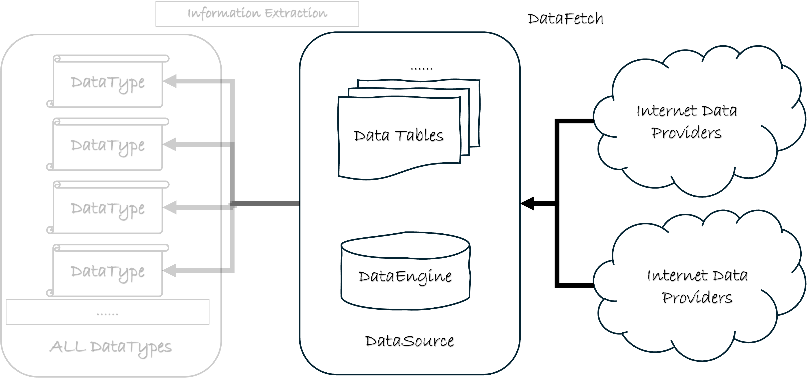

# 使用数据获取渠道自动填充数据

前面介绍过`DataSource`对象的基本操作方法，但是在实际使用中，我们需要往`DataSource`对象中填充大量数据，如果使用前面章节介绍的`DataSource.update_table_data()`方法手动填充数据，这样的工作量是非常大的。

这里我们介绍如何使用数据获取渠道自动填充数据。

## QTEASY数据拉取功能

`QTEASY`数据管理模块: 

如上图所示，`qteasy`的数据功能分为三层，第一层包括多种数据下载接口，用于从网络数据提供商获取数据，这个过程称为`DataFetching`。 

## 数据拉取接口`refill_data_source()`

`qteasy`提供了一个自动化数据下载接口`qteasy.refill_data_source()`，可以从多个不同的网络数据提供商拉取多种金融数据，满足不同用户的使用习惯。`qteasy`提供的数据拉取API具备强大的多线程并行下载、数据分块下载、下载流量控制和错误延时重试功能，以适应不同数据供应商各种变态的流量限制，同时数据拉取API可以方便地定期自动运行完成数据批量下载任务，不用担心错过高频数据。

下面先用一个例子解释如何使用`qteasy.refill_data_source()`接口自动填充数据。我们先创建一个不含数据的`DataSource`对象，并向其中填充最基本的数据。

```python
>>> import qteasy as qt
>>> ds = qt.DataSource()
# 检查数据源中是否有数据
>>> ds.overview()
Analyzing local data source tables... depending on size of tables, it may take a few minutes
[########################################]104/104-100.0%  A...zing completed!
Finished analyzing datasource: 
file://csv@qt_root/data/
3 table(s) out of 104 contain local data as summary below, to view complete list, print returned DataFrame
===============================tables with local data===============================
               Has_data Size_on_disk Record_count Record_start Record_end
table                                                                    
trade_calendar   True       1.8MB         70K          CFFEX        SZSE 
stock_basic      True       852KB          5K           None        None 
stock_daily      True      98.8MB        1.3M       20211112    20241231 
```

我们可以看到，`DataSource`对象中已经有了一些数据表，为了进行下面的测试，我们将首先删除`trade_calendar`以及`stock_daily`两张数据表中的数据，然后再使用数据拉取接口自动填充它们。

首先删除两张数据表，为了删除数据表，首先将数据源的`allow_drop_table`属性设置为`True`，然后再删除数据表。

```python
>>> ds.allow_drop_table = True
>>> ds.drop_table_data('trade_calendar')
>>> ds.drop_table_data('stock_daily')
>>> ds.allow_drop_table = False
>>> overview = ds.overview()
Analyzing local data source tables... depending on size of tables, it may take a few minutes
[########################################]104/104-100.0%  A...zing completed!
Finished analyzing datasource: 
file://csv@qt_root/data/
1 table(s) out of 104 contain local data as summary below, to view complete list, print returned DataFrame
===============================tables with local data===============================
            Has_data Size_on_disk Record_count Record_start Record_end
table                                                                 
stock_basic   True       852KB         5K          None        None   
```

可以看到，`trade_calendar`和`stock_daily`两张数据表中的数据已经被删除。

接下来，我们使用`qteasy.refill_data_source()`接口自动填充数据，代码很简单，只有一行，剩下的工作`qteasy`会自动完成。

```python
>>> qt.refill_data_source(
        tables='stock_daily',  # 指定要填充的数据表：股票日K线数据
        channel='tushare',  # 指定数据下载渠道
        data_source=ds,  # 指定需要填充的数据源对象
        start_date='20210101',  # 指定数据下载的起始日期
        end_date='20211231',  # 指定数据下载的结束日期
)

Filling data source file://csv@qt_root/data/ ...
into 2 table(s) (parallely): {'stock_daily', 'trade_calendar'}
[########################################]243/243-100.0%  <stock_daily> 2398764 wrtn in about 16 sec                 
[########################################]7/7-100.0%  <trade_calendar> 70054 wrtn in about 1 sec                     
                    
Data refill completed! 2468818 rows written into 2/2 table(s)!
```

拉取并填充数据后，可以检查数据已经下载成功了：

```python
>>> ds.read_table_data('stock_daily', shares='000001.SZ, 000002.SZ', start='20211111', end='20211131')

                       open   high    low  close  pre_close  change  pct_chg  \
ts_code   trade_date                                                           
000001.SZ 2021-11-11  17.35  18.43  17.32  18.35      17.40    0.95   5.4598   
          2021-11-12  18.31  18.63  18.11  18.27      18.35   -0.08  -0.4360   
          2021-11-15  18.35  18.63  18.20  18.43      18.27    0.16   0.8758   
          2021-11-16  18.36  18.54  18.17  18.22      18.43   -0.21  -1.1394   
          2021-11-17  18.15  18.30  17.98  18.11      18.22   -0.11  -0.6037   
          2021-11-18  18.09  18.12  17.73  17.80      18.11   -0.31  -1.7118   
          2021-11-19  17.80  18.24  17.70  18.15      17.80    0.35   1.9663   
          2021-11-22  18.03  18.25  17.90  18.12      18.15   -0.03  -0.1653   
          2021-11-23  18.11  18.35  17.68  17.88      18.12   -0.24  -1.3245   
          2021-11-24  17.77  17.95  17.66  17.87      17.88   -0.01  -0.0559   
          2021-11-25  17.74  17.79  17.63  17.68      17.87   -0.19  -1.0632   
          2021-11-26  17.62  17.67  17.52  17.58      17.68   -0.10  -0.5656   
          2021-11-29  17.41  17.57  17.36  17.51      17.58   -0.07  -0.3982   
          2021-11-30  17.54  17.68  17.35  17.44      17.51   -0.07  -0.3998   
000002.SZ 2021-11-11  18.95  20.84  18.89  20.79      18.98    1.81   9.5364   
          2021-11-12  20.50  20.50  19.41  19.76      20.79   -1.03  -4.9543   
          2021-11-15  19.56  19.59  19.12  19.40      19.76   -0.36  -1.8219   
          2021-11-16  19.29  19.57  19.21  19.24      19.40   -0.16  -0.8247   
          2021-11-17  19.23  19.53  19.09  19.46      19.24    0.22   1.1435   
          2021-11-18  19.35  19.40  18.98  19.09      19.46   -0.37  -1.9013   
          2021-11-19  19.01  20.28  18.92  19.90      19.09    0.81   4.2431   
          2021-11-22  19.90  19.95  19.19  19.22      19.90   -0.68  -3.4171   
          2021-11-23  19.19  19.44  19.10  19.24      19.22    0.02   0.1041   
          2021-11-24  19.12  19.38  19.00  19.30      19.24    0.06   0.3119   
          2021-11-25  19.22  19.35  19.07  19.22      19.30   -0.08  -0.4145   
          2021-11-26  19.15  19.15  18.95  18.99      19.22   -0.23  -1.1967   
          2021-11-29  18.75  18.87  18.35  18.46      18.99   -0.53  -2.7909   
          2021-11-30  18.44  18.66  18.16  18.26      18.46   -0.20  -1.0834   

                             vol       amount  
ts_code   trade_date                           
000001.SZ 2021-11-11  2084729.00  3752413.858  
          2021-11-12   957546.46  1753072.716  
          2021-11-15   655089.99  1203764.095  
          2021-11-16   601110.48  1099113.409  
          2021-11-17   664640.38  1203859.180  
          2021-11-18   799843.77  1430058.311  
          2021-11-19   786371.56  1414506.380  
          2021-11-22   738617.80  1337768.172  
          2021-11-23  1235977.96  2213817.590  
          2021-11-24   741310.84  1316774.397  
          2021-11-25   603532.70  1068221.304  
          2021-11-26   694499.88  1219937.312  
          2021-11-29   512594.71   895105.981  
          2021-11-30   733616.06  1280384.552  
000002.SZ 2021-11-11  3151015.76  6352746.112  
          2021-11-12  2065924.12  4100076.111  
          2021-11-15   959331.52  1852352.374  
          2021-11-16   593989.40  1149085.955  
          2021-11-17   623749.71  1205064.294  
          2021-11-18   609995.75  1168010.581  
          2021-11-19  1308293.09  2570652.947  
          2021-11-22   877584.30  1697701.639  
          2021-11-23   563435.65  1083646.252  
          2021-11-24   827366.98  1587246.249  
          2021-11-25   518123.06   995473.890  
          2021-11-26   504023.33   959331.064  
          2021-11-29   718595.81  1334479.867  
          2021-11-30   713092.22  1305310.857
```
## 数据拉取API的功能特性

分析数据拉取的过程，我们可以看到，`qteasy`自动完成了下面的工作：

- **自动查找依赖表** —— 虽然我们只指定了`stock_daily`数据表，但是`qteasy`自动检测到`trade_calendar`数据表也是空的，且`stock_daily`表依赖交易日历表，所以也自动填充了`trade_calendar`数据表。
- **下载进度可视化** —— `qteasy`提供了下载进度可视化，可以看到每个数据分块的下载进度，以及总体下载进度，过程中可以显示剩余时间，方便用户查看数据下载的情况。
- **大数据量自动分块** —— 上面的代码下载了2021年全年所有股票的日K线数据，这些数据量共有239万行，不管从任何数据渠道，这么大量的数据都不可能一次性下载下来，因此，`qteasy`自动将数据分块，每一块只有一天的数据，可以看到整年的数据被分成了243块，数据分块下载显著降低了每次网络申请的数据量，提高成功率且降低了被阻断的风险。
- **多线程并行下载** —— 实行数据分块下载后，`qteasy`自动使用多线程并行下载，加快数据下载速度，243个数据分块并行下载总共耗时仅16秒。

有了上面这些特性，`qteasy`的数据拉取功能可以满足几乎所有用户的数据获取需求，不管是下载大量数据，还是下载高频数据，`qteasy`都能提供高效的数据下载服务。

当然，除了上面提到的这些特性之外，`qteasy`还提供了更多的功能特性，以针对下载过程中出现的各种状况，这些功能特性我们在后面会逐步介绍：

- **多渠道下载** —— `qteasy`提供了多种数据下载渠道，很多数据表可以从多个不同的渠道下载，而且随着版本更新，数据拉取渠道也在不断增加。
- **流量控制** —— 有些数据渠道对数据下载有流量限制，`qteasy`提供了流量控制功能，可以限制数据下载的速度，即下载一定分块数量的数据后，可以暂停一段时间，例如每下载300个分块的数据，就暂停一分钟，避免被数据渠道封禁。
- **错误重试** —— 有些数据渠道下载数据时，可能会出现网络错误，`qteasy`提供了错误重试功能，可以在下载失败后，自动重试下载，如果重试不成功，会延长重试等待时间再试，直到下载成功或超过重试次数并报错。
- **日志记录** —— `qteasy`提供了数据下载日志记录功能，可以记录每次数据下载的详细信息，包括下载的数据量、下载的时间、下载的速度等，方便用户查看数据下载的情况。

### 多渠道拉取数据

`qteasy`提供了多种数据下载渠道，很多数据表可以从多个不同的渠道下载，而且随着版本更新，数据拉取渠道也在不断增加。

refill_data_source()接口的channel参数可以指定数据下载渠道，如果不指定，`qteasy`会自动选择一个默认的数据下载渠道`tushare`，但是用户也可以手动指定数据下载渠道，例如 ：

下面的代码尝试从`eastmoney`数据渠道下载`stock_daily`数据表从2025年最初两个月的日K线数据：

```python
>>> qt.refill_data_source(
        tables='stock_daily', 
        channel='eastmoney',   # 指定数据下载渠道为东方财经
        data_source=ds, 
        start_date='20250101', 
        end_date='20250301',
)

Filling data source file://csv@qt_root/data/ ...
into 2 table(s) (parallely): {'stock_daily', 'stock_basic'}
[########################################]11078/11078-100.0%  <stock_daily> 131264304 wrtn in about 17 min           
[----------------------------------------]0/1-0.0%  <stock_basic> can't be fetched from channel:eastmoney!
          
Data refill completed! 131264304 rows written into 1/2 table(s)!
```
验证一下数据是否下载成功：

```python
>>> ds.read_table_data('stock_daily', shares='000001.SZ, 000002.SZ', start='20250101', end='20250103')

                       open   high    low  close  pre_close  change  pct_chg  \
ts_code   trade_date                                                           
000001.SZ 2025-01-13  11.25  11.26  11.08  11.20      11.30   -0.10  -0.8850   
          2025-01-14  11.20  11.40  11.19  11.38      11.20    0.18   1.6071   
          2025-01-15  11.38  11.58  11.36  11.48      11.38    0.10   0.8787   
          2025-01-16  11.55  11.59  11.47  11.57      11.48    0.09   0.7840   
          2025-01-17  11.53  11.55  11.42  11.45      11.57   -0.12  -1.0372   
          2025-01-20  11.50  11.52  11.40  11.42      11.45   -0.03  -0.2620   
          2025-01-21  11.45  11.45  11.32  11.33      11.42   -0.09  -0.7881   
          2025-01-22  11.32  11.33  11.08  11.09      11.33   -0.24  -2.1183   
          2025-01-23  11.17  11.40  11.17  11.32      11.09    0.23   2.0739   
          2025-01-24  11.32  11.39  11.22  11.34      11.32    0.02   0.1767   
          2025-01-27  11.38  11.55  11.38  11.47      11.34    0.13   1.1464   
000002.SZ 2025-01-13   6.60   6.77   6.55   6.76       6.69    0.07   1.0463   
          2025-01-14   6.76   6.93   6.75   6.91       6.76    0.15   2.2189   
          2025-01-15   6.88   6.96   6.79   6.86       6.91   -0.05  -0.7236   
          2025-01-16   6.90   7.07   6.84   6.88       6.86    0.02   0.2915   
          2025-01-17   6.58   6.65   6.45   6.63       6.88   -0.25  -3.6337   
          2025-01-20   6.60   6.94   6.48   6.85       6.63    0.22   3.3183   
          2025-01-21   6.84   7.54   6.82   7.36       6.85    0.51   7.4453   
          2025-01-22   7.27   7.36   6.98   7.02       7.36   -0.34  -4.6196   
          2025-01-23   7.15   7.70   7.08   7.36       7.02    0.34   4.8433   
          2025-01-24   7.33   7.54   7.21   7.39       7.36    0.03   0.4076   
          2025-01-27   7.38   7.56   7.22   7.27       7.39   -0.12  -1.6238   

                            vol       amount  
ts_code   trade_date                          
000001.SZ 2025-01-13   934966.0  1044904.416  
          2025-01-14   824629.0   934467.766  
          2025-01-15  1031631.0  1185403.653  
          2025-01-16   872964.0  1007689.274  
          2025-01-17   689765.0   791230.419  
          2025-01-20   832029.0   953092.179  
          2025-01-21   902069.0  1024879.174  
          2025-01-22  1347129.0  1504818.607  
          2025-01-23  1514920.0  1715172.472  
          2025-01-24   944944.0  1069899.088  
          2025-01-27  1151935.0  1324270.607  
000002.SZ 2025-01-13   911147.0   611005.036  
          2025-01-14  1116454.0   765177.082  
          2025-01-15   887294.0   608363.557  
          2025-01-16  1110545.0   771648.218  
          2025-01-17  3620283.0  2369977.993  
          2025-01-20  2988167.0  2009728.944  
          2025-01-21  5849397.0  4290640.172  
          2025-01-22  3448728.0  2457396.391  
          2025-01-23  4416581.0  3245710.622  
          2025-01-24  2555024.0  1885566.128  
          2025-01-27  2151753.0  1580357.769  
```

数据下载显然也是成功的。分析上面的下载过程，可以发现几个特点：

- 不同渠道下载的数据格式是相同的，这是`qteasy`的设计原则，不同的数据下载渠道下载的数据会经历相同的清洗过程，这样用户可以方便地切换不同的数据下载渠道，而不用担心数据格式不同导致的数据处理问题。
- 不同的渠道下载分块方式不同，导致下载速度不同，`eastmoney`数据渠道下载速度较慢，需要约17分钟才能下载完成。这是由于不同下载渠道的特殊限制决定的。
- 不同渠道的下载可以下载的数据表也不同，有些数据表无法通过某些渠道下载，可能是因为权限限制或者其他因素导致的，如果某个数据表无法下载，`qteasy`会自动跳过这个数据表，不会影响其他数据表的下载。

因此，用户需要根据自身的情况选择不同的渠道拉取数据。

### 实现下载流量控制

`qteasy`的`refill_data_source`提供了流量控制功能，可以限制数据下载的速度，即下载一定分块数量的数据后，可以暂停一段时间，例如每下载300个分块的数据，就暂停一分钟，避免被数据渠道封禁。

这个功能通过refill_data_source()接口的`download_batch_size`和`download_batch_interval`两个参数实现：

- `download_batch_size`参数指定每次下载的数据分块数量，如果设置为300，则在下载300个数据分块后，会暂停一段时间。
- `download_batch_interval`参数指定每次下载数据分块后的暂停时间，默认为0，即不暂停。

下面的代码演示了如何使用`download_batch_size`和`download_batch_interval`参数实现下载流量控制：

```python
>>> qt.refill_data_source(
        tables='stock_daily',
        channel='tushare',
        data_source=ds, 
        start_date='20250101', 
        end_date='20250301', 
        download_batch_size=300,  # 每次下载300个数据分块
        download_batch_interval=60,  # 每次下载300个数据分块后暂停60秒
)
```

如果是用流量控制，当然下载时间会变长，但是对于某些数据渠道，这是必须的，否则可能会被封禁或报错导致下载失败。

### 实现错误重试

需要注意的是，数据下载过程中出错，`qteasy`会自动重试下载，重试机制如下：

- 第一次下载失败后重试之前会等待一段时间，默认等待时间为1.0秒
- 每次重试失败后，等待时间都会增加，默认等待时间增加为2倍，即第一次等待1.0秒，第二次等待2.0秒，第三次等待4.0秒，以此类推。
- 重试超过最大限额后停止重试并报错，默认情况下最多重复7次。

以上三个错误重试参数都是通过`qteasy`的配置文件在设定的，用户可以通过`qt.config()`接口查看或修改这些参数，也可以在`qteasy`的初始配置文件中修改这些参数。

- `hist_dnld_retry_cnt` - 最大重试次数，默认为7次
- `hist_dnld_retry_wait` - 第一次重试等待时间，默认为1.0秒
- `hist_dnld_backoff` - 重试等待时间增加倍数，默认为2.0

关于如何修改配置文件，或者使用`qteasy`的初始配置文件，请参考[`qteasy`的配置文件章节](../api/api_reference.rst)。

### 日志记录

`qteasy`提供了数据下载日志记录功能，可以记录每次数据下载的详细信息，包括下载的数据量、下载的时间、下载的速度等，方便用户查看数据下载的情况。

### 其他功能

`qteasy`的`refill_data_source()`接口还提供了其他一些功能，例如：

- 限制下载数据的范围，可以通过`start_date`和`end_date`参数限制下载数据的时间范围，通过`shares`参数限制下载数据的股票范围。
- 设置是否并行下载，可以通过`parallel`参数设置是否并行下载，如果设置为False，则会串行下载，否则会并行下载。
- 设置是否下载依赖表，可以通过`download_dependent`参数设置是否下载依赖表，如果设置为False，则不会下载依赖表，否则会下载依赖表。
- 设置是否强制更新交易日历表。

其他更多关于该接口的解释，请参见`qteasy`的[API文档](../api/history_data.rst)。

