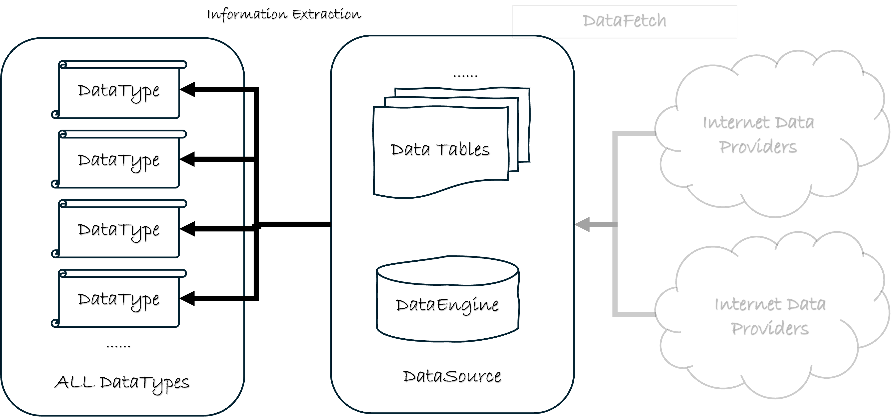

# 以标准化方式从数据表中提取信息

前面的章节中，我们介绍了数据源和数据源的概念，并且介绍了如何往数据源中填充金融数据。在这一章节中，我们将介绍如何从数据源中提取对我们有用的信息，而不仅仅是读取数据。

`QTEASY`数据管理模块: 

## 信息 != 数据

在量化交易中，我们需要准备大量的金融数据，然而，数据并不是最终的目的，我们需要从数据中提取有用的信息。在交易策略中，我们使用这些信息作出交易决策。

信息不等于数据，有些信息是可以直接从数据表中读出来的，比如股票的收盘价，开盘价等。但是，有些信息是需要通过一定的计算才能得到的，比如股票的复权价格等。

例如，我们在交易策略中需要用到股票的前复权价格，我们知道，复权价格是用股票的价格以及复权因子计算得到的，分别保存在下面两张表中：

- `stock_daily`：股票日K线行情表，包含了股票的开盘价、收盘价、最高价、最低价等信息。
- `stock_adj_factor`：股票复权因子表，包含了股票的复权因子信息。

此时，上面两张表中已经保存了我们需要的数据，但它们并不是我们需要的信息，我们需要通过计算才能得到我们需要的信息。

因此，为了获取复权价格这条信息，我们无法避免繁琐的计算过程。

而且，还必须考虑到，如果我们需要的不是复权日K线价格，而是复权后的小时K线价格，还需要把日K线数据转换为小时K线数据，这样的计算过程更加复杂。

在交易策略的实现过程中，如果每次使用复权价格时都要考虑上面的转换和计算过程，那么会使得策略的实现变得复杂，而且容易出错。也会让我们把有限的精力
分散到这些琐碎的计算过程中，而不是集中在策略的实现上。

因此，我们需要一种方法，能够把这些琐碎的计算过程封装起来，使得我们在实现策略时，只需要关注策略本身，而不需要关注这些琐碎的计算过程。

为此，`qteasy`数据管理模块提供了一种标准化的方式，用于从数据表中提取信息。这种方式就是`DataType`对象。

## DataType对象

`DataType`对象是`QTEASY`数据管理模块中的一个重要对象，它在v1.4版本中正式引入，它封装了标准化的数据处理逻辑，用于从数据表中提取信息。使得用户只要定义好一个`DataType`对象，就不需要再将精力分散在琐碎的数据信息获取计算过程中，而是可以专注于策略的实现。

`qteasy`提供了大量内置预定义的`DataType`对象，用户也可以根据自己的需求自定义`DataType`对象。

举一个简单的例子，假设我们需要获取股票的后复权价格，可以直接使用内置的`DataType`: `close|b`对象，如下所示：

```python
# 获取格力电器 2025-02-01 到 2025-02-27 的后复权收盘价
import qteasy
from qteasy.datatypes import DataType

close_b = DataType(name='close|b', asset_type='E', freq='D')
# 获取数据
close_b.get_data_from_source(
        datasource=qteasy.QT_DATA_SOURCE, 
        symbols='000651.SZ', 
        starts='2025-02-01', 
        ends='2025-02-27',
)

ts_code     000651.SZ
trade_date           
2025-02-05    9234.85
2025-02-06    9194.82
2025-02-07    9295.95
2025-02-10    9245.38
2025-02-11    9199.03
2025-02-12    9220.10
2025-02-13    9232.74
2025-02-14    9268.56
2025-02-17    9201.14
2025-02-18    9066.29
2025-02-19    8836.63
2025-02-20    8817.67
2025-02-21    8714.43
2025-02-24    8695.47
2025-02-25    8533.23
2025-02-26    8621.72
2025-02-27    8729.18
```

## 所有 DataType 清单（罗列并简短介绍）

qteasy 2.0 内置了大量 DataType，每种数据类型由 **name**（名称）、**freq**（频率）、**asset_type**（资产类型）唯一确定，并对应到具体数据表及列或计算方式。完整清单可通过 ``qteasy.datatypes.get_dtype_map()`` 获取，返回的 DataFrame 索引为 (dtype, freq, asset_type)，列包含 description（用途描述）、acquisition_type（获取方式）等。

### 获取完整清单

```python
import qteasy
from qteasy import datatypes

# 仅内置类型
dtype_map = datatypes.get_dtype_map()
print(dtype_map.head(20))

# 含用户自定义类型（若有）
dtype_map_all = datatypes.get_dtype_map(include_user_defined=True)
```

### 常见数据类型示例

| name（名称） | freq | asset_type | 用途简述 |
|-------------|------|------------|----------|
| trade_cal | d | None | 交易日历 |
| close\|b | D | E | 股票后复权收盘价 |
| close\|f | D | E | 股票前复权收盘价 |
| open, high, low, close, vol | D/1min/5min/… | E/IDX/FD 等 | K 线开高低收、成交量 |
| open\|b, high\|b 等 | D | E | 后复权开高低收 |
| stock_symbol, stock_name, industry | None | E | 股票代码、名称、行业等基本信息 |
| wt_idx\|% | d | E | 指数成分股权重 |
| … | … | … | 完整列表见 get_dtype_map() 输出 |

上表中 ``freq`` 常用取值：``D`` 日线，``1min``/``5min`` 等为分钟线，``None`` 表示与频率无关（如基本信息）。``asset_type``：``E`` 股票，``IDX`` 指数，``FD`` 基金，``None`` 表示不限定资产。每种类型的详细说明、对应数据表及列见 ``get_dtype_map()`` 返回的 ``description`` 与 ``kwargs``。
