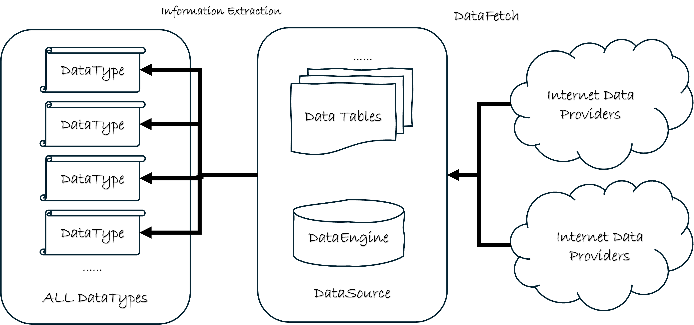

# 使用数据获取渠道自动填充数据

前面介绍过`DataSource`对象的基本操作方法，但是在实际使用中，我们需要往`DataSource`对象中填充大量数据，如果使用前面章节介绍的`DataSource.update_table_data()`方法手动填充数据，这样的工作量是非常大的。

这里我们介绍如何使用数据获取渠道自动填充数据。

## 不同的数据渠道

`QTEASY`数据管理模块: 

如上图所示，`qteasy`的数据功能分为三层，第一层包括多种数据下载接口，用于从网络数据提供商获取数据，这个过程称为`DataFetching`。 

`qteasy`提供了一个自动化数据下载接口`qteasy.refill_data_source()`，可以从多个不同的网络数据提供商拉取多种金融数据，满足不同用户的使用习惯。`qteasy`提供的数据拉取API具备强大的多线程并行下载、数据分块下载、下载流量控制和错误延时重试功能，以适应不同数据供应商各种变态的流量限制，同时数据拉取API可以方便地定期自动运行完成数据批量下载任务，不用担心错过高频数据。

## 数据拉取接口`refill_data_source()`

下面先用一个例子解释如何使用`qteasy.refill_data_source()`接口自动填充数据。

要使用这个数据接口，导入`qteasy`模块后即可使用

```python
>>> import qteasy as qt
>>> ds = qt.DataSource()
>>> qt.refill_data_source(tables='trade_calendar', data_source=ds, start_date='2019-01-01', end_date='2019-12-31')
```