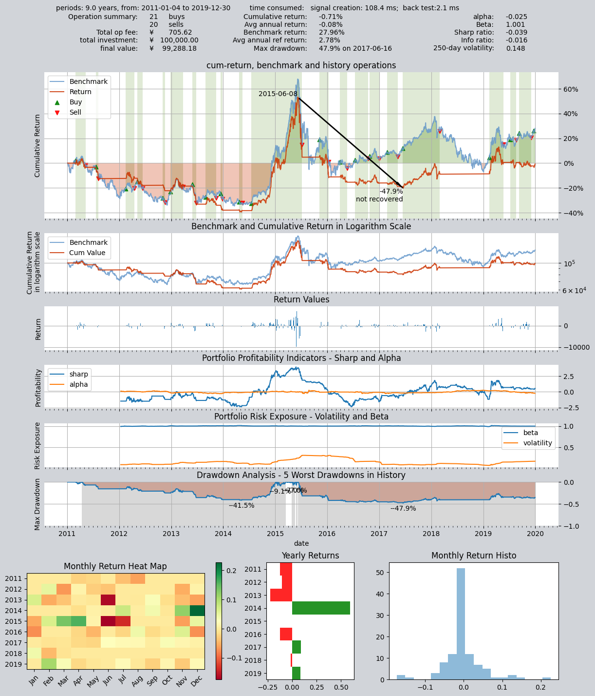

# 2—金融数据下载及管理

本示例展示了如何使用qteasy模块下载、管理及提取本地存储的金融数据
QTEASY提供了一套比较完善的金融数据下载及管理工具，可以通过tushare服务器下载相当广泛的金融数据，将数据存储在本地，并在需要的时候自动从本地提取数据用于策略的回测或策略运行。

## 本地数据源对象`DataSource`

在`qteasy`中定义了一个`DataSource`对象，这个对象定义了一个本地金融数据源，并提供了一系列内置的本地金融数据表和数据类型，用户可以直接通过各种数据类型的ID来直接读取相应的金融数据（前提是这些金融数据已经从网上下载并保存到了本地数据源中）。

大量常用的金融数据，例如'close' 'pe'都是预先定义并内置在`qteasy`中的，这些数据涵盖了相当广泛的范围，包括：

- 量价数据，如开盘价open、收盘价close、最高价high，交易量vol等等
- 财务指标数据，如市盈率pe，市净率pb
- 财务报表数据，如ebidta、ebit等等
- 公司基本信息数据，如管理层姓名、公司行业信息

上面的数据都是以“数据表”的形式内置并定义在系统中的，如果需要使用这些数据，必须首先下载数据至本地。`DataSource`对象定义了数据存储的方式和位置。`qteasy`定义了一个默认的数据源对象`QT_DATA_SOURCE`，在不特殊指明的情况下，`qteasy`所操作及使用的数据都在这个数据源中。

`DataSource`对象可以将数据保存为文件格式（csv、fth等），也可以将数据保存在mysql数据库中，鉴于金融数据的体量，建议将数据保存在数据库中。数据存储方式及存储位置可以在`qteasy`的`configuration`中设置。


### DataSource的两种数据源类型

### `qt.DataSource(source_type, file_type='fth', file_loc='qteasy/data/', host='localhost', port=3306, user=None, password=None, db='qt_db')`

对于一个`DataSource`对象，用户可以选择将数据存储为不同的形式，也叫数据源。`DataSource`目前支持两种不同的数据源：
 - db: 数据库，数据存储在mysql/Maria DB数据库中，通过建立数据库连接来访问
 - file: 文件，数据以文件的形式存储在指定的文件夹中，支持csv、hdf5以及feather三种文件格式

鉴于金融数据的数据量较大（例如，所有股票的日K线历史数据有超过一千万行数据，分钟级K线的数据量更加庞大），推荐使用`mysql`数据库来存储数据，如果使用本地文件存储数据，数据交换的效率将会很低。

使用下面的参数建立一个连接到本地数据库的DataSource对象：


```python
import qteasy as qt
ds_db = qt.DataSource(source_type='db', host='localhost', port=3306, user='user', password='password', db='qt_db')
```

可以通过connection_type属性了解DataSource对象的连接性质


```python
print(ds_db.connection_type)
ds_db
```

    db:mysql://localhost@3306/qt_db
    
    DataSource('db', 'localhost', 3306)


使用下面的参数可以建立一个使用本地文件夹的`DataSource`对象


```python
import qteasy as qt
ds_csv = qt.DataSource(source_type='file', file_loc='qteasy/data', file_type='csv')

print(ds_csv.connection_type)
ds_csv
```

    file://csv@qt_root/qteasy/data
    
    DataSource('file', 'qteasy/data', 'csv')


使用`qt.configuration`可以查看当前的配置变量，使用`qt.QT_DATA_SOURCE`可以查看当前数据源的类型和参数

```python
qt.configuration(config_key='local_data_source, local_data_file_type, local_data_file_path', default=False)
qt.QT_DATA_SOURCE
```

    No. Config-Key            Cur Val        
    -----------------------------------------
    1   local_data_source     database
    2   local_data_file_type  csv
    3   local_data_file_path  qteasy/data/

    DataSource('db', 'localhost', 3306)

## 历史数据类型

qteasy可以管理多种不同的数据类型，自动下载这些类型的数据并储存在本地，供交易策略调用。每一种数据都有一个内置的数据id（data_id），根据这个data_id，用户可以查看、读取、下载相应的数据。

### `qt.find_history_data(s, match_description=False, fuzzy=False, freq=None, asset_type=None, match_threshold=0.85,)`
`qt.find_history_data()`可以查找qteasy内置的所有数据类型，列出数据的id，资产类型和频率，以及数据的详细说明。
使用`qt.get_history_data()`并将找到的数据id作为参数传入，则可以直接查看已经下载的历史数据

```python
import qteasy as qt
qt.find_history_data('pe')
```

输出如下：
```commandline
matched following history data, 
use "qt.get_history_data()" to load these historical data by its data_id:
------------------------------------------------------------------------
           freq asset             table                            desc
data_id                                                                
initial_pe    d     E         new_share                  新股上市信息 - 发行市盈率
pe            d   IDX   index_indicator                    指数技术指标 - 市盈率
pe            d     E   stock_indicator  股票技术指标 - 市盈率（总市值/净利润， 亏损的PE为空）
pe_2          d     E  stock_indicator2                  股票技术指标 - 动态市盈率
========================================================================
```
```python
import qteasy as qt
qt.get_history_data('pe', '000001.SZ', start="20220101", end="20220201")
```
```commandline
Out[16]: 
{'000001.SZ':
                  pe
 2022-01-04  11.1761
 2022-01-05  11.5048
 2022-01-06  11.4847
 2022-01-07  11.5384
 2022-01-10  11.5317
 2022-01-11  11.6792
 2022-01-12  11.4042
 2022-01-13  11.3908
 2022-01-14  10.9547
 2022-01-17  10.8809
 2022-01-18  11.0822
 2022-01-19  11.0688
 2022-01-20  11.6256
 2022-01-21  11.6390
 2022-01-24  11.5384
 2022-01-25  11.3036
 2022-01-26  11.1694
 2022-01-27  10.9346
 2022-01-28  10.6193
 2022-01-31  10.6193
 2022-02-01  10.6193}
```
## 检查本地数据源的数据
使用`qt.get_table_overview()`可以查看当前数据源中已经下载的数据量
当数据量较大时，需要花费几分钟时间分析所有的数据，并打印本地数据源中数据表的数据量、占用磁盘空间以及数据范围

本地数据存储在若干张数据表中，也可以通过`qt.get_table_info()`来获取某一张数据表的详细信息
包括数据表的主键类型和取值范围以外，还包括各数据列的名称、含义和数据类型

### `qt.get_table_info(table_name, data_source=None, verbose=True)`

获取一张数据表的信息，包括数据量（数据行数），占用磁盘空间大小、数据主键的名称及数据范围
如果设置`verbose=True`，还可以查看数据表中的数据列完整信息，包括列名、数据类型和说明

### `qt.get_table_overview(data_source=None)`

统计数据源中所有数据表的数据量并打印总览


使用`qt.get_table_info()`可以获取一张数据表的信息：

```python
qt.get_table_info('stock_15min', verbose=True)
```

    <stock_15min>, 15.85GB/100.9M records on disc
    primary keys: 
    -----------------------------------
    1:  ts_code:       *<CRITICAL>*
        <unknown> entries
        starts: 000001.SZ, end: 689009.SH
    2:  trade_time:
        <unknown> entries
        starts: 20090105, end: 20220323
    
    columns of table:
    ------------------------------------
          columns       dtypes remarks
    0     ts_code  varchar(20)    证券代码
    1  trade_time     datetime  交易日期时间
    2        open        float     开盘价
    3        high        float     最高价
    4         low        float     最低价
    5       close        float     收盘价
    6         vol       double  成交量(股)
    7      amount       double  成交额(元)


使用`qt.get_table_overview()`可以检查并显示DataSource中保存的所有本地数据的总览

```python
qt.get_table_overview()
```

    Analyzing local data source tables... depending on size of tables, it may take a few minutes
    [########################################]62/62-100.0%  Analyzing completed!or>>>>>ht>or>>
    db:mysql://localhost@3306/ts_db
    Following tables contain local data, to view complete list, print returned DataFrame
                     Has_data Size_on_disk Record_count Record_start  Record_end
    table                                                                       
    trade_calendar     True        2.5MB         76K     1990-10-12   2022-12-31
    stock_basic        True        1.5MB          5K           None         None
    stock_names        True        2.4MB         13K     1990-12-10   2022-03-21
    index_basic        True        4.5MB         11K           None         None
    fund_basic         True        8.3MB         17K           None         None
    future_basic       True        2.5MB          7K           None         None
    opt_basic          True        4.5MB         10K           None         None
    stock_15min        True      15.85GB      100.9M       20090105     20220323
    stock_30min        True       6.66GB       38.9M       20090105     20220321
    stock_hourly       True       3.41GB       38.3M       20090105     20220318
    stock_daily        True       1.57GB       12.1M     1990-12-19   2022-03-22
    stock_weekly       True      217.9MB        2.4M     1990-12-21   2022-03-18
    stock_monthly      True       87.7MB        638K     1990-12-31   2022-02-28
    index_15min        True       2.07GB       17.6M       20090105     20220323
    index_30min        True       1.12GB        7.6M       20090105     20220318
    index_hourly       True      602.0MB        7.1M       20090105     20220113
    index_daily        True      357.0MB        2.2M     1990-12-19   2022-03-23
    index_weekly       True       56.6MB        611K     1991-07-05   2022-03-18
    index_monthly      True       22.5MB        139K     1991-07-31   2022-02-28
    fund_hourly        True         16KB           0           None         None
    fund_daily         True      165.3MB        1.6M     1998-04-07   2022-03-22
    fund_nav           True      973.0MB       15.0M     2000-01-07   2022-03-22
    fund_share         True       69.7MB        1.1M     1998-03-27   2022-03-18
    fund_manager       True       84.7MB         40K     2000-02-22   2022-03-18
    future_daily       True      384.0MB        2.0M     1995-04-17   2022-03-23
    options_daily      True      753.0MB        5.3M     2015-02-09   2022-03-23
    stock_adj_factor   True      688.0MB       11.0M     1990-12-19   2022-03-23
    fund_adj_factor    True      112.7MB        1.9M     1998-04-07   2022-03-23
    stock_indicator    True       2.31GB       11.6M     1999-01-01   2022-03-23
    stock_indicator2   True      988.0MB        4.8M     2017-06-14   2022-03-23
    index_indicator    True        5.5MB         45K     2004-01-02   2022-03-23
    index_weight       True      841.9MB       10.5M     2005-04-08   2022-03-17
    income             True       94.8MB        189K     1990-12-31   2021-12-31
    balance            True      130.0MB        172K     1989-12-31   2021-12-31
    cashflow           True      111.9MB        186K     1998-12-31   2021-12-31
    financial          True      373.0MB        152K     1989-12-31   2021-12-31
    forecast           True       50.6MB         86K     1998-12-31   2022-12-31
    express            True        4.5MB         23K     2004-12-31   2021-12-31


## 获取历史数据，并将数据保存在DataSource中
如果`DataSource`中没有数据，那么`qteasy`将很难发挥所长，因此，首先需要将数据保存到`DataSource`中
`DataSource`类提供了`fetch_history_table_data()`函数，来获取并存储历史数据到`DataSource`中，在这个函数的参数中可以直接给出一个`DataFrame`、一个csv文件名或excel文件名，同样也可以连接网络数据提供商的API获取数据。
使用`DataSource`对象获取、更新数据的方法包括：

### `DataSource.fetch_history_table_data(table, channel, df=None, f_name=None, **kwargs)`
从外部数据源获取数据，调整清洗数据以使它与数据源中的数据表匹配

数据获取渠道，指定本地文件、金融数据API，或直接给出local_df，支持以下选项：
 - 'df'      : 通过参数传递一个df，该df的columns必须与table的定义相同
 - 'csv'     : 通过本地csv文件导入数据，此时必须给出f_name参数
 - 'excel'   : 通过一个Excel文件导入数据，此时必须给出f_name参数
 - 'tushare' : 从Tushare API获取金融数据，请自行申请相应权限和积分
 - 'other'   : 其他金融数据API，尚未开发

### `DataSource.update_table_data()`
检查输入的df，去掉不符合要求的列或行后，将数据合并到table中，包括以下步骤：

 1. 检查下载后的数据表的列名是否与数据表的定义相同，删除多余的列
 2. 如果datasource type是"db"，删除下载数据中与本地数据重复的部分，仅保留新增数据
 3. 如果datasource type是"file"，将下载的数据与本地数据合并并去重


### `DataSource.read_table_data()`

### 通过本地文件获取数据，并保存到DataSource中：

下面的示例代码将存储在`DataFrame`中的数据保存在`DataSource`中

```python
# stock_data 是事先准备好的股票价格数据，格式为pd.DataFrame
df = ds_csv.fetch_history_table_data(table='stock_basic', channel='df', df=stock_data)
ds_csv.update_table_data('stock_basic', df)
ds_csv.table_data_exists('stock_basic')
```

### 通过tushare获取数据，并保存到DataSource中：
`tushare`是一个网络金融数据API，提供了大量的金融数据，不过某些数据需要积分才能获取，请自行申请`tushare`账号并获取相应积分
`tushare`的说明文档在这里：https://tushare.pro/document/2

连接到`tushare`获取数据的时候，只需要指定数据表的名称即可，`DataSource`会自行调用相应的`tushare API`下载数据：

```python
df = ds_csv.fetch_history_table_data(table='trade_calendar', channel='tushare')
ds_csv.update_table_data('trade_calendar', df)
ds_csv.table_data_exists('trade_calendar')
```

## 连接`tushare`下载数据并保存到本地数据源

`qteasy`提供了`tushare`数据接口，在获取相应`tushare`权限后，可以直接从`tushare`批量下载金融数据，并将数据更新到本地数据源中
例如，下面的命令将2022年3月起到9月之间的所有股票日K线数据下载到本地：
在下载数据前检察`stock_daily`表的信息：

### `qt.refill_data_source(data_source, *args, **kwargs)`

连接到`tushare`下载所需的数据并保存到相应的数据表，给出需要下载的数据表名称，通过`start_date`和`end_date`限定数据的范围，同时可以通过`freq`、`asset_type`等指定不同的数据类型，即可下载表格数据并保存到合适的位置。
重复的数据会被忽略或覆盖已有的数据。


> `qt.refill_data_source()`的`tables`参数指定需要补充的数据表；
> 除了直接给出表名称以外，还可以通过表类型同时下载多个数据表的数据：
> 
> - `cal`     : 交易日历表，各个交易所的交易日历
> - `basics`  : 所有的基础信息表，包括股票、基金、指数、期货、期权的基本信息表
> - `adj`     : 所有的复权因子表，包括股票、基金的复权因子，用于生成复权价格
> - `data`    : 所有的历史数据表，包括股票、基金、指数、期货、期权的日K线数据以及周、月K线数据
> - `events`  : 所有的历史事件表，包括股票更名、更换基金经理、基金份额变动等数据
> - `report`  : 财务报表，包括财务指标、三大财务报表、财务快报、月报、季报以及年报
> - `comp`    : 指数成分表，包括各个指数的成份股及其百分比
> - `all`     : 所有的数据表，以上所有数据表，由于数据量大，建议分批下载


数据下载到本地后，可以使用`qt.get_history_data()`来获取数据，如果同时获取多个股票的历史数据，每个股票的历史数据会被分别保存到一个`dict`中。


例如，通过检查发现，`stock_daily`表中的数据不够完整，最新的数据仅更新到2022年3月22日，数据共有1210万行：
```python
qt.get_table_info('stock_daily', verbose=False)
```

    <stock_daily>, 1.57GB/12.1M records on disc
    primary keys: 
    -----------------------------------
    1:  ts_code:
        <unknown> entries
        starts: 000001.SZ, end: 873527.BJ
    2:  trade_date:       *<CRITICAL>*
        <unknown> entries
        starts: 1990-12-19, end: 2022-03-22


此时使用`qt.refill_data_source()`函数，批量获取2022年3月以后一直到10月底的`stock_daily`数据

```python
qt.refill_data_source(tables='stock_daily', 
                      start_date='20220301',
                      end_date='20221031')
```

数据下载过程中会通过进度条显示下载进度，同时显示下载读取的数据量和总耗时。由于数据需要分批下载，下载大量的数据可能非常耗时。默认情况下
qteasy会通过多线程并行下载提高速度，但下载频率过快可能会导致tushare权限问题。

    [########################################]8/8-100.0%  <trade_calendar:SSE-INE>65417wrtn in 2'24"448
    [########################################]163/163-100.0%  <stock_daily:20220301-20221031>786300wrtn in 2'42"199


下载完成后重新检查`stock_daily`的数据：可以发现数据已经增加到1280万行，增加了70万行数据，数据覆盖的日期也达到了2022年10月31日。

```python
qt.get_table_info('stock_daily', verbose=False)
```

    <stock_daily>, 1.57GB/12.8M records on disc
    primary keys: 
    -----------------------------------
    1:  ts_code:
        <unknown> entries
        starts: 000001.SZ, end: 873527.BJ
    2:  trade_date:       *<CRITICAL>*
        <unknown> entries
        starts: 1990-12-19, end: 2022-10-31


## 本地数据的获取和可视化

只要本地数据源中有了数据，就可以非常容易地获取这些数据，如果是量价数据，还可以非常容易地可视化（打印为K线图或价格曲线图）

### 股票或资产的基本信息数据

### `qt.get_basic_info(code_or_name: str, asset_types=None, match_full_name=False, printout=True, verbose=False)`

获取一个股票或证券的基本信息，`code_or_name`可以是股票的代码，或者股票名称，默认情况下系统会进行全剧匹配查找匹配的证券，如`‘000001’`会匹配到多种不同的证券，所有匹配的证券都会被列出，除非在`asset_type`中指定一种或几种证券类型。
如果设置`match_full_name=True`，则会通过股票或基金的全名来模糊匹配证券


### `qt.get_stock_info(code_or_name: str, asset_types=None, match_full_name=False, printout=True, verbose=False)`

`get_basic_info()`的别称

### 筛选股票代码

### `qt.filter_stocks(date: str = 'today', **kwargs)`

根据发行日期、地区、行业、规模、指数成份等多种可用的信息筛选出一部分股票，打印出股票的信息

### `qt.filter_stock_codes(date: str = 'today', **kwargs)`

根据发行日期、地区、行业、规模、指数成份等多种可用的信息筛选出一部分股票，返回股票的完整代码

### 提取金融历史数据

### **`qt.get_history_data(htypes, shares=None, start=None, end=None, freq=None, asset_type=None, adj=None, as_data_frame=True, group_by=None, **kwargs)`**

这个函数从默认`QT_DATA_SOURCE`中提取数据，根据输入的数据类型、股票代码、日期范围以及频率等参数，输出多个`DataFrame`或`HistoryPanel`对象
这些`DataFrame`保存在一个dict中，这个dict的键为股票代码或数据类型，值为按股票代码或数据类型分组的数据框

### 量价数据的可视化

### **`qt.candle(stock=None, start=None, end=None, stock_data=None, asset_type=None, freq=None, plot_type='candle', interactive=True, data_source=None, **kwargs）`**

这个函数从本地数据源中提取股票的价格数据，并生成一张完整的动态高级K线图


示例：

## 查找证券的基本信息

使用`qt.get_basic_info()`获取证券的基本信息
在`DataSource`中准备好相关的金融数据后，还可以方便地查找证券的信息，通过证券代码（六位数字）或证券的名称搜索证券，并打印出详细信息。
使用证券名称搜索时，支持模糊查找或使用通配符：

例如，通过六位代码获取证券信息：


```python
qt.get_basic_info('601728')
```

    found 1 matches, matched codes are {'E': {'601728.SH': '中国电信'}, 'IDX': {}, 'FT': {}, 'FD': {}, 'OPT': {}, 'count': 1}
    More information for asset type E:
    ------------------------------------------
    ts_code       601728.SH
    name               中国电信
    area                 北京
    industry           电信运营
    fullname     中国电信股份有限公司
    list_status           L
    list_date    2021-08-20
    -------------------------------------------


也可以直接通过证券名称来查找证券，模糊查找匹配多个证券，例如：


```python
qt.get_basic_info('中国证券')
```

    Too many matched codes 128, best matched are
    {'E': {'000728.SZ': '国元证券'}, 'IDX': {'100630.CIC': '中金证券'}, 'FD': {'001552.OF': '天弘中证证券保险A'}}
    pass "verbose=Ture" to view all matched assets
    More information for asset type E:
    ------------------------------------------
    ts_code       000728.SZ
    name               国元证券
    area                 安徽
    industry             证券
    fullname     国元证券股份有限公司
    list_status           L
    list_date    1997-06-16
    -------------------------------------------
    More information for asset type IDX:
    ------------------------------------------
    ts_code   100630.CIC
    name            中金证券
    fullname      中金证券指数
    publisher       中金公司
    category          其他
    list_date       None
    -------------------------------------------
    More information for asset type FD:
    ------------------------------------------
    ts_code        001552.OF
    name           天弘中证证券保险A
    management          天弘基金
    custodian           国泰君安
    fund_type            股票型
    issue_date    2015-06-29
    issue_amount        0.05
    invest_type        被动指数型
    type              契约型开放式
    -------------------------------------------


通过证券名称匹配证券时，支持通过通配符查找：


```python
qt.get_basic_info('中国?通')
```

    found 2 matches, matched codes are {'E': {'600050.SH': '中国联通', '601698.SH': '中国卫通'}, 'IDX': {}, 'FD': {}, 'count': 2}
    More information for asset type E:
    ------------------------------------------
    ts_code           600050.SH     601698.SH
    name                   中国联通          中国卫通
    area                     北京            北京
    industry               电信运营          电信运营
    fullname     中国联合网络通信股份有限公司  中国卫通集团股份有限公司
    list_status               L             L
    list_date        2002-10-09    2019-06-28
    -------------------------------------------


默认情况下，并不会查找证券的全名，如果有必要，可以匹配全名，例如:


```python
# 使用‘贵州钢绳’为关键字搜索股票代码，不匹配全名时，找不到匹配的结果：
qt.get_basic_info('贵州钢绳')
```
结果如下：


    found 0 matches, matched codes are {'E': {}, 'IDX': {}, 'FD': {}, 'count': 0}


```python
# 然而如果设置了匹配全名`match_full_name=True`，则能够找到匹配的代码：
qt.get_basic_info('贵州钢绳', match_full_name=True)
```

结果如下：

    found 1 matches, matched codes are {'E': {'600992.SH': '贵绳股份'}, 'IDX': {}, 'FD': {}, 'count': 1}
    More information for asset type E:
    ------------------------------------------
    ts_code       600992.SH
    name               贵绳股份
    area                 贵州
    industry            钢加工
    fullname     贵州钢绳股份有限公司
    list_status           L
    list_date    2004-05-14
    -------------------------------------------


`qt.filter_stocks`被用来根据某些标准筛选股票，例如：

```python
# 筛选2000年以后发行的HS300指数成份股
qt.filter_stocks(date = '20000101', index='000300.SH')

```


<table border="1" class="dataframe">
  <thead>
    <tr style="text-align: right;">
      <th></th>
      <th>symbol</th>
      <th>name</th>
      <th>area</th>
      <th>industry</th>
      <th>market</th>
      <th>list_date</th>
      <th>exchange</th>
    </tr>
    <tr>
      <th>ts_code</th>
      <th></th>
      <th></th>
      <th></th>
      <th></th>
      <th></th>
      <th></th>
      <th></th>
    </tr>
  </thead>
  <tbody>
    <tr>
      <td>000001.SZ</td>
      <td>000001</td>
      <td>平安银行</td>
      <td>深圳</td>
      <td>银行</td>
      <td>主板</td>
      <td>1991-04-03</td>
      <td>SZSE</td>
    </tr>
    <tr>
      <td>000002.SZ</td>
      <td>000002</td>
      <td>万科A</td>
      <td>深圳</td>
      <td>全国地产</td>
      <td>主板</td>
      <td>1991-01-29</td>
      <td>SZSE</td>
    </tr>
    <tr>
      <td>000063.SZ</td>
      <td>000063</td>
      <td>中兴通讯</td>
      <td>深圳</td>
      <td>通信设备</td>
      <td>主板</td>
      <td>1997-11-18</td>
      <td>SZSE</td>
    </tr>
    <tr>
      <td>000069.SZ</td>
      <td>000069</td>
      <td>华侨城A</td>
      <td>深圳</td>
      <td>旅游景点</td>
      <td>主板</td>
      <td>1997-09-10</td>
      <td>SZSE</td>
    </tr>
    <tr>
      <td>000100.SZ</td>
      <td>000100</td>
      <td>TCL科技</td>
      <td>广东</td>
      <td>元器件</td>
      <td>主板</td>
      <td>2004-01-30</td>
      <td>SZSE</td>
    </tr>
    <tr>
      <td>...</td>
      <td>...</td>
      <td>...</td>
      <td>...</td>
      <td>...</td>
      <td>...</td>
      <td>...</td>
      <td>...</td>
    </tr>
    <tr>
      <td>603486.SH</td>
      <td>603486</td>
      <td>科沃斯</td>
      <td>江苏</td>
      <td>家用电器</td>
      <td>主板</td>
      <td>2018-05-28</td>
      <td>SSE</td>
    </tr>
    <tr>
      <td>605499.SH</td>
      <td>605499</td>
      <td>东鹏饮料</td>
      <td>深圳</td>
      <td>软饮料</td>
      <td>主板</td>
      <td>2021-05-27</td>
      <td>SSE</td>
    </tr>
    <tr>
      <td>688561.SH</td>
      <td>688561</td>
      <td>奇安信-U</td>
      <td>北京</td>
      <td>软件服务</td>
      <td>科创板</td>
      <td>2020-07-22</td>
      <td>SSE</td>
    </tr>
    <tr>
      <td>688599.SH</td>
      <td>688599</td>
      <td>天合光能</td>
      <td>江苏</td>
      <td>电气设备</td>
      <td>科创板</td>
      <td>2020-06-10</td>
      <td>SSE</td>
    </tr>
    <tr>
      <td>688981.SH</td>
      <td>688981</td>
      <td>中芯国际</td>
      <td>上海</td>
      <td>半导体</td>
      <td>科创板</td>
      <td>2020-07-16</td>
      <td>SSE</td>
    </tr>
  </tbody>
</table>
<p>397 rows × 7 columns</p>
</div>


```python
# 筛选行业为“航空或全国地产,且区域为‘上海、北京及山东“的股票
qt.filter_stocks(industry='航空, 全国地产', area='上海,北京,山东')
```


<table border="1" class="dataframe">
  <thead>
    <tr style="text-align: right;">
      <th></th>
      <th>name</th>
      <th>area</th>
      <th>industry</th>
      <th>market</th>
      <th>list_date</th>
      <th>exchange</th>
    </tr>
    <tr>
      <th>ts_code</th>
      <th></th>
      <th></th>
      <th></th>
      <th></th>
      <th></th>
      <th></th>
    </tr>
  </thead>
  <tbody>
    <tr>
      <td>000402.SZ</td>
      <td>金融街</td>
      <td>北京</td>
      <td>全国地产</td>
      <td>主板</td>
      <td>1996-06-26</td>
      <td>SZSE</td>
    </tr>
    <tr>
      <td>000620.SZ</td>
      <td>新华联</td>
      <td>北京</td>
      <td>全国地产</td>
      <td>主板</td>
      <td>1996-10-29</td>
      <td>SZSE</td>
    </tr>
    <tr>
      <td>002111.SZ</td>
      <td>威海广泰</td>
      <td>山东</td>
      <td>航空</td>
      <td>中小板</td>
      <td>2007-01-26</td>
      <td>SZSE</td>
    </tr>
    <tr>
      <td>002829.SZ</td>
      <td>星网宇达</td>
      <td>北京</td>
      <td>航空</td>
      <td>中小板</td>
      <td>2016-12-13</td>
      <td>SZSE</td>
    </tr>
    <tr>
      <td>002933.SZ</td>
      <td>新兴装备</td>
      <td>北京</td>
      <td>航空</td>
      <td>中小板</td>
      <td>2018-08-28</td>
      <td>SZSE</td>
    </tr>
    <tr>
      <td>002985.SZ</td>
      <td>北摩高科</td>
      <td>北京</td>
      <td>航空</td>
      <td>中小板</td>
      <td>2020-04-29</td>
      <td>SZSE</td>
    </tr>
    <tr>
      <td>300034.SZ</td>
      <td>钢研高纳</td>
      <td>北京</td>
      <td>航空</td>
      <td>创业板</td>
      <td>2009-12-25</td>
      <td>SZSE</td>
    </tr>
    <tr>
      <td>300719.SZ</td>
      <td>安达维尔</td>
      <td>北京</td>
      <td>航空</td>
      <td>创业板</td>
      <td>2017-11-09</td>
      <td>SZSE</td>
    </tr>
    <tr>
      <td>300965.SZ</td>
      <td>恒宇信通</td>
      <td>北京</td>
      <td>航空</td>
      <td>创业板</td>
      <td>2021-04-02</td>
      <td>SZSE</td>
    </tr>
    <tr>
      <td>600118.SH</td>
      <td>中国卫星</td>
      <td>北京</td>
      <td>航空</td>
      <td>主板</td>
      <td>1997-09-08</td>
      <td>SSE</td>
    </tr>
    <tr>
      <td>600372.SH</td>
      <td>中航电子</td>
      <td>北京</td>
      <td>航空</td>
      <td>主板</td>
      <td>2001-07-06</td>
      <td>SSE</td>
    </tr>
    <tr>
      <td>600657.SH</td>
      <td>信达地产</td>
      <td>北京</td>
      <td>全国地产</td>
      <td>主板</td>
      <td>1993-05-24</td>
      <td>SSE</td>
    </tr>
    <tr>
      <td>600708.SH</td>
      <td>光明地产</td>
      <td>上海</td>
      <td>全国地产</td>
      <td>主板</td>
      <td>1996-06-06</td>
      <td>SSE</td>
    </tr>
    <tr>
      <td>600748.SH</td>
      <td>上实发展</td>
      <td>上海</td>
      <td>全国地产</td>
      <td>主板</td>
      <td>1996-09-25</td>
      <td>SSE</td>
    </tr>
    <tr>
      <td>600760.SH</td>
      <td>中航沈飞</td>
      <td>山东</td>
      <td>航空</td>
      <td>主板</td>
      <td>1996-10-11</td>
      <td>SSE</td>
    </tr>
    <tr>
      <td>600791.SH</td>
      <td>京能置业</td>
      <td>北京</td>
      <td>全国地产</td>
      <td>主板</td>
      <td>1997-01-30</td>
      <td>SSE</td>
    </tr>
    <tr>
      <td>600823.SH</td>
      <td>世茂股份</td>
      <td>上海</td>
      <td>全国地产</td>
      <td>主板</td>
      <td>1994-02-04</td>
      <td>SSE</td>
    </tr>
  </tbody>
</table>
</div>


```python
# 获取历史数据：股票00001.SH的日K线数据
qt.get_history_data(shares='000001.SH', htypes='open,high,low,close,vol', freq='d', start='20200101', end='20201231')
```

生成的结果是一个`dict`，默认情况下以股票代码为`key`，`value`是一个包含所有需要类型的历史数据的`DataFrame`：


    {'000001.SH':                
                    open     high      low    close          vol
     2020-01-02  3066.34  3098.10  3066.34  3085.20  292470208.0
     2020-01-03  3089.02  3093.82  3074.52  3083.79  261496667.0
     2020-01-06  3070.91  3107.20  3065.31  3083.41  312575842.0
     2020-01-07  3085.49  3105.45  3084.33  3104.80  276583111.0
     2020-01-08  3094.24  3094.24  3059.13  3066.89  297872553.0
     ...             ...      ...      ...      ...          ...
     2020-12-25  3351.79  3397.01  3348.35  3396.56  294546895.0
     2020-12-28  3396.36  3412.52  3383.65  3397.29  316181542.0
     2020-12-29  3399.29  3407.09  3376.09  3379.04  311769185.0
     2020-12-30  3375.01  3414.45  3374.42  3414.45  291023543.0
     2020-12-31  3419.73  3474.92  3419.73  3473.07  335673926.0
     
     [261 rows x 5 columns]}


如果需要同时读取多个股票的多种数据，也可以实现。而且可以设置不同的数据频率

```python
# 获取历史数据：股票00001.SH, 000002.SH的多种价格和财务指标数据，且将数据整理为‘周'频率
qt.get_history_data(shares='000001.SH, 000002.SH, 000003.SH',
                    htypes='pe, ebitda, pb, eps, total_income',
                    freq='w',
                    start='20200101',
                    end='20200228')
```

结果如下：


    {'000001.SH':                
                    pe  ebitda    pb  eps  total_income
     2020-01-03  14.22     NaN  1.42  NaN           NaN
     2020-01-10  14.23     NaN  1.42  NaN           NaN
     2020-01-17  14.14     NaN  1.41  NaN           NaN
     2020-01-24  13.70     NaN  1.36  NaN           NaN
     2020-01-31  13.70     NaN  1.36  NaN           NaN
     2020-02-07  13.29     NaN  1.32  NaN           NaN
     2020-02-14  13.48     NaN  1.34  NaN           NaN
     2020-02-21  13.85     NaN  1.39  NaN           NaN
     2020-02-28  13.14     NaN  1.32  NaN           NaN,
     '000002.SH':             
                 pe  ebitda  pb  eps  total_income
     2020-01-03 NaN     NaN NaN  NaN           NaN
     2020-01-10 NaN     NaN NaN  NaN           NaN
     2020-01-17 NaN     NaN NaN  NaN           NaN
     2020-01-24 NaN     NaN NaN  NaN           NaN
     2020-01-31 NaN     NaN NaN  NaN           NaN
     2020-02-07 NaN     NaN NaN  NaN           NaN
     2020-02-14 NaN     NaN NaN  NaN           NaN
     2020-02-21 NaN     NaN NaN  NaN           NaN
     2020-02-28 NaN     NaN NaN  NaN           NaN,
     '000003.SH':            
                 pe  ebitda  pb  eps  total_income
     2020-01-03 NaN     NaN NaN  NaN           NaN
     2020-01-10 NaN     NaN NaN  NaN           NaN
     2020-01-17 NaN     NaN NaN  NaN           NaN
     2020-01-24 NaN     NaN NaN  NaN           NaN
     2020-01-31 NaN     NaN NaN  NaN           NaN
     2020-02-07 NaN     NaN NaN  NaN           NaN
     2020-02-14 NaN     NaN NaN  NaN           NaN
     2020-02-21 NaN     NaN NaN  NaN           NaN
     2020-02-28 NaN     NaN NaN  NaN           NaN}


保存到本地的股票量价数据可以直接以K线图的形式显示出来，下面是一些示例：

## 历史价格数据的可视化
`qteasy`支持使用动态K线图展示数据，此时不需要从`DataSource`中读取数据，直接使用`qt.candle()`函数即可实现：


```python
data = qt.candle('000004.SZ')
```


    


`qt.candle()`函数支持传入K线图的开始日期、结束日期、K线频率、复权方式以显示不同区间和频率的K线图，也支持传入移动均线的时长和macd的不同参数显示不同的均线，例如，传入下面的参数显示一段时间内的60分钟K线图，且使用后复权价格:


```python
data = qt.candle('000004.SZ', start='20220110', end='20220318', adj='b', freq='H')
```


    


`qt.candle()`函数还支持通过股票名称显示K线图，如果输入是股票名称，会自动模糊查找，并且支持通配符。例如：


```python
data = qt.candle('国华网安', start='20220110', end='20220318', adj='b', freq='H')
```


下面是更多的K线图例子，展示了股票、基金、指数等不同的资产类别，不同的数据频率，不同的均线设定、不同的图表类型等
```python
import qteasy as qt
df = qt.candle('159601', start='20210420', freq='d')
df = qt.candle('000001.SH', start = '20211221', asset_type='IDX', plot_type='c')
df = qt.candle('000300.SH', start = '20220331', asset_type='IDX', mav=[], plot_type='c')
df = qt.candle('000300.SH', start = '20221021', asset_type='IDX', mav=[], plot_type='c', 
               freq='30min')
df = qt.candle('601728', freq='30min', adj='b', plot_type='c')
df = qt.candle('沪镍主力', start = '20211130', mav=[5, 12, 36])
df = qt.candle('510300', start='20200101', asset_type='FD', adj='b', mav=[])
df = qt.candle('格力电器', start='20220101', asset_type='E', adj='f', mav=[5, 10, 20, 30])
df = qt.candle('513100', asset_type='FD', adj='f', mav=[])
df = qt.candle('110025', asset_type='FD', adj='f', mav=[9, 28])
df = qt.candle('001104', asset_type='FD', adj='f', mav=[12, 26])
```


    


    


    


    


    


    


    


    


    


    
