# 获取并管理金融数据

`qteasy`是一个完全本地化部署和运行的量化交易分析工具包，具备以下功能：

- 金融数据的获取、清洗、存储以及处理、可视化、使用
- 量化交易策略的创建，并提供大量内置基本交易策略
- 向量化的高速交易策略回测及交易结果评价
- 交易策略参数的优化以及评价
- 交易策略的部署、实盘运行

通过本系列教程，您将会通过一系列的实际示例，充分了解`qteasy`的主要功能以及使用方法。

## 开始前的准备工作

在开始本教程前，请完成以下工作：

- 完成`qteasy`的安装并升级到最新版本
- 注册`tushare pro`账户并确保有一定的积分（大多数高级数据需要较多积分才能下载）
- 完成`qteasy.cfg`文件的配置，将`tushare_token`写入配置文件
- 完成`mysql`数据库的配置，并将数据库配置写入`qteasy.cfg·`(***可选项***)
- 完成`ta-lib`的安装 (***可选项***)

在[上一篇教程](1-get-started.md)中，我介绍了如何新建一个虚拟环境，并在新的虚拟环境中安装并初始化`qteasy`，如果还没有完成这一步的朋友，请移步前一篇教程完成`qteasy`的安装和基础配置。

另外，为了方便后续图表等功能的使用，建议使用`jupyter notebook`来进行开发，您可以在新建的虚拟环境中运行以下命令安装`jupyter notebook`：

```bash
(bash): pip install notebook
```
安装完成后，可以使用下面命令启动`jupyter notebook`：

```bash
(bash): jupyter notebook
```

启动后，就可以在浏览器中的一个交互式开发环境中运行代码了，如下图所示：

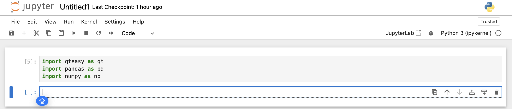

如果不使用`jupyter notebook`，也可以使用`ipython`：
```bash
(bash): pip install ipython
```
`ipython` 运行在terminal中，但是对图表的支持没有那么好


## 获取基础数据以及价格数据

如上一篇教程介绍，刚刚初始化的`qteasy`是无法调用任何历史数据的，所有历史数据都必须首先下载到本地，保存到一个称为`Datasource`的数据仓库之后，才能完成后续所有需要数据的工作，例如调用历史数据，进行策略的回测和优化等等。

`qteasy`需要使用的数据种类很多，所有的数据都是保存在一些预定义的数据表中，`Datasource`就是一系列数据表的集合。其中最基础的数据表包括：

- `trade_calendar` - 交易日历数据，包括不同交易所的开市、闭市日期计划，每年底更新下一年的交易日历
- `stock_basics` - 股票基础信息，包括沪深股市所有股票的基本信息，包括代码、名称、全称、上市日期、分类等等基础信息
- `index_basics` - 指数基础信息，包括沪深股市所有指数的基本信息，包括代码、名称、全称等等信息

在配置好`tushare_token`以后，第一次导入`qteasy`时，如果系统未找到交易日历数据，会显示信息提示交易日历无法读取。

关于`DataSource`数据源对象的更多信息，请参见[DataSource Reference](../references/2-get-history-data.md)

```python
>>> import qteasy as qt
```
提示信息：
```text
UserWarning: trade calendar is not loaded, some utility functions may not work properly, to download trade calendar, run 
"qt.refill_data_source(tables='trade_calendar')"
```
`qteasy`提供了一个函数`get_table_overview()`来显示本地存储的数据信息，运行这个函数，可以打印出本地保存的数据表的清单，存储的数据量、占用的磁盘空间大小、以及数据范围等等。

```python
>>> qt.get_table_overview()
```
数据表分析过程可能会花费几分钟时间，其间会显示进度条显示分析进度。分析完成以后，会显示本地数据源的数据表清单，以及数据表的数据范围等信息。

如果当前数据源中没有任何数据，会输出如下：

```text
Analyzing local data source tables... depending on size of tables, it may take a few minutes
Analyzing completed!
Analyzing tables: 100%|█████████████████████████| 104/104 [00:00<00:00, 9107.58it/s]

Finished analyzing datasource: 
file://csv@qt_root/data/
0 table(s) out of 104 contain local data as summary below, to view complete list, print returned DataFrame
===============================tables with local data===============================
Empty DataFrame
Columns: [has_data, size, records, min2, max2]
Index: []
```

如果本地数据源中没有数据，将会显示上面的内容。此时需要下载数据到本地数据源。

### 下载交易日历和基础数据

我们可以调用`refill_data_source`函数下载交易日历和基础数据。这个函数是`qteasy`的标准数据下载接口函数，所有的历史数据类型均可以通过此接口下载。这个函数的基本参数是`tables`，传入数据表的名称即可下载相应的数据到本地存储了。使用`refill_data_source`下载交易数据时，`qteasy`会自动进行数据清洗，排除重复数据，去除错误数据，发生错误自动重试，并将下载的数据合并到本地数据表中。目前`qteasy`仅支持通过`tushare`下载金融数据，未来还会增加其他的金融数据接口，丰富用户选择。

要下载前面提到的交易日历、股票和指数的基本信息，只需要运行下面的代码：

```python
>>> qt.refill_data_source(tables='trade_calendar, stock_basic, index_basic')
```
数据下载过程中会显示进度条显示下载进度。

输出如下：

```text
Filling data source file://csv@qt_root/data/ ...
into 3 table(s) (parallely): {'trade_calendar', 'index_basic', 'stock_basic'}
<trade_calendar> 72609 wrn: 100%|███████████████| 8/8 [00:03<00:00,  2.39task/s]
<index_basic> 12456 wrn: 100%|██████████████████| 8/8 [00:00<00:00,  9.68task/s]
<stock_basic> 5484 wrn: 100%|███████████████████| 4/4 [00:00<00:00,  5.45task/s]

Data refill completed! 90549 rows written into 3/3 table(s)!
```
下载完成后，再次运行`qt.get_table_overview()`函数

```python
>>> qt.get_table_overview()
```
可以看到数据已经成功下载到本地：
```text
Analyzing local data source tables... depending on size of tables, it may take a few minutes
Analyzing tables: 100%|████████████████████████| 104/104 [00:00<00:00, 967.60it/s]
Analyzing completed!

Finished analyzing datasource: 
file://fth@qt_root/data/
3 table(s) out of 104 contain local data as summary below, to view complete list, print returned DataFrame
===============================tables with local data===============================
               Has_data Size_on_disk Record_count Record_start Record_end
table                                                                    
trade_calendar   True       1.3MB         73K         CFFEX       SZSE   
stock_basic      True       651KB          5K          None       None   
index_basic      True       1.1MB         12K          None       None   
```

可以看到，三张数据表已经被下载到本地数据源，数据源的类型为`"file://csv@qt_root/data/"`类型（即数据以`csv`文件形式存储在qt根路径的`/data/`路径下），包含三张数据表，其中交易日历的范围涵盖到2024年年底。

### 查看股票和指数的基础数据

上面的基础数据下载好之后，建议重新启动IDE，重新导入`qteasy`。这时，我们就可以使用`qteasy`筛选和查找股票/指数了。

查找股票/指数详细信息可以使用`get_stock_info()`或者`get_basic_info()`函数，两个函数功能相同，都可以根据输入的证券代码、名称或者关键字查找证券的信息，支持通配符或者模糊查找；如果同一个代码对应不同的`qt_code`，例如股票`000001`代表平安银行，对应`qt_code: 000001.SZ`，而指数`000001`代表上证指数，`qt_code: 000001.SZ`，`qteasy`会罗列出所有的证券信息：

```python
# 通过完整的qt_code获取信息
>>> qt.get_basic_info('000001.SZ')
```
输出如下:
```text
found 1 matches, matched codes are {'E': {'000001.SZ': '平安银行'}, 'count': 1}
More information for asset type E:
------------------------------------------
ts_code       000001.SZ
name               平安银行
area                 深圳
industry             银行
fullname     平安银行股份有限公司
list_status           L
list_date    1991-04-03
-------------------------------------------
```
更多的输出可以查看下图：

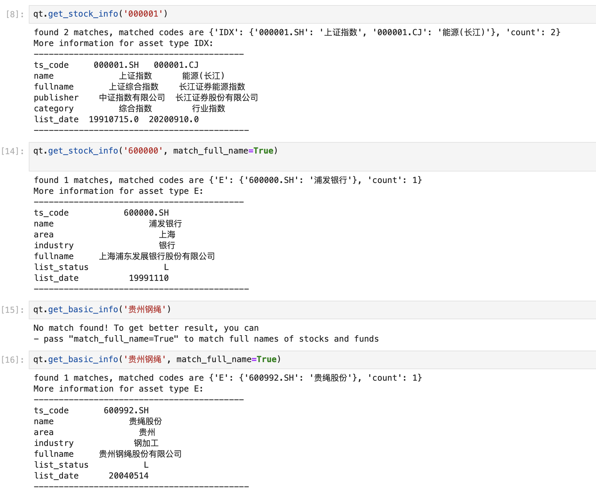

在上面的例子中，系统只找到了类型为股票和指数的证券，如果还需要查找基金、期货等更多的证券信息，用同样的方法下载更多的基础数据表即可：

- **fund_basic**: 基金基础数据
- **future_basic**: 期货基础数据

除了查找股票或证券的基本信息以外，我们还能用`qt.filter_stock()`函数来筛选股票：
```python
>>> qt.filter_stocks(date='20240212', industry='银行', area='上海')
```
输出如下：
```text
           name area industry market  list_date exchange
qt_code                                                 
600000.SH  浦发银行   上海       银行     主板 1999-11-10      SSE
601229.SH  上海银行   上海       银行     主板 2016-11-16      SSE
601328.SH  交通银行   上海       银行     主板 2007-05-15      SSE
601825.SH  沪农商行   上海       银行     主板 2021-08-19      SSE
```
### 下载沪市股票数据

金融数据中最重要的数据类型非量价数据莫属。接下来，我们就来下载历史价格数据。

`qteasy`的历史数据全都是以K线数据的形式存储在数据表中的，目前支持的K线数据包括：

- 分钟K线 - 1分钟/5分钟/15分钟/30分钟/60分钟K线
- 日K线
- 周K线
- 月K线

我们同样使用`qt.refill_data_source()`函数下载股票数据。最常用的股票日K线数据保存在`stock_daily`表中。不过由于数据量较大，我们最好在下载数据时限定数据的范围，通过`start_date`/`end_date`参数，指定下载数据的起始日期，分批下载历史数据，否则，下载的过程将会非常漫长：

```python
>>> qt.refill_data_source(tables='stock_daily', start_date='20230101', end_date='20231231')
```
上面的代码下载了2023年全年所有已上市股票的日K线数据，同样，下面的代码可以用来下载常用指数（上证指数和沪深300指数）的日K线数据：

```python
>>> qt.refill_data_source(tables='index_daily', symbols='000001, 000300', start_date='20231231', end_date='20240208')
```
### 从本地获取股价数据
当股价数据保存在本地之后，就可以随时提取出来使用了。

我们可以使用`qt.get_history_data()`函数来获取股票的量价数据。这个函数是`qteasy`的一个通用接口，可以用来获取各种类型的数据。在函数的参数中指定数据的类型（通过数据类型ID）、股票的代码以及其他参数，就可以获取相应的数据了。如果要获取刚刚下载的K线价格，需要设置数据类型为`"open, high, low, close, vol"`以获取开盘价、最高价、最低价、收盘价和交易量：

```python
>>> qt.get_history_data(
...         'open, high, low, close, vol',  # 数据类型，分别为开盘价、最高价、最低价、收盘价、成交量
...         shares='000001.SZ',   # 股票代码：平安银行
...         start='20230101',   # 数据开始日期
...         end='20230301',  # 数据结束日期
... )
```

得到结果如下：

```text
{'000001.SZ':
              open   high    low  close         vol
 2023-01-04  13.71  14.42  13.63  14.32  2189682.53
 2023-01-05  14.40  14.74  14.37  14.48  1665425.18
 2023-01-06  14.50  14.72  14.48  14.62  1195744.71
 2023-01-09  14.75  14.88  14.52  14.80  1057659.11
 2023-01-10  14.76  14.89  14.39  14.44  1269423.39
 2023-01-11  14.45  14.78  14.39  14.67   830566.12
 2023-01-12  14.77  14.77  14.53  14.67   625694.84
 2023-01-13  14.67  14.95  14.55  14.95   949085.83
 2023-01-16  14.95  15.28  14.85  15.08  1560039.89
 2023-01-17  15.13  15.18  14.77  14.97   935834.54
 2023-01-18  14.95  15.18  14.91  15.11   718434.03
 2023-01-19  15.13  15.25  14.87  15.09   641875.20
 2023-01-20  15.16  15.24  15.00  15.13   608590.08
 2023-01-30  15.60  15.74  14.89  15.15  1374317.50
 2023-01-31  15.24  15.51  14.96  14.99  1030497.84
 2023-02-01  15.03  15.08  14.51  14.70  1653421.48}
```

上面函数的输出是一个字典，字典的键为`shares`参数指定的所有股票的代码，而值为一个`DataFrame`，包含该股票在指定期间的历史数据，这里我们指定了数据类型为K线量价数据。当然，我们也可以指定其他的数据类型，只要这些数据已经下载到了本地，就可以直接读取。

例如，指定数据类型`htypes='pe, pb, total_mv'`可以获取股票的市盈率、市净率和总市值等三项财务指标。如果某些指标存在缺失值的时候，可以定义填充方式填充缺失值，还可以对数据进行重新采样，将每日的数据变为每周或每小时数据。

关于`get_history_data`函数参数的详细解释，请参见[qteasy文档](https://qteasy.readthedocs.io)

### 生成K线图
使用量价数据，更加方便易读的方法是将数据显示为K线图。

`qteasy`提供了`qt.candle()`函数，用于显示专业K线图，只要数据下载到本地后，就可以立即显示K线图：

```python
>>> qt.candle('600004.SH', start='20230101', end='20230301')
```
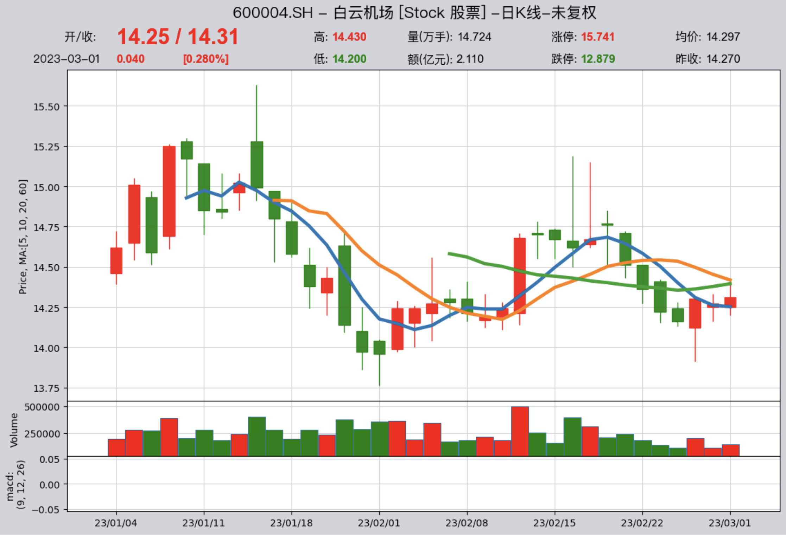

下载复权因子数据到本地后，就可以显示复权价格了：

```python
>>> qt.refill_data_source(tables='adj', start_date='20230101', end_date='20230601')
>>> qt.candle('600004.SH', start='20230101', end='20230301', adj='b')
```


`qt.candle()`函数支持传入K线图的开始日期、结束日期、K线频率、复权方式以显示不同区间和频率的K线图，也支持传入移动均线的时长和macd的不同参数显示不同的均线，`qt.candle()`函数还支持通过股票名称显示K线图，如果输入是股票名称，会自动模糊查找，并且支持通配符。

下面是更多的K线图例子，展示了股票、基金、指数等不同的资产类别，不同的数据频率，不同的均线设定、不同的图表类型等，为了显示下面示例中的K线图，您需要下载相应的数据。
```python
>>> import qteasy as qt
>>> df = qt.candle('159601', start='20210420', freq='d')
>>> df = qt.candle('000001.SH', start = '20211221', asset_type='IDX', plot_type='c')
>>> df = qt.candle('000300.SH', start = '20220331', asset_type='IDX', mav=[], plot_type='c')
>>> df = qt.candle('000300.SH', start = '20221021', asset_type='IDX', mav=[], plot_type='c', 
>>>                freq='30min')
>>> df = qt.candle('601728', freq='30min', adj='b', plot_type='c')
>>> df = qt.candle('沪镍主力', start = '20211130', mav=[5, 12, 36])
>>> df = qt.candle('510300', start='20200101', asset_type='FD', adj='b', mav=[])
>>> df = qt.candle('格力电器', start='20220101', asset_type='E', adj='f', mav=[5, 10, 20, 30])
>>> df = qt.candle('513100', asset_type='FD', adj='f', mav=[])
>>> df = qt.candle('110025', asset_type='FD', adj='f', mav=[9, 28])
>>> df = qt.candle('001104', asset_type='FD', adj='f', mav=[12, 26])
```

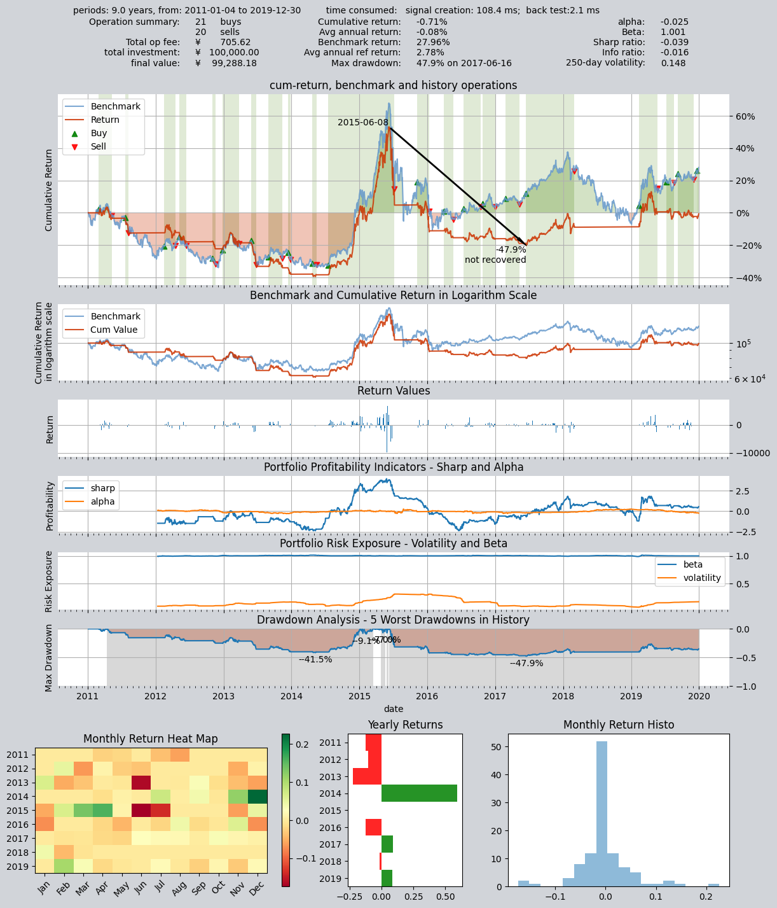
    

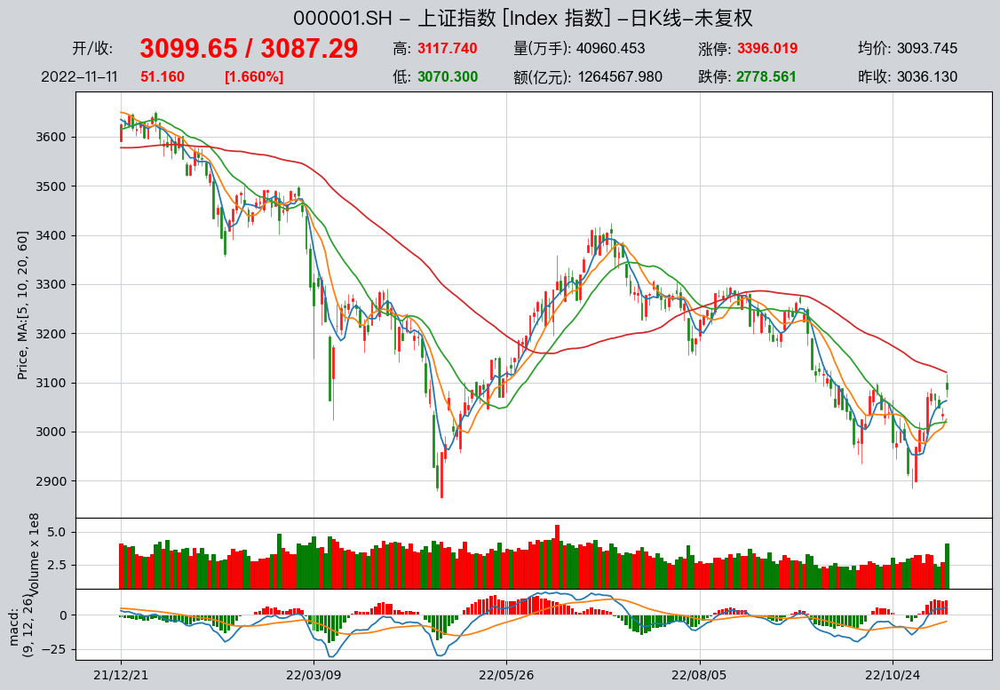
    

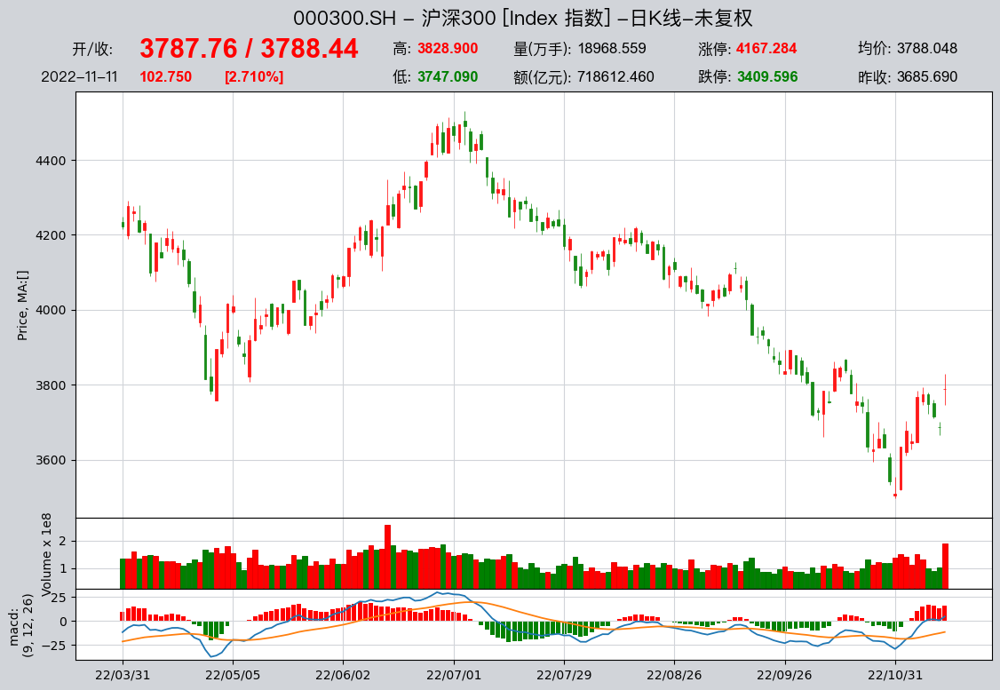
    

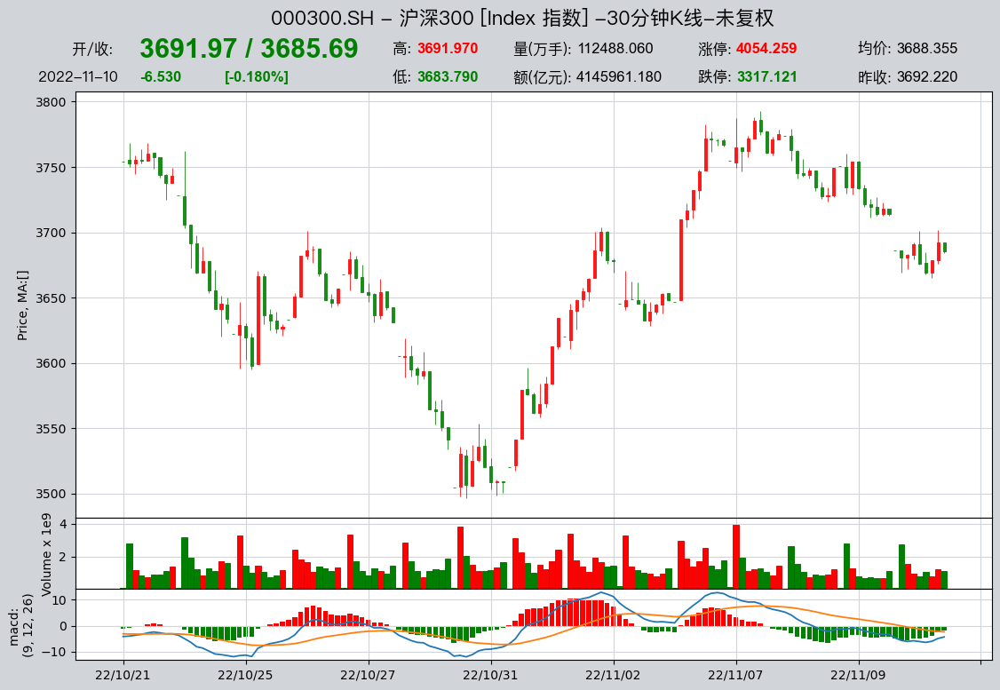
    

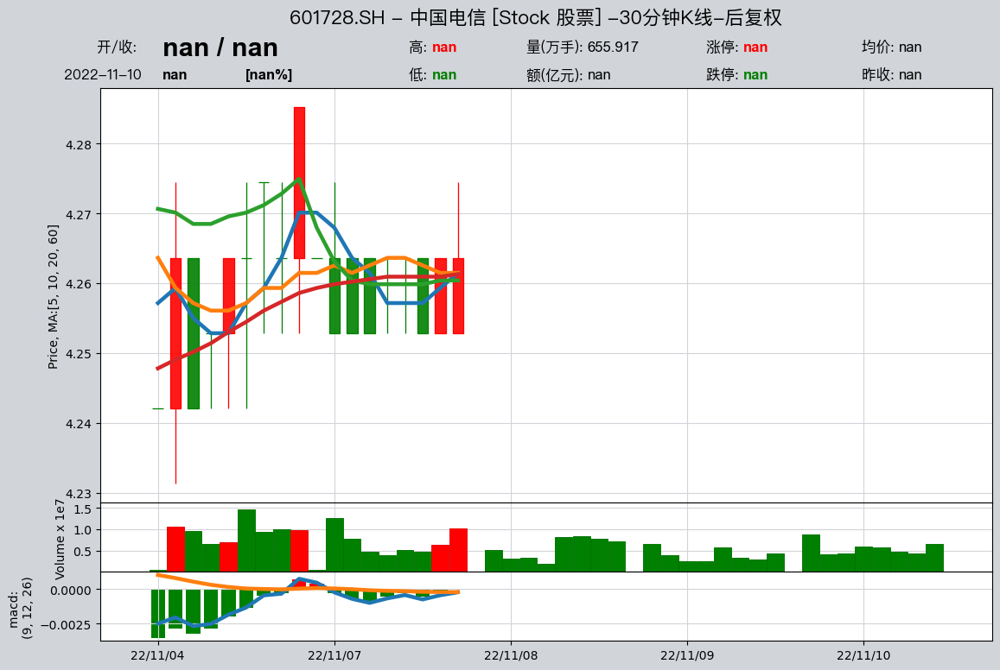


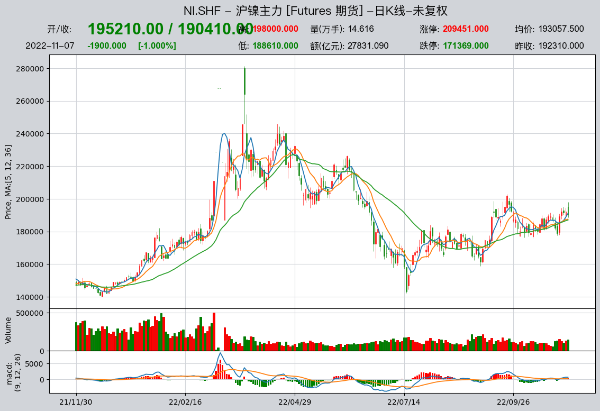
    

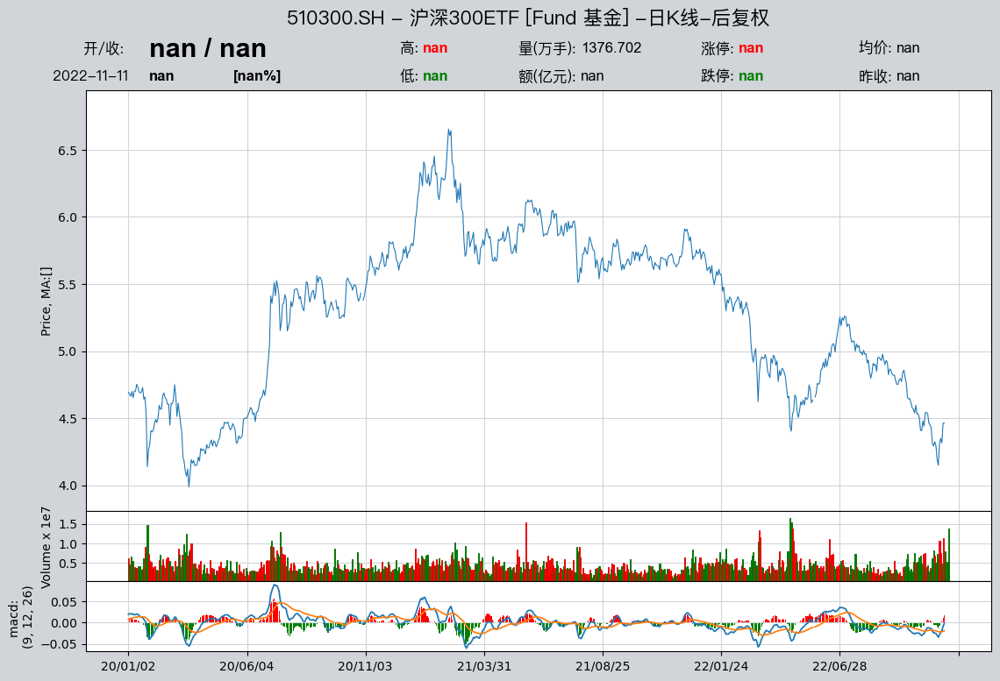
    

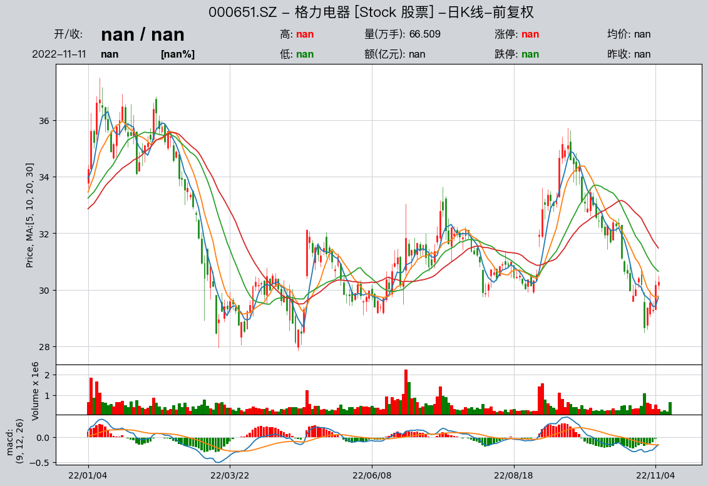
    

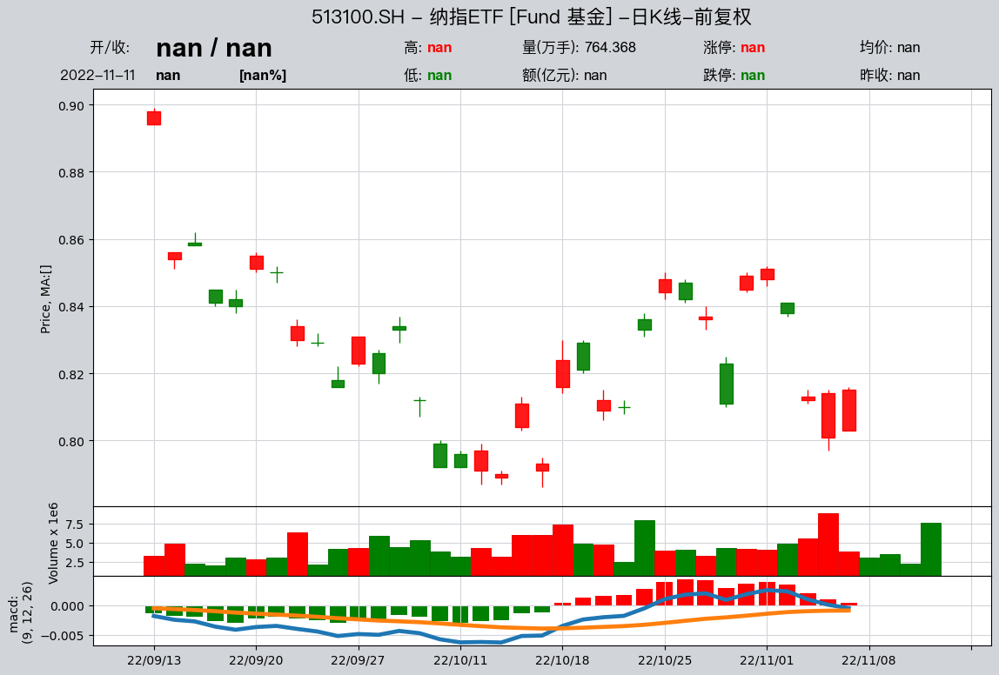
    

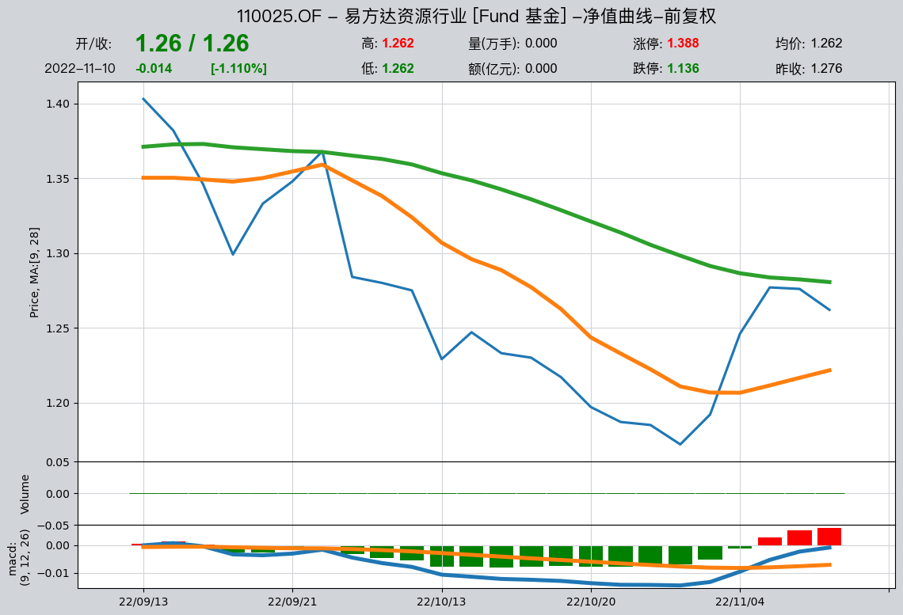
    

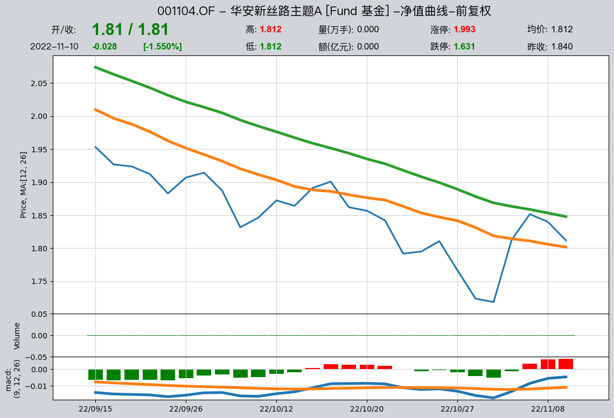
    
## 数据类型`DataType`的查找

前面提到过，`qteasy`中的所有数据类型均被封装为`DataType`对象，代表一种可以被直接使用的历史数据，每个`DataType`均有一个唯一的ID，通过这个ID，可以提取数据，在交易策略中引用该数据类型，完成`qteasy`中所需的工作。

为了更加了解`qteasy`中的数据类型，我们可以用`qt.find_history_data()`函数来查询所需的数据类型。`qteasy`中定义的数据类型是与数据频率、资产类型挂钩的，也就是说，不同资产的收盘价是不同的数据类型，不同频率的收盘价也是不同的。

`qt.find_history_data()`函数可以根据输入查找相关的数据类型，并且显示它们的ID，数据表、说明等相关信息，例如，搜索`‘close’`（收盘价）可以找到所有相关的数据类型：

```python
>>> qt.find_history_data('close')
```
得到下面输出：
```text
matched following history data, 
use "qt.get_history_data()" to load these historical data by its data_id:
------------------------------------------------------------------------
          freq asset           table            desc
data_id                                             
close        d     E     stock_daily     股票日K线 - 收盘价
close        w     E    stock_weekly     股票周K线 - 收盘价
close        m     E   stock_monthly     股票月K线 - 收盘价
close     1min     E      stock_1min   股票60秒K线 - 收盘价
  ...      ...   ...           ...             ...
close        h    FD     fund_hourly    基金小时K线 - 收盘价
close        d   Any        top_list  融资融券交易明细 - 收盘价
========================================================================
```
再例如，搜索市盈率pe，可以得到：

```python
>>> qt.find_history_data('pe')
```
得到下面输出：
```text
matched following history data, 
use "qt.get_history_data()" to load these historical data by its data_id:
------------------------------------------------------------------------
           freq asset             table                            desc
data_id                                                                
initial_pe    d     E         new_share                  新股上市信息 - 发行市盈率
pe            d   IDX   index_indicator                    指数技术指标 - 市盈率
pe            d     E   stock_indicator  股票技术指标 - 市盈率（总市值/净利润， 亏损的PE为空）
pe_2          d     E  stock_indicator2                  股票技术指标 - 动态市盈率
========================================================================
```
查找到相应的数据之后，只需要查看该数据所属的数据表，将该数据表下载到本地数据源中(`refill_data_source(tables, ...)`)，即可使用这些数据(`qt.get_history_data(htype, shares, ...)`)了。

### 简单介绍`DataType`对象

如上文所示，`qteasy`中的数据类型是以`DataType`对象的形式存在的，每个数据类型都有一个唯一的ID，通过这个ID可以提取数据，在交易策略中引用该数据类型，完成`qteasy`中所需的工作。

`DataType`代表了可以从数据源中提取出来的一种历史数据，例如，股票日K线的收盘价就是一种历史数据，股票周K线的收盘价又是另一种历史数据，股票月K线的收盘价又是另一种历史数据，虽然它们都是收盘价，但由于频率不同，所以被封装为不同的数据类型。

`DataType`类封装了统一的数据获取API和属性，大大方便了历史数据在`qteasy`中的使用。当我们需要使用某种历史数据时，只需要通过该ID使用get_history_data直接获取即可。

而需要在交易策略中使用某种数据，只要在交易策略定义过程中注册该数据的ID，就可以直接在策略中直接使用了，而不需要关心该数据是如何存储的，如何下载的，如何清洗的等等细节问题。

## 定期下载数据到本地

为了保持本地数据源的数据更新，我们可以使用`qt.refill_data_source()`函数定期下载数据到本地。创建一个文件`refill_data.py`，并在其中写入以下代码：

```python
import qteasy as qt

if __name__ == '__main__':
    # 解析命令行参数，--tabls参数表示数据表类型，--start_date和--end_date表示下载数据的起始日期和结束日期
    import argparse
    parser = argparse.ArgumentParser(description='refill data source')
    parser.add_argument('--tables', type=str, default='stock_daily', help='data table type')
    parser.add_argument('--start_date', type=str, default='20230101', help='start date')
    parser.add_argument('--end_date', type=str, default='20231231', help='end date')
    parser.add_argument('--parallel', type=bool, default=True, help='parallel download')
    parser.add_argument('--merge_type', type=str, default='update', help='merge type')
    args = parser.parse_args()
    tables = args.tables
    start_date = args.start_date
    end_date = args.end_date
    parallel = args.parallel
    merge_type = args.merge_type
    
    if tables == 'events':
        # 下载低频data和event数据，下载周期较长以cover所有的季度月度周度数据 （每周下载或每月下载）
        tables = 'stock_weekly, stock_monthly, index_weekly, index_monthly, '
        tables += 'income, balance, cashflow, financial, forecast, express, comp, report, events'
    elif tables == 'basics':
        # 下载基础数据，下载周期较长以cover所有的季度月度周度数据 （每周下载或每月下载）
        tables = 'basics'
    elif tables == 'daily':
        # 下载日频数据，下载周期较短以减少下载负载 （每天或每周下载）
        tables = 'adj, stock_daily, fund_daily, future_daily, options_daily, stock_indicator, stock_indicator2, index_indicator, shibor, libor, hibor, index_daily'
    elif tables == 'stock_mins':
        tables = 'adj, stock_1min, stock_5min, stock_15min, stock_30min, stock_hourly'
    elif tables == 'index_mins':
        tables = 'adj, index_1min, index_5min, index_15min, index_30min, index_hourly'
    elif tables == 'fund_mins':
        tables = 'adj, fund_1min, fund_5min, fund_15min, fund_30min, fund_hourly'
    else:
        tables == tables
    
    qt.refill_data_source(tables=tables, 
                          start_date=start_date, 
                          end_date=end_date, 
                          parallel= parallel, 
                          merge_type=merge_type)
```
上面的脚本文件提供了最基本的数据下载功能，可以根据需要修改`tables`和`start_date`、`end_date`参数，以及`parallel`和`merge_type`参数，来下载不同的数据类型和不同的数据范围。
您可以自行改进脚本文件以实现更多的功能

要下载2023年全年的`stock_daily`数据，只需要在命令行中运行以下命令：


``` bash
(bash): python -m refill_data --tables stock_daily --start_date 20230101 --end_date 20231231
```


## 回顾总结

至此，我们已经初步了解了`qteasy`中对数据的管理方式，了解了数据下载的方法。下载了基本数据以及一些量价数据。我们学会了如何提取数据、如何显示K线图。最后，我们还学会了查询数据的方法，如果需要某种数据，知道如何查询，如何下载和调用这些数据。

在下一篇教程中，我们将进一步加深对`qteasy`的了解，我们将学会如何创建交易策略，如何运行并回测交易策略。

关于`qteasy`的更多介绍，请参见[qteasy文档](https://qteasy.readthedocs.io)