# 回测您的第一个交易策略

`qteasy`是一个完全本地化部署和运行的量化交易分析工具包，具备以下功能：

- 金融数据的获取、清洗、存储以及处理、可视化、使用
- 量化交易策略的创建，并提供大量内置基本交易策略
- 向量化的高速交易策略回测及交易结果评价
- 交易策略参数的优化以及评价
- 交易策略的部署、实盘运行

通过本系列教程，您将会通过一系列的实际示例，充分了解`qteasy`的主要功能以及使用方法。

## 开始前的准备工作

在开始本节教程前，请先确保您已经掌握了下面的内容：

- 完成`qteasy`的安装并升级到最新版本，完成`qteasy`的初始化配置
- 配置好本地数据源，掌握下载各种金融数据的方法，能够将指数、股票的各种历史价格数据、财务报表数据等下载到本地。

在[上一篇教程](2-get-data.md)中，我介绍了如何配置本地数据源，查找、下载金融数据到本地，并从本地数据源中提取数据。如果还没有完成这一步的朋友，请移步前一篇教程了解如何下载和操作数据。

## 本节的目标

在本节中，我们将通过创建`qteasy`模块来测试一个大小盘轮动交易策略，

大小盘轮动是一个非常基本而且常见的交易策略，这个交易策略抓住大盘股和小盘股往往上涨和下跌不同步的特点，在大盘股和小盘股之间轮流切换持有，以期望获得更高的收益率。通过创建这个交易策略，可以非常方便地帮助我们了解如何使用`qteasy`创建交易策略，调用历史价格回测交易策略，分析策略的表现并对策略进行改进。

在这里，我们需要创建一个最简单的轮动策略：在前面提到的两个指数之间轮动，每天选择未来可能的涨幅较大的指数持有：

- 分别计算两个指数在过去20天的涨幅，也就是今天的价格相对于20天前价格的涨幅
- 选择涨幅较大的那个指数，在第二天持有，同时卖掉涨幅较小的指数

$$当日涨幅 = \frac{Price_0}{Price_{20}} - 1$$

## 策略的实现
根据上述的策略思路，我们很容易在`qteasy`中实现这样的轮动选股策略，因为`qteasy`中已经内置了近70个交易策略，所有的内置策略都有独特的名称，直接引用名称即可使用这些内置策略。`qteasy`中的所有交易策略都必须包含在一个名为`Operator`（交易员）的对象中，交易员对象实际是一个策略的容器，可以理解为一个交易员可以同时管理多个策略，并且同时运行这些策略来生成交易信号。

交易员对象可以直接通过`qt.Operator()`来创建，创建时传递`strategies`参数即可在创建时同时创建交易策略：


```python
>>> import qteasy as qt
>>> op = qt.Operator(
...     strategies = 'ndayrate',  # 创建交易员对象时，同时创建一个交易策略“ndayrate”
...     run_freq='d',   # 交易策略的运行频率为每天运行一次
...     run_timing='close',  # 交易策略的运行时机为每天股票收盘时运行
... )
```
通过上面的代码，我们已经在`qteasy`中创建了一个单因子选股策略（`ndayrate`），这个策略是一个内置选股策略，它根据“N日价格涨幅”来选股，它的选股逻辑是判断股票池中所有股票的N日价格涨幅，并且根据价格涨幅选择股票或资产（当然，选择的方法是通过参数配置的，在下文中会提到）。

使用`qt.built_ins()`函数，可以查看内置策略的详细介绍：


```python
>>> qt.built_in_doc('ndayrate', print_out=True)
```
输出如下:
```text
以股票过去N天的价格或数据指标的变动比例作为选股因子选股
    基础选股策略：根据股票以前n天的股价变动比例作为选股因子

    策略参数：
        n: int, 股票历史数据的选择期
    信号类型:
        PT型: 百分比持仓比例信号
    信号规则:
        在每个选股周期使用过去N日内价格变动率作为选股因子进行选股
        通过以下策略属性控制选股方法:
        - max_sel_count:     float,  选股限额，表示最多选出的股票的数量，默认值: 0.5，表示选中50%的股票
        - condition:         str ,   确定股票的筛选条件，默认值any
            - any        :默认值，选择所有可用股票
            - greater    :筛选出因子大于ubound的股票
            - less       :筛选出因子小于lbound的股票
            - between    :筛选出因子介于lbound与ubound之间的股票
            - not_between:筛选出因子不在lbound与ubound之间的股票
        - lbound:            float,  执行条件筛选时的指标下界, 默认值np.-inf
        - ubound:            float,  执行条件筛选时的指标上界, 默认值np.inf
        - sort_ascending:    bool,   排序方法，默认值: False,
            - True: 优先选择因子最小的股票,
            - False, 优先选择因子最大的股票
        - weighting:         str ,   确定如何分配选中股票的权重，默认值: even
            - even       :所有被选中的股票都获得同样的权重
            - linear     :权重根据因子排序线性分配
            - distance   :股票的权重与他们的指标与最低之间的差值（距离）成比例
            - proportion :权重与股票的因子分值成正比
    策略属性缺省值:
        默认参数: (14,)
        数据类型: close 收盘价，单数据输入
        窗口长度: 150
        参数范围: [(2, 150)]
    策略不支持参考数据，不支持交易数据
```

至此，一个`Operator`对象和交易策略就已经创建好了。

我们可以使用`Operator.info()`来查看交易员对象和交易策略的详细信息，同时，通过`Operator.strategies`属性可以访问其中的所有交易策略。

```python
>>> op.info()
>>> stg = op.strategies[0]  # 获取op的第一个策略，下面的几种方法是等效的
>>> # stg = op[0]
>>> # stg = op['ndayrate']
>>> # stg = op.get_strategy_by_id('ndayrate')
```
输出如下：
```text
==============================Operator Information==============================
Name:        None
Run Mode:    batch - All history operation signals are generated before back testing
Groups:      1 Strategy(s) in 1 Group(s)

------------------------------------Group_1-------------------------------------
Signal Type: pt - Position Target, signal represents position holdings in percentage of total value
Run Timing:  close @ d - days
Strategies (1): ['ndayrate']
Signal blenders: ndayrate

------------------------------Strategies in group-------------------------------
stg_id          name                    parameters                              
--------------------------------------------------------------------------------
ndayrate        N-DAY RATE              (14,)                                   
================================================================================
```
通过交易策略的`info()`方法也可以查看更详细的策略参数和信息:

```python
>>> stg.info()
```
输出如下
```text
============================= Strategy: N-DAY RATE =============================
Strategy FACTOR(N-DAY RATE)
Parameters: ['n'] = (14,)                                           
Date Types: close_ANY_d x 150                                       
----------------------------- Selection Properties -----------------------------
Max select count        50.0%
Sort Ascending          False
Weighting               even                                                    
Filter Condition        any                                                     
Filter ubound           inf
Filter lbound           -inf
```
从上面的信息中可以看到，`ndayrate`策略有许多的可配置参数，通过调整这些参数，我们可以调整策略的选股方式，从而调整交易策略的表现。

接下来，我们还需要做一些最基本的设定，确保这个选股策略能按照我们的想法选股。`Operator`对象中的所有参数都可以通过`op.set_parameter()`方法来实现。

```python
>>> op.set_parameter(0,   # 指定需要设置参数的交易策略：即设置策略0的参数
...                  sort_ascending=False,  # 设置选择涨幅最大的指数
...                  max_sel_count=1,  # 设置选股数量，每次最多从投资池里选择一支股票
...                  par_values=(20, ),  # 策略参数N=20，比较20日涨幅
...                  data_types=[qt.StgData('close',  # 使用收盘价计算涨幅
                                            freq='d',  # 使用每日收盘价
                                            asset_type='ANY',  # 适用于任何类型的资产
                                            use_latest_data_cycle=True,  # 使用最新的数据周期，每次选股数据包括当天收盘价在内
                                            window_length=25,  # 数据窗口长度为25天
                                            )],  
... )  
```
在上面的代码段中，我们通过几个简单的参数设置选股策略的基本行为：

- `sort_ascending=False`：排序方式：该策略的操作方式是将选股指标排序后取前几位，因为需要取最大涨幅，因此需要降序排列，如果要取最小涨幅，则需要设置`sort_ascending=True`
- `max_sel_count=1`：选股数量：这个参数控制选股因为从两个指数中固定二选一，因此设置此参数为1
- `par_values=(20, )`：策略参数值：这个策略使用一个可调参数N，表示表示根据N日涨幅选股，设置为20即根据20日股价涨幅作为选股因子
- `data_types=[qt.StgData(...)]`：数据类型：决定策略使用何种数据来计算选股因子，这里使用了一个StgData对象，该对象包含下面参数：
  - `freq='d'`: 这里我们使用收盘价计算价格涨幅，窗口长度设置为25，这样每一次策略运行的时候，都会读取当日以及
  - `asset_type='ANY'`：数据类型：该策略适用于任何类型的资产，当然也可以设置为特定的资产类型，例如股票、指数、基金等等
  - `use_latest_data_cycle=True`：数据周期：该参数控制策略每次运行时使用的数据周期，设置为True代表使用最新的数据周期，也就是每次选股时都包括当天的收盘价在内，如果设置为False，则每次策略运行看到的数据都不包括当天的收盘价。在实际运行过程中，我们实际上是不可能使用当天的准确收盘价来交易的，因为收盘后就无法交易了，不过，我们可以在收盘前一分钟使用收盘前一分钟的实时价格来交易，通常这个价格与收盘价非常接近，在这里设置使用当天的收盘价是一种简化的回测处理方式。
  - `window_length=25`：数据窗口长度：qteasy确保策略每次运行时只能看到从运行当时回溯一段时间的数据，从而避免未来函数。设置为25代表每次选股时都只能看到从25天前到当天的25个价格，这样就可以保证在计算20日涨幅的时候有足够的数据了

### 准备回测数据
配置好选股策略以后，需要通过回测检验策略的表现，也就是调用沪深300和创业板两个指数的实际历史数据，进行模拟交易，看看模拟交易的结果是否能够跑赢大盘。在实际操作中，卖卖大盘指数不太容易，不过一般都可以很容易找到跟踪大盘指数的ETF基金来代替大盘，在这里为了简单起见，我们这里就直接投资于2011年1月1日一直到2020年12月31日之间的沪深300和创业板指数，假设交易费率为万分之一，双向收费，看看投资的结果如何。

前面我们已经了解过如何下载历史数据了，这里我们需要沪深300和创业板指数从2013年到2022年底之间的所有数据。

> **注意**
> 在下载历史数据用于回测的时候，下载的数据需要比回测日期起点更多一些，例如，回测从2013年1月1日开始，实际需要的数据更多一些，因此下载数据的起点应该从2012年9月开始。关于这一点的详细分析，请参见[参考文档](http://qteasy.readthedocs.io)

使用下面的代码下载相应的历史数据：

```python
>>> qt.refill_data_source(tables='index_daily', symbols='399006, 000300', start_date='20100901', end_date='20201231')
```
确认数据是否下载成功：
```python
>>> qt.candle('000300.SH', start='20110101', end='20201231', asset_type='IDX', mav=[])
>>> qt.candle('399001.SZ', start='20110101', end='20201231', asset_type='IDX', mav=[])
```
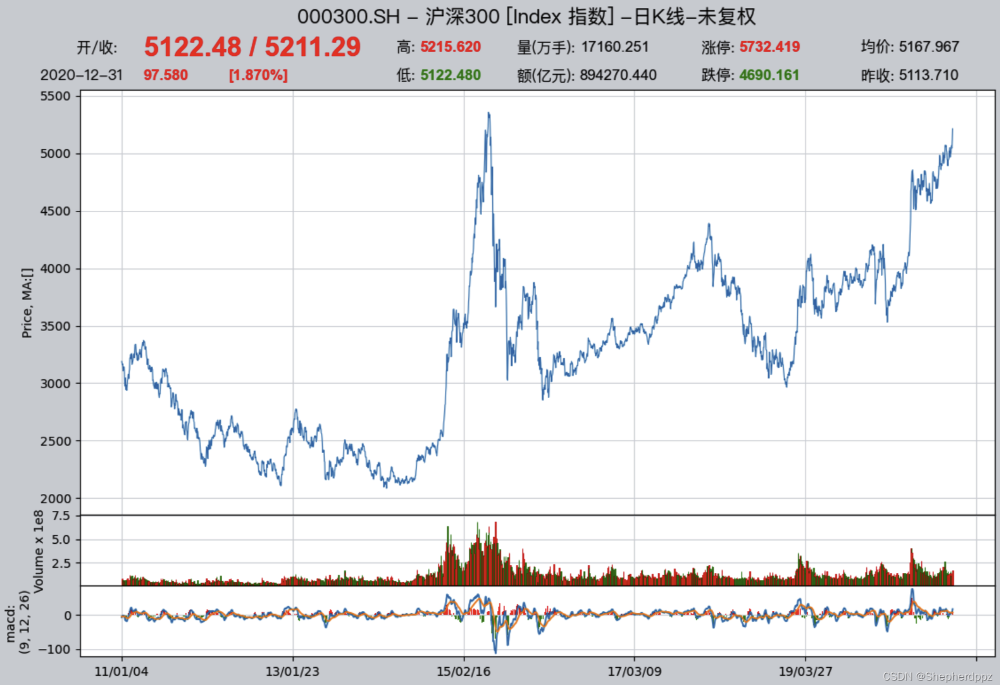

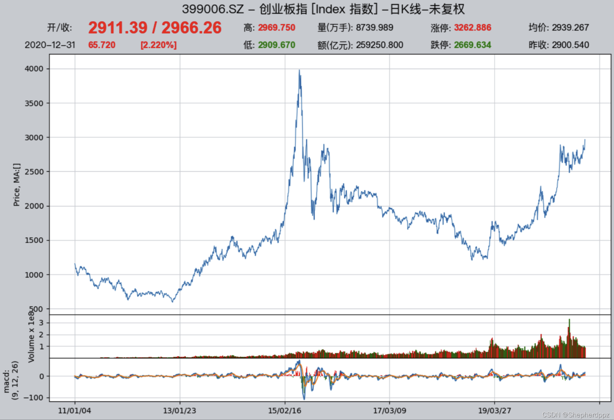

### 配置回测参数

数据准备好之后，就可以开始配置回测参数并开始回测了。`qteasy`的策略回测完全是参数化的，在回测之前我们需要告诉系统所有的相关信息，例如投资的产品品种、投入资金的数量、回测开始日期和结束日期、回测过程的交易费用计算方法、交易批量等。我们可以通过`qt.configure()`对回测参数进行基本配置：
```python
>>> qt.configure(asset_pool=['000300.SH',
...                          '399006.SZ'],  # 投资股票池里包括沪深300和创业板指数两个指数，分别代表大盘和小盘股
...              invest_cash_amounts=[100000],  # 投入金额为十万元
...              asset_type='IDX',  # 为简单起见，直接投资于指数
...              cost_rate_buy=0.0001,  # 买入资产时交易费用万分之一
...              cost_rate_sell=0.0001,  # 卖出资产时的交易费用为万分之一
...              invest_start='20110101',  # 模拟交易开始日期
...              invest_end='20201231',  # 模拟交易结束日期
...              trade_batch_size=0,  # 买入资产时最小交易批量
...              sell_batch_size=0,  # 卖出资产时最小交易批量
... )
```
上面的配置含义如下
- `asset_pool=['000300.SH', '399006.SZ']`：投资目标指数用列表形式给出，如果要投资其他的指数或ETF基金，直接传入证券代码即可，如果要从三个或更多的证券中选股，直接加入列表中即可
- `invest_amounts=100000`： 投资金额为十万元，如果需要模拟多次分批投入，还可以传入一个列表，不过需要分别指定每次投入的具体日期
- `asset_type='IDX'`： 投资标的类型：`'E'`代表股票， `'IDX'`代表指数，` 'FD'`代表基金，`'FT'`代表期货，`'OPT'`代表期权
- `cost_rate_buy=0.0001`： 设置买入和卖出交易费用比例，`qteasy`还支持设置最低费用、固定费用等等，这里只简单设置费率即可
- `cost_rate_sell=0.0001`：
- `invest_start='20110101'`： 模拟交易开始日期
- `invest_end='20201231'`：  模拟交易结束日期
- `trade_batch_size=0`：  买入资产时最小交易批量，`0`代表可以交易任意份额，1代表只能交易整数份，这里可以输入任意大于`0`的数
- `sell_batch_size=0`： 卖出资产时最小交易批量为`0`

`qteasy`还有其他的配置参数，参见[QTEASY文档](https://qteasy.readthedocs.io/zh-cn/latest/)。

## 策略的回测结果

`qteasy`的策略回测非常简单，设置好所有的配置后，即可以开始回测了，我们可以调用`qt.run()`开始回测，回测的同时，我们开启可视化图表输出，并且开启交易明细记录：
```python
>>> res = qt.run(op, mode=1, visual=True, trade_log=True)  # 调用qteasy的run方法，启动回测交易
```
等待片刻后，回测完成，`qteasy`会将打印回测报告在终端打印出来

输出如下：

在报告中直接可以看到我们投资的总回报率以及同期沪深300指数的回报率的对比：

```text
====================================
|                                  |
|         BACKTEST REPORT          |
|                                  |
====================================
qteasy running mode: 1 - History back testing
... 内容略，详见下文报告解析
-------------operation summary:------------
... 内容略，详见下文报告解析

Total operation fee:      ¥    7,163.97 
total investment amount:  ¥  100,000.00  # 投入的总金额为十万元
final value:              ¥  553,138.36  # 回测结束时的资产总额为五十多万元
Total return:                   453.14%  # 投资的总收益率为453%
Avg Yearly return:               18.67%  # 投资的年化收益率为18.67%
... 内容略，详见下文报告解析
Benchmark return:                60.32%  # 同期沪深300指数的总回报率为60.32%
Benchmark Yearly return:          4.84%  # 同期沪深300指数的年化收益率仅有4.84%

------strategy loop_results indicators------ 
... 内容略，详见下文报告解析

==================END OF REPORT===================
```

从回测的结果可以很容易看出，这个策略是跑赢了沪深300大盘指数的，在这十年间沪深300的年化收益率只有可怜的5%左右（4.84%），甚至比某些收益较高的定期产品都不如，而我们这个策略的投资年化收益率达到了18.67%，十年间总资产从十万元达到了五十多万元，翻了五倍多

## 策略的进一步改进
我们的策略获得了初步的成功，不过，光看总回报率还不能完全说明问题，策略在整个十年间的表现如何呢？这就需要进一步分析，看看能否进一步改进这个策略。这时我们需要进一步查看回测的结果，尤其是可视化结果和交易明细记录，通过这些记录和报告来找到策略的不足和改进点。

为了进一步改进，我们需要更深入地分析策略的表现，找到策略的不足之处，并且找到改进的方向。为此，qteasy提供了下面这些工具，用于帮助用户分析回测结果：

- **回测报告**：需设置`report=True`，回测报告以文字的形式总结了回测的结果，便于快速掌握投资的回报率以及关键评价指标。
- **可视化报告**：需设置`visual=True`，可视化复合图表以图形的形式展示回测报告中的内容，并且提供了更多的细节信息，便于用户更加直观地理解回测结果。
- **交易日志文件**：需设置：`trade_log=True`，交易日志文件以csv文件的形式记录了回测过程中每一次策略运行的过程，记录策略运行的关键变量以及每一次的选股结果，便于用户分析策略的运行过程，找到策略的不足之处，并且找到改进的方向。
- **交易明细报告**：需设置：`trade_log=True`，交易明细报告以csv文件的形式记录了每一笔交易的详细信息，便于用户分析每一笔交易的细节，找到策略的不足之处，并且找到改进的方向。

下面我们将详细了解每一项工具的内容和使用方法，帮助我们分析回测结果，找到策略的不足之处，并且找到改进的方向。

### 回测报告详细解析：

`qteasy`的回测报告包含大量的回测结果统计信息，我们来逐一详细了解：

#### 第1部份：回测基本信息

报告的第一部份包含了回测的基本信息，包括回测耗时、回测的起止日期、回测的总周期等等，这些信息可以帮助我们了解回测的基本情况：

```text
qteasy running mode: 1 - History back testing
time consumption for operate signal creation: 123.2 ms  # 生成交易信号的时间
time consumption for operation back testing:  288.7 ms  # 回测交易的时间
investment starts on      2011-01-04 15:00:00           # 回测开始日期
ends on                   2020-12-30 15:00:00           # 回测结束日期
Total looped periods:     10.0 years.                   # 回测的总周期为十年
```

#### 第2部份：交易操作统计
回测报告的第二部份是交易操作统计，以列表方式统计了每个投资标的的买入和卖出次数，以及持仓的时间占比：

例如可以看出000300.SH（沪深300指数）在十年间被买入了75次，卖出了81次，持仓时间占比为47.7%，空仓时间占比为52.3%，而399006.SZ（创业板指数）在十年间被买入了105次，卖出了85次，持仓时间占比为47.9%，空仓时间占比为52.1%。

```text
-------------operation summary:------------
Only non-empty shares are displayed, call 
"loop_result["oper_count"]" for complete operation summary
          Sell Cnt Buy Cnt Total Long pct Short pct Empty pct
000300.SH    81       75    156   47.7%     -0.0%     52.3%  
399006.SZ    85      105    190   47.9%     -0.0%     52.1%  
```
#### 第3部份：回测结果统计
回测报告的第三部份是回测结果统计，包含了投资的总金额、最终的资产总额、总收益率、年化收益率、基准收益率等等重要的回测结果统计信息：

```text
Total operation fee:      ¥    7,163.97  # 投资过程中的总交易费用 
total investment amount:  ¥  100,000.00  # 投入的总金额
final value:              ¥  553,138.36  # 回测结束时的资产总额
Total return:                   453.14%  # 投资的总收益率
Avg Yearly return:               18.67%  # 投资的年化收益率
Skewness:                         -0.40  # 投资回报率的偏度，偏度表明投资回报率分布的偏斜程度，负偏度表明投资回报率分布的左尾较长，意味着投资回报率有较大的负面极端值的可能性
Kurtosis:                          3.12  # 投资回报率的峰度，峰度表明投资回报率分布的峰态程度，峰度越大，表明投资回报率分布的峰态越高，意味着投资回报率有较大的极端值的可能性
Benchmark return:                60.32%  # 基准收益率，这里是指投资标的的基准指数（默认沪深300指数）的收益率，该指数在同一时段内收益率只有60%
Benchmark Yearly return:          4.84%  # 基准年化收益率，这里是指投资标的的基准指数（默认沪深300指数）的年化收益率，该指数在同一时段内年化收益率只有4.84%
```
#### 第4部份：策略表现指标
回测报告的第四部份是策略表现指标，包含了Alpha、Beta、Sharp Ratio、Info Ratio、250日波动率、最大回撤等等重要的策略表现指标
```text
------strategy loop_results indicators------ 
alpha:                            0.208  # 投资策略的Alpha值，Alpha值表明投资策略相对于基准指数的超额收益率，Alpha值越大，表明投资策略相对于基准指数的表现越好
Beta:                             0.693  # 投资策略的Beta值，Beta值表明投资策略相对于基准指数的系统风险，Beta值越大，表明投资策略相对于基准指数的系统风险越大
Sharp ratio:                      0.836  # 投资策略的Sharp Ratio，Sharp Ratio表明投资策略的风险调整收益率，Sharp Ratio越大，表明投资策略的风险调整收益率越好
Info ratio:                       0.056  # 投资策略的Info Ratio，Info Ratio表明投资策略相对于基准指数的风险调整超额收益率，Info Ratio越大，表明投资策略相对于基准指数的风险调整超额收益率越好
250 day volatility:               0.259  # 投资策略的250日波动率，250日波动率表明投资策略在250个交易日内的收益率波动程度，250日波动率越大，表明投资策略的收益率波动程度越大
Max drawdown:                    45.94%  # 最大回撤，最大回撤表明投资策略在回测期间内的最大资产回撤程度，最大回撤越大，表明投资策略的风险越大
    peak / valley:        2015-06-03 / 2019-01-03  # 最大回撤从2015年6月3日的峰值开始，到2019年1月3日的谷值，投资收益达到回撤45.94%
    recovered on:         2020-02-17               # 接着从2019年1月3日开始反弹，一直到2020年2月17日才完全恢复到2015年6月3日的峰值水平，也就是说，最大回撤持续了近五年时间
```

### 可视化报告详解

只要设置`qteasy`的环境配置变量`visual=True`，在回测报告的最后，就能看到运行结果的可视化图表报告：

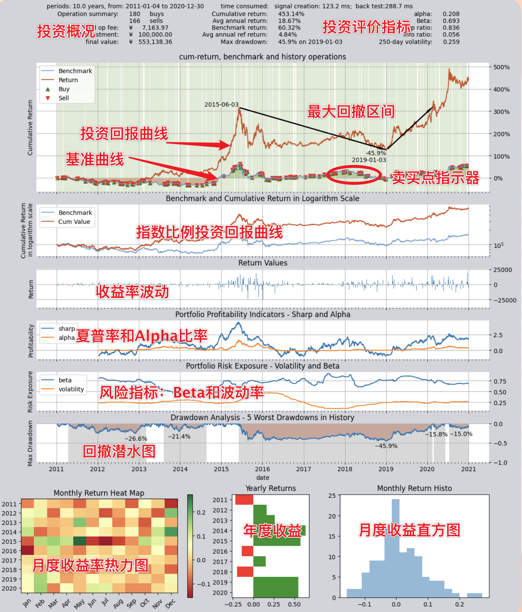

可视化图表用复合图表的方式将回测报告中的所有信息以更加直观的方式显示出来。可以看到，这张图表的主体部分包括六张统一时间轴的历史曲线图，下面还有三张并列的柱状图，分别统计了历年和历月的收益率。

总体上，这张图表可以分为四个部分，我们逐一来了解：

#### 第1部分，基本信息以及投资回报指标

在图表的最上方，显示了回测的基本信息和投资回报指标，这些信息与回测报告中的内容基本一致，包括投资的总回报率、年化收益率、基准指数的回报率等等重要的投资回报指标，方便用户快速了解投资的表现。

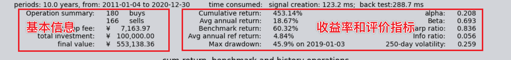
#### 第2部份，收益率曲线图

回测的历史回报率曲线图包括三张图表，显示的内容都是历史收益率，但是各有侧重。

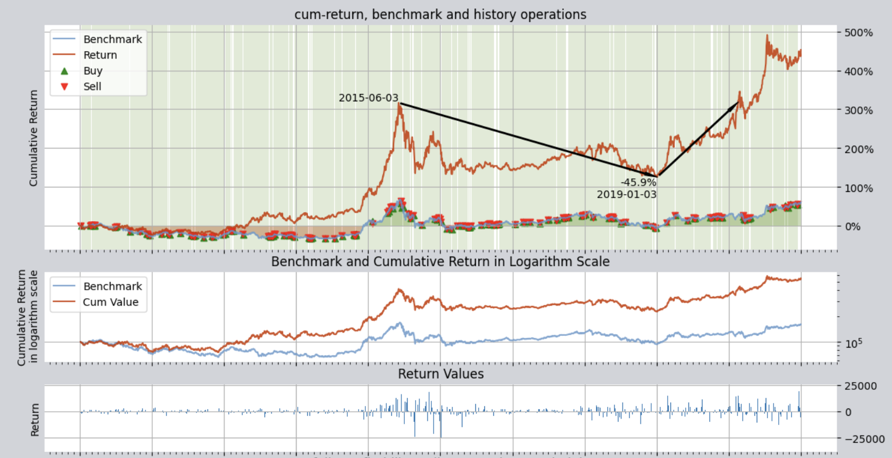

三张图表分别为：

- **收益率曲线图**：这个曲线图以百分比为单位，用红、绿两条线记录投资回报和基准回报（默认情况下投资基准是沪深300指数，可以通过环境配置变量`reference_asset`来设置其他指数）的收益率历史曲线。红色曲线为投资组合的收益率，而蓝色曲线为参考指数收益率。
这张曲线图包含了一些额外信息，可以通过环境变量来控制开启或关闭：
  - 回撤指示器：在投资区间的最大一次回撤的峰值、谷值以及恢复日间使用黑色箭头标注出来，方便用户了解投资的最大回撤情况
  - 买卖指示器（设置`buy_sell_points=True`）：在表示基准收益曲线的绿色线上，会在买入和卖出的时间点用红色/绿色箭头标注每一次买进和卖出，红色表示
  - 仓位指示器（设置`show_positions=True`）：图面背景用浅色的竖向条纹标注了每个时段的持仓比例，绿色代表持多仓，红色表示持空仓（上图中只有多仓，没有空仓），条纹颜色越深，代表持仓比例越高，反之则代表持仓比例较低
- **对数收益率曲线图**：这个曲线图以对数收益率为单位，显示投资回报和基准回报的历史曲线。对数收益率曲线图可以更好地显示投资回报率的变化趋势，尤其是在投资回报率较高或较低的时候，对数收益率曲线图能够更清晰地显示出投资回报率的变化情况。
- **收益率柱状图**：这个图用柱状图显示了回测历史区间内每天的收益金额。

从收益率曲线图上可以看到，整体收益率虽然还算不错，但是回撤较高，最大达到了45%。

大家可以设想，投资者如果从2015年6月3日开始投资，结果将是：到2019年1月3日亏损45.9%，然后一直到2020年后才能解套！

#### 第3部分，评价指标曲线图

图表的第三部份是策略性能指标图，主要用于评价策略的盈利能力和风险控制能力，同样包括三张图表：

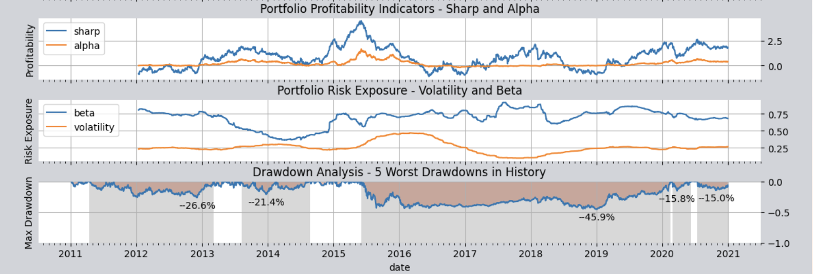

- **盈利能力评价指标**：第一张图显示了策略的盈利能力评价指标，显示了夏普率和Alpha率两个指标在历史上的滚动变化值。这两个指标都被广泛用于评价交易策略产生超额利润（即超出基准）的能力，图表上显示的两条线上每一点都是以当日为终点，过去250个交易日的夏普率和Alpha率的滚动计算结果，因此可以看到这两条线在历史上的变化情况，夏普率越高，表明策略的风险调整收益率越好，Alpha率越高，表明策略相对于基准指数的超额收益率越好。
- **风险控制能力评价指标**：第二张图显示了策略的风险控制能力评价指标，显示了Beta率和波动率两个指标在历史上的滚动变化值。这两个指标都评价策略能否控制风险，Beta率越低，表明策略相对于基准指数的系统风险越小，波动率越低，表明策略的收益率波动程度越小。
- **回撤控制能力指标**：第三张图是回撤潜水图，显示了策略的回撤控制能力评价指标，显示了投资回报率的历史曲线以及投资回报率的历史回撤曲线（也就是“underwater”曲线）。该曲线的每一次下探都代表着投资回报曲线相对前期高点出现了回撤，下探得越深就代表回撤越厉害，一次完整的下潜和上浮代表一次完整的回撤周期。同时在这张图上用灰色柱标注了历史上五次最深的回撤过程，灰色柱越宽表示回撤的持续时间越长。

从回撤潜水图上可以看出，整个十年间除了短短一两年以外，几乎都处于潜水套牢状态，而且潜水的深度最深达到了45%以上。在整个十年投资期间，总资产不断地出现回撤，45%回撤是最大最深的一次，但前期还有26%、22%等多次回撤，而且长度都不短，整个投资就是“长期被套牢，偶尔能翻盘”的状况，我相信，没有几个投资者能够熬得住这样的煎熬的，对吧？

#### 第4部分，收益率统计图

最下面还有并列的三张图表，分别从不同角度统计历年或历月的收益率：

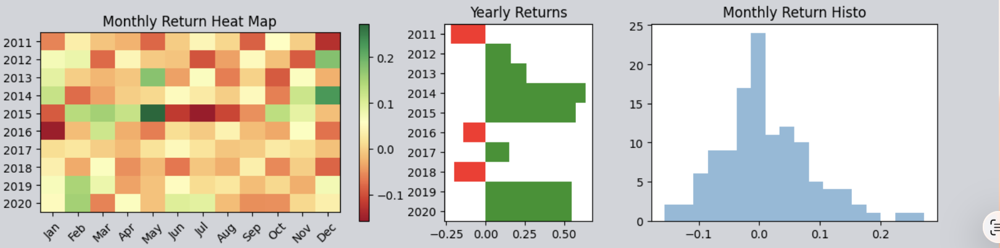

- **月度收益热力图**：以填色方块的形式展示历年（纵坐标）每个月（横坐标）的收益率，颜色越偏绿表示收益越高、越偏红表示收益越低或亏损
- **年度收益柱状图**：直观地显示每年的收益率，绿色柱代表正收益、红色柱表示亏损，柱子越高收益/亏损绝对值越高。
- **月度收益直方图**：统计所有月份的收益率并绘制它们的概率分布图，总体上来说这个图一般是呈类似正态分布的钟形曲线，但是根据策略的性能不同，钟形曲线会整体上向右偏移，表示总体产生正收益的概率高，或者产生偏斜等，从而帮助用户从统计上理解收益率的分布情况。

通过上面三张图，可以看到整个十年中有三年（2011年、2016年和2018年）的收益率是负的，其余年份均实现了正收益，但是收益率波动很大，有些年份大赚，有些年份大亏，波动大表明策略风险高，风控能力较弱。

至此，通过分析图表，我们现在对交易策略的总体收益有了非常直观的了解：这个策略最大的问题是没有控制好回撤。

因此，应该想办法改进一下这个策略，看看如何能够降低回撤，提升策略的性能。为此，我们需要仔细分析模拟交易回测过程中的每一笔交易，寻找降低回撤的办法。要查看回测交易的每一个细节，那就需要查看交易日志文件。

下面我们来继续详解交易日志文件。

### 交易日志/交易报告详解
只要我们设置环境变量`trade_log=True`，系统就会在每次回测后生成两份文件：交易日志文件和交易明细报告。这两份报告的保存路径由环境变量`trade_log_file_path`控制，默认在`QT_ROOT_PATH/tradelog/`路径下。

> 如果要查看具体的日志文件保存路径，请使用：
> ```python
> import qteasy as qt
> print(qt.QT_TRADE_LOG_PATH)
> ```

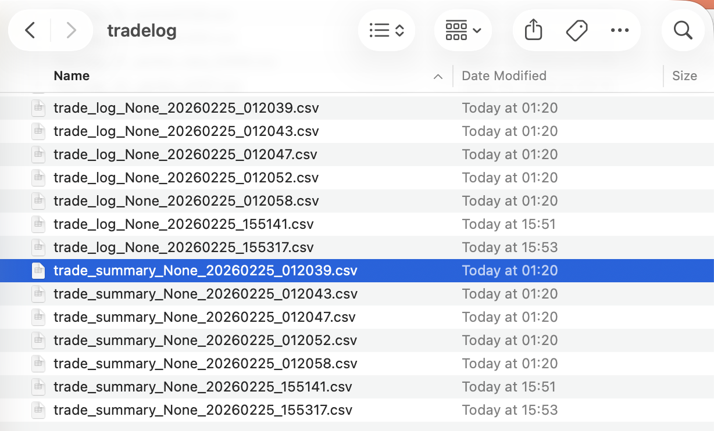

打开路径文件夹，可以看到历次回测的报告，所有报告都保存为csv文件，便于用Excel打开，这些文件包括两类：

- **交易日志**：以“trade_log”打头是交易日志文件，罗列了每一次策略运行的详细信息
- **交易报告**：以“trade_summary”打头的是交易报告，里面罗列了每一笔交易的信息

上述文件都以回测运行的日期/时间结尾，以区分不同时间生成的日志文件。我们分别解释：

#### 交易日志解读

使用Excel打开第一个文件可以看到交易日志，交易日志用表格记录了每一次策略运行时的资金的变动，持股的变动、每种股票的交易明细等信息，不管是否有交易或持股变动，每天都有记录：

整个交易历史在表格中是按行排列的，每八行为一组，每一组记录一次交易，从第一次到最后一次交易的信息按顺序从上到下记录。

每一组记录的八行分别记录下面的内容：

- **0, trade signal 交易信号**: 记录这次运行后产生的交易信号（交易信号是一组数字，经信号解析后变成交易订单，详见[交易信号](../manage_strategies/2.%20operator.md)）
- **1, price 交易价格**: 记录本次运行时的各个股票的交易价格
- **2, traded amounts交易数量**：记录本次运行后各个股票的实际交易数量，正数为买入数量，负数为卖出数量，0代表没有交易
- **3, cash changed现金变动**：记录本次运行后各个股票实际交易导致的现金变动金额，正数代表现金增加，负数代表现金减少，0代表没有变动
- **4, trade cost交易费用**：记录本次运行后各个股票实际交易产生的交易费用
- **5, own amounts持仓数量**: 记录本次运行后持有的各个股票的数量，正数代表持多头持仓数量，负数代表空头数量，0代表没有持股
- **6, available amounts可用持仓**：记录本次运行后可用的各个股票的数量，正数代表可用的多头持仓数量，负数代表可用的空头持仓数量，0代表没有可用持股
- **7, summary合计**：记录本次运行后持有/可用现金总计、持股总价值以及投资总价值

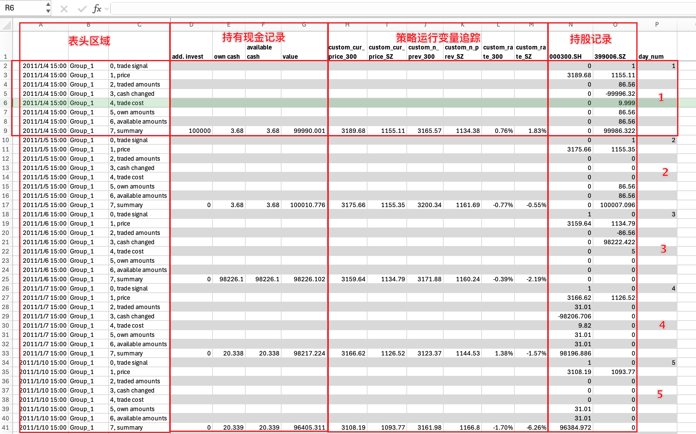
仔细察看交易日志，整张表格按列可分为三组或四组，分别提供不同角度的信息：

- **表头区域**：表头区域第一列记录每一次运行的日期和时间，第二列记录每一次运行的策略组名称（详情参见[策略组](../manage_strategies/3.%20group_and_blender.md)），第三列标注每一行的名称，
- **持有现金记录**：在该区域的summary合计行，记录每次运行前新增投入的现金、期末持有现金总额/可用现金总额以及投资总额（包括现金总额和股票总价值）
- **策略运行变量追踪**：策略运行变量追踪是可选的，允许用户在策略中插入追踪点来追踪策略运行过程变量的值，这在策略调试过程中很有用，此处暂时掠过，详见
- **持股记录**：

从上面的文件中可以看到，1月4日买入了31份沪深300指数，到1月5日收盘时卖出了持有的沪深300指数31份，并在1月6日收盘时买入87份创业板指，并在1月7日继续持有。。。
而打开trade_records.csv文件可以看到，这里记录了每一笔成交的交易，包括交易日期、买卖方向、交易份额、价格、总金额、交易费率等等信息，由于只记录有交易的实际发生，因此信息更加紧凑：
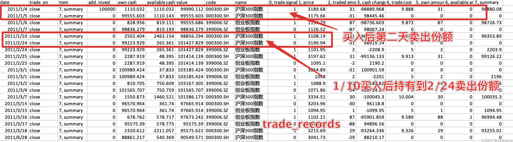
仔细分析上面的表格，会发现这个投资策略除了在换股的时候以外，都是满仓持有的，在2015年中的股灾期间也不例外，我们找到这段时间会发现，从2015年的6月18日开始，不管是沪深300指数还是创业板指数，他们的20日收益率都已经由正转负，表明后市已经开始下跌了，然而此时策略仍然坚定地持有创业板指，这是因为创业板指的跌幅要小于沪深300，也就是收益率大于沪深300：
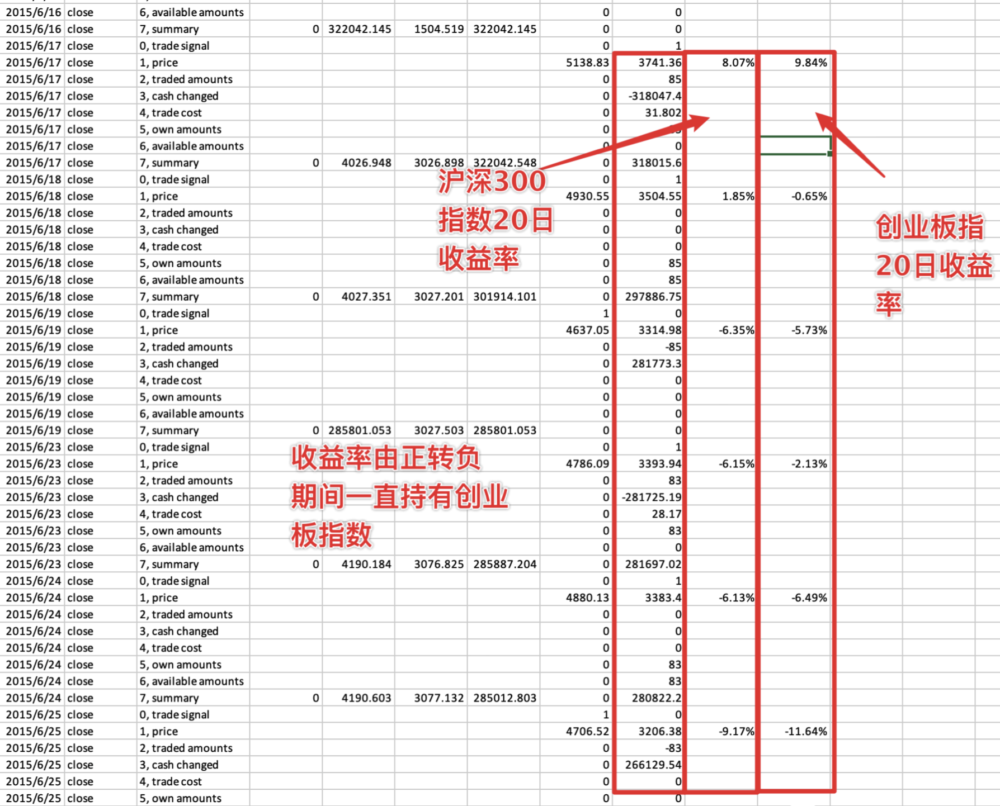
所以其实这时候我们的策略仍然选择了正确的指数，只不过因为两个指数都在跌，我们的策略选择了跌的少的那一个持有，减少了我们的损失。

那么，我们可否从这里出发改进我们的策略呢？思路很简单，我们可以加一条规则：

- 每天计算两个指数在过去20天的涨幅，也就是今天的价格相对于20天前价格的涨幅
- 如果选股日两个指数都小于0，那么我们第二天就空仓，一个指数都不持有
- 否则，选择涨幅较大的那个指数，在第二天持有，同时卖掉涨幅较小的指数

我们在原来的简单选股规则基础上增加了一条“过滤条件”，将两个指数都小于0的情况排除在外，好了，那么在`qteasy`中如何调整，以反映这个新的修改呢？

### 改进后的策略设置

`qteasy`的内置选股策略提供了一个过滤条件`condition`属性，默认条件下`condition='any'`，代表没有过滤条件，现在我们需要把小于0的收益率过滤掉，因此可以设置`condition='greater'`同时设置过滤范围`ubound=0`即可：
```python
>>> op.set_parameter(0,
...                  condition='greater',  # 新增过滤条件：20日涨幅大于等于
...                  ubound=0.0,  # 过滤条件值：0
...                  )  
```
上面的设置跟前一节基本相同，增加了两个参数：

 - `condition='greater'`：含义是增加过滤条件，N日涨幅必须大于等于某个值才能参加选股，这个值在`ubound`参数中设置。也就是说排除掉小于这个值的股票，让其无法中选
 - `ubound=0`： 设置为0，这样只有涨幅大于等于0的指数才能被选中，当然还可以设置为其他浮点数

### 改进后的结果
同样按照前面的配置，直接执行`qt.run()`。这里直接放结果：
```python
>>> res=qt.run(op, visual=True, trade_log=True)
```
输出如下：
```text
====================================
|                                  |
|         BACKTEST REPORT          |
|                                  |
====================================
qteasy running mode: 1 - History back testing
time consumption for operate signal creation: 137.9 ms
time consumption for operation back testing:  7.2 ms
investment starts on      2011-01-04 15:00:00
ends on                   2020-12-30 15:00:00
Total looped periods:     10.0 years.
-------------operation summary:------------
Only non-empty shares are displayed, call 
"loop_result["oper_count"]" for complete operation summary
          Sell Cnt Buy Cnt Total Long pct Short pct Empty pct
000300.SH    91       84    175   24.9%     -0.0%     75.1%  
399006.SZ    91      104    195   41.5%     -0.0%     58.5%  

Total operation fee:     ¥   10,997.75
total investment amount: ¥  100,000.00
final value:              ¥  808,794.95
Total return:                   708.79% 
Avg Yearly return:               23.26%
Skewness:                         -0.22
Kurtosis:                          5.21
Benchmark return:                60.32% 
Benchmark Yearly return:          4.84%

------strategy loop_results indicators------ 
alpha:                            0.294
Beta:                             0.619
Sharp ratio:                      0.990
Info ratio:                       0.050
250 day volatility:               0.209
Max drawdown:                    27.31% 
    peak / valley:        2018-01-24 / 2019-01-23
    recovered on:         2019-03-12


==================END OF REPORT===================
```

可视化图表如下：
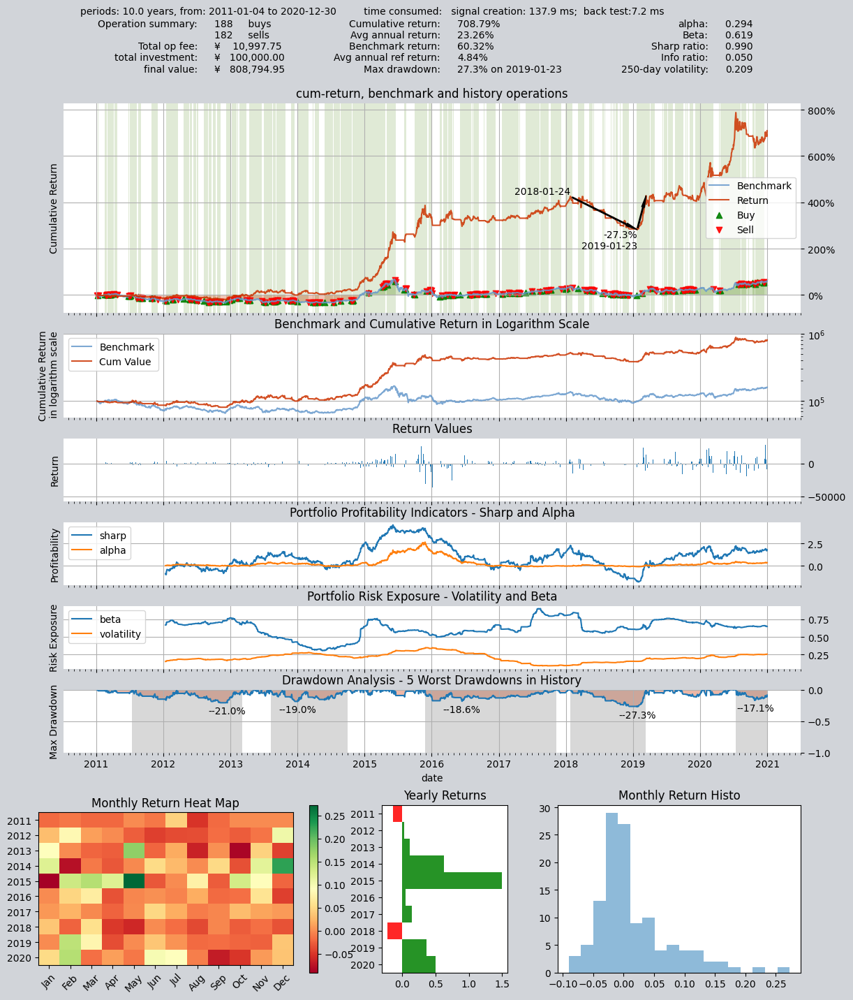

从资产收益率图上可以看到，原来一片绿色（全程持仓）变成了白绿相间（白色区间空仓持币），资产回撤情况得到了大幅度优化：从原来的50%回撤降低到了20%左右。而且总回报率也大大提升：

- 资产总额从改进前的四十多万提高到七十多万
- 总收益率从300%提升到了640%
- 年化收益率从17%提升到了22%
- 最大回撤从50%降低到了20%

通过查看交易记录可知，的确策略在2015年6月底的股灾期间保持空仓，躲避了单边下跌的行情。
## 本篇回顾

通过本教程，我们通过一个大小盘轮动交易策略的创建、回测、修改熟悉了解了`qteasy`的交易策略，知道如何通过引用内置交易策略，创建一个单策略交易员对象，并使交易员运行策略获得回测结果。从下一篇教程开始，我们将进一步详细讨论`qteasy`的内置交易策略，并且介绍组合策略的实现方式，在交易员对象中添加更多的策略并设定组合方式，通过策略组合实现更复杂的效果，并且了解更多策略控制和类型。
