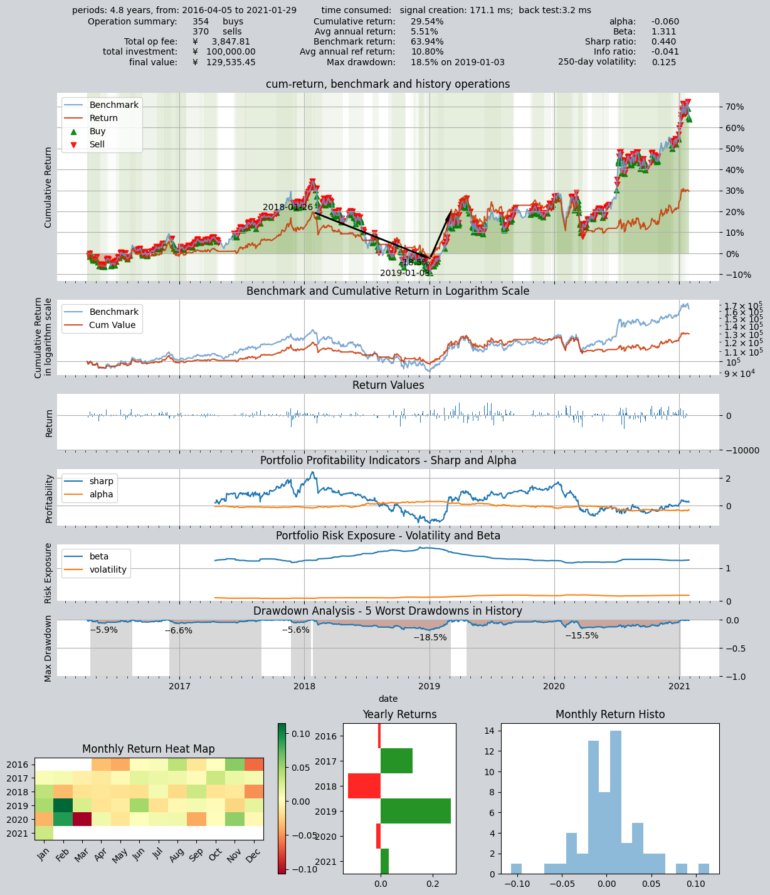
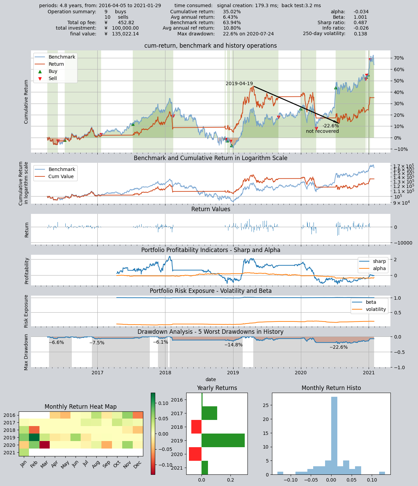
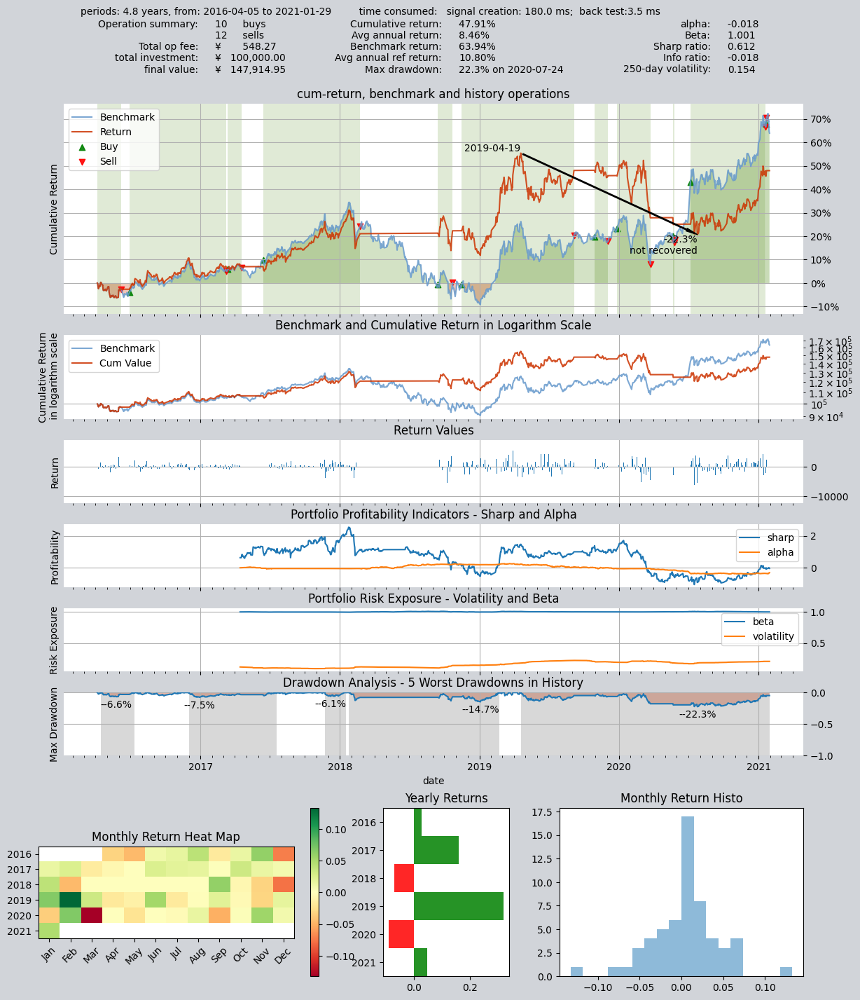

# 拼搭出一个比较复杂的策略

`qteasy`是一个完全本地化部署和运行的量化交易分析工具包，具备以下功能：

- 金融数据的获取、清洗、存储以及处理、可视化、使用
- 量化交易策略的创建，并提供大量内置基本交易策略
- 向量化的高速交易策略回测及交易结果评价
- 交易策略参数的优化以及评价
- 交易策略的部署、实盘运行

通过本系列教程，您将会通过一系列的实际示例，充分了解`qteasy`的主要功能以及使用方法。

## 开始前的准备工作

在开始本节教程前，请先确保您已经掌握了下面的内容：

- 安装、配置`qteasy` —— 详情请参阅[QTEASY教程1](1-get-started.md)
- 设置了一个本地数据源，并已经将足够的历史数据下载到本地（包括交易日历、股票/基金/指数基本信息、股票/基金/指数的价格数据以及财务指标或其他财务数据——详情请参阅[QTEASY教程2](2-get-data.md)
- 学会创建交易员对象，使用一个内置交易策略并回测其历史表现，检查回测日志、明白如何调整策略的运行参数或可调参数，改进策略的表现——[QTEASY教程3](3-start-first-strategy.md)

在[QTEASY文档](https://qteasy.readthedocs.io/zh-cn/latest/)中，还能找到更多关于如何创建交易员对象运行策略，使用历史数据回测策略，检查回测交易记录，修改策略等等相关内容。对`qteasy`的基本使用方法还不熟悉的同学，可以移步那里查看更多详细说明。

## 本节的目标

在上一节教程中，我们创建了一个Operator交易员对象，并且使该交易员运行了第一个选股交易策略。不过，在qteasy中，交易员的能耐可远不止运行一个交易策略这么简单。实际上，Operator对象类似于真正的交易员，它可以同时控制并运行任意多个交易策略，这些交易策略既可以在不同的时刻以不同的频率分别运行，也可以集中大量同时运行，而且，同时运行的策略还可以以任意指定的方式“混合”成需要的样子。

您可以把交易员想像成一名画家，手里的调色板上有着不同颜色的颜料，他既可以使用不同颜色的颜料勾勒出颜色鲜明的线条，也可以用几种不同颜色调配处柔和的过渡色；这样，即使画家手里的颜料只有寥寥数种，但是画笔下却可以调配出大千世界的亿万种色彩。

这正是`qteasy`的重要设计理念之一：Operator交易员对象通过下面两种工具，可以将非常简单的交易策略组合调配成非常复杂的交易策略，从而实现复杂的功能，这两种工具包括：

- **Strategy Group 策略组**：交易员可以将多个策略分组运行，每一组交易策略共享同样的运行频率（例如每日运行，每小时运行或每分钟运行）以及运行时机（例如每日收盘时运行或每天10:30运行），这样可以灵活地控制策略的运行时间。
- **Blender 策略混合器**：在同一组内同时运行的交易策略必然是同时运行的，此时各个策略会根据各自的运行逻辑生成一组交易信号，但是这一组交易信号必须被以某种方式“合并”成一组，这种合并的方式是通过混合器`blender`执行的，混合器专门负责将多个策略生成的交易信号融合成一组，而融合的逻辑完全由用户定义的`blender string`组合字符串确定，用户有完全控制权。

在本节中，我们将了解如果使用`qteasy`中更多的内置策略，如何使交易员同时运行多个交易策略，如何使用策略混合器`blender`来使用交易策略生成不同的组合策略，

目前`qteasy`支持超过70种内置交易策略，全部都是开箱即用，完整的内置交易策略清单请参见[参考文档](../references/4-build-in-strategy-blender.md)：

通过下面的API可以获取qteasy中提供的所有内置交易策略的清单：

```python
import qteasy as qt
qt.built_ins()
```
上面的API将返回qteasy所有内置交易策略：

```text
{'crossline': qteasy.built_in.CROSSLINE,
 'macd': qteasy.built_in.MACD,
 'dma': qteasy.built_in.DMA,
 'trix': qteasy.built_in.TRIX,
 'cdl': qteasy.built_in.CDL,
 'bband': qteasy.built_in.BBand,
 's-bband': qteasy.built_in.SoftBBand,
 'sarext': qteasy.built_in.SAREXT,
 'ssma': qteasy.built_in.SCRSSMA,
 'sdema': qteasy.built_in.SCRSDEMA,
 'sema': qteasy.built_in.SCRSEMA,
 'sht': qteasy.built_in.SCRSHT,
 'skama': qteasy.built_in.SCRSKAMA,
 'smama': qteasy.built_in.SCRSMAMA,
 ...}
```

下面清单罗列了部分`qteasy`内置开箱即用的交易策略，完整的清单请参见[参考文档](../references/4-build-in-strategy-blender.md)

| ID          |       策略名称        | 说明                                                                                                                                                           | 
|:------------|:-----------------:|:-------------------------------------------------------------------------------------------------------------------------------------------------------------|
| `crossline` | `TimingCrossline` | crossline择时策略类，利用长短均线的交叉确定多空状态<br />1，当短均线位于长均线上方，且距离大于l\*m%时，设置仓位目标为1<br />2，当短均线位于长均线下方，且距离大于l\*m%时，设置仓位目标为-1<br />3，当长短均线之间的距离不大于l\*m%时，设置仓位目标为0          |
| `macd`      |   `TimingMACD`    | MACD择时策略类，运用MACD均线策略，生成目标仓位百分比:<br />1，当MACD值大于0时，设置仓位目标为1<br />2，当MACD值小于0时，设置仓位目标为0                                                                        |
| `dma`       |    `TimingDMA`    | DMA择时策略<br />1， DMA在AMA上方时，多头区间，即DMA线自下而上穿越AMA线后，输出为1<br />2， DMA在AMA下方时，空头区间，即DMA线自上而下穿越AMA线后，输出为0                                                          |
| `trix`      |   `TimingTRIX`    | TRIX择时策略，使用股票价格的三重平滑指数移动平均价格进行多空判断:<br />计算价格的三重平滑指数移动平均价TRIX，再计算M日TRIX的移动平均：<br />1， TRIX位于MATRIX上方时，设置仓位目标为1<br />2， TRIX位于MATRIX下方时，设置仓位目标位-1             |
| `cdl`       |    `TimingCDL`    | CDL择时策略，在K线图中找到符合要求的cdldoji模式<br />搜索历史数据窗口内出现的cdldoji模式（匹配度0～100之间），加总后/100，计算 等效cdldoji匹配数量，以匹配数量为交易信号。                                                    |
| `bband`     |   `TimingBBand`   | 布林带线交易策略，根据股价与布林带上轨和布林带下轨之间的关系确定多空，在价格上穿或下穿布林带线上下轨时产生交易信号。布林带线的均线类型不可选<br />1，当价格上穿上轨时，产生全仓买入信号<br />2，当价格下穿下轨时，产生全仓卖出信号                                     |
| `s-bband`   |    `SoftBBand`    | 布林带线渐进交易策略，根据股价与布林带上轨和布林带下轨之间的关系确定多空，交易信号不是一次性产生的，而是逐步渐进买入和卖出。计算BBAND，检查价格是否超过BBAND的上轨或下轨：<br />1，当价格大于上轨后，每天产生10%的比例买入交易信号<br />2，当价格低于下轨后，每天产生33%的比例卖出交易信号 |
| `sarext`    |  `TimingSAREXT`   | 扩展抛物线SAR策略，当指标大于0时发出买入信号，当指标小于0时发出卖出信号                                                                                                                       |
| `ssma`      |     `SCRSSMA`     | 单均线交叉策略——SMA均线(简单移动平均线)：根据股价与SMA均线的相对位置设定持仓比例                                                                                                                |
| `sdema`     |    `SCRSDEMA`     | 单均线交叉策略——DEMA均线(双重指数平滑移动平均线)：根据股价与DEMA均线的相对位置设定持仓比例                                                                                                          |
| `sema`      |     `SCRSEMA`     | 单均线交叉策略——EMA均线(指数平滑移动均线)：根据股价与EMA均线的相对位置设定持仓比例                                                                                                               |
| ...         |        ...        | 完整的内置策略清单请见[参考文档](../references/4-build-in-strategy-blender.md)                                                                                              |


每一个内置交易策略都有自己的ID（例如上表中的`crossline`、`macd`、`dma`等等），用户可以通过这个ID来获取内置交易策略的实例，并将其加入到交易员对象中使用。例如：

```python
stg = qt.get_built_in_strategy('dma')
stg.info()
```
得到输出：
```text
================================ Strategy: DMA =================================
Strategy RULE-ITER(DMA)
Parameters: ['slow', 'long', 'diff'] = (12, 26, 9)                  
Date Types: close_ANY_d x 270                                       
----------------------------- Iteration Properties -----------------------------
Allow multi pars        True
Multi-parameter not set                      
```

如果需要查看每一个内置交易策略的详细解释，例如策略参数的含义、信号生成规则，可以查看每一个交易策略的`doc-string`：

例如：

```python
qt.built_in_doc('Crossline', print_out=True)
```
可以看到
```
Init signature: qt.built_in.TimingCrossline(pars:tuple=(35, 120, 0.02))
Docstring:     
crossline择时策略类，利用长短均线的交叉确定多空状态

策略参数：
    s: int, 短均线计算日期；
    l: int, 长均线计算日期；
    m: float, 均线边界宽度（百分比）；
信号类型：
    PT型：目标仓位百分比
信号规则：
    1，当短均线位于长均线上方，且距离大于l*m%时，设置仓位目标为1
    2，当短均线位于长均线下方，且距离大于l*mM时，设置仓位目标为-1
    3，当长短均线之间的距离不大于l*m%时，设置仓位目标为0

策略属性缺省值：
默认参数：(35, 120, 0.02)
数据类型：close 收盘价，单数据输入
采样频率：天
窗口长度：270
参数范围：[(10, 250), (10, 250), (0, 1)]
策略不支持参考数据，不支持交易数据
File:           ~/Library/CloudStorage/OneDrive-Personal/Projects/PycharmProjects/qteasy/qteasy/built_in.py
Type:           type
Subclasses:     
```

在`ipython`等交互式`python`环境中，也可以使用`?`来显示内置交易策略的详细信息，例如：

```text
>>> qt.built_in.SelectingNDayRateChange?
```

可以看到：

```
Init signature: qt.built_in.SelectingNDayRateChange(pars=(14,))
Docstring:     
基础选股策略：根据股票以前n天的股价变动比例作为选股因子

策略参数：
    n: int, 股票历史数据的选择期
信号类型：
    PT型：百分比持仓比例信号
信号规则：
    在每个选股周期使用以前n天的股价变动比例作为选股因子进行选股
    通过以下策略属性控制选股方法：
    *max_sel_count:     float,  选股限额，表示最多选出的股票的数量，默认值：0.5，表示选中50%的股票
    *condition:         str ,   确定股票的筛选条件，默认值'any'
                                'any'        :默认值，选择所有可用股票
                                'greater'    :筛选出因子大于ubound的股票
                                'less'       :筛选出因子小于lbound的股票
                                'between'    :筛选出因子介于lbound与ubound之间的股票
                                'not_between':筛选出因子不在lbound与ubound之间的股票
    *lbound:            float,  执行条件筛选时的指标下界, 默认值np.-inf
    *ubound:            float,  执行条件筛选时的指标上界, 默认值np.inf
    *sort_ascending:    bool,   排序方法，默认值: False,
                                True: 优先选择因子最小的股票,
                                False, 优先选择因子最大的股票
    *weighting:         str ,   确定如何分配选中股票的权重
                                默认值: 'even'
                                'even'       :所有被选中的股票都获得同样的权重
                                'linear'     :权重根据因子排序线性分配
                                'distance'   :股票的权重与他们的指标与最低之间的差值（距离）成比例
                                'proportion' :权重与股票的因子分值成正比

策略属性缺省值：
默认参数：(14,)
数据类型：close 收盘价，单数据输入
采样频率：月
窗口长度：150
参数范围：[(2, 150)]
策略不支持参考数据，不支持交易数据
File:           ~/Library/CloudStorage/OneDrive-Personal/Projects/PycharmProjects/qteasy/qteasy/built_in.py
Type:           type
Subclasses:    
```

## 多重策略以及策略组合

在`qteasy`中，一个`Operator`交易员对象可以同时分组运行任意多个交易策略。这些交易策略在运行的时候，都会分别提取各自所需的历史数据，独立生成不同的交易信号，这些交易信号会被组合成一组交易信号，统一执行。

利用这种特性，用户可以在一个交易员对象中同时运行多个各有侧重的交易策略，例如，一个交易策略监控个股的股价，根据股价产生择信号，第二个交易策略专门负责监控大盘走势，通过大盘走势决定整体仓位。第三个交易策略专门负责止盈止损，在特定时刻止损。最终的交易信号以第一个交易策略为主，但受到第二个策略的节制，必要时会被第三个策略完全控制。

或者，用户也可以很容易地制定出一个“委员会”策略，在一个综合性策略中由多个策略独立地做出交易决策，最终的交易信号由所有子策略组成的”委员会“投票决定，投票的方式可以是简单多数、绝对多数、加权投票结果等等。

上述交易策略组合中，每一个独立的交易策略都很简单，很容易定义，而将他们组合起来，又能发挥更大的作用。同时每一个子策略都是独立的，可以自由组合出复杂的综合性交易策略。这样可以避免不断地重复开发策略，只需要对子策略重新排列组合，重新定义组合方式，就可以快速地搭建一系列的复杂综合性交易策略。这样能够极大地提高交易策略的搭建效率，缩短周期。时间就是金钱。

交易信号的混合即交易信号的各种运算或函数，从简单的逻辑运算、加减运算一直到复杂的自定义函数，只要能够应用于一个`ndarray`的函数，都可以用于混合交易信号，只要最终输出的交易信号有意义即可。

### 定义策略组合方式`blender`

在一个`Operator`交易员对象中，所有的交易策略都必须被分配到某一个策略组中，如果策略组中的策略数量多于1个，就必须定义一个`blender`。如果没有明确定义`blender`，而策略的数量超过1个时，`qteasy`会在运行`Operator`的时候创建一个默认的`blender`，但是为了让多重策略正确运行，用户需要自行定义`blender`。

`blender_str`是用户自行定义的一个组合表达式，用户使用这个表达式确定不同交易策略的组合方式。这个组合表达式使用四则运算符、逻辑运算符、函数等符号规定策略信号是如何组合的。`blender`表达式中可以包括以下元素：

`blender`表达式中支持的符号如下：

| 元素    |     示例      | 说明                                            |
|:------|:-----------:|:----------------------------------------------|
| 策略序号  | `s0, s1...` | 以s开头，数字结尾的字符串，数字为`Group`中的策略的序号，代表这个策略生成的交易信号 |
| 数字    |   `-1.35`   | 任何合法的数字，参与表达式运算的数字                            |
| 运算符   |     `+`     | 包括`+ - * / ^`等数学运算符                           |
| 逻辑运算符 |    `and`    | 支持`&`/`~`以及`and`/`or`/`not`等逻辑运算符             |
| 函数    |   `sum()`   | 表达式支持多种函数，支持的函数参见后表                           |
| 括号    |    `()`     | 组合运算                                          |


### `blender`示例

当一个`Operator`对象中有三个交易策略时（其序号分别为`s0`/`s1`/`s2`），按照以下方式定义的`blender`都是合法可用的，同时使用`Operator.set_blender()`来设置`blender`：

#### 使用四则运算符定义blender表达式

`'s0 + s1 + s2'`

此时三个交易策略生成的交易信号会被加起来，成为最终的交易信号，如果策略0的结果为买入10%，策略1结果为买入10%，策略2结果为买入30%，则最终的结果为买入50%

#### 使用逻辑运算符定义blender表达式：

`'s0 and s1 and s2'`

表示只有当交易策略1、2、3都出现交易信号的时候，才会最终形成交易信号。如策略1的结果为买入，策略2结果为买入，而策略3没有交易信号，则最终的结果为没有交易信号。

#### blender表达式中还可以包含括号和一些函数：

`'max(s0, s1) + s2'`

表示策略1、2的结果中最大值与策略3的结果相加，成为最终交易信号。如果策略1的结果为买入10%，策略2结果为买入20%，策略3结果为买入30%，最终的结果为买入50%

#### blender 表达式中每个策略可以出现不止一次，也可以出现纯数字：

`'(0.5 * s0 + 1.0 * s1 + 1.5 * s2) / 3 * min(s0, s1, s2)'`

上面的`blender`表达式表示：首先计算三个策略信号的加权平均（权重分别为0.5、1.0、1.5），然后再乘以三个信号的最小值

#### blender 表达式中函数的操作参数在函数名中定义：

`'clip_-0.5_0.5(s0 + s1 + s2) + pos_2_0.2(s0, s1, s2)'`

上面的`blender`表达式定义了两种不同的函数操作，分别得到结果后相加得到最终结果。第一个函数是范围剪切，将三组策略信号相加后，剪切掉小于-0.5的信号值以及大于0.5的信号值，得到计算结果；第二个函数是仓位判断函数，统计三组信号中持仓大于0.2的时间段，将其定义为“多头”，然后再统计每一个时间段三个策略中持多头建议的数量，如果超过两个策略持多头建议，则输出满仓多头，否则输出空仓。

`blender`表达式中支持的函数如下：

| 函数          |            表达式示例            | 说明                                                                                                                |
|:------------|:---------------------------:|:------------------------------------------------------------------------------------------------------------------|
| `abs`       |          `abs(s0)`          | 绝对值函数<br />计算所有交易信号的绝对值<br />只能输入一个交易信号                                                                           |
| `avg`       |     `avg(s0, s1, ...)`      | 平均值函数<br />计算所有交易信号的平均值<br />输入信号的数量不限                                                                            |
| `avgpos`    |  `avgpos_N_T(s0, s1, ...)`  | 平均值累计函数<br />当交易信号为持仓目标信号时，统计同一时间产生非空仓信号（输出信号绝对值>T）的个数，当空头/多头信号的数量大于N时，输出所有空头/多头信号的平均值，否则输出0.<br />输入信号的数量不限      |
| `ceil`      |         `ceil(s0)`          | 向上取整函数<br />交易信号向上取整<br />只能输入一个交易信号                                                                              |
| `clip`      |       `clip_U_L(s0)`        | 范围剪切函数<br />剪切超过范围的信号值，剪切上下范围在函数名中定义<br />只能输入一个交易信号                                                              |
| `combo`     |    `combo(s0, s1, ...)`     | 组合值函数<br />输出所有交易信号加总的值<br />输入信号的数量不限                                                                            |
| `committee` |   `cmt_N_T(s0, s1, ...)`    | 委员会函数（等同于累计持仓函数pos））<br />当交易信号为持仓目标信号时，统计同一时间产生非空仓信号（输出信号绝对值>T）的个数数，当多头/空头信号的数量大于N时，输出-1/1，否则输出0.<br />输入信号的数量不限 |
| `exp`       |          `exp(s0)`          | exp函数<br />计算e的信号次幂<br />只能输入一个交易信号                                                                               |
| `floor`     |         `floor(s0)`         | 向下取整函数<br />交易信号向下取整<br />只能输入一个交易信号                                                                              |
| `log`       |          `log(s0)`          | 对数函数<br />计算以e为底的对数值<br />只能输入一个交易信号                                                                              |
| `log10`     |         `log10(s0)`         | 以10为底的对数函数<br />计算以10为底的对数值<br />只能输入一个交易信号                                                                       |
| `max`       |     `max(s0, s1, ...)`      | 最大值函数<br />计算所有交易信号的最大值<br />输入信号的数量不限                                                                            |
| `min`       |     `min(s0, s1, ...)`      | 最小值函数<br />计算所有交易信号的最小值<br />输入信号的数量不限                                                                            |
| `pos`       |   `pos_N_T(s0, s1, ...)`    | 累计持仓函数<br />当交易信号为持仓目标信号时，统计同一时间产生非空仓信号（输出信号绝对值>T）的个数数，当多头/空头信号的数量大于N时，输出-1/1，否则输出0.<br />输入信号的数量不限               |
| `position`  | `position_N_T(s0, s1, ...)` | 累计持仓函数<br />当交易信号为持仓目标信号时，统计同一时间产生非空仓信号（输出信号绝对值>T）的个数数，当多头/空头信号的数量大于N时，输出-1/1，否则输出0.<br />输入信号的数量不限               |
| `pow`       |        `pow(s0, s1)`        | 幂函数<br />计算第一个交易信号的第二个信号次幂即sig0^sig1<br />输入信号的数量只能为两个                                                            |
| `power`     |       `power(s0, s1)`       | 幂函数<br />计算第一个交易信号的第二个信号次幂即sig0^sig1<br />输入信号的数量只能为两个                                                            |
| `sqrt`      |         `sqrt(s0)`          | 平方根函数<br />交易信号的平方根<br />只能输入一个交易信号                                                                               |
| `str`       |    `str_T(s0, s1, ...)`     | 强度累计函数<br />将所有交易信号加总，当信号强度超过T时，输出1，否则输出0<br />输入信号的数量不限                                                          |
| `strength`  |  `strength_T(s0, s1, ...)`  | 强度累计函数<br />将所有交易信号加总，当信号强度超过T时，输出1，否则输出0<br />输入信号的数量不限                                                          |
| `sum`       |     `sum(s0, s1, ...)`      | 组合值函数<br />输出所有交易信号加总的值<br />输入信号的数量不限                                                                            |
| `unify`     |         `unify(s0)`         | 均一化函数<br />均一化交易信号，等比缩放同一行的交易信号使每一行的总和为1<br />只能输入一个交易信号                                                          |
| `vote`      |   `vote_N_T(s0, s1, ...)`   | 委员会投票函数（等同于累计持仓函数）<br />当交易信号为持仓目标信号时，统计同一时间产生非空仓信号（输出信号绝对值>T）的个数数，当多头/空头信号的数量大于N时，输出-1/1，否则输出0.<br />输入信号的数量不限   |


以下方法可以被用来设置或获取策略的`blender`

### `operator.set_blender(blender_str=None, group_id=None)`
设置`blender`，直接传入一个表达式`blender_str`，这个表达式会被自动解析后用于组合交易策略。
在使用`set_blender()`的时候，可以使用group_id参数来指定这个`blender`是用于哪个策略组的，如果不指定group_id，则默认这个`blender`是用于所有策略组的。

### `operator.view_blender()`
查看`blender`, 注意此时为了便于人类阅读，混合器表达式中的策略代码`s0`,`s1`,`s2`会被自动替换为具体的策略ID， 如下面例子所示：

```python
>>> op = qt.Operator('dma, macd, trix')
>>> op.set_blender('(0.5 * s0 + 1.0 * s1 + 1.5 * s2) / 3 * min(s0, s1, s2)', group_id='Group_1')
>>> op.view_blender()
```
`operator.view_blender()`输出一个字典，键为策略组ID，值为混合器表达式，其中混合器表达式中的`s0`,`s1`,`s2`已经被替换为具体的策略ID：

输出如下：

```text
{'Group_1': '(0.5 * dma + 1.0 * macd + 1.5 * trix) / 3 * min(dma, macd, trix)'}
```

如果在调用`view_blender()`的时候指定了`group_id`参数，则只会输出这个策略组的混合器表达式：

```python
>>> op.view_blender(group_id='Group_1')
```

输出如下：

```text
'(0.5 * dma + 1.0 * macd+ 1.5 * trix) / 3 * min(dma, macd, trix)'
```

上面例子中的`s0`,`s1`,`s2`分别被`dma`、`macd`、`trix`代替，但如果`Operator`中包含多个相同的策略，它们会被自动分配不同的策略ID，以示区别：
```python
>>> op = qt.Operator('dma, dma, dma')
>>> op.set_blender('(0.5 * s0 + 1.0 * s1 + 1.5 * s2) / 3 * min(s0, s1, s2)')
>>> op.view_blender('Group_1')
```
输出如下：

```text
'(0.5 * dma_0 + 1.0 * dma_1 + 1.5 * dma_2) / 3 * min(dma_0, dma_1, dma_2)'
```


### `blender`使用示例

下面使用一个例子来演示`blender`的工作方式：

我们生成一个交易员对象，同时运行五个`DMA`交易策略，但五个交易策略分别有不同的可调参数，这时，我们可以理解为这个交易员同时运行五个同样的交易逻辑，但这五个交易逻辑被配置了不同的参数，因此在同样的输入条件下，产生不同的交易信号，意味着五个交易策略各有侧重，有的擅长于抓取长期变量，有的善于追踪短期趋势。

下面，同样是这五个交易策略，但我们会用三个不同的例子，来展示三种不同的混合方式，向您展示，即使完全相同的交易策略和交易参数，在同一段历史区间，不同的混合方式同样能影响最终的交易结果。

#### 第一种混合方式：加权平均混合

第一种混合方式将五个交易策略的结果进行加权平均，每个交易策略的权重如下：

- s0: 权重0.8
- s1: 权重1.2
- s2: 权重2.0
- s3: 权重0.5
- s4: 权重1.5

为了实现上面的加权平均混合，我们可以定义如下的`blender`表达式，其含义是：首先将五个交易策略的结果分别乘以他们的权重，然后再除以权重之和（即5），得到加权平均的结果：

`(0.8*s0+1.2*s1+2*s2+0.5*s3+1.5*s4)/5`

接下来，我们将这个`blender`表达式设置到交易员对象中，运行策略，得到回测结果：

```python
# 创建一个交易员对象，同时运行五个相同的dma交易策略，这些交易策略运行方式相同，但是设置不同的参数后，会产生不同的交易信号。我们通过不同的策略组合方式，得到不同的回测结果
op = qt.Operator('dma, dma, dma, dma, dma')
# 分别给五个不同的交易策略设置不同的策略参数，使他们产生不同的交易信号
op.set_parameter(stg_id=0, par_values=(132, 200, 24))
op.set_parameter(stg_id=1, par_values=(124, 187, 51))
op.set_parameter(stg_id=2, par_values=(103, 81, 16))
op.set_parameter(stg_id=3, par_values=(48, 111, 148))
op.set_parameter(stg_id=4, par_values=(104, 127, 58))

op.set_blender('(0.8*s0+1.2*s1+2*s2+0.5*s3+1.5*s4)/5')

# 运行策略
res = qt.run(op, mode=1, invest_start='20160405', invest_end='20210201')
```

得到回测结果报告如下：年化收益5.51%，夏普率0.44。关于回测结果报告的解读，请参见[教程第三节](../tutorials/3-start-first-strategy.md)的相关内容。

我们在这里并不关注如何改进交易策略的表现，而是关注同样的交易策略在不同的混合方式下，表现出不同的回测结果，这些回测结果的差异完全来自于混合方式的不同。

```text
====================================
|                                  |
|         BACKTEST REPORT          |
|                                  |
====================================
qteasy running mode: 1 - History back testing
time consumption for operate signal creation: 171.1 ms
time consumption for operation back testing:  3.2 ms
investment starts on      2016-04-05 15:00:00
ends on                   2021-01-29 15:00:00
Total looped periods:     4.8 years.
-------------operation summary:------------
Only non-empty shares are displayed, call 
"loop_result["oper_count"]" for complete operation summary
          Sell Cnt Buy Cnt Total Long pct Short pct Empty pct
000300.SH   370      354    724   88.1%     -0.0%     11.9%  

Total operation fee:     ¥    3,847.81
total investment amount: ¥  100,000.00
final value:              ¥  129,535.45
Total return:                    29.54% 
Avg Yearly return:                5.51%
Skewness:                         -0.90
Kurtosis:                         12.22
Benchmark return:                63.94% 
Benchmark Yearly return:         10.80%

------strategy loop_results indicators------ 
alpha:                           -0.060
Beta:                             1.311
Sharp ratio:                      0.440
Info ratio:                      -0.041
250 day volatility:               0.125
Max drawdown:                    18.49% 
    peak / valley:        2018-01-26 / 2019-01-03
    recovered on:         2019-03-05


==================END OF REPORT===================
```



    
如果仔细观察上面生成的收益曲线图，可以注意到图示的背景上绘制了深浅不同的绿色条纹，这些条纹代表该段时间段里的持仓比例，白色代表空仓持币，即完全不持有任何股票，而最深的绿色代表100%持股，介于中间的绿色代表0～100%之间的持股比例，持股比例越高，条纹的颜色越深。

由于五个交易策略的输出结果是以加权平均的形式输出的，因此只要任意一个交易策略输出发生改变，就会导致最终的交易信号发生改变，这也导致整个交易历史区间的买卖次数非常频繁（共有370次卖出操作和354次买入操作），持仓比例也在0%～100%之间频繁波动。

从图中可以看到，整个交易历史区间存在着深浅不一的绿色，如果您非常仔细地检查每一个持股区间，会发现这些区间的持股比例正好对应着当时五个交易策略的混合结果：当全部交易策略都"一致决定"全仓买入时，它们的加权平均结果就是100%买入，但只要有一个或多个策略决定持有空仓，最终加权平均的结果就是持有一定百分比的股票，这个百分比等于五个策略信号的加权平均结果。最终的结果就是持仓比例在0%～100%之间波动，完全空仓和完全满仓的时间都不长。

这也意味着我们不能通过空仓来完全避免单边下跌行情，不过，始终保持一定仓位却能更好地抓住上升通道。

同时，您也应该可以观察到，由于仓位是灵活调整的，在单边下跌行情中的仓位（绿色的深浅幅度）明显更低，上涨行情仓位更高，这正是我们所期望的。

接下来，让我们来看下一种完全不同的混合方式：

#### 第二种混合方式：委员会投票

这种方式让同样五个交易策略组成一个"委员会"，通过平等投票来决定仓位，且仓位必须是"非黑即白"的两种结果之一：要么满仓，要么空仓。其表达式如下：

这时我们需要用到blender_str支持的特殊函数“委员会函数”，`cmt_N_T(s0, s1, ...)`,这个函数的含义是：当同一时间产生非空仓信号（输出信号绝对值>T）的策略数量大于N时，输出满仓多头（1）或满仓空头（-1），否则输出空仓（0）。因此当N=3，T=0时，表达式如下：

`cmt_3_0(s0, s1, s2, s3, s4)`

这就相当于我们创建了一个由五个交易策略组成的委员会，只有当同一时间至少有三个策略输出多头满仓建议时，委员会才会输出多头满仓建议，否则输出空仓建议。

因此最终的结果就是持仓比例要么是100%（当三个或以上的策略输出满仓建议时），要么是0%（当三个或以上的策略没有输出满仓建议时）。在单边下跌行情中，持仓比例要么是100%，要么是0%，没有任何中间状态。交易员Operator相当于执行了一个由五人投资委员会的投票结果来决定持仓的交易策略。委员会的成员各有自己的想法（因为他们的参数不同），但最终的决策是由多数人决定的。

```python
op.set_blender('cmt_3_0(s0, s1, s2, s3, s4)')  # 将委员会混合函数设置为blender表达式
# 运行策略
res = qt.run(op, mode=1)
```

得到结果如下：年化收益6.43，夏普率0.487

```text
====================================
|                                  |
|         BACKTEST REPORT          |
|                                  |
====================================
qteasy running mode: 1 - History back testing
time consumption for operate signal creation: 179.3 ms
time consumption for operation back testing:  3.2 ms
investment starts on      2016-04-05 15:00:00
ends on                   2021-01-29 15:00:00
Total looped periods:     4.8 years.
-------------operation summary:------------
Only non-empty shares are displayed, call 
"loop_result["oper_count"]" for complete operation summary
          Sell Cnt Buy Cnt Total Long pct Short pct Empty pct
000300.SH    10       9      19   57.2%     -0.0%     42.8%  

Total operation fee:     ¥      452.82
total investment amount: ¥  100,000.00
final value:              ¥  135,022.14
Total return:                    35.02% 
Avg Yearly return:                6.43%
Skewness:                         -0.74
Kurtosis:                         11.60
Benchmark return:                63.94% 
Benchmark Yearly return:         10.80%

------strategy loop_results indicators------ 
alpha:                           -0.034
Beta:                             1.001
Sharp ratio:                      0.487
Info ratio:                      -0.026
250 day volatility:               0.138
Max drawdown:                    22.60% 
    peak / valley:        2019-04-19 / 2020-07-24
    recovered on:         Not recovered!


==================END OF REPORT===================
```



    
您一定看到了，这一次的输出结果跟前一次有了很大区别：上一次回测时持仓比例是渐变的(投资收益图背景绿色条带的颜色深浅代表持仓的比例)，而这一次是非黑即白的，要么是满仓，要么是空仓，而且交易的次数也大大减少，一共只有九次买进和十次卖出。您如果仔细分析交易日志，会发现只有当三个交易策略举手赞成满仓时，才会满仓，其余时间空仓。因此在单边下跌行情中的收益曲线是一条直线。但满仓时如果股票下跌，也没有办法通过适当减仓来降低损失。

接下来，我们仍然使用这个委员会，但是现在只要有两票投满仓时，最终就会满仓：

#### 第三种混合方式：委员会投票

第三种组合方式：同样是委员会策略，但输出满仓多头的投票门槛变为2票，即只要有两个策略认为输出多头即可

```python
op.set_blender('pos_2_0(s0, s1, s2, s3, s4)')
# 运行策略
res = qt.run(op, mode=1)
```
得到结果如下：年化收益8.46%，夏普率0.612

```text
====================================
|                                  |
|         BACKTEST REPORT          |
|                                  |
====================================
qteasy running mode: 1 - History back testing
time consumption for operate signal creation: 180.0 ms
time consumption for operation back testing:  3.5 ms
investment starts on      2016-04-05 15:00:00
ends on                   2021-01-29 15:00:00
Total looped periods:     4.8 years.
-------------operation summary:------------
Only non-empty shares are displayed, call 
"loop_result["oper_count"]" for complete operation summary
          Sell Cnt Buy Cnt Total Long pct Short pct Empty pct
000300.SH    12       10     22   71.5%     -0.0%     28.5%  

Total operation fee:     ¥      548.27
total investment amount: ¥  100,000.00
final value:              ¥  147,914.95
Total return:                    47.91% 
Avg Yearly return:                8.46%
Skewness:                         -0.64
Kurtosis:                          8.61
Benchmark return:                63.94% 
Benchmark Yearly return:         10.80%

------strategy loop_results indicators------ 
alpha:                           -0.018
Beta:                             1.001
Sharp ratio:                      0.612
Info ratio:                      -0.018
250 day volatility:               0.154
Max drawdown:                    22.34% 
    peak / valley:        2019-04-19 / 2020-07-24
    recovered on:         Not recovered!


==================END OF REPORT===================
```



    
对比第二张图表和第三张图表，您可以发现，满仓的区间明显变长了，这是因为原来需要三张赞成票才能满仓的策略，现在只要两张赞成票就可以了，因此更容易出现满仓的结果

## 本篇回顾

好了，相信到了这里，您应该会对交易策略的混合有了一个初步的理解了。我们的教程还会继续，`qteasy`还有更多的方式实现您希望的交易策略，实际上，尽管`qteasy`的内核被设计为一个有利于高速回测和高速执行的向量化的策略内核，但仍然考虑到了足够的灵活性，理论上您可以实现您所设想的任何类型的交易策略。

同时，`qteasy`的回测框架也做了相当多的特殊设计，可以完全避免您无意中在交易策略中导入"未来函数"，确保您的交易策略在回测时完全基于过去的数据，同时也使用了很多预处理技术以及JIT技术对内核关键函数进行了编译，以实现不亚于C语言的运行速度。

不过，为了实现理论上无限可能的交易策略，仅仅使用内置交易策略以及策略混合就不一定够用了，一些特定的交易策略，或者一些特别复杂的交易策略是无法通过内置策略混合而成的，这就需要我们使用`qteasy`提供的`Strategy`基类，基于一定的规则创建一个自定义交易策略了。

在`qteasy`教程的下一节，我们将用一个例子来介绍如何创建一个自定义交易策略，如何定义策略的基本参数，如何定义策略所需的数据类型，如何设置交易信号的生成逻辑。。。
