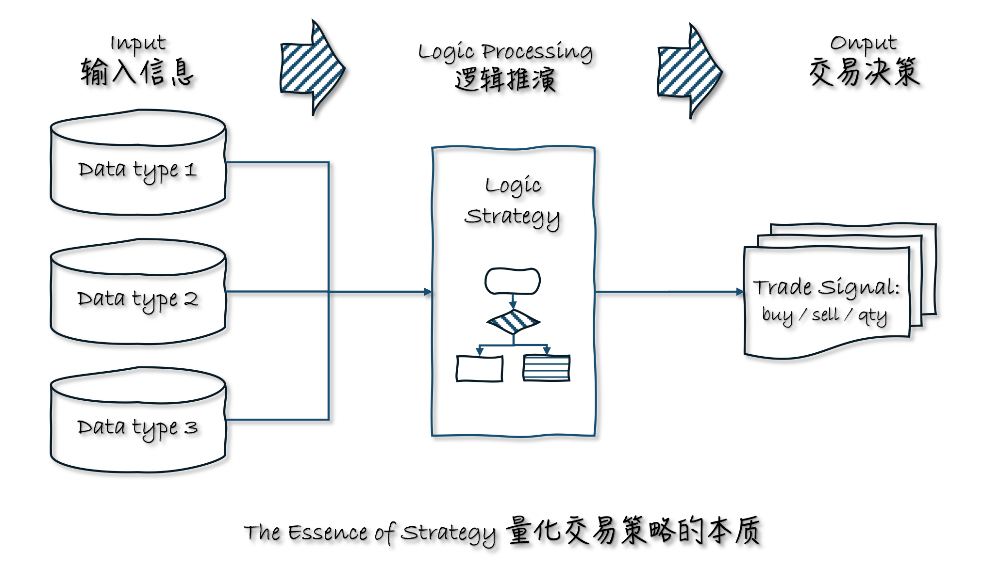
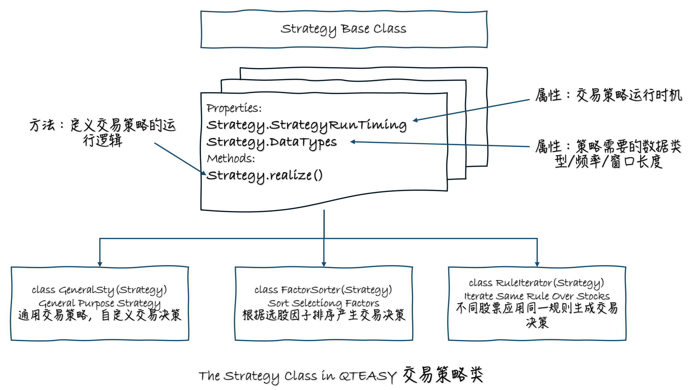
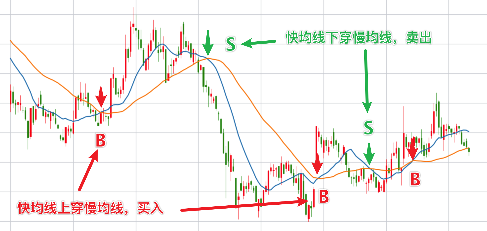
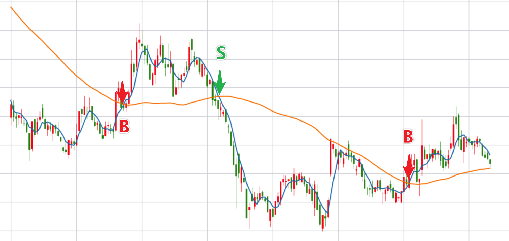
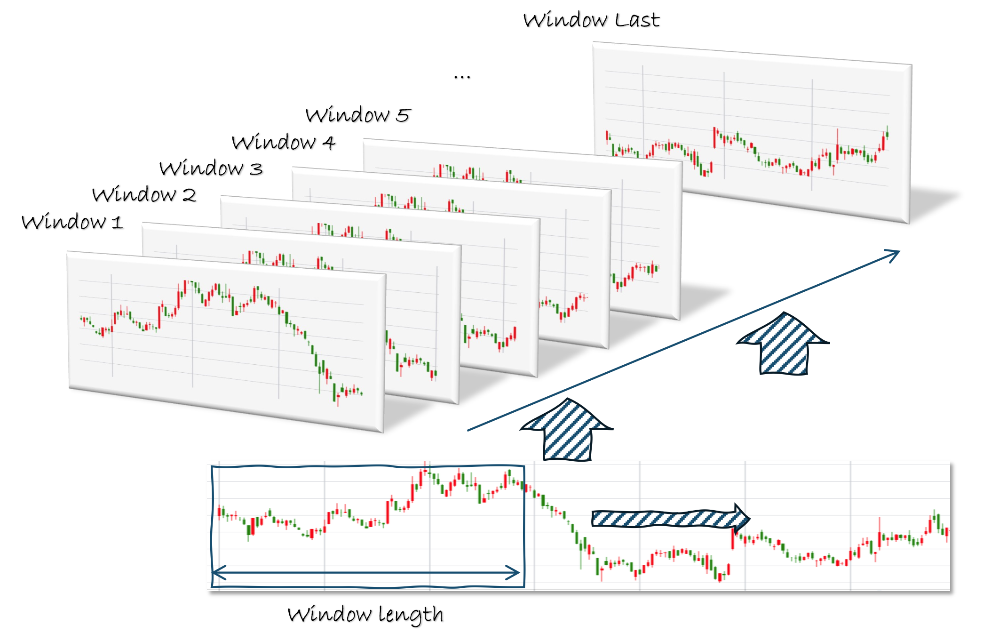
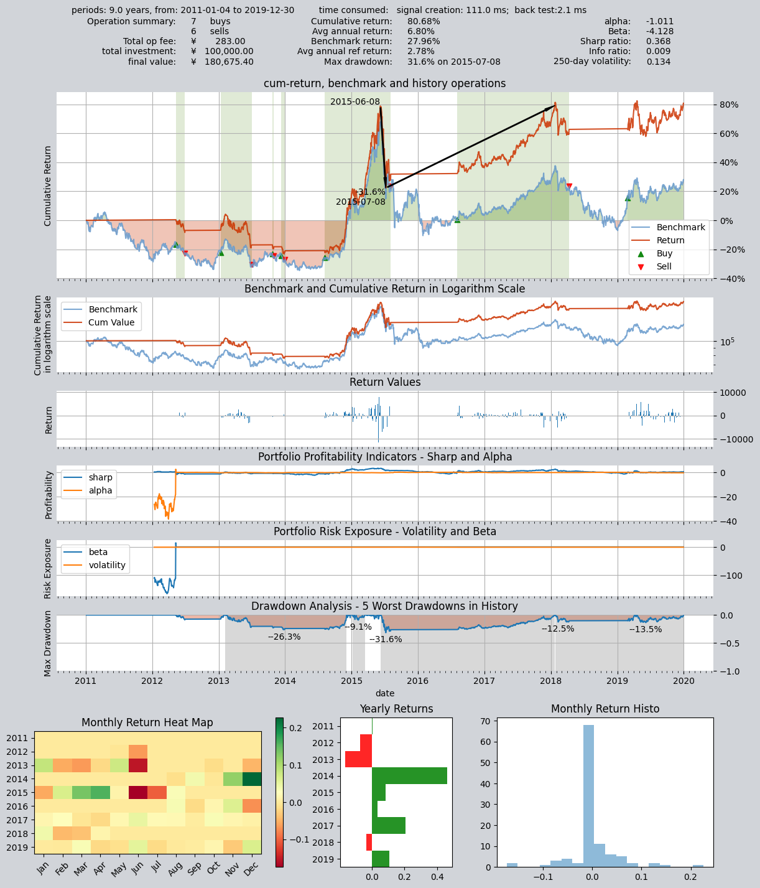

# 使用qteasy创建自定义交易策略

`qteasy`是一个完全本地化部署和运行的量化交易分析工具包，具备以下功能：

- 金融数据的获取、清洗、存储以及处理、可视化、使用
- 量化交易策略的创建，并提供大量内置基本交易策略
- 向量化的高速交易策略回测及交易结果评价
- 交易策略参数的优化以及评价
- 交易策略的部署、实盘运行

通过本系列教程，您将会通过一系列的实际示例，充分了解`qteasy`的主要功能以及使用方法。

## 开始前的准备工作

在开始本节教程前，请先确保您已经掌握了下面的内容：

- **安装、配置`qteasy`** —— [QTEASY教程1](1-get-started.md)
- **设置了一个本地数据源**，并已经将足够的历史数据下载到本地——[QTEASY教程2](2-get-data.md)
- **学会创建交易员对象，使用内置交易策略**，——[QTEASY教程3](3-start-first-strategy.md)
- **学会使用混合器，将多个简单策略混合成较为复杂的交易策略**——[QTEASY教程4](4-build-in-strategies.md)

在[QTEASY文档](https://qteasy.readthedocs.io)中，还能找到更多关于使用内置交易策略、创建自定义策略等等相关内容。对`qteasy`的基本使用方法还不熟悉的同学，可以移步那里查看更多详细说明。

## 本节的目标

`qteasy`的内核被设计为一个兼顾高速执行以及足够的灵活性的框架，理论上您可以实现您所设想的任何类型的交易策略。

同时，`qteasy`的回测框架也做了相当多的特殊设计，可以完全避免您无意中在交易策略中导入"未来函数"，确保您的交易策略在回测时完全基于过去的数据，同时也使用了很多预处理技术以及JIT技术对内核关键函数进行了编译，以实现不亚于C语言的运行速度。

不过，为了实现理论上无限可能的交易策略，仅仅使用内置交易策略以及策略混合就不一定够用了，一些特定的交易策略，或者一些特别复杂的交易策略是无法通过内置策略混合而成的，这就需要我们使用`qteasy`提供的`Strategy`基类，基于一定的规则创建一个自定义交易策略。

在本节中，我们将介绍`qteasy`的交易策略基类，通过几个具体的例子详细讲解如何基于这几个基类，创建一个只属于您自己的交易策略。为了循序渐进，我们先从一个较为简单的例子开始。

## 自定义策略的实现方法

在量化交易的工作流程中，一个交易策略实际上就是一个函数，这个函数以已知的信息作为输入，通过一系列逻辑推演，输出交易决策。不管什么技术流派，不管哪种交易风格，不管任何分析方法，交易策略的最根本的定义，就是如此。




比如：

- 技术分析派利用过去的股票价格（**输入数据**）计算技术指标（**逻辑推演**），进行买入/卖出操作（**交易决策**）
- 价值投资派利用上市公司的各项指标（**输入数据**），分析公司的成长潜力（**逻辑推演**），决定买入/卖出哪一支股票（**交易决策**）
- 宏观分析者即使不关心个股的价格，也需要参考热点新闻、市场景气（仍然是**输入数据**），分析市场的整体趋势（**逻辑推演**），决定是否入市（**交易决策**）
- 高频或超高频的套利交易，也需要根据短期内价格的实时变化（**输入数据**），分析套利空间大小（**逻辑推演**），以便迅速介入操作（**交易决策**）

上面的交易策略，如果以较高的频率，跟踪少数投资品种，就是所谓的“**择时交易策略**”，如果以较低的频率，跟踪大量的投资品种，就是所谓的“**选股策略**”。

总之，一切量化交易，都是一套**定期运行的逻辑推演，在每次运行时，提取当时的最新数据作为输入，输出一套交易决策**。如此反复运行，形成稳定的交易操作流水，概莫能外，这就是交易策略的抽象概念。

## 使用 `qteasy` 的 `Strategy` 策略类

`qteasy`的交易策略就是基于上面的概念定义的。`qteasy`定义的策略类，就是数据和交易逻辑的载体。用户通过继承`Strategy`类，定义自己的策略类，在这个类中定义策略需要的数据以及策略的实现逻辑，就可以创建一个自定义交易策略了。

因此，在`qteasy`的设计中，一个交易策略包括下面四个核心要素：

### 策略以及策略组的运行时机

- **策略的运行时机** —— 策略何时运行，以什么频率运行，这个要素是由策略组确定的。在将一个策略添加到`Operator`中的时候，可以指定参数`run_freq` `run_timing`,这两个参数共同决定了策略的运行时机

### 策略的可调参数和历史数据

`qteasy`中的交易策略还有一个特别的设计：可调参数。可调参数是指在策略运行过程中会被不断调整的参数，例如均线周期、选股排名的股票数量等等，这些参数直接影响了策略的表现，因此我们希望能够调整这些参数来找到最优的参数组合，从而使得策略表现最佳。`qteasy`提供了一个非常方便的接口来定义可调参数，用户可以在策略属性中定义任意数量的可调参数，并且为每个可调参数指定名称、取值范围、数据类型等等，这些定义好的可调参数会被自动传入策略实现函数中，用户可以直接使用这些参数来实现交易逻辑。

- **策略的可调参数** —— 策略中需要调整的参数，例如均线周期、选股排名的股票数量等等，这些参数直接影响了策略的表现，因此我们希望能够调整这些参数来找到最优的参数组合，从而使得策略表现最佳。`qteasy`提供了一个非常方便的接口`Parameters`来定义可调参数，用户可以在策略属性中定义任意数量的可调参数，并且为每个可调参数指定名称、取值范围、数据类型等等，这些定义好的可调参数会被自动传入策略实现函数中，用户可以直接使用这些参数来实现交易逻辑。

### 策略需要的数据以及运行逻辑

- **策略需要的数据** —— 策略需要的数据输入；例如，需要过去10天的日K线数据，还是过去一年的市盈率？策略所需的数据量可以由`Strategy.data_types` 属性完全自由定义，用户可以使用`qt.StgData()`对象定义任意类型的数据输入，数据的频率、数据的窗口长度都可以由策略属性完全自由定义，`qteasy`会根据这些定义自动打包数据送入策略的实现函数中
- **策略的运行逻辑** —— 策略的实现逻辑通过重写`Strategy.realize()`方法，用户可以自由定义如何使用输入数据，产生交易信号。

### 策略的输出信号

`qteasy`允许用户定义不同类型的交易信号：`PT` `PS` `VS`等等，用户可以根据自己的需要选择不同类型的交易信号来实现不同类型的交易策略。关于交易信号的含义，简述如下，要查看不同类型的交易信号的详细介绍，参见[交易信号](../manage_strategies/3.%20trade%20signals.md)。
  - **PT型信号** —— 代表仓位的百分比，输出为一个0到1之间的数值，保持持有多少比例的仓位，例如输出0.5代表持有50%的仓位，输出0代表不持有，输出1代表全仓持有；
  - **PS型信号** —— 代表交易百分比，输出为一个-1到1之间的数值，代表买入/卖出多少比例的仓位，例如输出0.5代表买入50%的仓位，输出-0.5代表卖出50%的仓位，输出0代表不操作；
  - **VS型信号** —— 代表交易的数量，输出的数字代表需要买入/卖出的股票数量，例如500表示买入500股，-300表示卖出300股

除了上面跟策略有关的信息以外，其余所有的工作`qteasy`都已经做好了，所有的交易数据都会根据策略属性被自动打包成一个`ndarray`数组，可以很方便地提取并使用；同一个交易策略，在实盘运行时会自动抽取交易数据，根据定义好的策略生成交易信号，在回测时也会自动提取历史数据，自动生成历史数据切片，不会形成未来函数。同时，所有交易数据都会

因此，在`qteasy`中的策略自定义非常简单：

- **`__init__()`** 在此方法中定义策略的所有参数，包括策略的名称、描述、以及最重要的可调参数、数据类型等等，这些参数会被`qteasy`自动识别，在策略运行可以直接使用
- **`realize()`** 在此方法中定义策略的运行逻辑：提取历史数据，根据数据生成交易信号



除了上面所说的策略属性以外，自定义策略同样拥有与内置交易策略相同的基本属性，例如可调参数等等，因为它们与内置交易策略相同，在这里就不赘述了。
## 三种不同的自定义策略基类

`qteasy`提供了三种不同的策略类，便于用户针对不同的情况创建自定义策略。

- **`GeneralStg`**: 通用交易策略类，用户需要在`realize()`方法中给出所有交易资产的交易决策信号
- **`FactorSorter`**: 因子选股类，用户只需要在`realize()`方法中定义出选股因子，便可以通过对象属性实现多种选股动作
- **`RuleIterator`**: 循环规则类，用户只要针对一支股票定义选股或择时规则，则同样的规则会被循环作用于所有的股票，而且不同股票可以定义不同的参数

三种交易策略基类的属性、方法都完全相同，区别仅在于`realize()`方法的定义。

下面，我们通过几个循序渐进的例子来了解如何创建自定义策略。

## 定义一个双均线择时交易策略

我们的第一个例子是最简单的双均线择时交易策略，这是一个最经典的择时交易策略。
这个均线择时策略有两个可调参数：
- FMA 快均线周期
- SMA 慢均线周期
策略根据过去一段时间的收盘价，计算上述两个周期产生的简单移动平均线，当两根均线发生交叉时产生交易信号：

- 当快均线自下而上穿过上边界，发出全仓买入信号
- 当快均线自上而下穿过上边界，发出全部卖出信号



这个策略的逻辑非常简单。那我们怎么定义这个策略呢？首先，我们需要决定使用哪一种交易策略基类。很多情况下，三种交易策略基类都可以用来生成同样的交易策略，只不过某些基类针对特定类型的策略提前做了一些定义，因而可以进一步简化策略的代码。这个策略是一个典型的择时策略，是针对不同投资品种应用同一规则的策略类型，因此，我们可以先用`RuleIterator`策略类来建立策略。在后面的例子中我们会陆续讲到另外两种策略类。

接下来，我们把这个策略的三大要素明确一下：

- **策略的运行时机** —— 为了简单，我们定义这个策略每天收盘时运行
- **策略需要的数据** ——为了计算两条均线，我们需要每次策略运行时的历史收盘价(`“close”`)，而且需要过去连续至少SMA天的历史数据，才足够用来计算SMA慢均线
- **策略的逻辑** ——提取收盘价后，首先计算两条均线，然后判断最近一天的均线是否有上穿/下穿。具体说来，就是比较昨天和今天两个移动平均价的相对关系，如果昨天SMA大于FMA，而今天SMA就小于FMA了，说明FMA从下方上穿了SMA，应该产生全仓买入信号，这个信号为1，如果情况正好相反，则输出全仓卖出信号-1，其他情况下则输出0，没有交易信号。

有了上面的准备，那我们来看看策略代码如何定义。一个最基本的策略代码，第一步就是继承策略基类（这里是`RuleIterator`），创建一个自定义类：
```python
from qteasy import RuleIterator
from qteasy import Parameter, StgData

class Cross_SMA(RuleIterator):

    # 策略的属性定义在__init__()方法中
    def __init__(self):
        super().__init__(
        )

    # 策略的具体实现代码写在策略的realize()函数中
    def realize(self):
        """策略的具体实现代码：
        """
        pass
```
好了，上面几行代码，就是我们第一个自定义交易策略的全部框架了，在这个框架中填充属性，补充逻辑，就能成为一个完整的交易策略。怎么做呢，我们首先定义这个策略的最基本属性——名称、描述、以及可调参数：

名称和描述都是策略的信息，在后续调用时方便了解策略的用途，咱们按照喜好定义即可，比较关键的属性是可调参数。

在我们这个策略中，我们希望快均线和慢均线的计算参数是可调的，因为这两个参数直接影响了快慢均线的具体位置，从而直接影响两条均线的交叉点，从而形成不同的买卖点，参见下面两张图，分别显示了同一只股票在同一段时间内不同速度均线的交叉情况，当均线的计算周期不同时，产生的买卖点也完全不同：


上图中均线周期分别为15天/40天，产生三次买入、两次卖出信号

上图中均线周期分别为5天/50天，产生两次买入、一次卖出信号

既然均线周期直接影响到策略的表现，因此我们自然希望找到最优的均线周期组合（参数组合），使得策略的表现最佳。为了达到这个目的，`qteasy`允许用户将这些参数定义为“可调参数”，并提供优化算法来寻找最优参数。对所有的内置交易策略来说，可调参数的数量和含义是定义好的，用户不能修改，但是在自定义策略这里，用户就有了很大的自由度，理论上讲，策略运行过程中用到的任何变量，都可以被定义为可调参数。

在这里，我们将快慢均线的周期定义为可调参数，在策略属性中进行以下定义

策略的可调参数使用Parameter对象定义，利用这个对象我们可以为每个可调参数指定名称、取值范围、数据类型等等，这些定义好的可调参数会被自动传入策略实现函数中，用户可以直接使用这些参数来实现交易逻辑。

```python
pars=[Parameter((10, 100), data_type='int', name='fast', value=30),
      Parameter((10, 100), data_type='int', name='slow', value=60)],  # 策略默认参数是快均线周期30， 慢均线周期60
```

### 定义策略需要的数据
策略需要的数据`StgData`对象确定，`qteasy`中的每个数据类型对象都可以根据一个唯一ID，数据频率以及资产类型确定。同时还可以指定数据窗口的长度。


定义好策略数据后，`qteasy`会自动将窗口内的数据打包送入策略`realize()`函数，如果在回测的过程中，所有历史数据会根据同样的规则分别打包成一系列的数据窗口，因此，不管是回测还是实盘运行，`realize()`函数接受到的历史数据格式完全相同，处理方式也完全相同，确保实盘和回测运行的一致性，也避免了回测中可能出现的未来函数：



`StgData`数据类型的定义如下，我们需要过去201天的每日收盘价，之所以需要201天的收盘价，是因为我们定义了可调参数的最大范围为200，为了计算周期为200的移动均线，需要201天的收盘价
```python
data_types=[StgType('close', asset_type='ANY', freq='d', window_length=201)]  # 策略基于收盘价计算均线，因此数据类型为'close'，历史数据的频率为日，历史数据窗口长度为201，每一次交易信号都是由它之前前201天的历史数据决定的
```
根据上面定义的数据类型，qteasy给该策略分配一个唯一的ID：`close_ANY_d`，使用这个ID就可以在策略实现函数中提取历史数据了，后面我们会介绍如何提取历史数据。

至此，自定义交易策略的所有重要属性就全部定义好了。接下来我们来定义策略的实现。

### 自定义交易策略的实现：`realize()`

在`realize()`方法中，我们需要做三件事情，我们一件件解决：

- 获取历史数据
- 获取可调参数
- 编写逻辑，产生输出

#### 获取历史数据和可调参数值：

前面已经提过，这个策略的可调参数就是均线的计算周期，因此，为了使用可调参数计算周期，我们需要取得可调参数的值以及具体的历史数据。

在realize()方法中获取可调参数和历史数据非常简单，分别使用`self.get_data()`和`self.get_pars()`即可获取。两个方法都可以一次获取多个数据或参数，获取的数据会被解包到一个`tuple`中，用户可以直接使用。

```python
def realize(self):
    """策略的具体实现代码
    """
    close = self.get_data('close_ANY_d')  # 通过数据ID获取数据：最近201天的收盘价
    f, s = self.get_pars('fast', 'slow')  # 读取快均线（fast）和慢均线（slow）的计算周期
```

到这里，实现策略逻辑所需要的元素都备齐了，接下来我们可以开始实现策略逻辑。

我们需要首先计算两组移动平均价，如果用户安装了`ta-lib`库，那么可以直接调用`ta-lib`的`SMA`函数计算移动平均价，如果没有安装，现在也没有太大关系，因为`qteasy`为用户提供了免`ta-lib`版本的`SMA`函数，（并不是所有的技术指标都有免`ta-lib`版本，详情参见[参考文档](../api/api_reference.rst)）可以直接引用计算。

```python
def realize(self, h, **kwargs):
    """策略的具体实现代码
    """
    ...
    from qteasy.tafuncs import sma
    # 使用qt.sma计算简单移动平均价
    s_ma = sma(close, s)
    f_ma = sma(close, f)
    # 为了考察两条均线的交叉, 计算两根均线昨日和今日的值，以便判断
    s_today, s_last = s_ma[-1], s_ma[-2]
    f_today, f_last = f_ma[-1], f_ma[-2]
```
计算出移动均线后，我们可以直接在`realize`方法中定义策略的输出，也就是交易决策。

对于`RuleIterator`类策略，不管我们的策略同时作用于多少支股票，我们都只需要定义一套规则即可，是为“规则迭代”，因此，我们只需要输出一个数字，代表交易决策即可。这个数字会被`qteasy`自动转化为不同的交易委托单。转化的规则由`Operator`对象的工作模式确定，关于这一点在前面的教程中已经介绍过了，这里不再赘述。

在本例子中，我们计划让交易策略输出的信号代表将多大比例的总资产投入到投资产品中，那么只需要在应当买入的当天，产生交易信号“1”，在应当卖出的当天，产生交易信号“-1”即可，如果不希望交易，则输出“0”：

```python
def realize(self, h, **kwargs):
    """策略的具体实现代码
    """
    ...
    if (f_last < s_last) and (f_today > s_today):  
        # 当快均线自下而上穿过上边界（即昨日快均线低于慢均线，而今天高于于慢均线），发出全仓买入信号
        return 1
    elif (f_last > s_last) and (f_today < s_today): 
        # 当快均线自上而下穿过上边界（即昨日快均线高于慢均线，而今天低于于慢均线），发出全部卖出信号
        return -1
    else:  # 其余情况不产生任何信号
        return 0
```

至此，这个交易策略就定义完成了！`qteasy`会完成所有背后的复杂工作，用户仅需要集中精力解决策略的数据和逻辑定义即可。完整代码如下（为节约篇幅，删除了所有注释）：

```python
from qteasy import RuleIterator, Parameter, StgData
from qteasy.tafuncs import sma
# 创建双均线交易策略类
class Cross_SMA_PS(RuleIterator):
    def __init__(self):
        super().__init__(
            name='CROSSLINE',  # 策略的名称
            description='快慢双均线择时策略',  # 策略的描述
            pars=[Parameter((10, 100), par_type='int', name='fast', value=30),
                  Parameter((10, 100), par_type='int', name='slow', value=60)],
            data_types=[StgData('close', freq='d', asset_type='ANY', window_length=201)],
        )

    def realize(self):
        
        close = self.get_data('close_ANY_d')  # 通过数据ID获取数据：最近201天的收盘价
        f, s = self.get_pars('fast', 'slow')  # 读取快均线（fast）和慢均线（slow）的计算周期
        
        # 使用qt.sma计算简单移动平均价
        s_ma = sma(close, s)
        f_ma = sma(close, f)
        # 为了考察两条均线的交叉, 计算两根均线昨日和今日的值，以便判断
        s_today, s_last = s_ma[-1], s_ma[-2]
        f_today, f_last = f_ma[-1], f_ma[-2]
        
        if (f_last < s_last) and (f_today > s_today):  
            # 当快均线自下而上穿过上边界（即昨日快均线低于慢均线，而今天高于于慢均线），发出全仓买入信号
            return 1
        elif (f_last > s_last) and (f_today < s_today): 
            # 当快均线自上而下穿过上边界（即昨日快均线高于慢均线，而今天低于于慢均线），发出全部卖出信号
            return -1
        else:  # 其余情况不产生任何信号
            return 0
```

接下来，我们就可以像使用任何内置交易策略一样使用这个自定义策略了。

我们需要创建一个新的`Operator`对象，并在创建对象的时候，将刚才创建的`Cross_SMA`策略加入到`Operator`中，同时指定这个策略的信号类型为`PS`型信号，这是告诉`Operator`使用`PS`规则来解析交易策略生成的信号：

```python
op = qt.Operator(strategies=[Cross_SMA_PS()], signal_type='PS')
```

让我们看看这个策略的回测结果。

### 第一个策略的回测结果

策略回测的参数设置与内置交易策略完全一样
```python
op = qt.Operator([Cross_SMA_PS()], signal_type='PS')

# 设置op的策略参数
op.set_parameter(0, 
                 par_values= (20, 60)  # 设置快慢均线周期分别为20天、60天
                )

# 设置基本回测参数，开始运行模拟交易回测
res = qt.run(op, 
             mode=1,  # 运行模式为回测模式
             asset_pool='000300.SH',  # 投资标的为000300.SH即沪深300指数
             invest_start='20110101',  # 回测开始日期
             invest_end='20191231', # 回测结束日期
             visual=True  # 生成交易回测结果分析图
            )
```
回测的结果如下：


下面，我们可以尝试一下修改策略的可调参数，再重新跑一遍回测，回测区间与前一次相同：

```python
op.set_parameter(0, 
                 par_values= (25, 166)  # 设置快慢均线周期分别为25天、166天
                )

# 设置基本回测参数，开始运行模拟交易回测，回测参数完全一样
res = qt.run(op, 
             mode=1,  # 运行模式为回测模式
             asset_pool='000300.SH',  # 投资标的为000300.SH即沪深300指数
             invest_start='20110101',  # 回测开始日期
             visual=True  # 生成交易回测结果分析图
            )
```
可以看到，改变参数后，策略的回测结果大为改观：要了解如何进行策略参数优化，请参考本教程的后续章节

```text
====================================
|                                  |
|         BACKTEST REPORT          |
|                                  |
====================================
qteasy running mode: 1 - History back testing
time consumption for operate signal creation: 111.0 ms
time consumption for operation back testing:  2.1 ms
investment starts on      2011-01-04 15:00:00
ends on                   2019-12-30 15:00:00
Total looped periods:     9.0 years.
-------------operation summary:------------
Only non-empty shares are displayed, call 
"loop_result["oper_count"]" for complete operation summary
          Sell Cnt Buy Cnt Total Long pct Short pct Empty pct
000300.SH    6        7      13   46.8%     -0.0%     53.2%  

Total operation fee:     ¥      283.00
total investment amount: ¥  100,000.00
final value:              ¥  180,675.40
Total return:                    80.68% 
Avg Yearly return:                6.80%
Skewness:                         -1.01
Kurtosis:                         17.32
Benchmark return:                27.96% 
Benchmark Yearly return:          2.78%

------strategy loop_results indicators------ 
alpha:                           -1.011
Beta:                            -4.128
Sharp ratio:                      0.368
Info ratio:                       0.009
250 day volatility:               0.134
Max drawdown:                    31.58% 
    peak / valley:        2015-06-08 / 2015-07-08
    recovered on:         2018-01-22

==================END OF REPORT===================
```



至此，我们已经实现了一个简单的自定义择时交易策略，那么另外两种策略类如何实现呢？我们在下一章节中再用更多的例子来说明。

## 本节回顾


在这一节中，我们了解了`qteasy`中对交易策略的抽象定义，了解了一个交易策略所包含的基本要素以及它们的定义方法，并且通过一个最简单的例子，实际创建了一个自定义双均线交易策略。

接下来，我们还将继续介绍自定义交易策略，因为相关的内容比较多，所以自定义交易策略相关的教程将占用三个章节。在下一章节中，我们将学习如何使用另外两种自定义策略基类（`FactorSorter`因子选股基类和`GeneralStg`通用策略基类）来创建交易策略。接着，我们将再用一个章节的篇幅，来介绍一个比较复杂的自定义交易策略，展示`qteasy`的灵活性，让我们下一节见！
