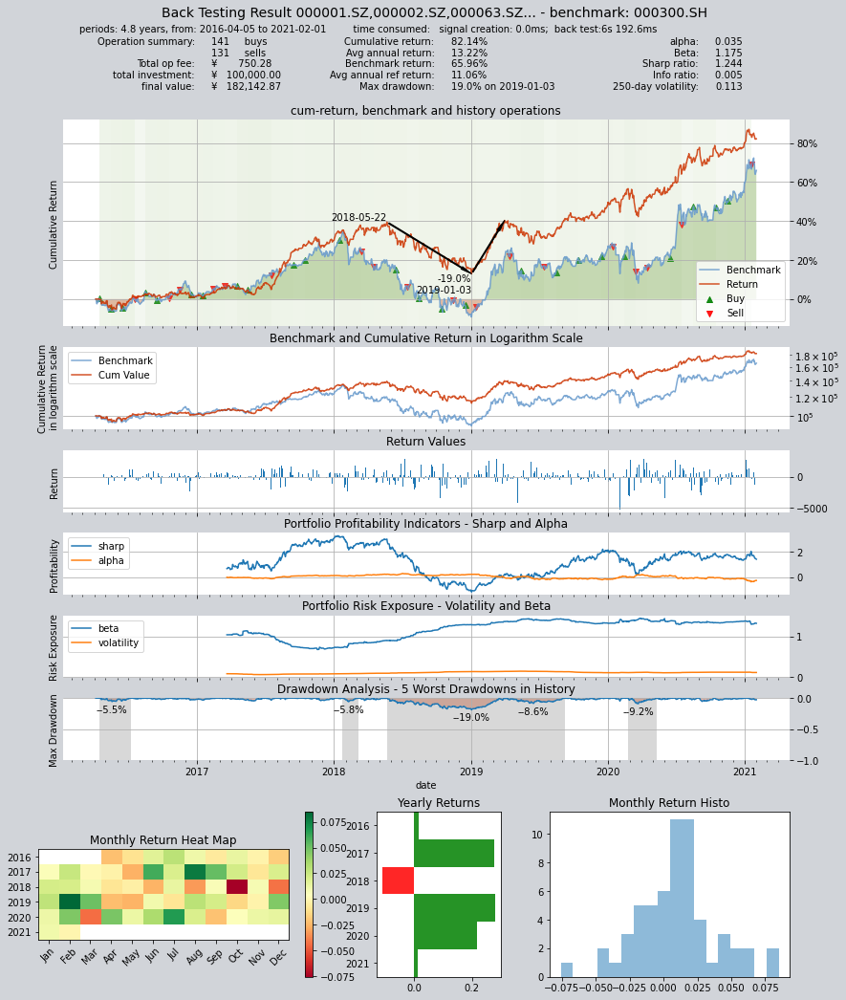
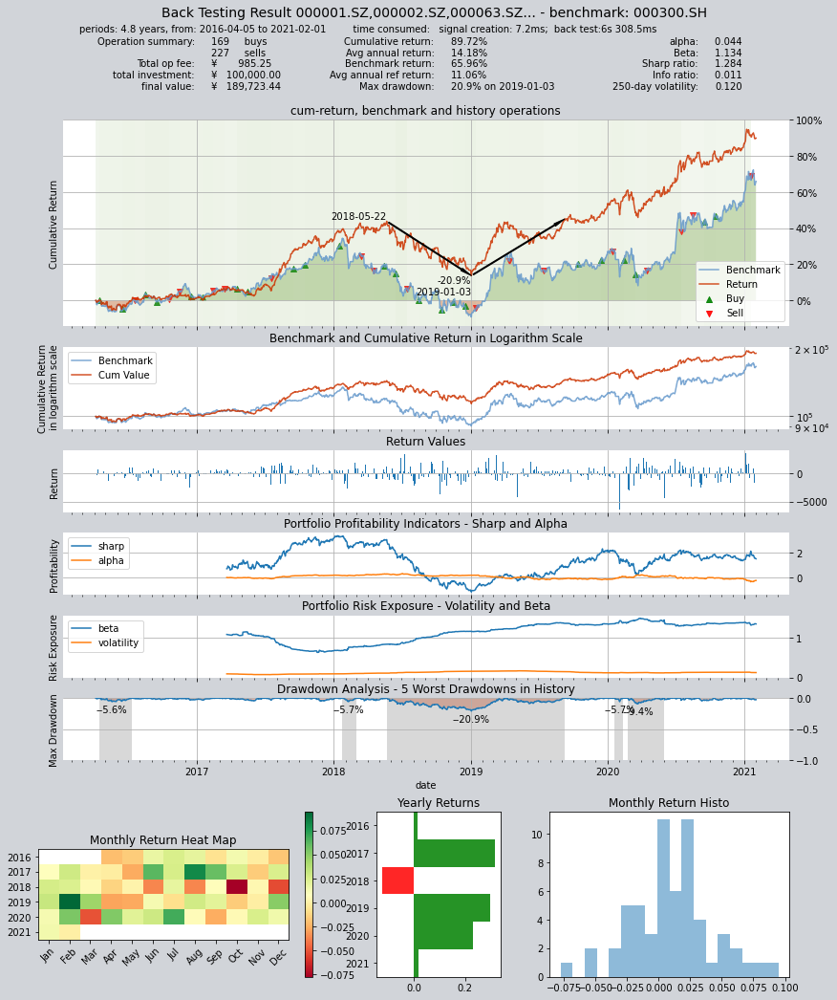

# 创建自定义因子选股交易策略

`qteasy`是一个完全本地化部署和运行的量化交易分析工具包，具备以下功能：

- 金融数据的获取、清洗、存储以及处理、可视化、使用
- 量化交易策略的创建，并提供大量内置基本交易策略
- 向量化的高速交易策略回测及交易结果评价
- 交易策略参数的优化以及评价
- 交易策略的部署、实盘运行

通过本系列教程，您将会通过一系列的实际示例，充分了解`qteasy`的主要功能以及使用方法。

## 开始前的准备工作

在开始本节教程前，请先确保您已经掌握了下面的内容：

- **安装、配置`qteasy`** —— [QTEASY教程1](1-get-started.md)
- **设置了一个本地数据源**，并已经将足够的历史数据下载到本地——[QTEASY教程2](2.0-get-data.md)
- **学会创建交易员对象，使用内置交易策略**，——[QTEASY教程3](3-start-first-strategy.md)
- **学会使用混合器，将多个简单策略混合成较为复杂的交易策略**——[QTEASY教程4](4-build-in-strategies.md)
- **了解如何自定义交易策略**——[QTEASY教程5](5-first-self-defined-strategy.md)

在[QTEASY文档](https://qteasy.readthedocs.io/zh-cn/latest/)中，还能找到更多关于使用内置交易策略、创建自定义策略等等相关内容。对`qteasy`的基本使用方法还不熟悉的同学，可以移步那里查看更多详细说明。

## 本节的目标

在本节中，我们将承接上一节开始的内容，介绍`qteasy`的交易策略基类，在介绍过一个最简单的择时交易策略类以后，我们将介绍如何使用`qteasy`提供的另外两种策略基类，创建一个多因子选股策略。

为了提供足够的使用便利性，`qteasy`的提供的各种策略基类本质上并无区别，只是为了减少用户编码工作量而提供的预处理形式，甚至可以将不同的交易策略基类理解成，为了特定交易策略设计的“语法糖”，因此，同一交易策略往往可以用多种不同的交易策略基类实现，因此，在本节中，我们将用两种不同的策略基类来实现一个Alpha选股交易策略。
## Alpha选股策略的选股思想

我们在这里讨论的Alpha选股策略是一个低频运行的选股策略，这个策略可以每周或者每月运行一次，每次选股时会遍历HS300指数的全部成分股，依照一定的标准将这300支股票进行优先级排序，从中选择出排位靠前的30支股票，等权持有，也就是说，每个月进行一次调仓换股，调仓时将排名靠后的股票卖掉，买入排名靠前的股票，并确保股票的持有份额相同。

Alpha选股策略的排名依据每一支股票的两个财务指标：`EV`（企业市场价值）以及`EBITDA`（息税折旧摊销前利润）来计算，对每一支股票计算EV与EBITDA的比值，当这个比值大于0的时候，说明该上市公司是盈利的（因为`EBITDA`为正）。这时，这个比值代表该公司每赚到一块钱利润，需要投入的企业总价值。自然，这个比值越低越好。例如，下面两家上市公司数据如下：

- A公司的`EBITDA`为一千万，而企业市场价值为一百亿，`EV`/`EBITDA`=1000.。说明该公司每一千元的市场价值可以挣到一元钱利润
- B公司的`EBITDA`同样为一千万，企业市场价值为一千亿，`EV`/`EBITDA`=10000，说明该公司每一万元的市场价值可以挣到一元钱利润

从常理分析，我们自然会觉得A公司比较好，因为靠着较少的公司市场价值，就挣到了同样的利润，这时我们认为A公司的排名比较靠前。

按照上面的规则，我们在每个月的最后一天，将HS300成分股的所有上市公司全部进行一次从小到大排名，剔除掉EV/EBITDA小于0的公司（盈利为负的公司当然应该剔除）以后，选择排名最靠前的30个公司持有，就是Alpha选股交易策略。

其实，类似于这样的指标排序选股策略，`qteasy`提供了一个内置交易策略可以直接实现。

使用`built_in_doc`来查看这个内置交易策略的文档：

```python
>>> import qteasy as qt
>>> qt.built_in_doc('finance', print_out=True)
```
输出如下：
```text
以股票过去一段时间内的财务指标的平均值作为选股因子选股
        基础选股策略。以股票的历史指标的平均值作为选股因子，因子排序参数可以作为策略参数传入
        改变策略数据类型，根据不同的历史数据选股，选股参数可以通过pars传入
    策略参数:
        - sort_ascending: enum, 是否升序排列因子
            - True: 优先选择因子最小的股票,
            - False, 优先选择因子最大的股票
        - weighting: enum, 股票仓位分配比例权重
            - even       :默认值, 所有被选中的股票都获得同样的权重
            - linear     :权重根据因子排序线性分配
            - distance   :股票的权重与他们的指标与最低之间的差值（距离）成比例
            - proportion :权重与股票的因子分值成正比
        - condition: enum, 股票筛选条件
            - any        :默认值，选择所有可用股票
            - greater    :筛选出因子大于ubound的股票
            - less       :筛选出因子小于lbound的股票
            - between    :筛选出因子介于lbound与ubound之间的股票
            - not_between:筛选出因子不在lbound与ubound之间的股票
        - lbound: float, 股票筛选下限值, 默认值np.-inf
        - ubound: float, 股票筛选上限值, 默认值np.inf
        - max_sel_count: float, 抽取的股票的数量(p>=1)或比例(p<1), 默认值: 0.5，表示选中50%的股票
    信号类型:
        PT型: 百分比持仓比例信号
    信号规则:
        使用data_types指定一种数据类型，将股票过去的datatypes数据取平均值，将该平均值作为选股因子进行选股
    策略属性缺省值:
        默认参数: (True, 'even', 'greater', 0, 0, 0.25)
        数据类型: eps 每股收益，单数据输入
        窗口长度: 270
        参数范围: [(True, False),
        ('even', 'linear', 'proportion'),
        ('any', 'greater', 'less', 'between', 'not_between'),
        (-np.inf, np.inf),
        (-np.inf, np.inf),
        (0, 1.)]
    策略不支持参考数据，不支持交易数据
```

不过这个内置交易策略仅支持以`qteasy`内置历史数据类型为选股因子，例如pe市盈率、profit利润等数据是`qteasy`的内置历史数据，可以直接引用。但如果是``qteasy``内置历史数据中找不到的选股因子，就不能直接使用内置交易策略了。`EV`/`EBITDA`这个指标是一个计算指标，因此，我们必须使用自定义交易策略。并在自定义策略中计算该指标。
## 计算选股指标

为了计算EV/EBITDA，我们必须至少先确认`qteasy`中是否已经提供了EV和EBITDA这两种历史数据：

我们可以使用API：`find_history_data()`来查看历史数据类型是否被`qteasy`支持，首先查找 `ebitda`

```python
>>> qt.find_history_data('ebitda')
```
输出如下：
```text
matched following history data, 
use "qt.get_history_data()" to load these historical data by its data_id:
------------------------------------------------------------------------
              freq asset      table                  desc
data_id                                                  
ebitda           q     E  financial  上市公司财务指标 - 息税折旧摊销前利润
========================================================================
['income_ebitda', 'ebitda']
```
`qteasy`中的数据类型需要通过`qteasy.DataType`来创建，`DataType`代表了一种历史数据类型，它代表了`qteasy`可以直接从历史数据中提取出的一类信息，通过数据类型对象，`qteasy`提供了统一的数据接口，使得用户可以非常容易地获取到各种历史数据信息，而不需要关心数据类型的存储方式、存储位置；同时，`qteasy`完全封装了所有数据类型的类型处理、频率转换、股票代码匹配等等非常繁杂的底层数据逻辑，使得用户可以完全不用关心每一种数据的存储方式、直接使用即可。

关于`qteasy`数据类型的更详细介绍，请参见[QTEASY文档](https://qteasy.readthedocs.io/zh-cn/latest/data_types.html)。

`qteasy`的`DataType`包含三个属性：

- name: 数据类型的名称，例如上面返回值中的`ebitda`
- freq: 数据的频率，例如上面返回值中的`q`，代表季度数据
- asset_type: 数据的资产类型，例如上面返回值中的`E`，代表股票数据

以上三个属性共同定义了一种唯一的数据类型。`qteasy`内置了大量的历史数据类型，用户可以直接使用这些数据类型来获取历史数据，而不需要自己去计算或者处理原始数据来得到这些数据类型。

从上面的返回值可以看出，在`qteasy`的内置历史数据类型中，EBITDA是一个标准的历史数据类型，这个数据来自于上市公司财务指标表 `financial`， 数据频率为 `q`（季度）：

接下来查看EV：

```python
>>> qt.find_history_data('ev')
```
输出如下：
```text
matched following history data, 
use "qt.get_history_data()" to load these historical data by its data_id:
------------------------------------------------------------------------
Empty DataFrame
Columns: [freq, asset_type, table_name, description]
Index: []
========================================================================
```
表明在 `qteasy` 的内置历史数据类型中，没有找到名字为EV的历史数据类型，此时可以使用参数`fuzzy=True`来确认。

```python
>>> qt.find_history_data('ev', fuzzy=True)
```
输出如下：
```text
matched following history data, 
use "qt.get_history_data()" to load these historical data by its data_id:
------------------------------------------------------------------------
                                    name  freq asset              table               column                desc
data_id                                                                                                         
sw_level                        sw_level  None   IDX  sw_industry_basic                level         申万行业分类 - 级别
sw_level|%                    sw_level|%  None   IDX  sw_industry_basic                level        申万行业分类筛选 - %
managers_lev                managers_lev     d     E       stk_managers                  lev       公司高管信息 - 岗位类别
total_revenue              total_revenue     q     E             income        total_revenue     上市公司利润表 - 营业总收入
revenue                          revenue     q     E             income              revenue      上市公司利润表 - 营业收入
withdra_biz_devfund  withdra_biz_devfund     q     E             income  withdra_biz_devfund  上市公司利润表 - 提取企业发展基金
express_revenue          express_revenue     q     E            express              revenue  上市公司业绩快报 - 营业收入(元)
total_revenue_ps        total_revenue_ps     q     E          financial     total_revenue_ps  上市公司财务指标 - 每股营业总收入
revenue_ps                    revenue_ps     q     E          financial           revenue_ps   上市公司财务指标 - 每股营业收入
========================================================================
```
上面这张表格列出了`qteasy`中已经定义好且可以直接使用的数据类型，请注意 `name` / `freq` / `asset` 这三列，分别代表了数据类型的名称、数据频率以及数据的资产类型，这三列共同定义了一个唯一的数据类型，用户可以通过`qteasy.DataType(name, freq, asset)`来创建一个数据类型对象来获取这种数据类型的历史数据。

尽管EV并不在 `qteasy` 的内置历史数据类型中，但我们可以看到有一些与EV相关的历史数据类型，例如总收入、每股收入等等，这些数据类型虽然与EV相关，但并不是我们需要的EV。


不过，我们知道EV可以通过下面的公式计算：

$$ EV = MV 总市值 + TL 总负债 - Cash 总现金 $$

而上面几个财务指标都是`qteasy`直接支持的：

- 总市值 - 数据类型： `total_mv`
- 总负债 - 数据类型： `total_liab`
- 总现金 - 数据类型： `c_cash_equ_end_period`

为此我们可以测试一下，查看这些数据类型的详细解释：

```python
>>> qt.find_history_data('total_mv', fuzzy=True)
```
得到如下输出：

```text
matched following history data, 
use "qt.get_history_data()" to load these historical data by its data_id:
------------------------------------------------------------------------
                      name freq asset             table    column                 desc
data_id                                                                               
ths_total_mv  ths_total_mv    d   IDX   ths_index_daily  total_mv  同花顺指数日K线 - 总市值 （万元）
sw_total_mv    sw_total_mv    d   IDX    sw_index_daily  total_mv   申万指数日K线 - 总市值 （万元）
total_mv          total_mv    d   IDX   index_indicator  total_mv    指数技术指标 - 当日总市值（元）
total_mv          total_mv    d     E   stock_indicator  total_mv    股票技术指标 - 总市值 （万元）
total_mv_2      total_mv_2    d     E  stock_indicator2  total_mv     股票技术指标 - 总市值(亿元)
========================================================================
```
这里需要注意的是`total_mv`这个数据类型有两个版本，一个是以万元为单位的，一个是以亿元为单位的，我们在计算EV/EBITDA的时候，严格说来单位并不重要，但是在其他情况下需要注意，我们这里将该数据乘以10000，以统一单位。

我们在这选择`DataType('total_mv', 'd', 'E')`，这个数据类型代表了上市公司每天的总市值，单位为万元。

```python
>>> qt.find_history_data('total_liab', fuzzy=True)
```
```text
matched following history data, 
use "qt.get_history_data()" to load these historical data by its data_id:
------------------------------------------------------------------------
                                    name freq asset    table               column                   desc
data_id                                                                                                 
total_liab                    total_liab    q     E  balance           total_liab       上市公司资产负债表 - 负债合计
total_liab_hldr_eqy  total_liab_hldr_eqy    q     E  balance  total_liab_hldr_eqy  上市公司资产负债表 - 负债及股东权益总计
========================================================================
```
在这里我们可以选择数据类型`DataType('total_liab', 'q', 'E')`，这个数据类型代表了上市公司每个季度末的总负债，单位为元。

```python
>>> qt.find_history_data('cash', fuzzy=True)
```
```text
matched following history data, 
use "qt.get_history_data()" to load these historical data by its data_id:
------------------------------------------------------------------------
                                                      name freq asset      table                        column                                desc
data_id                                                                                                                                           
cash_reser_cb                                cash_reser_cb    q     E    balance                 cash_reser_cb             上市公司资产负债表 - 现金及存放中央银行款项
ifc_cash_incr                                ifc_cash_incr    q     E   cashflow                 ifc_cash_incr            上市公司现金流量表 - 收取利息和手续费净增加额
oth_cash_pay_oper_act                oth_cash_pay_oper_act    q     E   cashflow         oth_cash_pay_oper_act          上市公司现金流量表 - 支付其他与经营活动有关的现金
st_cash_out_act                            st_cash_out_act    q     E   cashflow               st_cash_out_act              上市公司现金流量表 - 经营活动现金流出小计
n_cashflow_act                              n_cashflow_act    q     E   cashflow                n_cashflow_act           上市公司现金流量表 - 经营活动产生的现金流量净额
n_cashflow_inv_act                      n_cashflow_inv_act    q     E   cashflow            n_cashflow_inv_act           上市公司现金流量表 - 投资活动产生的现金流量净额
oth_cash_recp_ral_fnc_act        oth_cash_recp_ral_fnc_act    q     E   cashflow     oth_cash_recp_ral_fnc_act          上市公司现金流量表 - 收到其他与筹资活动有关的现金
stot_cash_in_fnc_act                  stot_cash_in_fnc_act    q     E   cashflow          stot_cash_in_fnc_act              上市公司现金流量表 - 筹资活动现金流入小计
free_cashflow                                free_cashflow    q     E   cashflow                 free_cashflow                上市公司现金流量表 - 企业自由现金流量
oth_cashpay_ral_fnc_act            oth_cashpay_ral_fnc_act    q     E   cashflow       oth_cashpay_ral_fnc_act          上市公司现金流量表 - 支付其他与筹资活动有关的现金
stot_cashout_fnc_act                  stot_cashout_fnc_act    q     E   cashflow          stot_cashout_fnc_act              上市公司现金流量表 - 筹资活动现金流出小计
n_cash_flows_fnc_act                  n_cash_flows_fnc_act    q     E   cashflow          n_cash_flows_fnc_act           上市公司现金流量表 - 筹资活动产生的现金流量净额
eff_fx_flu_cash                            eff_fx_flu_cash    q     E   cashflow               eff_fx_flu_cash              上市公司现金流量表 - 汇率变动对现金的影响
n_incr_cash_cash_equ                  n_incr_cash_cash_equ    q     E   cashflow          n_incr_cash_cash_equ            上市公司现金流量表 - 现金及现金等价物净增加额
c_cash_equ_beg_period                c_cash_equ_beg_period    q     E   cashflow         c_cash_equ_beg_period            上市公司现金流量表 - 期初现金及现金等价物余额
c_cash_equ_end_period                c_cash_equ_end_period    q     E   cashflow         c_cash_equ_end_period            上市公司现金流量表 - 期末现金及现金等价物余额
incl_cash_rec_saims                    incl_cash_rec_saims    q     E   cashflow           incl_cash_rec_saims     上市公司现金流量表 - 其中:子公司吸收少数股东投资收到的现金
im_net_cashflow_oper_act          im_net_cashflow_oper_act    q     E   cashflow      im_net_cashflow_oper_act      上市公司现金流量表 - 经营活动产生的现金流量净额(间接法)
im_n_incr_cash_equ                      im_n_incr_cash_equ    q     E   cashflow            im_n_incr_cash_equ       上市公司现金流量表 - 现金及现金等价物净增加额(间接法)
net_cash_rece_sec                        net_cash_rece_sec    q     E   cashflow             net_cash_rece_sec        上市公司现金流量表 - 代理买卖证券收到的现金净额(元)
cashflow_credit_impa_loss        cashflow_credit_impa_loss    q     E   cashflow              credit_impa_loss                  上市公司现金流量表 - 信用减值损失
end_bal_cash                                  end_bal_cash    q     E   cashflow                  end_bal_cash                 上市公司现金流量表 - 现金的期末余额
beg_bal_cash                                  beg_bal_cash    q     E   cashflow                  beg_bal_cash               上市公司现金流量表 - 减:现金的期初余额
end_bal_cash_equ                          end_bal_cash_equ    q     E   cashflow              end_bal_cash_equ            上市公司现金流量表 - 加:现金等价物的期末余额
beg_bal_cash_equ                          beg_bal_cash_equ    q     E   cashflow              beg_bal_cash_equ            上市公司现金流量表 - 减:现金等价物的期初余额
cash_ratio                                      cash_ratio    q     E  financial                    cash_ratio                   上市公司财务指标 - 保守速动比率
salescash_to_or                            salescash_to_or    q     E  financial               salescash_to_or       上市公司财务指标 - 销售商品提供劳务收到的现金/营业收入
cash_to_liqdebt                            cash_to_liqdebt    q     E  financial               cash_to_liqdebt                上市公司财务指标 - 货币资金／流动负债
cash_to_liqdebt_withinterest  cash_to_liqdebt_withinterest    q     E  financial  cash_to_liqdebt_withinterest              上市公司财务指标 - 货币资金／带息流动负债
q_salescash_to_or                        q_salescash_to_or    q     E  financial             q_salescash_to_or  上市公司财务指标 - 销售商品提供劳务收到的现金／营业收入(单季度)
cash_div_planned                          cash_div_planned    d     E   dividend                      cash_div                         预案-每股分红（税后）
cash_div_tax_planned                  cash_div_tax_planned    d     E   dividend                  cash_div_tax                         预案-每股分红（税前）
cash_div_approved                        cash_div_approved    d     E   dividend                      cash_div                     股东大会批准-每股分红（税后）
cash_div_tax_approved                cash_div_tax_approved    d     E   dividend                  cash_div_tax                     股东大会批准-每股分红（税前）
cash_div                                          cash_div    d     E   dividend                      cash_div                         实施-每股分红（税后）
cash_div_tax                                  cash_div_tax    d     E   dividend                  cash_div_tax                         实施-每股分红（税前）
========================================================================
```
与cash相关的数据类型有很多，但我们需要的现金及现金等价物总额是`DataType(c_cash_equ_end_period, 'q', 'E')`，这个数据类型代表了上市公司每个季度末的现金及现金等价物总额。

根据上面的信息，我们可以选择下面四种数据类型来计算EV：
- **`DataType('total_mv', 'd', 'E')`**，这个数据类型代表了上市公司每天的总市值，单位为万元。
- **`DataType('total_liab', 'q', 'E')`**，这个数据类型代表了上市公司每个季度末的总负债，单位为元。
- **`DataType('c_cash_equ_end_period', 'q', 'E')`**，这个数据类型代表了上市公司每个季度末的现金及现金等价物总额，单位为元。

我们可以测试一下，`qteasy`提供了一个非常方便的API：`get_history_data()`，可以直接获取到这些数据类型的历史数据：

```python
# 创建数据类型对象
dtypes = [DataType('total_mv', freq='d', asset_type='E'),
          DataType('total_liab', freq='q', asset_type='E'),
          DataType('c_cash_equ_end_period', freq='q', asset_type='E'),
          DataType('ebitda', freq='q', asset_type='E')]
# 获取沪深300指数成分股(这里只获取前20支股票）
shares = qt.filter_stock_codes(index='000300.SH', date='20220131')[:20] 
# 获取所有股票的总市值、总负债、总现金、EBITDA数据
dt = qt.get_history_data(data_types=dtypes, shares=shares, asset_type='any', freq='m')
# 随便选择一支股票，转化为DataFrame检查数据是否正确获取
one_share = shares[1]
df = dt[one_share]
# 计算EV/EBITDA选股因子
df['ev_to_ebitda'] = (df.total_mv + df.total_liab - df.c_cash_equ_end_period) / df.ebitda
print(df)
```
```text
                total_mv    total_liab  c_cash_equ_end_period        ebitda  \
2022-01-04  2.382041e+07           NaN                    NaN           NaN   
2022-01-05  2.461094e+07           NaN                    NaN           NaN   
2022-01-06  2.447143e+07           NaN                    NaN           NaN   
2022-01-07  2.544796e+07           NaN                    NaN           NaN   
2022-01-10  2.576185e+07           NaN                    NaN           NaN   
...                  ...           ...                    ...           ...   
2022-12-26  2.136561e+07  1.426656e+12           1.158051e+11  2.969171e+10   
2022-12-27  2.152844e+07  1.426656e+12           1.158051e+11  2.969171e+10   
2022-12-28  2.160986e+07  1.426656e+12           1.158051e+11  2.969171e+10   
2022-12-29  2.112137e+07  1.426656e+12           1.158051e+11  2.969171e+10   
2022-12-30  2.116789e+07  1.426656e+12           1.158051e+11  2.969171e+10   

            ev_to_ebitda  
2022-01-04           NaN  
2022-01-05           NaN  
2022-01-06           NaN  
2022-01-07           NaN  
2022-01-10           NaN  
...                  ...  
2022-12-26     51.344518  
2022-12-27     51.399358  
2022-12-28     51.426778  
2022-12-29     51.262258  
2022-12-30     51.277926  

[242 rows x 5 columns]
```

可以看到选股因子已经计算出来了，那么我们可以开始定义交易策略了。

## 用`FactorSorter`定义Alpha选股策略

针对这种定时选股类型的交易策略，`qteasy`提供了`FactorSorter`交易策略类，顾名思义，这个交易策略基类允许用户在策略的实现方法中计算一组选股因子，这样策略就可以自动将所有的股票按照选股因子的值排序，并选出排名靠前的股票。至于排序方法、筛选规则、股票持仓权重等都可以通过策略参数设置。

如果符合上面定义的交易策略，使用`FactorSorter`策略基类将会非常方便。

下面我们就来一步步定义看看，首先继承`FactorSorter`并定义一个类，在上一个章节中，我们在自定义策略的`__init__()`方法中定义名称、描述以及默认参数等信息，然而我们也可以忽略`__init__()`方法，仅仅在创建策略对象时传入参数等信息，这也是可以的，我们在这里就这样做：

```python
>>> class AlphaFac(qt.FactorSorter):  # 注意这里使用FactorSorter策略类
...     
...     def realize(self):
...         # 从历史数据编码中读取四种历史数据的最新数值
...         total_mv = self.get_data('total_mv_E_d')[-1]  # 总市值
...         total_liab = self.get_data('total_liab_E_q')[-1]  # 总负债
...         cash_equ = self.get_data('c_cash_equ_end_period_E_q')[-1]  # 现金及现金等价物总额
...         ebitda = self.get_data('ebitda_E_q')[-1]  # ebitda，息税折旧摊销前利润
...         # 选股因子为EV/EBIDTA，使用下面公式计算
...         factor = (total_mv * 10000 + total_liab - cash_equ) / ebitda
...         return factor  # 直接返回选股因子，策略就定义好了
```

与上一节相同，在`realize()`中需要做的第一步是获取历史数据。我们知道历史数据包括`total_mv, total_liab, c_cash_equ_end_period, ebitda`等四种，这四种历史数据将会被定义为四种`DataType`传入策略中。在策略中要使用这些历史数据，可以直接使用`self.get_data()`方法：

```python
# 从历史数据编码中读取四种历史数据的最新数值
total_mv = self.get_data('total_mv_E_d')[-1]  # 总市值
total_liab = self.get_data('total_liab_E_q'))[-1]  # 总负债
cash_equ = self.get_data('c_cash_equ_end_period_E_q'))[-1]  # 现金及现金等价物总额
ebitda = self.get_data('ebitda_E_q'))[-1]  # ebitda，息税折旧摊销前利润
        ...
```
`self.get_data()`方法通过每一种数据的数据ID来获取相应的历史数据。而每一种数据的ID默认ID就是它的名称、资产类型和频率的组合，例如：

- **`DataType('total_mv', 'd', 'E')`**，这个数据类型的ID为 `total_mv_E_d`。
- **`DataType('total_liab', 'q', 'E')`**，这个数据类型的ID为：`total_liab_E_d`。

qteasy会在交易策略开始运行之前准备好相应的交易数据，所有的交易数据都是一个numpy数组，这个数组的行数与投资池中的股票数量相同，的每一列对应着股票池中的一支股票；而行数与时间窗口的长度相同，每一行对应着时间窗口中的一个时间点，且以升序排列，最后一列代表交易当时能看到的最新的历史数据。

按照这个规则，如果要获取第I支股票在交易日当天能看到的最近的历史数据，只要访问array(-1， i)即可，通过下面的循环即可访问同一时间内的所有股票的数据：

```python
total_mv = self.get_data('total_mv_E_d')
# 循环访问每一支股票的total_mv
for i in len(total_mv[-1]):
    print(f'total mv of share {i}: {total_mv[-1, i]}')
```

不过，使用for-loop来访问数据的效率比较低，您最好在策略中尽量使用向量化的操作以节省时间。

做好上述准备后，计算选股因子就非常方便了，而且，由于我们使用了`FactorSorter`策略基类，计算好选股因子后，直接返回选股因子就可以了，`qteasy`会处理剩下的选股操作：

```python
# 选股因子为EV/EBIDTA，使用下面公式计算
factor = (total_mv * 10000 + total_liab - cash_equ) / ebitda
return factor  # 直接返回选股因子，策略就定义好了
```


至此，仅仅用六行代码，一个自定义Alpha选股交易策略就定义好了。是不是非常简单？

好了，我们来看看回测的结果如何？

## 交易策略的回测结果

由于我们忽略了策略类的`__init__()`方法，因此在实例化策略对象时，必须输入完整的策略参数：
```python
>>> from qteasy import Parameter, StgData

>>> alpha = AlphaFac(
...     pars=[],
...     name='AlphaSel',
...     description='本策略每隔1个月定时触发计算SHSE.000300成份股的过去的EV/EBITDA并选取EV/EBITDA大于0的股票',
...     data_types=[DataType('total_mv', freq='d', asset_type='E'),
...                 DataType('total_liab', freq='q', asset_type='E'),
...                 DataType('c_cash_equ_end_period', freq='q', asset_type='E'), 
...                 DataType('ebitda', freq='q', asset_type='E')],
...     window_length=[20, 20, 10, 10],  # 现在可以为每一种数据类型设置不同的窗口长度
...     max_sel_count=30,  # 设置选股数量，最多选出30个股票
...     condition='greater',  # 设置筛选条件，仅筛选因子大于ubound的股票
...     ubound=0.0,  # 设置筛选条件，仅筛选因子大于0的股票
...     weighting='even',  # 设置股票权重，所有选中的股票平均分配权重
...     sort_ascending=True,  # 设置排序方式，因子从小到大排序选择头30名
... )  
```
然后创建一个`Operator`对象，因为我们希望控制持仓比例，因此最好使用“PT”信号类型：
```python
>>> op = qt.Operator(alpha, signal_type='PT')
>>> res = op.run(mode=1,
...        asset_type='E',
...        asset_pool=shares,
...        PT_buy_threshold=0.0,
...        PT_sell_threshold=0.0,
...        trade_batch_size=100,
...        sell_batch_size=1)
```
回测结果如下：

         ====================================
         |                                  |
         |       BACK TESTING RESULT        |
         |                                  |
         ====================================
    
    qteasy running mode: 1 - History back testing
    time consumption for operate signal creation: 9.4ms
    time consumption for operation back looping:  5s 831.0ms
    
    investment starts on      2016-04-05 00:00:00
    ends on                   2021-02-01 00:00:00
    Total looped periods:     4.8 years.
    
    -------------operation summary:------------
    Only non-empty shares are displayed, call 
    "loop_result["oper_count"]" for complete operation summary
    
              Sell Cnt Buy Cnt Total Long pct Short pct Empty pct
    000301.SZ    1        2       3   10.3%      0.0%     89.7%  
    000786.SZ    2        3       5   27.5%      0.0%     72.5%  
    000895.SZ    1        0       1   62.6%      0.0%     37.4%  
    002001.SZ    2        2       4   55.8%      0.0%     44.2%  
    002007.SZ    3        1       4   68.3%      0.0%     31.7%  
    002027.SZ    2        9      11   41.3%      0.0%     58.7%  
    002032.SZ    2        0       2    5.9%      0.0%     94.1%  
    002044.SZ    1        1       2    1.8%      0.0%     98.2%  
    002049.SZ    1        1       2    5.1%      0.0%     94.9%  
    002050.SZ    4        5       9   13.8%      0.0%     86.2%  
    ...            ...     ...   ...      ...       ...       ...
    603517.SH    1        1       2    1.8%      0.0%     98.2%  
    603806.SH    6        3       9   39.8%      0.0%     60.2%  
    603899.SH    1        1       2   31.0%      0.0%     69.0%  
    000408.SZ    3        6       9   35.5%      0.0%     64.5%  
    002648.SZ    1        1       2    5.2%      0.0%     94.8%  
    002920.SZ    1        1       2    1.7%      0.0%     98.3%  
    300223.SZ    1        1       2    5.2%      0.0%     94.8%  
    600219.SH    1        1       2    6.1%      0.0%     93.9%  
    603185.SH    1        1       2    5.2%      0.0%     94.8%  
    688005.SH    1        1       2    5.2%      0.0%     94.8%   
    
    Total operation fee:     ¥      928.22
    total investment amount: ¥  100,000.00
    final value:              ¥  159,072.14
    Total return:                    59.07% 
    Avg Yearly return:               10.09%
    Skewness:                         -0.28
    Kurtosis:                          3.29
    Benchmark return:                65.96% 
    Benchmark Yearly return:         11.06%
    
    ------strategy loop_results indicators------ 
    alpha:                           -0.012
    Beta:                             1.310
    Sharp ratio:                      1.191
    Info ratio:                      -0.010
    250 day volatility:               0.105
    Max drawdown:                    20.49% 
        peak / valley:        2018-05-22 / 2019-01-03
        recovered on:         2019-12-26
    
    ===========END OF REPORT=============
    



回测结果显示这个策略并不能非常有效地跑赢沪深300指数，不过总体来说回撤较小一些，风险较低，是一个不错的保底策略。

但策略的表现并不是我们讨论的重点，下面我们再来看一看，如果不用`FactorSorter`基类，如何定义同样的Alpha选股策略。
## 用`GeneralStg`定义一个Alpha选股策略
前面已经提过了两种策略基类：

- **`RuleIterator`**： 用户只需要针对一支股票定义选股规则，`qteasy`便能将同样的规则应用到股票池中所有的恶股票上，而且还能针对不同股票设置不同的可调参数
- **`FactorSorter`**：用户只需要定义一个选股因子，`qteasy`便能根据选股因子自动排序后选择最优的股票持有，并卖掉不够格的股票。

而`GeneralStg`是`qteasy`提供的一个最基本的策略基类，它没有提供任何“语法糖”功能，帮助用户降低编码工作量，但是正是因为没有语法糖，它才是一个真正的“万能”策略类，可以用来更加自由地创建交易策略。

上面的Alpha选股交易策略可以很容易用`FactorSorter`实现，但为了了解`GeneralStg`，我们来看看如何使用它来创建相同的策略：

直接把完整的代码贴出来：

```python

class AlphaPT(qt.GeneralStg):
    
    def realize(self, h, r=None, t=None, pars=None):

        # 从历史数据编码中读取四种历史数据的最新数值
        total_mv = h[:, -1, 0]  # 总市值
        total_liab = h[:, -1, 1]  # 总负债
        cash_equ = h[:, -1, 2]  # 现金及现金等价物总额
        ebitda = h[:, -1, 3]  # ebitda，息税折旧摊销前利润
        
        # 选股因子为EV/EBIDTA，使用下面公式计算
        factors = (total_mv + total_liab - cash_equ) / ebitda
        # 处理交易信号，将所有小于0的因子变为NaN
        factors = np.where(factors < 0, np.nan, factors)
        # 选出数值最小的30个股票的序号
        arg_partitioned = factors.argpartition(30)
        selected = arg_partitioned[:30]  # 被选中的30个股票的序号
        not_selected = arg_partitioned[30:]  # 未被选中的其他股票的序号（包括因子为NaN的股票）
        
        # 开始生成PT交易信号
        signal = np.zeros_like(factors)
        # 所有被选中的股票的持仓目标被设置为0.03，表示持有3.3%
        signal[selected] = 0.0333
        # 其余未选中的所有股票持仓目标在PT信号模式下被设置为0，代表目标仓位为0
        signal[not_selected] = 0  
        
        return signal    
```
将上面的代码与`FactorSorter`的代码对比，可以发现，`GeneralStg`的代码在计算出选股因子以后，还多出了因子处理的工作：

- 剔除小于零的因子
- 排序并选出剩余因子中最小的30个
- 选出股票后将他们的持仓比例设置为3.3%

事实上，上面的这些工作都是`FactorSorter`提供的“语法糖”，在这里我们必须手动实现而已。值得注意的是，我在上面例子中使用的排序等代码都是从`FactorSorter`中直接提取出来的高度优化的`numpy`代码，它们的运行速度是很快的，比一般用户能写出的代码快很多，因此，只要条件允许，用户都应该尽量利用这些语法糖，只有在不得已的情况下才自己编写排序代码。

大家可以研究一下上面的代码，但是请注意，如果使用`GeneralStg`策略类，策略的输出应该是股票的目标仓位，而不是选股因子。

下面看看回测结果：

## 回测结果：

使用同样的数据进行回测：
```python
alpha = AlphaPT(pars=(),
                 par_count=0,
                 par_types=[],
                 par_range=[],
                 name='AlphaSel',
                 description='本策略每隔1个月定时触发计算SHSE.000300成份股的过去的EV/EBITDA并选取EV/EBITDA大于0的股票',
                 data_types='total_mv, total_liab, c_cash_equ_end_period, ebitda',
                 run_freq='m',
                 data_freq='d',
                 window_length=100)
op = qt.Operator(alpha, signal_type='PT')
res = op.run(mode=1,
             asset_type='E',
             asset_pool=shares,
             PT_buy_threshold=0.00,  # 如果设置PBT=0.00，PST=0.03，最终收益会达到30万元
             PT_sell_threshold=0.00,
             trade_batch_size=100,
             sell_batch_size=1,
             trade_log=True
            )
```
回测结果如下：
    
         ====================================
         |                                  |
         |       BACK TESTING RESULT        |
         |                                  |
         ====================================
    
    qteasy running mode: 1 - History back testing
    time consumption for operate signal creation: 7.2ms
    time consumption for operation back looping:  6s 308.5ms
    
    investment starts on      2016-04-05 00:00:00
    ends on                   2021-02-01 00:00:00
    Total looped periods:     4.8 years.
    
    -------------operation summary:------------
    Only non-empty shares are displayed, call 
    "loop_result["oper_count"]" for complete operation summary
    
              Sell Cnt Buy Cnt Total Long pct Short pct Empty pct
    000301.SZ    1        1       2   10.3%      0.0%     89.7%  
    000786.SZ    2        3       5   27.5%      0.0%     72.5%  
    000895.SZ    1        1       2   68.7%      0.0%     31.3%  
    002001.SZ    2        2       4   57.5%      0.0%     42.5%  
    002007.SZ    0        1       1   68.3%      0.0%     31.7%  
    002027.SZ    6        7      13   41.3%      0.0%     58.7%  
    002032.SZ    3        1       4    7.5%      0.0%     92.5%  
    002044.SZ    1        1       2    1.8%      0.0%     98.2%  
    002049.SZ    1        1       2    5.1%      0.0%     94.9%  
    002050.SZ    4        4       8   13.8%      0.0%     86.2%  
    ...            ...     ...   ...      ...       ...       ...
    603806.SH    5        3       8   62.1%      0.0%     37.9%  
    603899.SH    2        3       5   36.3%      0.0%     63.7%  
    000408.SZ    3        5       8   35.5%      0.0%     64.5%  
    002648.SZ    1        1       2    5.2%      0.0%     94.8%  
    002920.SZ    1        1       2    5.1%      0.0%     94.9%  
    300223.SZ    1        2       3    5.2%      0.0%     94.8%  
    300496.SZ    1        1       2   10.5%      0.0%     89.5%  
    600219.SH    1        1       2    6.1%      0.0%     93.9%  
    603185.SH    1        1       2    5.2%      0.0%     94.8%  
    688005.SH    1        2       3    5.2%      0.0%     94.8%   
    
    Total operation fee:     ¥      985.25
    total investment amount: ¥  100,000.00
    final value:              ¥  189,723.44
    Total return:                    89.72% 
    Avg Yearly return:               14.18%
    Skewness:                         -0.41
    Kurtosis:                          2.87
    Benchmark return:                65.96% 
    Benchmark Yearly return:         11.06%
    
    ------strategy loop_results indicators------ 
    alpha:                            0.044
    Beta:                             1.134
    Sharp ratio:                      1.284
    Info ratio:                       0.011
    250 day volatility:               0.120
    Max drawdown:                    20.95% 
        peak / valley:        2018-05-22 / 2019-01-03
        recovered on:         2019-09-09
    
    ===========END OF REPORT=============
    


两种交易策略的输出结果基本相同
## 本节回顾

通过本节的学习，我们了解了`qteasy`提供的另外两种交易策略基类`FactorSorter`和`GeneralStg`的使用方法，实际创建了两个交易策略，虽然使用不同的基类，但是创建出了基本相同的Alpha选股交易策略。

在下一个章节中，我们仍然将继续介绍自定义交易策略，但是会用一个更加复杂的例子来演示自定义交易策略的使用方法。敬请期待！
