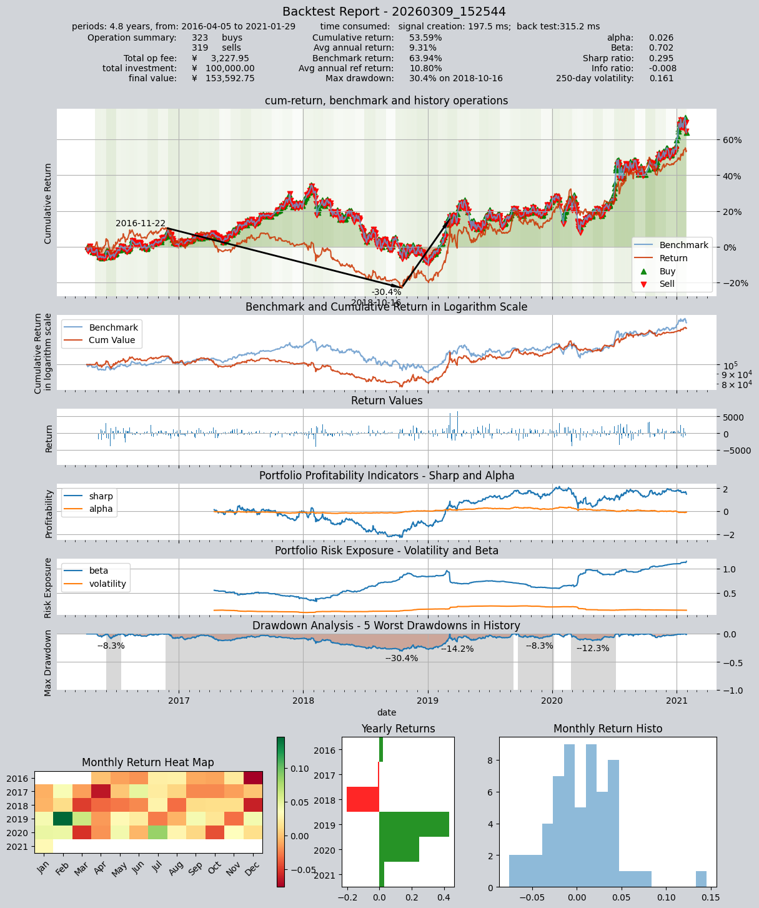

# 使用交易策略类，创建更复杂的自定义策略

`qteasy`是一个完全本地化部署和运行的量化交易分析工具包，[Github地址在这里](https://github.com/shepherdpp/qteasy)，并且可以[通过pip安装](https://blog.csdn.net/Shepherdppz/article/details/136075222?spm=1001.2014.3001.5501)：

```bash
$ pip install qteasy -U
```

`qteasy`具备以下功能：


- 金融数据的获取、清洗、存储以及处理、可视化、使用
- 量化交易策略的创建，并提供大量内置基本交易策略
- 向量化的高速交易策略回测及交易结果评价
- 交易策略参数的优化以及评价
- 交易策略的部署、实盘运行

通过本系列教程，您将会通过一系列的实际示例，充分了解`qteasy`的主要功能以及使用方法。

## 开始前的准备工作

在开始本节教程前，请先确保您已经掌握了下面的内容：

- **安装、配置`qteasy`** —— [QTEASY教程1](1-get-started.md)
- **设置了一个本地数据源**，并已经将足够的历史数据下载到本地——[QTEASY教程2](2-get-data.md)
- **学会创建交易员对象，使用内置交易策略**，——[QTEASY教程3](3-start-first-strategy.md)
- **学会使用混合器，将多个简单策略混合成较为复杂的交易策略**——[QTEASY教程4](4-build-in-strategies.md)
- **了解如何自定义交易策略**——[QTEASY教程5](5-first-self-defined-strategy.md)[QTEASY教程6](6-more-self-defined-strategies.md)

在[QTEASY文档](https://qteasy.readthedocs.io/zh/latest/)中，还能找到更多关于使用内置交易策略、创建自定义策略等等相关内容。对`qteasy`的基本使用方法还不熟悉的同学，可以移步那里查看更多详细说明。

`qteasy`的内核被设计为一个兼顾高速执行以及足够的灵活性的框架，理论上您可以实现您所设想的任何类型的交易策略。

同时，`qteasy`的回测框架也做了相当多的特殊设计，可以完全避免您无意中在交易策略中导入"未来函数"，确保您的交易策略在回测时完全基于过去的数据，同时也使用了很多预处理技术以及JIT技术对内核关键函数进行了编译，以实现不亚于C语言的运行速度。

不过，为了实现理论上无限可能的交易策略，仅仅使用内置交易策略以及策略混合就不一定够用了，一些特定的交易策略，或者一些特别复杂的交易策略是无法通过内置策略混合而成的，这就需要我们使用`qteasy`提供的`Strategy`基类，基于一定的规则创建一个自定义交易策略了。
## 本节的目标
                        
在本节中，我们将介绍`qteasy`的交易策略基类，通过一个具体的例子详细讲解如何基于这几个基类，创建一个只属于您自己的交易策略。为了说明

## 继承Strategy类，创建一个复杂的多因子选股策略


在这个例子中，我们使用

```python
import qteasy as qt
import numpy as np

def market_value_weighted(stock_return, mv, mv_cat, bp_cat, mv_target, bp_target):
    """ 根据mv_target和bp_target计算市值加权收益率，在策略中调用此函数计算加权收益率

    """
    sel = (mv_cat == mv_target) & (bp_cat == bp_target)
    mv_total = np.nansum(mv[sel])
    mv_weight = mv / mv_total
    return_total = np.nansum(stock_return[sel] * mv_weight[sel])
    return return_total


class MultiFactors(qt.FactorSorter):
    """ 开始定义交易策略
    """
    def __init__(self, pars: tuple = (0.5, 0.3, 0.7)):
    	"""交易策略的初始化参数"""
        super().__init__(
                pars=pars,  
                par_count=3,  # 策略的可调参数有三个
                par_types=['float', 'float', 'float'],  # 参数1:大小市值分类界限，参数2:小/中bp分界线，参数3，中/大bp分界线
                par_range=[(0.01, 0.99), (0.01, 0.49), (0.50, 0.99)],
                name='MultiFactor',
                description='根据Fama-French三因子回归模型估算HS300成分股的alpha值选股',
                strategy_run_timing='close',  # 在周期结束（收盘）时运行
                strategy_run_freq='m',  # 每月执行一次选股（每周或每天都可以）
                strategy_data_types='pb, total_mv, close',  # 执行选股需要用到的股票数据
                data_freq='d',  # 数据频率（包括股票数据和参考数据）
                window_length=20,  # 回测时的视窗长度为20天
                use_latest_data_cycle=True,  # 设置使用最新的数据
                reference_data_types='close-000300.SH',  # 选股需要用到市场收益率，使用沪深300指数的收盘价计算，因此设置HS300指数的收盘价作为参考数据传入
                max_sel_count=10,  # 最多选出10支股票
                sort_ascending=True,  # 选择因子最小的股票
                condition='less',  # 仅选择因子小于某个值的股票
                lbound=0,  # 仅选择因子小于0的股票
                ubound=0,  # 仅选择因子小于0的股票 
        )
    
    def realize(self, h, **kwargs):
		""" 策略的选股逻辑在realize()函数中定义
		"""
        size_gate_percentile, bp_small_percentile, bp_large_percentile = self.pars
        # 读取投资组合的数据PB和total_MV的最新值
        pb = h[:, -1, 0]  # 当前所有股票的PB值
        mv = h[:, -1, 1]  # 当前所有股票的市值
        pre_close = h[:, -2, 2]  # 当前所有股票的前收盘价
        close = h[:, -1, 2]  # 当前所有股票的最新收盘价

        # 读取参考数据(r)
        market_pre_close = r[-2, 0]  # HS300的昨收价
        market_close = r[-1, 0]  # HS300的收盘价

        # 计算账面市值比，为pb的倒数
        bp = pb ** -1
        # 计算市值的50%的分位点,用于后面的分类
        size_gate = np.nanquantile(mv, size_gate_percentile)
        # 计算账面市值比的30%和70%分位点,用于后面的分类
        bm_30_gate = np.nanquantile(bp, bp_small_percentile)
        bm_70_gate = np.nanquantile(bp, bp_large_percentile)
        # 计算每只股票的当日收益率
        stock_return = pre_close / close - 1

        # 根据每只股票的账面市值比和市值，给它们分配bp分类和mv分类
        # 市值小于size_gate的cat为1，否则为2
        mv_cat = np.ones_like(mv)
        mv_cat += (mv > size_gate).astype('float')
        # bp小于30%的cat为1，30%～70%之间为2，大于70%为3
        bp_cat = np.ones_like(bp)
        bp_cat += (bp > bm_30_gate).astype('float')
        bp_cat += (bp > bm_70_gate).astype('float')

        # 获取小市值组合的市值加权组合收益率
        smb_s = (market_value_weighted(stock_return, mv, mv_cat, bp_cat, 1, 1) +
                 market_value_weighted(stock_return, mv, mv_cat, bp_cat, 1, 2) +
                 market_value_weighted(stock_return, mv, mv_cat, bp_cat, 1, 3)) / 3
        # 获取大市值组合的市值加权组合收益率
        smb_b = (market_value_weighted(stock_return, mv, mv_cat, bp_cat, 2, 1) +
                 market_value_weighted(stock_return, mv, mv_cat, bp_cat, 2, 2) +
                 market_value_weighted(stock_return, mv, mv_cat, bp_cat, 2, 3)) / 3
        smb = smb_s - smb_b
        # 获取大账面市值比组合的市值加权组合收益率
        hml_b = (market_value_weighted(stock_return, mv, mv_cat, bp_cat, 1, 3) +
                 market_value_weighted(stock_return, mv, mv_cat, bp_cat, 2, 3)) / 2
        # 获取小账面市值比组合的市值加权组合收益率
        hml_s = (market_value_weighted(stock_return, mv, mv_cat, bp_cat, 1, 1) +
                 market_value_weighted(stock_return, mv, mv_cat, bp_cat, 2, 1)) / 2
        hml = hml_b - hml_s

        # 计算市场收益率
        market_return = market_pre_close / market_close - 1

        coff_pool = []
        # 对每只股票进行回归获取其alpha值
        for rtn in stock_return:
            x = np.array([[market_return, smb, hml, 1.0]])
            y = np.array([[rtn]])
            # OLS估计系数
            coff = np.linalg.lstsq(x, y)[0][3][0]
            coff_pool.append(coff)

        # 以alpha值为股票组合的选股因子执行选股
        factors = np.array(coff_pool)

        return factors
```
### 策略和回测参数配置，并开始回测
定义好上面的策略之后，就可以开始进行回测了，我们需要在`qteasy`中创建一个交易员对象，操作前面创建的策略：
```python
shares = qt.filter_stock_codes(index='000300.SH', date='20190501')  # 选择股票池，包括2019年5月以来所有沪深300指数成分股
# 设置回测的运行参数
qt.config(mode=1,  # mode=1表示回测模式
       invest_start='20160405',  # 回测开始日期
       invest_end='20210201',  # 回测结束日期
       asset_type='E',  # 投资品种为股票
       asset_pool=shares,  # shares包含同期沪深300指数的成份股
       trade_batch_size=100,  # 买入批量为100股
       sell_batch_size=1,  # 卖出批量为整数股
       trade_log=True,  # 生成交易记录
       )
       
#  开始策略的回测

alpha = MultiFactors()  # 生成一个交易策略的实例，名为alpha
op = qt.Operator(alpha, signal_type='PT')  # 生成交易员对象，操作alpha策略，交易信号的类型为‘PT'，意思是生成的信号代表持仓比例，例如1代表100%持有股票，0.35表示持有股票占资产的35%
op.op_type = 'stepwise'  # 运行模式为步进模式
op.set_blender('1.0*s0', "close")  # 交易策略混合方式，只有一个策略，不需要混合
op.run()  # 开始运行
```
运行结果如下：

```bash
         ====================================
         |                                  |
         |       BACK TESTING RESULT        |
         |                                  |
         ====================================
    
    qteasy running mode: 1 - History back testing
    time consumption for operate signal creation: 0.0 ms
    time consumption for operation back looping:  8 sec 335.0 ms
    
    investment starts on      2016-04-05 00:00:00
    ends on                   2021-02-01 00:00:00
    Total looped periods:     4.8 years.
    
    -------------operation summary:------------
    Only non-empty shares are displayed, call 
    "loop_result["oper_count"]" for complete operation summary
    
              Sell Cnt Buy Cnt Total Long pct Short pct Empty pct
    000063.SZ    2        2      4     3.4%      0.0%     96.6%  
    000100.SZ    3        3      6     5.2%      0.0%     94.8%  
    000157.SZ    1        1      2     1.8%      0.0%     98.2%  
    000333.SZ    2        2      4     3.4%      0.0%     96.6%  
    000338.SZ    1        1      2     1.7%      0.0%     98.3%  
    000413.SZ    2        2      4     3.6%      0.0%     96.4%  
    000596.SZ    1        1      2     1.8%      0.0%     98.2%  
    000625.SZ    3        3      6     5.3%      0.0%     94.7%  
    000629.SZ    1        1      2     1.7%      0.0%     98.3%  
    000651.SZ    1        1      2     1.7%      0.0%     98.3%  
    ...            ...     ...   ...      ...       ...       ...
    688005.SH    1        2      3     3.3%      0.0%     96.7%  
    000733.SZ    1        1      2     1.8%      0.0%     98.2%  
    002180.SZ    1        1      2     1.7%      0.0%     98.3%  
    600039.SH    1        1      2     1.7%      0.0%     98.3%  
    600803.SH    1        1      2     1.7%      0.0%     98.3%  
    601615.SH    1        1      2     1.8%      0.0%     98.2%  
    000983.SZ    2        2      4     3.3%      0.0%     96.7%  
    600732.SH    3        4      7     6.7%      0.0%     93.3%  
    600754.SH    1        1      2     1.8%      0.0%     98.2%  
    601699.SH    1        1      2     1.7%      0.0%     98.3%   
    
    Total operation fee:     ¥    7,063.30
    total investment amount: ¥  100,000.00
    final value:              ¥  584,928.02
    Total return:                   484.93% 
    Avg Yearly return:               44.15%
    Skewness:                         -0.14
    Kurtosis:                          2.77
    Benchmark return:                65.96% 
    Benchmark Yearly return:         11.06%
    
    ------strategy loop_results indicators------ 
    alpha:                            0.428
    Beta:                             0.371
    Sharp ratio:                      1.376
    Info ratio:                       0.076
    250 day volatility:               0.287
    Max drawdown:                    35.84% 
        peak / valley:        2018-06-12 / 2019-01-02
        recovered on:         2019-03-05
    
    ===========END OF REPORT=============
```
    


## 本节回顾

在本节中，我们通过一个具体的例子，详细讲解了如何基于`qteasy`的交易策略基类，创建一个只属于您自己的交易策略。通过这个例子，您可以看到，`qteasy`的交易策略基类提供了足够的灵活性，可以实现您所设想的任何类型的交易策略。

从下一个教程开始，我们将会介绍qteasy交易策略优化方法，通过多种优化算法，找到最优的交易策略参数，以及评价交易策略的性能。
