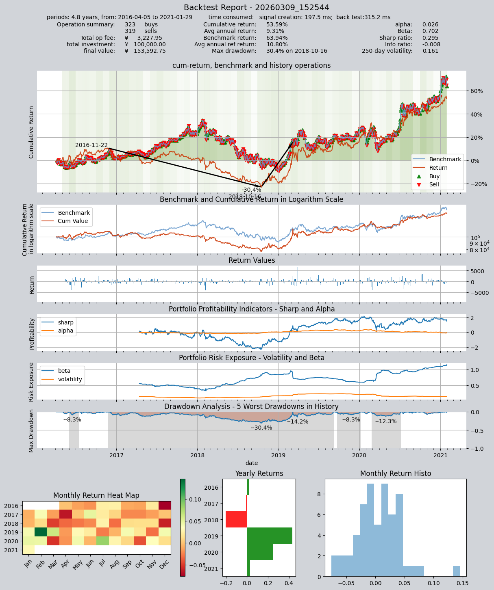

# 使用交易策略类，创建更复杂的自定义策略

`qteasy`是一个完全本地化部署和运行的量化交易分析工具包，[Github地址在这里](https://github.com/shepherdpp/qteasy)，并且可以[通过pip安装](https://blog.csdn.net/Shepherdppz/article/details/136075222?spm=1001.2014.3001.5501)：

```bash
$ pip install qteasy -U
```

`qteasy`具备以下功能：


- 金融数据的获取、清洗、存储以及处理、可视化、使用
- 量化交易策略的创建，并提供大量内置基本交易策略
- 向量化的高速交易策略回测及交易结果评价
- 交易策略参数的优化以及评价
- 交易策略的部署、实盘运行

通过本系列教程，您将会通过一系列的实际示例，充分了解`qteasy`的主要功能以及使用方法。

## 开始前的准备工作

在开始本节教程前，请先确保您已经掌握了下面的内容：

- **安装、配置`qteasy`** —— [QTEASY教程1](1-get-started.md)
- **设置了一个本地数据源**，并已经将足够的历史数据下载到本地——[QTEASY教程2](2-get-data.md)
- **学会创建交易员对象，使用内置交易策略**，——[QTEASY教程3](3-start-first-strategy.md)
- **学会使用混合器，将多个简单策略混合成较为复杂的交易策略**——[QTEASY教程4](4-build-in-strategies.md)
- **了解如何自定义交易策略**——[QTEASY教程5](5-first-self-defined-strategy.md)[QTEASY教程6](6-more-self-defined-strategies.md)

在[QTEASY文档](https://qteasy.readthedocs.io/zh-cn/latest/)中，还能找到更多关于使用内置交易策略、创建自定义策略等等相关内容。对`qteasy`的基本使用方法还不熟悉的同学，可以移步那里查看更多详细说明。

`qteasy`的内核被设计为一个兼顾高速执行以及足够的灵活性的框架，理论上您可以实现您所设想的任何类型的交易策略。

同时，`qteasy`的回测框架也做了相当多的特殊设计，可以完全避免您无意中在交易策略中导入"未来函数"，确保您的交易策略在回测时完全基于过去的数据，同时也使用了很多预处理技术以及JIT技术对内核关键函数进行了编译，以实现不亚于C语言的运行速度。

不过，为了实现理论上无限可能的交易策略，仅仅使用内置交易策略以及策略混合就不一定够用了，一些特定的交易策略，或者一些特别复杂的交易策略是无法通过内置策略混合而成的，这就需要我们使用`qteasy`提供的`Strategy`基类，基于一定的规则创建一个自定义交易策略了。

## 本节的目标
                        
在本节中，我们将介绍`qteasy`的交易策略基类，通过一个具体的例子详细讲解如何基于这几个基类，创建一个只属于您自己的交易策略。为了说明

## 继承Strategy类，创建一个复杂的多因子选股策略


在这个例子中，我们使用

```python
>>> import qteasy as qt
>>> import numpy as np
>>> from qteasy import Parameter, StgData

>>> def market_value_weighted(stock_return, mv, mv_cat, bp_cat, mv_target, bp_target):
...    """ 根据mv_target和bp_target计算市值加权收益率，在策略中调用此函数计算加权收益率  """
...    sel = (mv_cat == mv_target) & (bp_cat == bp_target)
...    mv_total = np.nansum(mv[sel])
...    mv_weight = mv / mv_total
...    return_total = np.nansum(stock_return[sel] * mv_weight[sel])
...     return return_total

>>> class MultiFactors(qt.FactorSorter):
...     """ 开始定义交易策略 """
... 
...     def __init__(self, par_values: tuple = (0.5, 0.3, 0.7)):
...         """交易策略的初始化参数"""
...         super().__init__(
...                 pars=[Parameter((0.01, 0.99), par_type='float', name='size_gate', value=0.5),  # 参数1:大小市值分类界限
...                       Parameter((0.01, 0.49), par_type='float', name='bp_s_gate', value=0.3),  # 参数2:小/中bp分界线
...                       Parameter((0.50, 0.99), par_type='float', name='bp_l_gate', value=0.7)],  # 参数3，中/大bp分界线
...                 name='MultiFactor',
...                 description='根据Fama-French三因子回归模型估算HS300成分股的alpha值选股',
...                 data_types=[StgData('pb', freq='d', asset_type='E', window_length=20, use_latest_data_cycle=True),  # 执行选股需要用到的股票数据
...                              StgData('total_mv', freq='d', asset_type='E', window_length=20, use_latest_data_cycle=True),
...                              StgData('close', freq='d', asset_type='E', window_length=20, use_latest_data_cycle=True),
...                              StgData('close-000300.SH', freq='d', asset_type='IDX', window_length=20, use_latest_data_cycle=True)],  # 选股需要用到市场收益率，使用沪深300指数的收盘价计算
...                 max_sel_count=10,  # 最多选出10支股票
...                 sort_ascending=True,  # 选择因子最小的股票
...                 condition='less',  # 仅选择因子小于某个值的股票
...                 lbound=0,  # 仅选择因子小于0的股票
...                 ubound=0,  # 仅选择因子小于0的股票 
...         )
... 
...     def realize(self):
...         """ 策略的选股逻辑在realize()函数中定义
...         """
... 
...         size_gate_percentile, bp_small_percentile, bp_large_percentile = self.get_pars('size_gate', 'bp_s_gate', 'bp_l_gate')
...         # 读取投资组合的数据PB和total_MV的最新值
...         pb = self.get_data('pb_E_d')[-1]  # 当前所有股票的PB值
...         mv = self.get_data('total_mv_E_d')[-1]  # 当前所有股票的市值
...         pre_close = self.get_data('close_E_d')[-1]  # 当前所有股票的前收盘价
...         close = self.get_data('close_E_d')[-2]  # 当前所有股票的最新收盘价
...         
...         market_pre_close = self.get_data('close-000300.SH_IDX_d')[-2]  # HS300的昨收价
...         market_close = self.get_data('close-000300.SH_IDX_d')[-1]  # HS300的收盘价
...     
...         # 计算账面市值比，为pb的倒数
...         bp = pb ** -1
...         # 计算市值的50%的分位点,用于后面的分类
...         size_gate = np.nanquantile(mv, size_gate_percentile)
...         # 计算账面市值比的30%和70%分位点,用于后面的分类
...         bm_30_gate = np.nanquantile(bp, bp_small_percentile)
...         bm_70_gate = np.nanquantile(bp, bp_large_percentile)
...         # 计算每只股票的当日收益率
...         stock_return = pre_close / close - 1
...     
...         # 根据每只股票的账面市值比和市值，给它们分配bp分类和mv分类
...         # 市值小于size_gate的cat为1，否则为2
...         mv_cat = np.ones_like(mv)
...         mv_cat += (mv > size_gate).astype('float')
...         # bp小于30%的cat为1，30%～70%之间为2，大于70%为3
...         bp_cat = np.ones_like(bp)
...         bp_cat += (bp > bm_30_gate).astype('float')
...         bp_cat += (bp > bm_70_gate).astype('float')
...     
...         # 获取小市值组合的市值加权组合收益率
...         smb_s = (market_value_weighted(stock_return, mv, mv_cat, bp_cat, 1, 1) +
...                  market_value_weighted(stock_return, mv, mv_cat, bp_cat, 1, 2) +
...                  market_value_weighted(stock_return, mv, mv_cat, bp_cat, 1, 3)) / 3
...         # 获取大市值组合的市值加权组合收益率
...         smb_b = (market_value_weighted(stock_return, mv, mv_cat, bp_cat, 2, 1) +
...                  market_value_weighted(stock_return, mv, mv_cat, bp_cat, 2, 2) +
...                  market_value_weighted(stock_return, mv, mv_cat, bp_cat, 2, 3)) / 3
...         smb = smb_s - smb_b
...         # 获取大账面市值比组合的市值加权组合收益率
...         hml_b = (market_value_weighted(stock_return, mv, mv_cat, bp_cat, 1, 3) +
...                  market_value_weighted(stock_return, mv, mv_cat, bp_cat, 2, 3)) / 2
...         # 获取小账面市值比组合的市值加权组合收益率
...         hml_s = (market_value_weighted(stock_return, mv, mv_cat, bp_cat, 1, 1) +
...                  market_value_weighted(stock_return, mv, mv_cat, bp_cat, 2, 1)) / 2
...         hml = hml_b - hml_s
...     
...         # 计算市场收益率
...         market_return = market_pre_close / market_close - 1
...     
...         coff_pool = []
...         # 对每只股票进行回归获取其alpha值
...         for rtn in stock_return:
...             x = np.array([[market_return, smb, hml, 1.0]])
...             y = np.array([[rtn]])
...             # OLS估计系数
...             coff = np.linalg.lstsq(x, y)[0][3][0]
...             coff_pool.append(coff)
...     
...         # 以alpha值为股票组合的选股因子执行选股
...         factors = np.array(coff_pool)
...         
...         return factors
```
### 策略和回测参数配置，并开始回测
定义好上面的策略之后，就可以开始进行回测了，我们需要在`qteasy`中创建一个交易员对象，操作前面创建的策略：
```python
shares = qt.filter_stock_codes(index='000300.SH', date='20190501')  # 选择股票池，包括2019年5月以来所有沪深300指数成分股
       
#  开始策略的回测

alpha = MultiFactors()  # 生成一个交易策略的实例，名为alpha
op = qt.Operator(alpha, signal_type='PT', 
                 run_timing='close',  # 在周期结束（收盘）时运行
                 run_freq='M',  # 每月执行一次选股（每周或每天都可以）
                )  # 生成交易员对象，操作alpha策略，交易信号的类型为‘PT'，意思是生成的信号代表持仓比例，例如1代表100%持有股票，0.35表示持有股票占资产的35%
# 设置回测参数，并开始回测
>>> qt.run(op=op,
...        mode=1,  # 回测模式
...        invest_start='20160405',  # 回测开始日期
...        invest_end='20210201',  # 回测结束日期
...        asset_type='E',  # 投资品种为股票
...        asset_pool=shares,  # shares包含同期沪深300指数的成份股
...        trade_batch_size=100,  # 买入批量为100股
...        sell_batch_size=1,  # 卖出批量为整数股
...        trade_log=True,  # 生成交易记录
...       )  # 开始运行
```
运行结果如下：

```text
====================================
|                                  |
|         BACKTEST REPORT          |
|                                  |
====================================
qteasy running mode: 1 - History back testing
time consumption for operate signal creation: 197.5 ms
time consumption for operation back testing:  315.2 ms
investment starts on      2016-04-05 15:00:00
ends on                   2021-01-29 15:00:00
Total looped periods:     4.8 years.
-------------operation summary:------------
Only non-empty shares are displayed, call 
"loop_result["oper_count"]" for complete operation summary
          Sell Cnt Buy Cnt Total Long pct Short pct Empty pct
000413.SZ    3        3       6    5.4%     -0.0%     94.6%  
000415.SZ    1        1       2    2.0%     -0.0%     98.0%  
000625.SZ    1        1       2    2.0%     -0.0%     98.0%  
000629.SZ    1        1       2    1.5%     -0.0%     98.5%  
000656.SZ    1        1       2    1.8%     -0.0%     98.2%  
000723.SZ    5        5      10    8.2%     -0.0%     91.8%  
000725.SZ    1        1       2    1.9%     -0.0%     98.1%  
000728.SZ    1        1       2    1.9%     -0.0%     98.1%  
000783.SZ    1        1       2    1.8%     -0.0%     98.2%  
000898.SZ    4        4       8    7.1%     -0.0%     92.9%  
...            ...     ...   ...      ...       ...       ...
001965.SZ    1        1       2    1.9%     -0.0%     98.1%  
300418.SZ    2        2       4    3.8%     -0.0%     96.2%  
300442.SZ    1        1       2    1.8%     -0.0%     98.2%  
600026.SH    1        1       2    1.8%     -0.0%     98.2%  
000975.SZ    1        1       2    1.8%     -0.0%     98.2%  
300394.SZ    1        1       2    1.5%     -0.0%     98.5%  
600160.SH    3        3       6    5.0%     -0.0%     95.0%  
601127.SH    1        2       3    1.7%     -0.0%     98.3%  
601058.SH    2        2       4    3.6%     -0.0%     96.4%  
302132.SZ    1        1       2    2.0%     -0.0%     98.0%  

Total operation fee:     ¥    3,227.95
total investment amount: ¥  100,000.00
final value:              ¥  153,592.75
Total return:                    53.59% 
Avg Yearly return:                9.31%
Skewness:                          0.09
Kurtosis:                          6.81
Benchmark return:                63.94% 
Benchmark Yearly return:         10.80%

------strategy loop_results indicators------ 
alpha:                            0.026
Beta:                             0.702
Sharp ratio:                      0.295
Info ratio:                      -0.008
250 day volatility:               0.161
Max drawdown:                    30.41% 
    peak / valley:        2016-11-22 / 2018-10-16
    recovered on:         2019-03-07

trade log is stored in: /Users/jackie/Projects/qteasy_logs/trade_log_none_20260309_152544.csv
trade summary is stored in: /Users/jackie/Projects/qteasy_logs/trade_summary_none_20260309_152544.csv
value curve (complete values) is stored in: /Users/jackie/Projects/qteasy_logs/value_curve_none_20260309_152544.csv

==================END OF REPORT===================
```
    


## 本节回顾

在本节中，我们通过一个具体的例子，详细讲解了如何基于`qteasy`的交易策略基类，创建一个只属于您自己的交易策略。通过这个例子，您可以看到，`qteasy`的交易策略基类提供了足够的灵活性，可以实现您所设想的任何类型的交易策略。

从下一个教程开始，我们将会介绍`qteasy`交易策略优化方法，通过多种优化算法，找到最优的交易策略参数，以及评价交易策略的性能。
