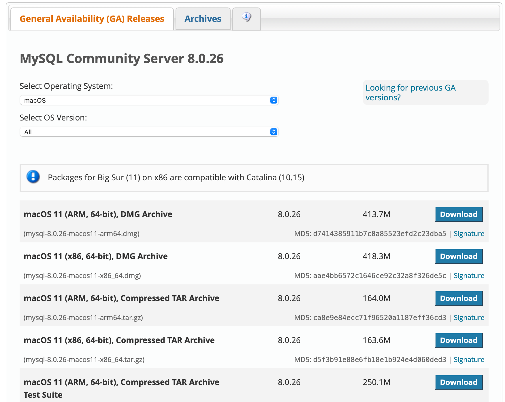
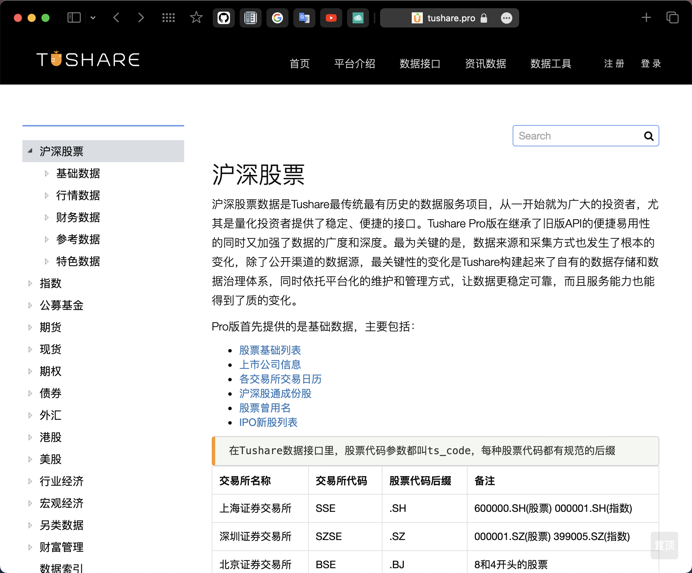
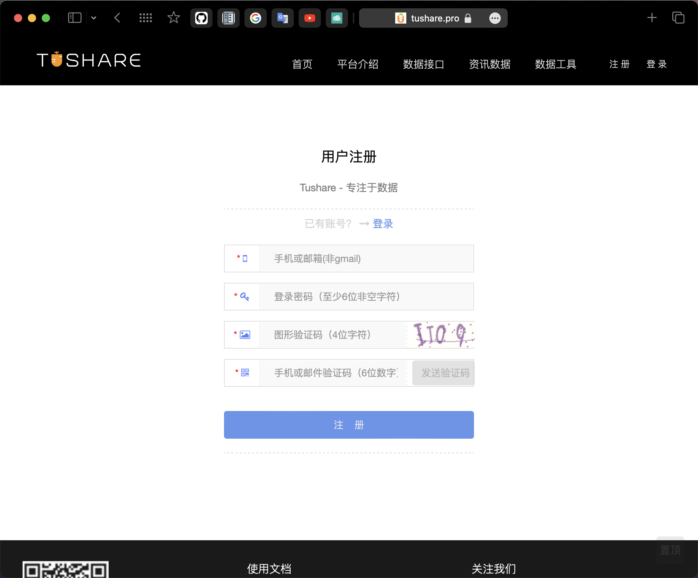
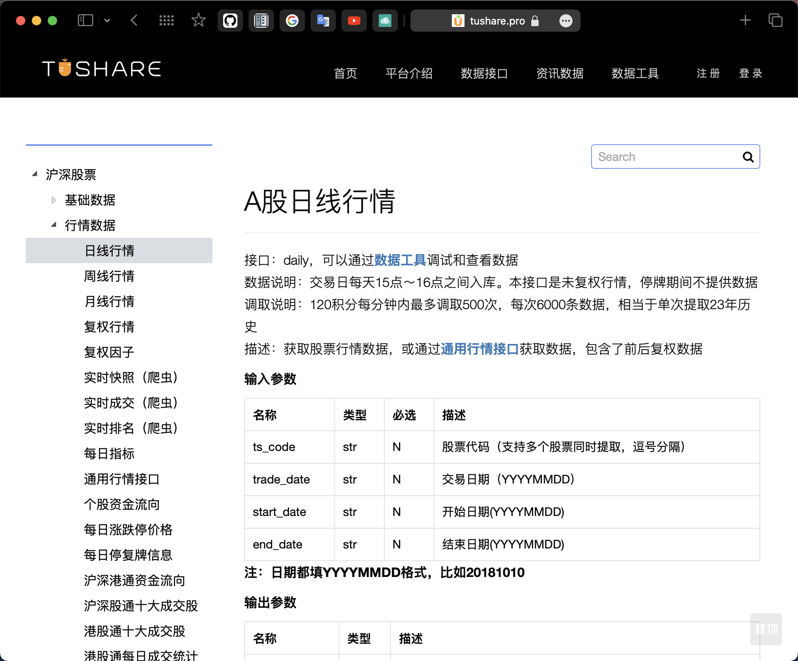

# 安装方法及初始配置

`qteasy`是一个完全本地化部署和运行的量化交易分析工具包，具备以下功能：

- 金融数据的获取、清洗、存储以及处理、可视化、使用
- 量化交易策略的创建，并提供大量内置基本交易策略
- 向量化的高速交易策略回测及交易结果评价
- 交易策略参数的优化以及评价
- 交易策略的部署、实盘运行

`qteasy`使用`python`创建，使用向量化回测及交易模拟引擎实现了策略的高速回测，同时又兼顾策略框架的灵活性，使得用户可以根据需要灵活定制各种高级策。`qteasy`提供了多种策略参数优化算法，帮助优化及评价交易策略，同时提供了实时运行模式，使交易策略可以直接部署使用。

通过本系列教程，您将会通过一系列的实际示例，充分了解`qteasy`的主要功能以及使用方法。

## `qteasy`安装前的准备工作

### 创建安装环境

`qteasy`可以通过`pip`来安装，由于依赖包较多，为了避免各依赖包与现有环境中的包产生冲突，建议创建一个独立的`python`环境来安装`qteasy`。

创建虚拟环境的方法有很多种，这里介绍两种方法，分别是使用`venv`和`conda`：

要使用`venv`创建虚拟环境，macOS和Linux用户可以打开终端，进入您需要创建环境的路径，输入以下命令，在当前目录下创建一个名为`qteasy-env`的虚拟环境，并激活环境：

```bash
python -m venv qteasy-env  
source qteasy-env/bin/activate
```

Windows用户可以打开命令提示符，进入您需要创建环境的文件夹，输入以下命令，创建虚拟环境并激活：

```bash
py -m venv qteasy-env  
.venv\Scripts\activate
```

要使用conda创建虚拟环境，可以打开终端，输入以下命令，创建一个名为`qteasy-env`的虚拟环境，并激活环境：

```bash
conda create -n qteasy-env python=3.8
conda activate qteasy-env
```

在激活的虚拟环境中，使用以下命令安装`qteasy`：

```bash
pip install qteasy
```
### 安装`MySQL`数据库 (可选)

`qteasy`可以管理大量的金融数据。`qteasy`的工作方式是将所有的金融数据下载到本地，清洗后存储到事先定义好的数据表中，在需要时（生成K线图、交易信号生成、模拟交易回测、交易结果评价等所有环节都需要用到金融数据）从本地数据源直接读取所需的数据。因此，必须在本地设置一个数据管理环境。

`qteasy`同时支持数据库及文件系统作为数据管理环境，考虑到金融数据量，强烈推荐使用数据库作为本地数据源。`qteasy`支持的本地数据源包括：

- **`csv` 文件** 默认数据源。占用空间大，但是可以使用Excel读取本地数据，数据量大时速度慢
- **`mysql` 数据库**，强烈推荐使用mysql数据库并确保磁盘有至少1TB的存储空间，速度快
- **`hdf5` 文件** 占用空间大，数据量大时速度慢
- **`feather` 文件** 占用空间较小，数据量大时速度慢

为了实现最佳的数据存储效率，建议使用`mysql`数据库作为本地数据源。

如果需要使用数据库作为本地数据源，参照以下方法安装`MySQL`数据库，如果使用文件作为本地数据源，可以跳过这一步。

在`MySQL`的[官网](https://dev.mysql.com/downloads/mysql/)可以直接找到社区开源版本下载:
网站提供了dmg和tar等多种不同的安装方式，而且还有针对M1芯片的版本可选：



安装完成后，创建用户，设置访问方式并设置密码：

``` mysql
# 创建新的用户，并允许客户通过localhost连接
mysql> CREATE USER '用户名'@'localhost' IDENTIFIED BY '初始密码';
Query OK, 0 rows affected (0.46 sec)

# 设置用户的权限
mysql> GRANT ALL ON *.* TO '用户名'@'localhost';
Query OK, 0 rows affected (0.06 sec)

# 创建新的用户，并允许客户通过远程连接
mysql> CREATE USER '用户名'@'%' IDENTIFIED BY '初始密码';
Query OK, 0 rows affected (0.46 sec)

# 设置用户的权限
mysql> GRANT ALL ON *.* TO '用户名'@'%';
Query OK, 0 rows affected (0.06 sec)
```
数据库设置好之后，`qteasy`会自动创建数据库表，将金融数据存储到数据库中。

#### 安装`pymysql`

```bash
pip install pymysql
```

### 创建`tushare`账号并获取API token (可选)

`qteasy`目前主要依赖`tushare`来获取金融数据，系统内建了比较完整的API与`tushare`接口。鉴于`tushare`的接口均有权限或积分要求，建议用户提前准备好相应的`tushare`积分，并开通相应权限。



注册tushare账号和权限的方法请参见[tushare pro主页](https://tushare.pro):


如果不创建`tushare`账号，`qteasy`仍然可以获得一些数据，但是数据的种类非常有限，访问频率和次数也受到限制，很多`qteasy`功能的使用将会受到限制，如下图所示:



未来计划增加其他金融数据提供商的API，以扩大数据来源。

### 安装TA-lib (可选)

`qteasy`内置了大量的技术指标，这些技术指标的计算依赖于`TA-lib`，如果需要使用`qteasy`内置的所有技术指标，需要安装`TA-lib`。
如果跳过这一步，将只能使用以下少数几种内置策略。下面简单介绍`TA-lib`的安装方法：

完整的`TA-Lib`包无法通过pip安装，因为通过`pip install ta-lib`安装的只是TA-Lib包的一个`python wrapper`, 用户必须首先安装C语言的TA-Lib才能在python中使用它。

> 有些用户可以用下面的方法安装C语言的TA-Lib包：
> `conda install -c conda-forge libta-lib`

在不同的系统下安装C语言的TA-Lib包的方法：

#### Windows

* 下载 [ta-lib-0.4.0-msvc.zip](http://prdownloads.sourceforge.net/ta-lib/ta-lib-0.4.0-msvc.zip) 并解压至 `C:\ta-lib`.
* 下载并安装 `Visual Studio Community` (2015 或更新版本)， 选择 `[Visual C++]` 功能
* Windows 开始菜单, 启动 `[VS2015 x64 Native Tools Command Prompt]`
* 移动至 `C:\ta-lib\c\make\cdr\win32\msvc`
* `nmake`

#### Mac OS

```bash
$ brew install ta-lib
```

如果使用Apple Silicon芯片，可以使用：

```bash
$ arch -arm64 brew install ta-lib
```

#### Linux

下载 [ta-lib-0.4.0-src.tar.gz](http://prdownloads.sourceforge.net/ta-lib/ta-lib-0.4.0-src.tar.gz) ，然后:

```bash
$ tar -xzf ta-lib-0.4.0-src.tar.gz
$ cd ta-lib/
$ ./configure --prefix=/usr
$ make
$ sudo make install
```
安装完成C语言`TA-Lib`后，可以安装`TA-Lib`的`python wrapper`：

```bash
pip install TA-Lib
```

更完整的`TA-Lib`的安装方法请参考[这里](https://pypi.org/prject/TA-Lib/)


## 初始化`QTEASY`

当`qteasy`的所有依赖包正确安装后，就可以在IDE中导入`qteasy`了。

```python
import qteasy as qt
print(qt.__version__)
```

第一次导入`qteasy`时会自动初始化，初始化过程会创建一个`qteasy.cfg`文件，这个文件用于存储qteasy的环境配置变量，用户可以通过修改这个文件来修改`qteasy`的环境配置变量。

用户可以将一些关键配置信息存放在`qteasy.cfg`文件中，这样`qteasy`在导入时会自动读取这些配置信息。

用户可以在资源管理器、访达或者终端中找到`qteasy`的根目录，然后打开`qteasy.cfg`文件，修改其中的内容。
> 在qteasy中可以通过`qt.QT_ROOT_PATH`查看qteasy的根目录
> ```python
> import qteasy as qt
> print(qt.QT_ROOT_PATH)
> ```

第一次初始化后的`qteasy.cfg`文件内容如下：

```
# qteasy configuration file
# following configurations will be loaded when initialize qteasy

# example:
# local_data_source = database
```
用户可以直接在文件中添加配置信息，保存文件后重新导入`qteasy`即可使配置生效了，例如：

```
local_data_source = database
```

以下几个配置信息是用户在使用`qteasy`前非常有必要配置的：

### 配置`tushare`的API token

注意`tushare`是一个收费的数据服务，用户需要获取积分，积分越多，获取的数据种类越多，权限也越大，如果不配置`tushare` token，将无法正常使用`tushare`的数据服务。

如果您按照教程前一节的内容创建了`tushare`账号并获取了token，可以将token写入`qteasy.cfg`文件中，这样在导入`qteasy`时就会自动读取这个token。

在`qteasy.cfg`文件中添加以下内容：

```
tushare_token = 你的tushare token
```

### 配置本地数据源

默认情况下，`qteasy`使用csv文件保存本地数据，速度较慢而且占用空间较大。为了更好地使用`qteasy`，用户还应该完成本地数据源的基本配置。

如果您按照教程前一节的内容创建了`mysql`数据库，可以将数据库的配置信息写入`qteasy.cfg`文件中，这样`qteasy`就会连接到您指定的数据库，将金融数据存储到数据库中。

在`qteasy.cfg`文件中添加以下内容：

```
local_data_source = database
local_db_host = <你的数据库主机名，如localhost>
local_db_port = <你的数据库端口，如3306>
local_db_user = <你的数据库用户名>
local_db_password = <你的数据库连接密码>
local_db_name = <保存金融数据的数据库名，如qt_database>
```
如果不做上述配置，`qteasy`会使用默认的csv文件作为本地数据源。

> 请注意，在文件中给出配置信息的时候，请不要加`<`和`>`，否则，这些字符也会被认为是`token`或者数据库名的一部份。从而导致连接数据库失败。
>
> `qteasy`在解析配置文件的时候，会根据配置的类型，自动转换为正确的格式，例如，数据库端口`3306`应该是`int`变量，直接使用：
> 
> ```
> local_db_port = 3306
> ```
> 
> 即可。`qteasy`会将字符串`3306`转换为`int`型`3306`。·
> 
> 下面这个配置文件的例子是正确的：
> 
> ```
> tushare_token = 2dff3f034aa966479c81e4b4b0736fb081b740abb2xxxxxxxxxxxxxxxxxxxxx
> 
> local_data_source = database
> 
> local_db_host = localhost
> local_db_port = 3306
> local_db_user = user_name
> local_db_password = pass_word
> local_db_name = qt_db
> ```

## 开始下载第一批金融数据

完成上述配置以后，保存并关闭`qteasy.cfg`文件，恭喜你，`qteasy`已经安装并配置好了，现在可以开始使用`qteasy`了。

完成上述配置以后，保存并关闭`qteasy.cfg`文件，恭喜你，`qteasy`已经安装并配置好了，现在可以开始使用`qteasy`了。

首先，我们需要下载一些金融数据，交易策略的回测、优化、评价等所有功能都需要用到金融数据。
在这里，我们可以先下载一些股票数据，以便后续的教程中使用。

`qt.refill_data_source`是一个通用的数据下载函数，只要你的tushare积分足够，可以下载股票、期货、指数、基金等金融数据，也可以下载宏观经济、财务报表、财务指标、公司基本信息等非交易数据。使用这个函数，您可以批量下载数据到本地，保存前会进行数据去重和清洗、确保不会重复保存，另外，使用多线程并行下载，提供下载进度条，特别适合一次性下载大量历史数据保存到本地，也适合定期运行，定期补充增量数据，例如每月或每周补充下载本月或本周的所有数据。

```python
import qteasy as qt

# 下载股票数据 (从2023年1月1日到2023年12月31日之间的所有股票数据)
qt.refill_data_source(tables='stock_daily', start_date='20230101', end_date='20231231')

Filling data source file://csv@qt_root/data/ ...
[########################################]9/9-100.0%  <trade_calendar:SSE-XHKG>74804wrtn in ~9't
[########################################]7/7-100.0%  <stock_basic:SH-BJ>10365wrtn in ~1't
[########################################]272/272-100.0%  <stock_daily:20230101-20231231>959278623wrtn in ~2H
```


在`qteasy`中，所有数据都保存在特定的数据表中，而且每一种数据都有其唯一的数据ID，例如'pe'表示市盈率，open表示开盘价，等等；通过数据ID，用户可以在qteasy中随时获取所需的数据——只要数据已经下载到本地。

同时，数据ID也是`qteasy`中交易策略的核心，用户可以通过数据ID在交易策略中"订阅"所需要的数据类型，并根据这些数据生成交易信号（关于交易信号和交易策略，请参见教程第四章）。

根据您的网络环境和数据量大小，下载数据的时间可能会有所不同，下载完成后，2023年内的所有股票数据就可以直接获取了。

要获取历史数据，可以使用`get_history_data`函数，在参数中指定数据类型、股票代码、开始日期和结束日期，
下面的代码可以获取2023年1月1日到3月1日的股票000001.SZ的开盘价、最高价、最低价、收盘价、成交量、成交额等数据：

```python
import qteasy as qt
qt.get_history_data('open, high, low, close, vol', shares='000001.SZ', start='20230101', end='20230301')

{'000001.SZ':              open   high    low  close         vol
2023-01-04  13.71  14.42  13.63  14.32  2189682.53
2023-01-05  14.40  14.74  14.37  14.48  1665425.18
2023-01-06  14.50  14.72  14.48  14.62  1195744.71
...
2023-02-27  13.75  13.88  13.68  13.69   621461.93
2023-02-28  13.75  13.85  13.61  13.78   607935.92
2023-03-01  13.80  14.19  13.74  14.17  1223451.78}
``` 

至此，如果您看到上面的数据，表明`qteasy`的安装和初始化工作已经完成，您已经可以开始使用`qteasy`了。

在下一章节中，我们将会介绍`qteasy`的基本数据类型，以及如何使用`qteasy`来获取并管理金融数据。

### API 参考

关于qteasy环境变量的AP，以及所有的环境变量，请参考 [Configuration APIs](../api/api_reference.rst)
