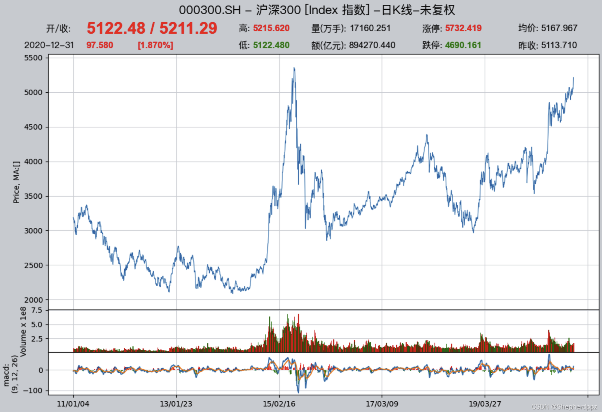
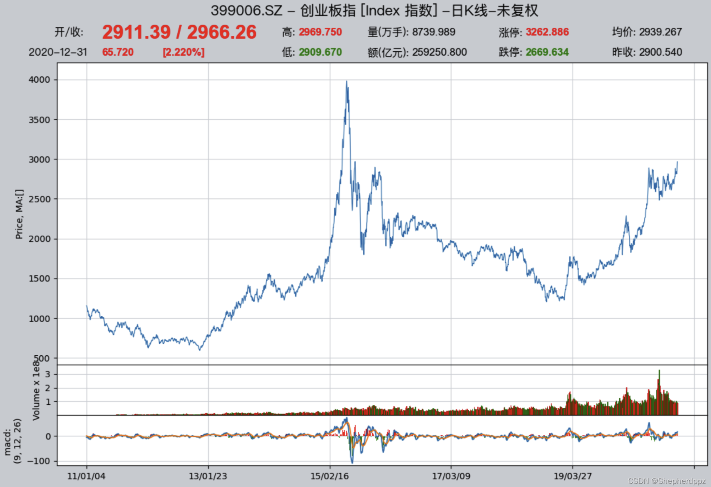
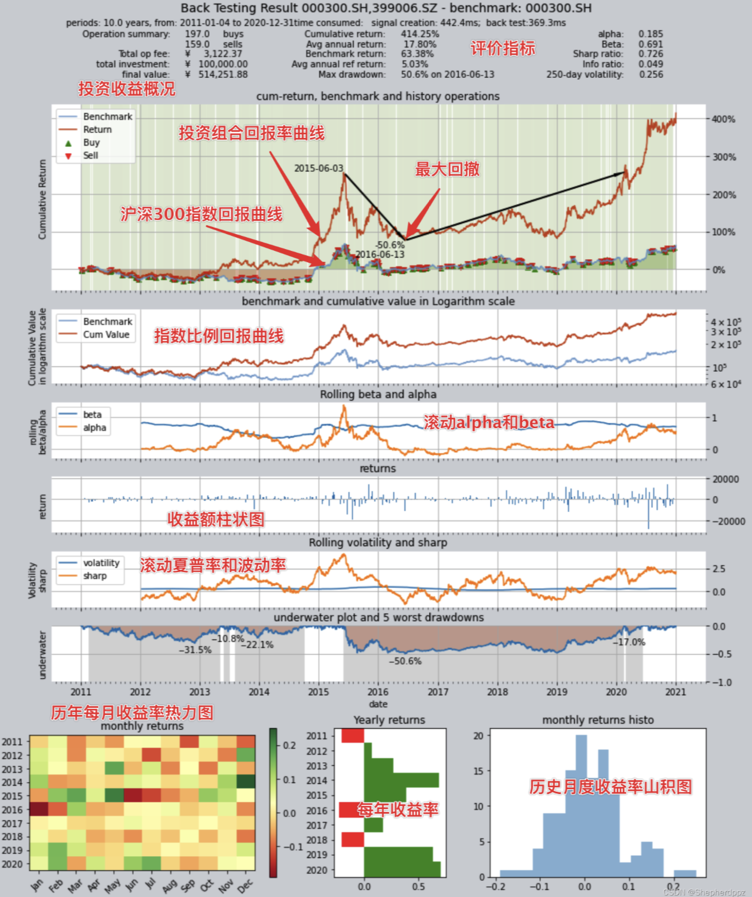
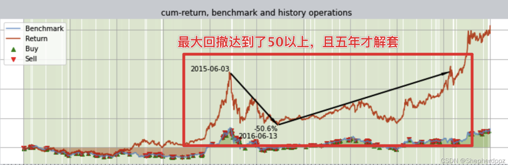
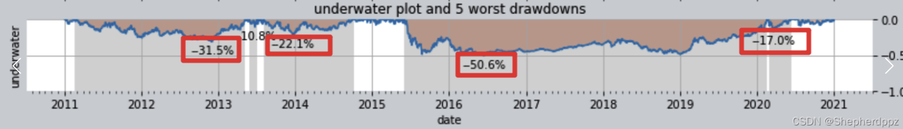
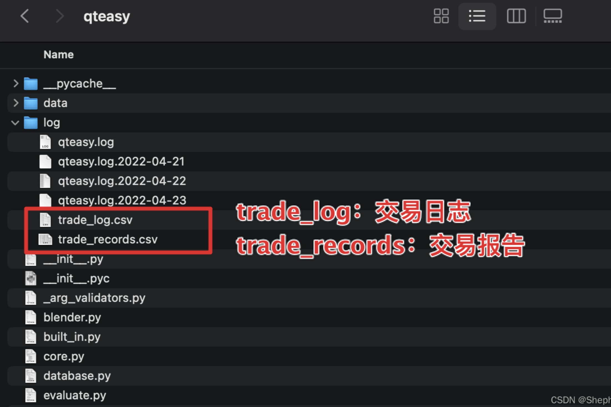
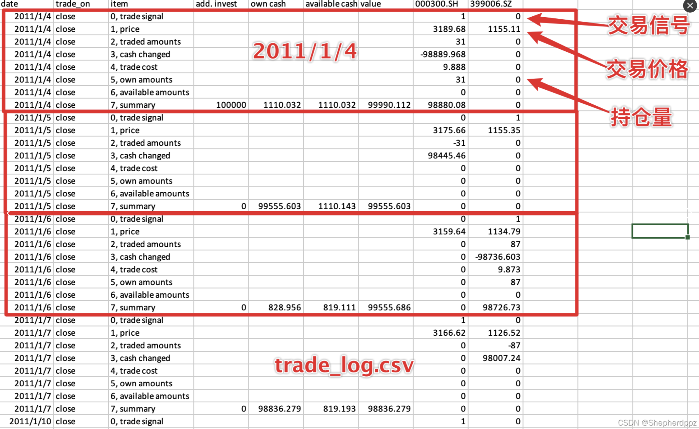
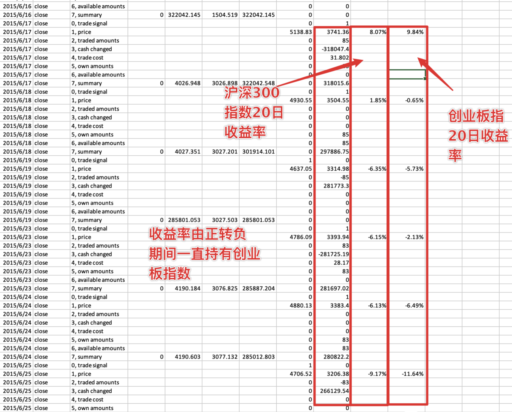
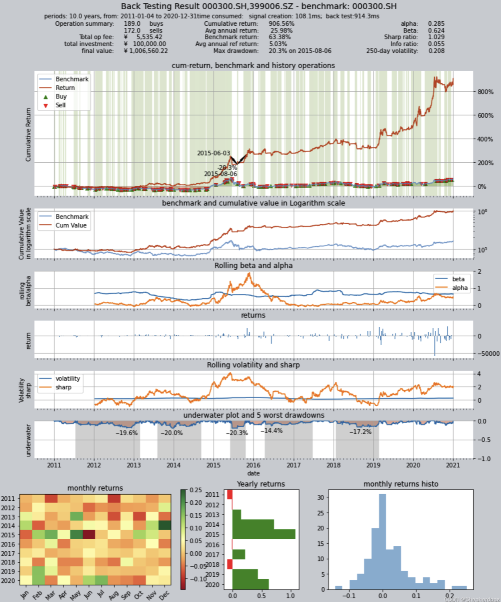

# 教程3—创建交易策略并评价回测结果

`qteasy`是一个完全本地化部署和运行的量化交易分析工具包，具备以下功能：

- 金融数据的获取、清洗、存储以及处理、可视化、使用
- 量化交易策略的创建，并提供大量内置基本交易策略
- 向量化的高速交易策略回测及交易结果评价
- 交易策略参数的优化以及评价
- 交易策略的部署、实盘运行

通过本系列教程，您将会通过一系列的实际示例，充分了解`qteasy`的主要功能以及使用方法。
## 开始前的准备工作

在开始本节教程前，请先确保您已经掌握了下面的内容：

- 完成`qteasy`的安装并升级到最新版本，完成qteasy的初始化配置
- 配置好本地数据源，掌握下载各种金融数据的方法，能够将指数、股票的各种历史价格数据、财务报表数据等下载到本地。

在[上一篇教程](http://qteasy.readthedocs.io)中，我介绍了如何配置本地数据源，查找、下载金融数据到本地，并从本地数据源中提取数据。如果还没有完成这一步的朋友，请移步前一篇教程了解如何下载和操作数据。

## 本节的目标

在本节中，我们将通过创建qteasy`模块来测试一个大小盘轮动交易策略，

大小盘轮动是一个非常基本而且常见的交易策略，这个交易策略抓住大盘股和小盘股往往上涨和下跌不同步的特点，在大盘股和小盘股之间轮流切换持有，以期望获得更高的收益率。通过创建这个交易策略，可以非常方便地帮助我们了解如何使用qteasy创建交易策略，调用历史价格回测交易策略，分析策略的表现并对策略进行改进。

在这里，我们需要创建一个最简单的轮动策略：在前面提到的两个指数之间轮动，每天选择未来可能的涨幅较大的指数持有：

- 分别计算两个指数在过去20天的涨幅，也就是今天的价格相对于20天前价格的涨幅
- 选择涨幅较大的那个指数，在第二天持有，同时卖掉涨幅较小的指数

$$当日涨幅 = \frac{Price_0}{Price_{20}} - 1$$

## 策略的实现
根据上述的策略思路，我们很容易在`qteasy`中实现这样的轮动选股策略，因为`qteasy`中已经内置了近70个交易策略，所有的内置策略都有独特的名称，直接引用名称即可使用这些内置策略。`qteasy`中的所有交易策略都必须包含在一个名为`Operator`（交易员）的对象中，交易员对象实际是一个策略的容器，可以理解为一个交易员可以同时管理多个策略，并且同时运行这些策略来生成交易信号。

交易员对象可以直接通过`qt.Operator()`来创建，创建时传递`strategies`参数即可在创建时同时创建交易策略：
```python
import qteasy as qt
op = qt.Operator(strategies = 'ndayrate', signal_type='pt')
```
通过上面的代码，我们已经在`queasy`中创建了一个选股策略（`ndayrate`），这个策略是一个内置选股策略，它根据“N日价格涨幅”来选股，它的选股逻辑是判断股票池中所有股票的N日价格涨幅，并且根据价格涨幅选择股票或资产（当然，选择的方法是通过参数配置的，在下文中会提到）。

使用`qt.built_ins()`函数，可以查看内置策略的详细介绍：

```python
qt.built_ins('ndayrate')
```
输出结果如下：
```text
以股票过去N天的价格或数据指标的变动比例作为选股因子选股
    基础选股策略：根据股票以前n天的股价变动比例作为选股因子

    策略参数：
        n: int, 股票历史数据的选择期
    信号类型：
        PT型：百分比持仓比例信号
    信号规则：
        在每个选股周期使用以前n天的股价变动比例作为选股因子进行选股
        通过以下策略属性控制选股方法：
        *max_sel_count:     float,  选股限额，表示最多选出的股票的数量，默认值：0.5，表示选中50%的股票
        *condition:         str ,   确定股票的筛选条件，默认值'any'
                                    'any'        :默认值，选择所有可用股票
                                    'greater'    :筛选出因子大于ubound的股票
                                    'less'       :筛选出因子小于lbound的股票
                                    'between'    :筛选出因子介于lbound与ubound之间的股票
                                    'not_between':筛选出因子不在lbound与ubound之间的股票
        *lbound:            float,  执行条件筛选时的指标下界, 默认值np.-inf
        *ubound:            float,  执行条件筛选时的指标上界, 默认值np.inf
        *sort_ascending:    bool,   排序方法，默认值: False,
                                    True: 优先选择因子最小的股票,
                                    False, 优先选择因子最大的股票
        *weighting:         str ,   确定如何分配选中股票的权重
                                    默认值: 'even'
                                    'even'       :所有被选中的股票都获得同样的权重
                                    'linear'     :权重根据因子排序线性分配
                                    'distance'   :股票的权重与他们的指标与最低之间的差值（距离）成比例
                                    'proportion' :权重与股票的因子分值成正比

    策略属性缺省值：
    默认参数：(14,)
    数据类型：close 收盘价，单数据输入
    采样频率：月
    窗口长度：150
    参数范围：[(2, 150)]
    策略不支持参考数据，不支持交易数据
```

至此，一个`Operator`对象和交易策略就已经创建好了。

我们可以使用`Operator.info()`来查看交易员对象和交易策略的详细信息，同时，通过`Operator.strategies`属性可以访问其中的所有交易策略，通过它的`info()`方法也可以查看更详细的策略参数和信息

```python
op.info()

stg = op.strategies[0]  # 获取op的第一个策略，下面的几种方法是等效的
stg = op[0]
stg = op['ndayrate']
stg = op.get_strategies_by_id('ndayrate')
```
输出结果如下：
```text
stg.info()
Strategy_ID             N-DAY RATE                                              
================================================================================
Strategy Parameter      (20,)                                                   
Strategy_type           FactorSorter
Strategy name           N-DAY RATE
Description
    Select stocks by its N day price change
Strategy Properties     Values                                                  
--------------------------------------------------------------------------------
Param.count             1
Param.types             ['int']                                                 
Param.range             [(2, 150)]                                              
Run parameters          d @ close                                               
Data types              ['close']                                               
Data parameters         150 d                                                   

Max select count        100.0%
Sort Ascending          False
Weighting               even                                                    
Filter Condition        any                                                     
Filter ubound           inf
Filter lbound           -inf
```
从上面的信息中可以看到，`ndayrate`策略有许多的可配置参数，通过调整这些参数，我们可以调整策略的选股方式，从而调整交易策略的表现。

接下来，我们还需要做一些最基本的设定，确保这个选股策略能按照我们的想法选股。`Operator`对象中的所有参数都可以通过`op.set_parameter()`方法来实现。

```python
op.set_parameter(0,   
                 sample_freq='d',  # 策略的选股周期为每日选股 
                 sort_ascending=False,  # 设置选择涨幅最大的指数
                 proportion_or_quantity=1,  # 设置每次选择一只指数后续持有
                 pars=(20, ),  # 策略参数N=20，比较20日涨幅
                 data_types='close')  # 使用收盘价计算涨幅
```
在上面的代码段中，我们通过几个简单的参数设置选股策略的基本行为：

- `sample_freq='d'`: 每日选股，如果设置选股周期为`'w'`表示每周选股，`'2d'`表示每两天选股一次
- `sort_ascending=False`：该策略的操作方式是将所有的N日涨幅排序后取前几位，因为需要取最大涨幅，因此需要降序排列，如果要取最小涨幅，则需要设置`sort_ascending=True`
- `proportion_or_quantity=1`：选择的股票数量，因为从两个指数中固定二选一，因此设置此参数为1
- `pars=(20, )`：策略参数N，设置为20表示根据20日涨幅选股
- `data_types='close'`：默认值，计算收盘价的涨幅

### 准备回测数据
配置好选股策略以后，需要通过回测检验策略的表现，也就是调用沪深300和创业板两个指数的实际历史数据，进行模拟交易，看看模拟交易的结果是否能够跑赢大盘。在实际操作中，卖卖大盘指数不太容易，不过一般都可以很容易找到跟踪大盘指数的ETF基金来代替大盘，在这里为了简单起见，我们这里就直接投资于2011年1月1日一直到2020年12月31日之间的沪深300和创业板指数，假设交易费率为万分之一，双向收费，看看投资的结果如何。

前面我们已经了解过如何下载历史数据了，这里我们需要沪深300和创业板指数从2013年到2022年底之间的所有数据。

> **注意**
> 在下载历史数据用于回测的时候，下载的数据需要比回测日期起点更多一些，例如，回测从2013年1月1日开始，实际需要的数据更多一些，因此下载数据的起点应该从2012年9月开始。关于这一点的详细分析，请参见[参考文档](http://qteasy.readthedocs.io)

使用下面的代码下载相应的历史数据：

```python
qt.refill_data_source(tables='index_daily', symbols='399006, 000300', start_date='20100901', end_date='20201231')
```
确认数据是否下载成功：
```python
qt.candle('000300.SH', start='20110101', end='20201231', asset_type='IDX', mav=[])
qt.candle('399001.SZ', start='20110101', end='20201231', asset_type='IDX', mav=[])
```




### 配置回测参数

数据准备好之后，就可以开始配置回测参数并开始回测了。qteasy的策略回测完全是参数化的，在回测之前我们需要告诉系统所有的相关信息，例如投资的产品品种、投入资金的数量、回测开始日期和结束日期、回测过程的交易费用计算方法、交易批量等。我们可以通过`qt.configure()`对回测参数进行基本配置：
```python
qt.configure(asset_pool=['000300.SH',
                         '399006.SZ'],  # 投资指数包括沪深300和创业板指数
             invest_cash_amounts=[100000],  # 投入金额为十万元
             asset_type='IDX',  # 为简单起见，直接投资于指数
             cost_rate_buy=0.0001,  # 买入资产时交易费用万分之一
             cost_rate_sell=0.0001,  # 卖出资产时的交易费用为万分之一
             invest_start='20110101',  # 模拟交易开始日期
             invest_end='20201231',  # 模拟交易结束日期
             trade_batch_size=0,  # 买入资产时最小交易批量
             sell_batch_size=0)  # 卖出资产时最小交易批量
```
上面的配置含义如下
- `asset_pool=['000300.SH', '399006.SZ']`：投资目标指数用列表形式给出，如果要投资其他的指数或ETF基金，直接传入证券代码即可，如果要从三个或更多的证券中选股，直接加入列表中即可
- `invest_amounts=100000`： 投资金额为十万元，如果需要模拟多次分批投入，还可以传入一个列表，不过需要分别指定每次投入的具体日期
- `asset_type='IDX'`： 投资标的类型：`'E'`代表股票， `'IDX'`代表指数，` 'FD'`代表基金，`'FT'`代表期货，`'OPT'`代表期权
- `cost_rate_buy=0.0001`： 设置买入和卖出交易费用比例，`qteasy`还支持设置最低费用、固定费用等等，这里只简单设置费率即可
- `cost_rate_sell=0.0001`：
- `invest_start='20110101'`： 模拟交易开始日期
- `invest_end='20201231'`：  模拟交易结束日期
- `trade_batch_size=0`：  买入资产时最小交易批量，`0`代表可以交易任意份额，1代表只能交易整数份，这里可以输入任意大于`0`的数
- `sell_batch_size=0`： 卖出资产时最小交易批量为`0`

`qteasy`还有其他的配置参数，参见`qteasy`的文档。

## 策略的回测结果

`qteasy`的策略回测非常简单，设置好所有的配置后，即可以开始回测了，我们可以调用`qt.run()`开始回测，回测的同时，我们开启可视化图表输出，并且开启交易明细记录：
```python
res = qt.run(op, visual=True, trade_log=True)  # 使用下面的方法效果是等同德
res = op.run(visual=True, trade_log=True)  # visual 和 trade_log两个参数同样是qt的配置参数，下面的调用方法等效：
qt.configure(visual=True,
             trade_log=True)
qt.run(op)  # or op.run()
```
等待片刻后，回测完成，qteasy会自动打印回测报告如下：
```
     ====================================
     |                                  |
     |       BACK TESTING RESULT        |
     |                                  |
     ====================================

qteasy running mode: 1 - History back testing
time consumption for operate signal creation: 142.4ms
time consumption for operation back looping:  3s369.3ms

investment starts on      2011-01-04 00:00:00
ends on                   2020-12-31 00:00:00
Total looped periods:     10.0 years.      - 一共模拟了十年的交易

-------------operation summary:------------

          Sell Cnt Buy Cnt Total Long pct Short pct Empty pct
000300.SH    74       79    153   47.2%      0.0%     52.8%  
399006.SZ    85      118    203   48.5%      0.0%     51.5%   

Total operation fee:     ¥    3,122.37    - 总交易费用
total investment amount: ¥  100,000.00    - 初始投资金额十万元
final value:              ¥  514,251.88   - 十年后投资总金额来到了五十一万
Total return:                   414.25%   - 十年总收益率
Avg Yearly return:               17.80%   - 年化收益率
Skewness:                         -0.38
Kurtosis:                          2.88
Benchmark return:                63.38%   - 同期沪深300指数的总收益
Benchmark Yearly return:          5.03%   - 沪深300的年化收益

------strategy loop_results indicators------ 
alpha:                            0.185
Beta:                             0.691
Sharp ratio:                      0.726
Info ratio:                       0.049
250 day volatility:               0.256
Max drawdown:                    50.57% 
    peak / valley:        2015-06-03 / 2016-06-13
    recovered on:         2020-02-18

===========END OF REPORT=============
```
从回测的结果可以很容易看出，这个策略是跑赢了沪深300大盘指数的，在这十年间沪深300的年化收益率只有可怜的5%左右，甚至比某些收益较高的定期产品都不如，而我们这个策略的投资年化收益率达到了17.8%，十年间总资产从十万元达到了五十多万元，翻了五倍多


## 策略的进一步改进
我们的策略获得了初步的成功，不过，光看总回报率还不能完全说明问题，策略在整个十年间的表现如何呢？这就需要进一步分析，看看能否进一步改进这个策略。这时我们需要进一步查看回测的结果，尤其是可视化结果和交易明细记录，通过这些记录和报告来找到策略的不足和改进点。

### 可视化报告的使用
由于设置了`visual=True`，在回测报告的最后，还能看到运行结果的可视化图表报告如下：

可视化图表是`qteasy`的一个很有用的功能。首先我们可以看到回测的历史回报率曲线图。这个曲线图以百分比为单位，将投资组合的回报率曲线和一个参考曲线（默认情况下参考曲线是沪深300指数，可以通过`qt.configure(reference_asset='xxxxxx.xx')`来设置为不同的指数）的收益率对比。红色曲线为投资组合的收益率，而蓝色曲线为参考指数收益率。
在这张图的参考指数曲线上，会用红、绿色箭头标注所有的买卖点，同时，图表在持有仓位的时间区间填充上绿色，响应没有持仓（空仓）的时段会保持为白色，这样就很容易看出整个投资历史上组合的回报率，以及买卖、持仓的大致时段和比例。

紧接着第一张图表，后续五张图表都是历史曲线图，显示了投资回报的多种不同的评价指标，这里面我感觉最有用的是“underwater”图，也就是第六张图，显示了投资资产回撤的情况，这个表我们过一会来仔细分析。

最下面还有并列的三张图表，分别统计了历史上历年或历月的收益率，其中可以看到整个十年中有三年（2011年、2016年和2018年）的收益率是负的，其余年份均实现了正收益。

了解了可视化图表，我们来分析历史曲线，大家可以看着历史回报率曲线图，并开始设想，加入我按这个投资策略开始投资，从2015年6月3日开始，我的收益率会如何？结果是：到2016年6月13日亏损50.6%，然后一直到2020年2月才能解套！如下图：

同样，我们从第六张underwater图中也可以看到，在整个十年投资期间，总资产不断地出现回撤，50%回撤是最大最深的一次，但前期还有31%、22%的多次回撤，而且长度都不短，整个投资就是“长期被套牢，偶尔能翻盘”的状况，我相信，没有几个投资者能够熬得住这样的煎熬的，对吧？


如上图，整个十年间除2015年前后或者2020年下半年以外，几乎都处于潜水套牢状态。

因此，我们可以想办法改进一下这个策略，看看如何能够降低回撤，提升策略的性能。为此，我们需要仔细分析模拟交易回测过程中的每一笔交易，寻找降低回撤的办法。要查看回测交易的每一个细节，那就需要查看交易明细报告。

### 交易明细报告
我们在回测的时候，设置了`print_backtest_log=True`，因此系统会生成详细的交易明细报告。这份报告被保存在了`qteasy/log`路径下，可以看到包含两个报告，两个报告都保存为csv文件，便于用Excel打开：

打开第一个文件可以看到交易日志，交易日志中记录了每一个交易日资金的变动，持股的变动、每种股票的交易明细等信息，不管是否有交易或持股变动，每天都有记录：

从上面的文件中可以看到，1月4日买入了31份沪深300指数，到1月5日收盘时卖出了持有的沪深300指数31份，并在1月6日收盘时买入87份创业板指，并在1月7日继续持有。。。
而打开trade_records.csv文件可以看到，这里记录了每一笔成交的交易，包括交易日期、买卖方向、交易份额、价格、总金额、交易费率等等信息，由于只记录有交易的实际发生，因此信息更加紧凑：

仔细分析上面的表格，会发现这个投资策略除了在换股的时候以外，都是满仓持有的，在2015年中的股灾期间也不例外，我们找到这段时间会发现，从2015年的6月18日开始，不管是沪深300指数还是创业板指数，他们的20日收益率都已经由正转负，表明后市已经开始下跌了，然而此时策略仍然坚定地持有创业板指，这是因为创业板指的跌幅要小于沪深300，也就是收益率大于沪深300：

所以其实这时候我们的策略仍然选择了正确的指数，只不过因为两个指数都在跌，我们的策略选择了跌的少的那一个持有，减少了我们的损失。

那么，我们可否从这里出发改进我们的策略呢？思路很简单，我们可以加一条规则：

- 每天计算两个指数在过去20天的涨幅，也就是今天的价格相对于20天前价格的涨幅
- 如果选股日两个指数都小于0，那么我们第二天就空仓，一个指数都不持有
- 否则，选择涨幅较大的那个指数，在第二天持有，同时卖掉涨幅较小的指数

我们在原来的简单选股规则基础上增加了一条“过滤条件”，将两个指数都小于0的情况排除在外，好了，那么在`qteasy`中如何调整，以反映这个新的修改呢？
### 改进后的策略设置
qteasy的内置选股策略提供了一个过滤条件`condition`属性，默认条件下`condition='any'`，代表没有过滤条件，现在我们需要把小于0的收益率过滤掉，因此可以设置`condition='greater'`同时设置过滤范围`ubound=0`即可：
```python
op.set_parameter(0, 
                 sample_freq='d',
                 sort_ascending=False,
                 proportion_or_quantity=1,
                 pars=(20, ),
                 data_types='close',
                 condition='greater',  # 新增过滤条件：20日涨幅大于等于
                 ubound=0)  # 过滤条件值：0
```
上面的设置跟前一节基本相同，增加了两个参数：

 - `condition='greater'`：含义是增加过滤条件，N日涨幅必须大于等于某个值才能参加选股，这个值在ubound参数中设置。也就是说排除掉小于这个值的股票，让其无法中选
 - `ubound=0`： 设置为0，这样只有涨幅大于等于0的指数才能被选中，当然还可以设置为其他浮点数

### 改进后的结果
同样按照前面的配置，直接执行`qt.run()`。这里直接放结果：
```python
res=qt.run(op, visual=True, print_backtest_log=True)
```
```code
     ====================================
     |                                  |
     |       BACK TESTING RESULT        |
     |                                  |
     ====================================

qteasy running mode: 1 - History back testing
time consumption for operate signal creation: 108.1ms
time consumption for operation back looping:  914.3ms

investment starts on      2011-01-04 00:00:00
ends on                   2020-12-31 00:00:00
Total looped periods:     10.0 years.

-------------operation summary:------------

          Sell Cnt Buy Cnt Total Long pct Short pct Empty pct
000300.SH    82       85    167   24.4%      0.0%     75.6%  
399006.SZ    90      104    194   41.2%      0.0%     58.8%   

Total operation fee:     ¥    5,535.42
total investment amount: ¥  100,000.00
final value:              ¥1,006,560.22
Total return:                   906.56% 
Avg Yearly return:               25.98%
Skewness:                         -0.23
Kurtosis:                          4.79
Benchmark return:                63.38% 
Benchmark Yearly return:          5.03%

------strategy loop_results indicators------ 
alpha:                            0.285
Beta:                             0.624
Sharp ratio:                      1.029
Info ratio:                       0.055
250 day volatility:               0.208
Max drawdown:                    20.26% 
    peak / valley:        2015-06-03 / 2015-08-06
    recovered on:         2015-10-20
===========END OF REPORT=============
```
可视化图表如下：


从资产收益率图上可以看到，原来一片绿色（全程持仓）变成了白绿相间（白色区间空仓持币），资产回撤情况得到了大幅度优化：从原来的50%回撤降低到了20%左右。而且总回报率也大大提升：

- 资产总额从改进前的五十多万提高到一百万
- 总收益率从400%提升到了900%
- 年化收益率从17%提升到了26%
- 最大回撤从50%降低到了20%

通过查看交易记录可知，的确策略在2015年6月底的股灾期间保持空仓，躲避了单边下跌的行情。
## 本篇回顾

通过本教程，我们通过一个大小盘轮动交易策略的创建、回测、修改熟悉了解了`qteasy`的交易策略，知道如何通过引用内置交易策略，创建一个单策略交易员对象，并使交易员运行策略获得回测结果。从下一篇教程开始，我们将进一步详细讨论`qteasy`的内置交易策略，并且介绍组合策略的实现方式，在交易员对象中添加更多的策略并设定组合方式，通过策略组合实现更复杂的效果，并且了解更多策略控制和类型。

