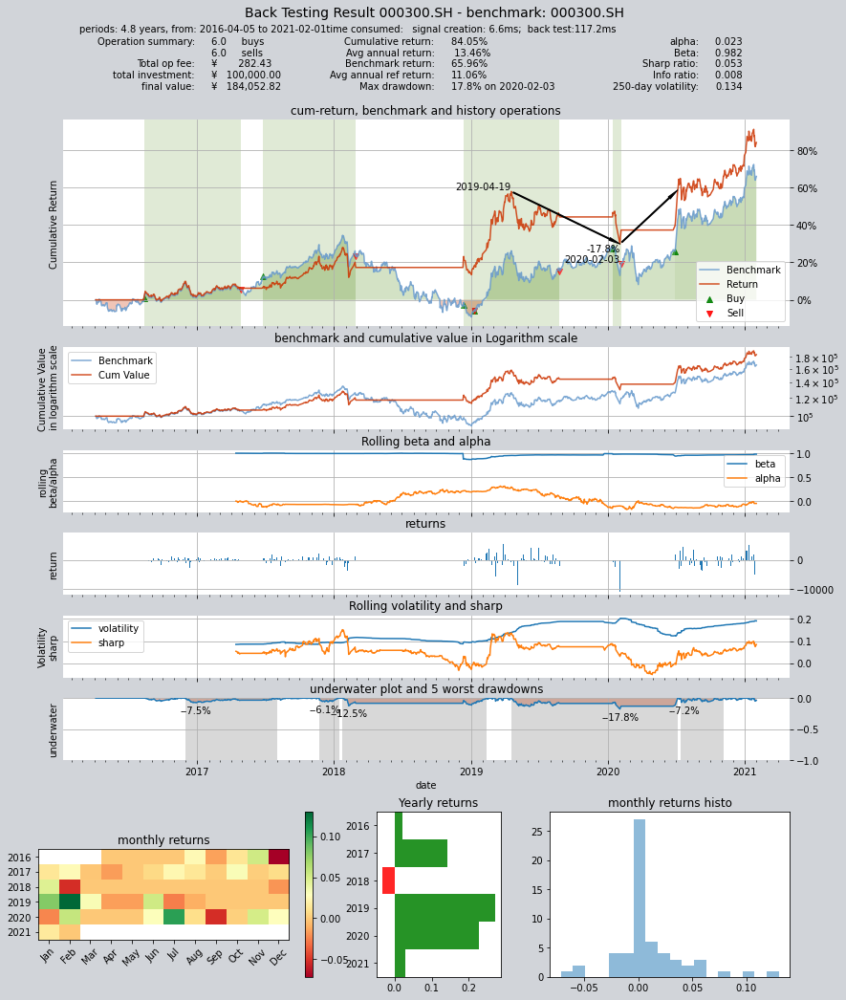
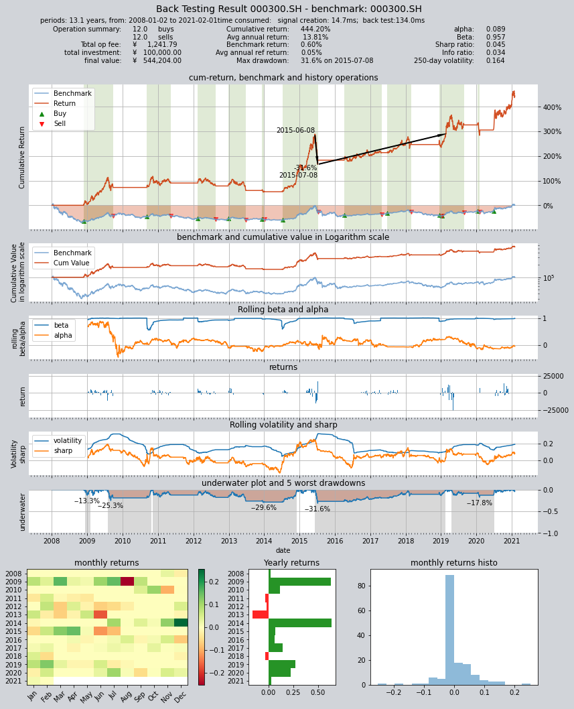
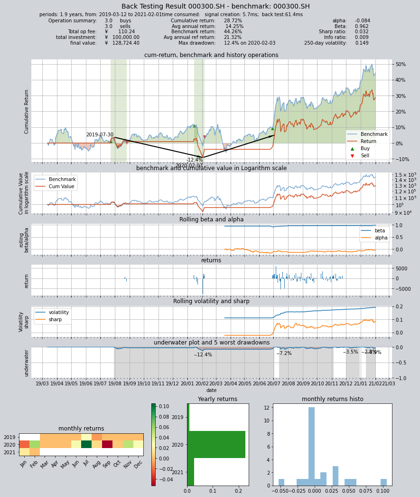
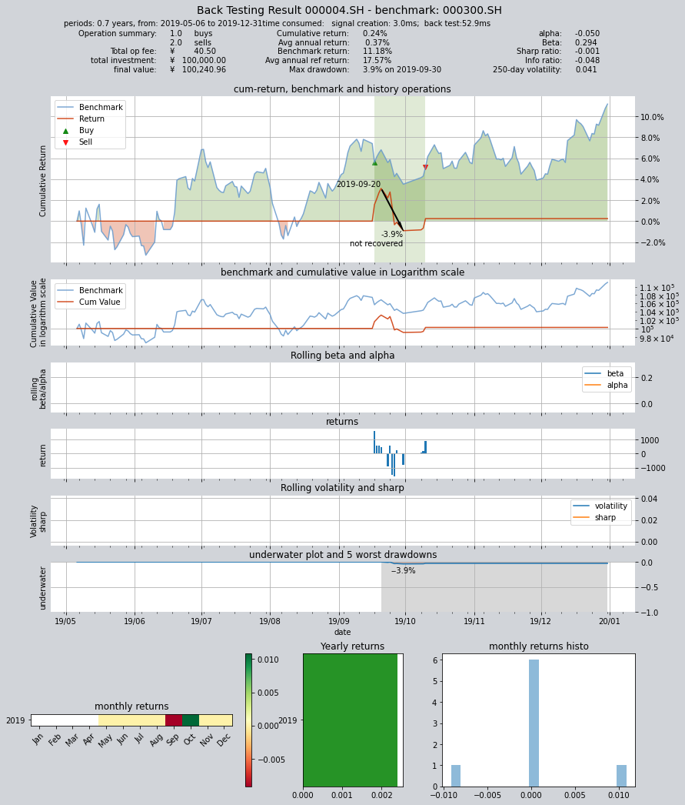
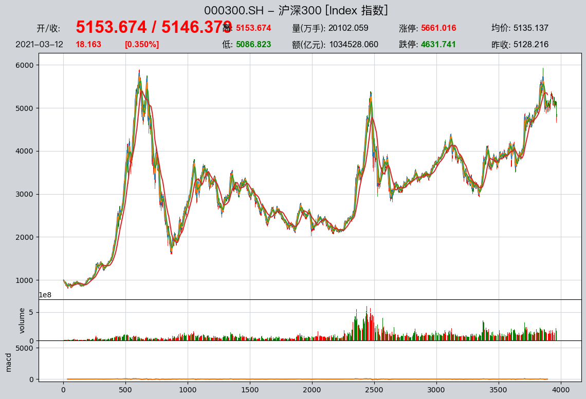

## qteasy策略历史回测

本示例演示qteasy中的策略历史回测功能，覆盖以下内容：
* 回测交易区间的设置
* 交易费用的设置
* 选股策略的回测
* 择时策略的回测
* 回测结果的评价和分析


```python
import sys
sys.path.append('../')
import qteasy as qt
%matplotlib inline
```


```python
op = qt.Operator(timing_types=['dma'])
op.set_parameter('t-0', pars=(23, 166, 196))
op.set_parameter('s-0', (0.5,))
op.set_parameter('r-0', ())
op.info()
qt.configure(mode=1)
```

    OPERATION MODULE INFO:
    =========================
    Information of the Module
    =========================
    Total count of SimpleSelecting strategies: 1
    the blend type of selecting strategies is 0
    Parameters of SimpleSelecting Strategies:
    <class 'qteasy.built_in.SelectingAll'> at 0x7fbd280fc3c8
    Strategy type: SIMPLE SELECTING
    Optimization Tag and opti ranges: 0 [(0, 1)]
    Parameter Loaded: <class 'tuple'> (0.5,)
    =========================
    Total count of timing strategies: 1
    The blend type of timing strategies is pos-1
    Parameters of timing Strategies:
    <class 'qteasy.built_in.TimingDMA'> at 0x7fbd280fc588
    Strategy type: QUICK DMA STRATEGY
    Optimization Tag and opti ranges: 0 [(10, 250), (10, 250), (10, 250)]
    Parameter Loaded: <class 'tuple'> (23, 166, 196)
    =========================
    Total count of Risk Control strategies: 1
    The blend type of Risk Control strategies is add
    <class 'qteasy.built_in.RiconNone'> at 0x7fbd280fc438
    Strategy type: NONE
    Optimization Tag and opti ranges: 0 []
    Parameter Loaded: <class 'tuple'> ()
    =========================


```python
res = qt.run(op, visual=True)
```

    Progress: [########################################] 1/1. 100.0%  Extracting data local files
         ====================================
         |                                  |
         |       BACK TESTING RESULT        |
         |                                  |
         ====================================
    
    qteasy running mode: 1 - History back testing
    time consumption for operate signal creation: 6.6ms
    time consumption for operation back looping:  117.2ms
    
    investment starts on      2016-04-05 00:00:00
    ends on                   2021-02-01 00:00:00
    Total looped periods:     4.8 years.
    
    -------------operation summary:------------ 
                sell  buy  total
    000300.SH   6.0  6.0   12.0
    Total operation fee:     ¥      282.43
    total investment amount: ¥  100,000.00
    final value:              ¥  184,052.82
    Total return:                    84.05% 
    Avg Yearly return:               13.46%
    Skewness:                         -0.44
    Kurtosis:                         13.59
    Benchmark return:                65.96% 
    Benchmark Yearly return:         11.06%
    
    ------strategy loop_results indicators------ 
    alpha:                            0.023
    Beta:                             0.982
    Sharp ratio:                      0.053
    Info ratio:                       0.008
    250 day volatility:               0.134
    Max drawdown:                    17.75% 
        peak / valley:        2019-04-19 / 2020-02-03
        recovered on:         2020-07-06
    
    
    ===========END OF REPORT=============
    


    

    


```python
qt.configure(asset_pool='000300.SH', 
             asset_type='I',
             invest_start = '20080101',
             invest_cash_dates = None)
res=qt.run(op)
```

    Progress: [########################################] 1/1. 100.0%  Extracting data local files
         ====================================
         |                                  |
         |       BACK TESTING RESULT        |
         |                                  |
         ====================================
    
    qteasy running mode: 1 - History back testing
    time consumption for operate signal creation: 14.7ms
    time consumption for operation back looping:  134.0ms
    
    investment starts on      2008-01-02 00:00:00
    ends on                   2021-02-01 00:00:00
    Total looped periods:     13.1 years.
    
    -------------operation summary:------------ 
                sell   buy  total
    000300.SH  12.0  12.0   24.0
    Total operation fee:     ¥    1,241.79
    total investment amount: ¥  100,000.00
    final value:              ¥  544,204.00
    Total return:                   444.20% 
    Avg Yearly return:               13.81%
    Skewness:                         -0.57
    Kurtosis:                         10.44
    Benchmark return:                 0.60% 
    Benchmark Yearly return:          0.05%
    
    ------strategy loop_results indicators------ 
    alpha:                            0.089
    Beta:                             0.957
    Sharp ratio:                      0.045
    Info ratio:                       0.034
    250 day volatility:               0.164
    Max drawdown:                    31.58% 
        peak / valley:        2015-06-08 / 2015-07-08
        recovered on:         2019-02-18
    
    
    ===========END OF REPORT=============
    


    

    


```python
qt.configure(asset_pool='000300.SH', 
             asset_type='I',
             invest_start = '20190312',
             invest_cash_dates = None)
res=qt.run(op)
```

    Progress: [########################################] 1/1. 100.0%  Extracting data local files
         ====================================
         |                                  |
         |       BACK TESTING RESULT        |
         |                                  |
         ====================================
    
    qteasy running mode: 1 - History back testing
    time consumption for operate signal creation: 5.7ms
    time consumption for operation back looping:  61.4ms
    
    investment starts on      2019-03-12 00:00:00
    ends on                   2021-02-01 00:00:00
    Total looped periods:     1.9 years.
    
    -------------operation summary:------------ 
                sell  buy  total
    000300.SH   3.0  3.0    6.0
    Total operation fee:     ¥      110.24
    total investment amount: ¥  100,000.00
    final value:              ¥  128,724.40
    Total return:                    28.72% 
    Avg Yearly return:               14.25%
    Skewness:                         -1.14
    Kurtosis:                         17.73
    Benchmark return:                44.26% 
    Benchmark Yearly return:         21.32%
    
    ------strategy loop_results indicators------ 
    alpha:                           -0.084
    Beta:                             0.962
    Sharp ratio:                      0.032
    Info ratio:                       0.009
    250 day volatility:               0.149
    Max drawdown:                    12.44% 
        peak / valley:        2019-07-30 / 2020-02-03
        recovered on:         2020-07-03
    
    
    ===========END OF REPORT=============
    


    

    


```python
res=qt.run(op, 
           mode=1,
           asset_pool='000004.SH',
          invest_start='20190505',
          invest_end='20191231',
          invest_cash_dates=None)
```

    Progress: [########################################] 1/1. 100.0%  Extracting data local files
         ====================================
         |                                  |
         |       BACK TESTING RESULT        |
         |                                  |
         ====================================
    
    qteasy running mode: 1 - History back testing
    time consumption for operate signal creation: 3.0ms
    time consumption for operation back looping:  52.9ms
    
    investment starts on      2019-05-06 00:00:00
    ends on                   2019-12-31 00:00:00
    Total looped periods:     0.7 years.
    
    -------------operation summary:------------ 
                sell  buy  total
    000004.SH   2.0  1.0    3.0
    Total operation fee:     ¥       40.50
    total investment amount: ¥  100,000.00
    final value:              ¥  100,240.96
    Total return:                     0.24% 
    Avg Yearly return:                0.37%
    Skewness:                         -1.21
    Kurtosis:                         26.00
    Benchmark return:                11.18% 
    Benchmark Yearly return:         17.57%
    
    ------strategy loop_results indicators------ 
    alpha:                           -0.050
    Beta:                             0.294
    Sharp ratio:                     -0.001
    Info ratio:                      -0.048
    250 day volatility:               0.041
    Max drawdown:                     3.92% 
        peak / valley:        2019-09-20 / 2019-09-30
        recovered on:         Not recovered!
    
    
    ===========END OF REPORT=============
    


    

    


```python
qt.configure(asset_pool=['000004.SH', '000300.SH'], asset_type='I')
res=qt.run(op,
          invest_start='20190101',
          invest_end='20201221')
```

    Progress: [########################################] 1/1. 100.0%  Extracting data local files
         ====================================
         |                                  |
         |       BACK TESTING RESULT        |
         |                                  |
         ====================================
    
    qteasy running mode: 1 - History back testing
    time consumption for operate signal creation: 7.6ms
    time consumption for operation back looping:  113.9ms
    
    investment starts on      2019-01-02 00:00:00
    ends on                   2020-12-21 00:00:00
    Total looped periods:     2.0 years.
    
    -------------operation summary:------------ 
                sell  buy  total
    000004.SH   7.0  4.0   11.0
    000300.SH   6.0  3.0    9.0
    Total operation fee:     ¥      129.12
    total investment amount: ¥  100,000.00
    final value:              ¥  117,672.36
    Total return:                    17.67% 
    Avg Yearly return:                8.61%
    Skewness:                         -1.41
    Kurtosis:                         17.09
    Benchmark return:                69.95% 
    Benchmark Yearly return:         30.90%
    
    ------strategy loop_results indicators------ 
    alpha:                           -0.167
    Beta:                             1.146
    Sharp ratio:                      0.009
    Info ratio:                      -0.013
    250 day volatility:               0.148
    Max drawdown:                    15.79% 
        peak / valley:        2019-07-02 / 2020-02-03
        recovered on:         2020-07-07
    
    
    ===========END OF REPORT=============
    


    

    


```python
qt.configure(asset_pool=['000001.SZ', '000002.SZ', '000005.SZ', '000006.SZ', '000007.SZ'], 
             asset_type='E',
             visual=True,
             print_backtest_log=False)
res=qt.run(op)
```

    Progress: [########################################] 1/1. 100.0%  Extracting data local files
         ====================================
         |                                  |
         |       BACK TESTING RESULT        |
         |                                  |
         ====================================
    
    qteasy running mode: 1 - History back testing
    time consumption for operate signal creation: 4.0ms
    time consumption for operation back looping:  61.2ms
    
    investment starts on      2019-01-02 00:00:00
    ends on                   2020-12-21 00:00:00
    Total looped periods:     2.0 years.
    
    -------------operation summary:------------ 
                sell  buy  total
    000001.SZ   7.0  3.0   10.0
    000002.SZ  12.0  5.0   17.0
    000005.SZ  10.0  4.0   14.0
    000006.SZ   7.0  2.0    9.0
    000007.SZ   6.0  2.0    8.0
    Total operation fee:     ¥      129.54
    total investment amount: ¥  100,000.00
    final value:              ¥  105,662.91
    Total return:                     5.66% 
    Avg Yearly return:                2.84%
    Skewness:                         -1.22
    Kurtosis:                         16.02
    Benchmark return:                69.95% 
    Benchmark Yearly return:         30.90%
    
    ------strategy loop_results indicators------ 
    alpha:                           -0.113
    Beta:                             0.713
    Sharp ratio:                      0.005
    Info ratio:                      -0.027
    250 day volatility:               0.150
    Max drawdown:                    18.94% 
        peak / valley:        2019-11-18 / 2020-02-04
        recovered on:         2020-07-13
    
    
    ===========END OF REPORT=============
    


    

    


### 测试选股策略

使用内置选股策略进行测试


```python
op = qt.Operator(timing_types='long', selecting_types='finance', ricon_types='ricon_none')
all_shares = qt.stock_basic()
shares_banking = list((all_shares.loc[all_shares.industry == '银行']['ts_code']).values)
shares_estate = list((all_shares.loc[all_shares.industry == "全国地产"]['ts_code']).values)
print(f'选出全国地产股票的前十位为：\n{shares_estate[0:20]}')
print(f'这些股票的信息为：\n{all_shares[all_shares.ts_code.isin(shares_estate[0:20])]}')
```

    选出全国地产股票的前十位为：
    ['000002.SZ', '000014.SZ', '000031.SZ', '000036.SZ', '000042.SZ', '000402.SZ', '000616.SZ', '000620.SZ', '000667.SZ', '000736.SZ', '000797.SZ', '000918.SZ', '001979.SZ', '002133.SZ', '002146.SZ', '600048.SH', '600067.SH', '600077.SH', '600162.SH', '600173.SH']
    这些股票的信息为：
            ts_code  symbol  name area industry list_date
    1     000002.SZ  000002   万科A   深圳     全国地产  19910129
    11    000014.SZ  000014  沙河股份   深圳     全国地产  19920602
    24    000031.SZ  000031   大悦城   深圳     全国地产  19931008
    28    000036.SZ  000036  华联控股   深圳     全国地产  19940617
    33    000042.SZ  000042  中洲控股   深圳     全国地产  19940921
    73    000402.SZ  000402   金融街   北京     全国地产  19960626
    188   000616.SZ  000616  ST海投   辽宁     全国地产  19961108
    191   000620.SZ  000620   新华联   北京     全国地产  19961029
    219   000667.SZ  000667  美好置业   云南     全国地产  19961205
    273   000736.SZ  000736  中交地产   重庆     全国地产  19970425
    307   000797.SZ  000797  中国武夷   福建     全国地产  19970715
    388   000918.SZ  000918   嘉凯城   浙江     全国地产  19990720
    463   001979.SZ  001979  招商蛇口   深圳     全国地产  20151230
    593   002133.SZ  002133  广宇集团   浙江     全国地产  20070427
    605   002146.SZ  002146  荣盛发展   河北     全国地产  20070808
    2493  600048.SH  600048  保利地产   广东     全国地产  20060731
    2510  600067.SH  600067  冠城大通   福建     全国地产  19970508
    2518  600077.SH  600077  宋都股份   浙江     全国地产  19970520
    2592  600162.SH  600162  香江控股   深圳     全国地产  19980609
    2602  600173.SH  600173  卧龙地产   浙江     全国地产  19990415


```python
qt.configure(asset_pool=shares_banking[0:20],
             asset_type='E',
             reference_asset='000300.SH',
             ref_asset_type='I',
             opti_05_back_testing/output_count=50,
             invest_start='20070101',
             invest_end='20181130',
             invest_cash_dates=None,
             trade_batch_size=1.,
             mode=1,
             log=False)
op.set_parameter('t-0', pars=())
op.set_parameter('s-0', pars=(True, 'linear', 'greater', 0, 0, 0.4),
                 sample_freq='Q',
                 data_types='basic_eps',
                 sort_ascending=True,
                 weighting='proportion',
                 condition='greater',
                 ubound=0,
                 lbound=0,
                 _poq=0.4)
op.set_parameter('r-0', pars=())
op.set_blender('ls', 'avg')
op.info()
print(f'test portfolio selecting from shares_estate: \n{shares_estate}')
qt.configuration()
res = qt.run(op, visual=True, trade_batch_size=100)
```
```
    OPERATION MODULE INFO:
    =========================
    Information of the Module
    =========================
    Total count of SimpleSelecting strategies: 1
    the blend type of selecting strategies is 0
    Parameters of SimpleSelecting Strategies:
    <class 'qteasy.built_in.SelectingFinanceIndicator'> at 0x7f8e9d8d5128
    Strategy type: FINANCE SELECTING
    Optimization Tag and opti ranges: 0 [(True, False), ('even', 'linear', 'proportion'), ('any', 'greater', 'less', 'between', 'not_between'), (-inf, inf), (-inf, inf), (0, 1.0)]
    Parameter Loaded: <class 'tuple'> (True, 'linear', 'greater', 0, 0, 0.4)
    =========================
    Total count of timing strategies: 1
    The blend type of timing strategies is avg
    Parameters of timing Strategies:
    <class 'qteasy.built_in.TimingLong'> at 0x7f8e9d8d5cc0
    Strategy type: Long
    Optimization Tag and opti ranges: 0 []
    Parameter Loaded: <class 'tuple'> ()
    =========================
    Total count of Risk Control strategies: 1
    The blend type of Risk Control strategies is add
    <class 'qteasy.built_in.RiconNone'> at 0x7f8e9d8d5c18
    Strategy type: NONE
    Optimization Tag and opti ranges: 0 []
    Parameter Loaded: <class 'tuple'> ()
    =========================
    test portfolio selecting from shares_estate: 
    ['000002.SZ', '000014.SZ', '000031.SZ', '000036.SZ', '000042.SZ', '000402.SZ', '000616.SZ', '000620.SZ', '000667.SZ', '000736.SZ', '000797.SZ', '000918.SZ', '001979.SZ', '002133.SZ', '002146.SZ', '600048.SH', '600067.SH', '600077.SH', '600162.SH', '600173.SH', '600208.SH', '600383.SH', '600393.SH', '600510.SH', '600515.SH', '600565.SH', '600606.SH', '600657.SH', '600665.SH', '600684.SH', '600708.SH', '600748.SH', '600791.SH', '600823.SH']
    Key                   Current        
    -------------------------------------
    mode:                 1
    asset_pool:           ['000001.SZ', '002142.SZ', '002807.SZ', '002839.SZ', '002936.SZ', '002948.SZ', '002958.SZ', '002966.SZ', '600000.SH', '600015.SH', '600016.SH', '600036.SH', '600908.SH', '600919.SH', '600926.SH', '600928.SH', '601009.SH', '601077.SH', '601128.SH', '601166.SH']
    asset_type:           E
    invest_start:         20070101
    invest_end:           20181130
    opti_start:           20160405
    opti_end:             20191231
    test_start:           20200106
    test_end:             20210201
    
    Progress: [########################################] 1/1. 100.0%  Extracting data local files

    ../qteasy/built_in.py:2157: RuntimeWarning: Mean of empty slice
      


    
         ====================================
         |                                  |
         |       BACK TESTING RESULT        |
         |                                  |
         ====================================
    
    qteasy running mode: 1 - History back testing
    time consumption for operate signal creation: 23.5ms
    time consumption for operation back looping:  104.6ms
    
    investment starts on      2007-01-04 00:00:00
    ends on                   2018-11-30 00:00:00
    Total looped periods:     11.9 years.
    
    -------------operation summary:------------ 
                sell   buy  total
    000001.SZ  13.0  11.0   24.0
    002142.SZ  10.0   8.0   18.0
    002807.SZ   6.0   4.0   10.0
    002839.SZ   2.0   2.0    4.0
    002936.SZ  42.0   0.0   42.0
    002948.SZ  42.0   0.0   42.0
    002958.SZ  42.0   0.0   42.0
    002966.SZ  42.0   0.0   42.0
    600000.SH  11.0  10.0   21.0
    600015.SH  14.0  12.0   26.0
    600016.SH  17.0  13.0   30.0
    600036.SH  12.0   9.0   21.0
    600908.SH   6.0   4.0   10.0
    600919.SH   5.0   1.0    6.0
    600926.SH   1.0   1.0    2.0
    600928.SH  42.0   0.0   42.0
    601009.SH  13.0  10.0   23.0
    601077.SH  42.0   0.0   42.0
    601128.SH   4.0   3.0    7.0
    601166.SH  10.0   6.0   16.0
    Total operation fee:     ¥      357.29
    total investment amount: ¥  100,000.00
    final value:              ¥  133,501.90
    Total return:                    33.50% 
    Avg Yearly return:                2.46%
    Skewness:                          2.53
    Kurtosis:                         43.87
    Benchmark return:                53.49% 
    Benchmark Yearly return:          3.66%
    
    ------strategy loop_results indicators------ 
    alpha:                              nan
    Beta:                              -inf
    Sharp ratio:                       -inf
    Info ratio:                       0.015
    250 day volatility:               0.541
    Max drawdown:                    66.91% 
        peak / valley:        2007-10-16 / 2008-11-20
        recovered on:         2016-10-11
    
    
    ===========END OF REPORT=============
    
```


    

    


```python
qt.candle('000300.SH', start='20201215', end='20210315', asset_type='I')
```


    

    


