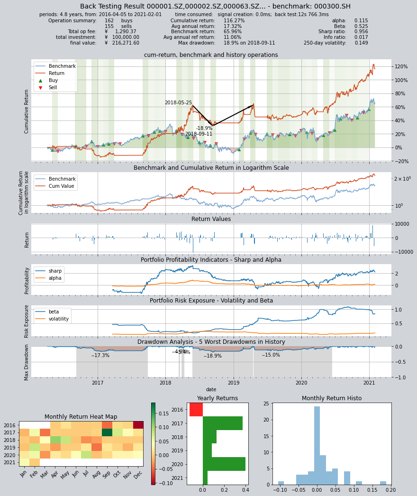

# 示例策略3: 集合竞价选股策略

本策略通过获取SHSE.000300沪深300的成份股数据并统计其30天内开盘价大于前收盘价的天数,并在该天数大于阈值10的时候加入股票池,随后对不在股票池的股票平仓并等权配置股票池的标的,每次交易间隔1个月.

回测数据为:SHSE.000300沪深300指数成份股
回测时间为:2016-04-05 到 2021-02-01


```python
import qteasy as qt
import pandas as pd
import numpy as np
```


```python
htypes = 'open, close'
shares = qt.filter_stock_codes(index='000300.SH', date='20220131')
print(shares[0:10])
dt = qt.get_history_data(htypes, shares=shares, asset_type='any', freq='m')

one_share = shares[24]

df = dt[one_share]

```

    ['000001.SZ', '000002.SZ', '000063.SZ', '000066.SZ', '000069.SZ', '000100.SZ', '000157.SZ', '000166.SZ', '000301.SZ', '000333.SZ']


### 第一种自定义策略设置方法，使用持仓数据和选股数据直接生成比例交易信号PS信号：
使用GeneralStrategy策略类，计算选股因子后，去掉所有小于零的因子，排序后提取排名前三十的股票
按以下逻辑生成交易信号：
1，检查当前持仓，如果持仓的股票未被选中，则全数卖出
2，检查当前持仓，如果新选中的股票没有持仓，则等权买入新增选中的股票

设置交易信号类型为PS，生成交易信号
由于生成交易信号需要用到持仓数据，因此不能使用批量生成模式，只能使用realtime模式


```python

class GroupPS(qt.GeneralStg):
    
    def realize(self, h, r=None, t=None, pars=None):
        
        # 读取策略参数（开盘价大于收盘价的天数）
        if pars is None:
            n_day = self.pars[0]
        else:
            n_day = pars[0]

        # 从历史数据编码中读取四种历史数据的最新数值
        opens = h[:, -30:, 0]  # 从前一交易日起前30天内开盘价
        closes = h[:, -31:-1, 1]  # 从两个交易日前开始前30天内收盘价
        
        # 从持仓数据中读取当前的持仓数量，并找到持仓股序号
        own_amounts = t[:, 0]
        owned = np.where(own_amounts > 0)[0]  # 所有持仓股的序号
        not_owned = np.where(own_amounts == 0)[0]  # 所有未持仓的股票序号
        
        # 选股因子为开盘价大于收盘价的天数，使用astype将True/False结果改为1/0，便于加总
        factors = ((opens - closes) > 0).astype('float')
        # 所有开盘价-收盘价>0的结果会被转化为1，其余结果转化为0，因此可以用sum得到开盘价大于收盘价的天数
        factors = factors.sum(axis=1)
        # 选出开盘价大于收盘价天数大于十天的所有股票的序号
        all_args = np.arange(len(factors))
        selected = np.where(factors > n_day)[0]
        not_selected = np.setdiff1d(all_args, selected)
        # 计算选出的股票的数量
        selected_count = len(selected)
        
        # 开始生成交易信号
        signal = np.zeros_like(factors)
        # 如果持仓为正，且未被选中，生成全仓卖出交易信号
        own_but_not_selected = np.intersect1d(owned, not_selected)
        signal[own_but_not_selected] = -1  # 在PS信号模式下 -1 代表全仓卖出
        
        if selected_count == 0:
            # 如果选中的数量为0，则不需要生成买入信号，可以直接返回只有卖出的信号
            return signal
        
        # 如果持仓为零，且被选中，生成全仓买入交易信号
        selected_but_not_own = np.intersect1d(not_owned, selected)
        signal[selected_but_not_own] = 1. / selected_count  # 在PS信号模式下，+1 代表全仓买进 （如果多只股票均同时全仓买进，则会根据资金总量平均分配资金）

        return signal
```
创建一个Operator对象，并回测交易策略

```python
alpha = GroupPS(pars=(10,),
                par_count=1,
                par_types=['int'],
                par_range=[(3, 25)],
                name='GroupPS',
                description='本策略每隔1个月定时触发, 从SHSE.000300成份股中选择过去30天内开盘价大于前收盘价的天数大于10天的股票买入',
                data_types='open, close',
                sample_freq='m',
                data_freq='d',
                window_length=32)  
op = qt.Operator(alpha, signal_type='PS')
op.op_type = 'stepwise'
op.set_parameter(0, (20,))
op.run(mode=1,
       asset_type='E',
       asset_pool=shares,
       trade_batch_size=100,
       sell_batch_size=1,
       trade_log=True)
print()
```
运行结果如下：

    
         ====================================
         |                                  |
         |       BACK TESTING RESULT        |
         |                                  |
         ====================================
    
    qteasy running mode: 1 - History back testing
    time consumption for operate signal creation: 0.0ms
    time consumption for operation back looping:  12s 766.3ms
    
    investment starts on      2016-04-05 00:00:00
    ends on                   2021-02-01 00:00:00
    Total looped periods:     4.8 years.
    
    -------------operation summary:------------
    Only non-empty shares are displayed, call 
    "loop_result["oper_count"]" for complete operation summary
    
              Sell Cnt Buy Cnt Total Long pct Short pct Empty pct
    000001.SZ    1        1      2     1.7%      0.0%     98.3%  
    000069.SZ    2        2      4     3.4%      0.0%     96.6%  
    000301.SZ    3        3      6    13.6%      0.0%     86.4%  
    000333.SZ    1        1      2     1.7%      0.0%     98.3%  
    000338.SZ    1        1      2     3.5%      0.0%     96.5%  
    000596.SZ    1        1      2     1.8%      0.0%     98.2%  
    000651.SZ    1        1      2     1.7%      0.0%     98.3%  
    000776.SZ    1        1      2     1.7%      0.0%     98.3%  
    000786.SZ    1        1      2     1.7%      0.0%     98.3%  
    000800.SZ    2        2      4     5.4%      0.0%     94.6%  
    ...            ...     ...   ...      ...       ...       ...
    603806.SH    2        2      4     3.6%      0.0%     96.4%  
    603939.SH    0        1      1     3.7%      0.0%     96.3%  
    688599.SH    0        1      1     3.7%      0.0%     96.3%  
    000408.SZ    1        1      2     1.7%      0.0%     98.3%  
    002648.SZ    2        2      4     3.4%      0.0%     96.6%  
    300751.SZ    1        1      2     1.7%      0.0%     98.3%  
    688065.SH    1        1      2     1.7%      0.0%     98.3%  
    600674.SH    2        2      4     3.7%      0.0%     96.3%  
    600803.SH    1        1      2     1.7%      0.0%     98.3%  
    601615.SH    1        1      2     1.7%      0.0%     98.3%   
    
    Total operation fee:     ¥    1,290.37
    total investment amount: ¥  100,000.00
    final value:              ¥  216,271.60
    Total return:                   116.27% 
    Avg Yearly return:               17.32%
    Skewness:                          0.29
    Kurtosis:                          7.52
    Benchmark return:                65.96% 
    Benchmark Yearly return:         11.06%
    
    ------strategy loop_results indicators------ 
    alpha:                            0.115
    Beta:                             0.525
    Sharp ratio:                      0.956
    Info ratio:                       0.017
    250 day volatility:               0.149
    Max drawdown:                    18.93% 
        peak / valley:        2018-05-25 / 2018-09-11
        recovered on:         2019-04-18
    
    ===========END OF REPORT=============
    


    

    

### 第二种自定义策略设置方，使用PT交易信号设置持仓目标：

在完成选股因子的计算之后，直接设置每个股票的持仓目标，这样就不需要使用知道持仓数据，直接输出持仓目标信号
，在回测过程中根据实际持仓量生成交易信号。
    


```python

class GroupPT(qt.GeneralStg):
    
    def realize(self, h, r=None, t=None, pars=None):

        # 读取策略参数（开盘价大于收盘价的天数）
        if pars is None:
            n_day = self.pars[0]
        else:
            n_day = pars[0]
        
        # 从历史数据编码中读取四种历史数据的最新数值
        opens = h[:, -30:, 0]  # 从前一交易日起前30天内开盘价
        closes = h[:, -31:-1, 1]  # 从两个交易日前开始前30天内收盘价
        
        # 选股因子为开盘价大于收盘价的天数，使用astype将True/False结果改为1/0，便于加总
        factors = ((opens - closes) > 0).astype('float')
        # 所有开盘价-收盘价>0的结果会被转化为1，其余结果转化为0，因此可以用sum得到开盘价大于收盘价的天数
        factors = factors.sum(axis=1)
        
        # 选出开盘价大于收盘价天数大于十天的所有股票的序号
        all_args = np.arange(len(factors))
        selected = np.where(factors > n_day)[0]
        not_selected = np.setdiff1d(all_args, selected)
        # 计算选出的股票的数量
        selected_count = len(selected)
        
        # 开始生成交易信号
        signal = np.zeros_like(factors)
        if selected_count == 0:
            return signal
        # 所有被选中的股票均设置为正持仓目标
        signal[selected] = 1. / selected_count  
        # 未被选中的股票持仓目标被设置为0
        signal[not_selected] = 0
        
        return signal
    
```
创建一个Operator对象，开始回测交易策略

```python
alpha = GroupPT(pars=(10,),
                par_count=1,
                par_types=['int'],
                par_range=[(3, 25)],
                name='GroupPS',
                description='本策略每隔1个月定时触发, 从SHSE.000300成份股中选择过去30天内开盘价大于前收盘价的天数大于10天的股票买入',
                data_types='open, close',
                sample_freq='m',
                data_freq='d',
                window_length=32)  
op = qt.Operator(alpha, signal_type='PT')
op.op_type = 'batch'
op.set_parameter(0, (20,))
op.run(mode=1,
       asset_type='E',
       asset_pool=shares,
       trade_batch_size=100,
       sell_batch_size=1,
       trade_log=True)
print()
```
交易回测结果如下：
    
         ====================================
         |                                  |
         |       BACK TESTING RESULT        |
         |                                  |
         ====================================
    
    qteasy running mode: 1 - History back testing
    time consumption for operate signal creation: 399.1ms
    time consumption for operation back looping:  8s 621.5ms
    
    investment starts on      2016-04-05 00:00:00
    ends on                   2021-02-01 00:00:00
    Total looped periods:     4.8 years.
    
    -------------operation summary:------------
    Only non-empty shares are displayed, call 
    "loop_result["oper_count"]" for complete operation summary
    
              Sell Cnt Buy Cnt Total Long pct Short pct Empty pct
    000001.SZ    1        1       2    1.7%      0.0%     98.3%  
    000069.SZ    2        2       4    3.4%      0.0%     96.6%  
    000301.SZ    6        5      11   13.6%      0.0%     86.4%  
    000338.SZ    1        1       2    1.7%      0.0%     98.3%  
    000596.SZ    1        1       2    1.8%      0.0%     98.2%  
    000625.SZ    1        1       2    1.7%      0.0%     98.3%  
    000661.SZ    1        1       2    1.7%      0.0%     98.3%  
    000776.SZ    1        1       2    1.7%      0.0%     98.3%  
    000786.SZ    1        1       2    1.7%      0.0%     98.3%  
    000800.SZ    2        3       5    5.4%      0.0%     94.6%  
    ...            ...     ...   ...      ...       ...       ...
    603806.SH    2        2       4    3.6%      0.0%     96.4%  
    603939.SH    0        2       2    3.7%      0.0%     96.3%  
    688599.SH    0        2       2    3.7%      0.0%     96.3%  
    000408.SZ    1        1       2    1.7%      0.0%     98.3%  
    002648.SZ    1        1       2    1.7%      0.0%     98.3%  
    300751.SZ    1        1       2    1.7%      0.0%     98.3%  
    688065.SH    1        1       2    1.7%      0.0%     98.3%  
    600674.SH    2        2       4    3.7%      0.0%     96.3%  
    600803.SH    1        1       2    1.7%      0.0%     98.3%  
    601615.SH    1        1       2    1.7%      0.0%     98.3%   
    
    Total operation fee:     ¥    1,375.35
    total investment amount: ¥  100,000.00
    final value:              ¥  216,215.03
    Total return:                   116.22% 
    Avg Yearly return:               17.31%
    Skewness:                          0.23
    Kurtosis:                          6.63
    Benchmark return:                65.96% 
    Benchmark Yearly return:         11.06%
    
    ------strategy loop_results indicators------ 
    alpha:                            0.110
    Beta:                             0.542
    Sharp ratio:                      1.015
    Info ratio:                       0.017
    250 day volatility:               0.139
    Max drawdown:                    18.58% 
        peak / valley:        2016-04-14 / 2017-01-16
        recovered on:         2017-09-27
    
    ===========END OF REPORT=============
    

    

    

