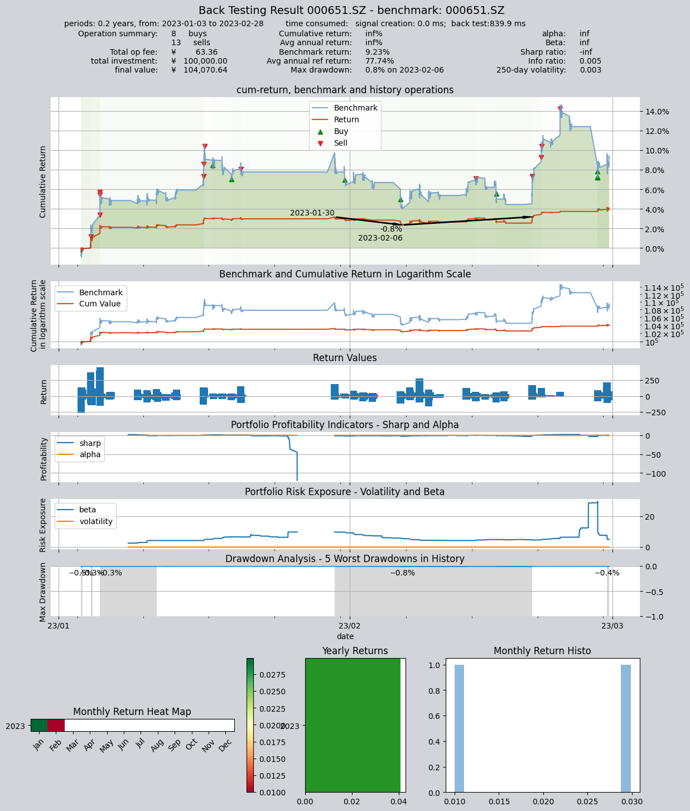

# 示例策略13: 经典网格交易策略

本策略是一个经典的网格交易策略
策略的运行标的是000651.SZ格力电器，策略第一次运行时，买入1000股并持有，同时设定当前买入价格（四舍五入到0.1元）为基准网格，
并根据网格尺寸计算出卖出网格和买入网格， 接下来每隔5分钟运行一次，当股票价格触及买入网格或卖出网格时，产生交易信号，并刷新网格：

例如：
- 假设当前基准网格为30元，网格尺寸为0.5元，卖出网格为30.5元，买入网格为29.5元
- 当价格触及卖出网格30.5元时，产生卖出信号，卖出200股并更新基准网格为30.5元，同时计算出新的卖出网格31元和买入网格30元

交易回测的标的是：000651.SZ格力电器，

交易回测区间是：2023年1月1日至2023年3月1日

注，由于策略网格参数在每次交易以后都会被刷新，因此该策略只能以stepwise方式进行回测，为了方便生成交易信号，该策略使用了VS信号类型

```python
import qteasy as qt
import pandas as pd
import numpy as np
```


```python
class GridTrade(qt.RuleIterator):
    
    def realize(self, h, r=None, t=None, pars=None):
        
        # 读取当前保存的策略参数，首次运行时base_grid参数为0，此时买入1000股并设置当前价格为基准网格
        grid_size, trade_batch, base_grid = self.pars

        # 读取最新价格
        price = h[-1, 0]  # 最近一个K线周期的close价格
        
        # 计算当前价格与当前网格的偏离程度，判断是否产生交易信号
        if base_grid <= 0.01:
            # 基准网格尚未设置，此时为首次运行，首次买入1000股并设置基准网格为当前价格（精确到0.1元）
            result = 1510
            base_grid = np.round(price / 0.1) * 0.1
        elif price - base_grid > grid_size:
            # 触及卖出网格线，产生卖出信号
            result = - trade_batch  # 交易信号等于交易数量，必须使用VS信号类型
            # 重新计算基准网格
            base_grid += grid_size 
        elif base_grid - price > grid_size:
            # 触及买入网格线，产生买入信号
            result = trade_batch + 10
            # 重新计算基准网格
            base_grid -= grid_size
        else:
            result = 0
        
        # 使用新的基准网格更新交易参数
        self.pars = grid_size, trade_batch, base_grid
        
        return result
            
```


```python
alpha = GridTrade(pars=(0.5, 200, 0.0),  # 当基准网格为0时，代表首次运行，此时买入1000股，并设置当前价为基准网格
                   par_count=3,
                   par_types=['float', 'int', 'float'],
                   par_range=[(0.2, 2), (100, 300), (0, 40)],
                   name='GridTrade',
                   description='网格交易策略，当前股票价格波动幅度超过网格尺寸时，产生卖出或买入交易信号，并更新网格',
                   strategy_run_timing='close',
                   strategy_run_freq='5min',
                   data_freq='5min',
                   window_length=20,
                  ) 

op = qt.Operator(alpha, signal_type='VS')  # 交易信号等于交易数量，必须使用VS信号类型
op.op_type = 'stepwise'  # 需要动态更新策略参数，必须使用'stepwise'交易类型
op.set_parameter(0, (0.5, 200, 0.0))
op.run(mode=1,
       asset_type='E',
       asset_pool='000651.SZ',
       benchmark_asset='000651.SZ',
       benchmark_asset_type='E',
       benchmark_dtype='close',
       trade_batch_size=100,
       sell_batch_size=1,
       trade_log=True,
       invest_start='20230101',
       invest_end='20230301',
       backtest_price_adj='none',
      )
print()
```
回测的结果如下：
    
         ====================================
         |                                  |
         |       BACK TESTING RESULT        |
         |                                  |
         ====================================
    
    qteasy running mode: 1 - History back testing
    time consumption for operate signal creation: 0.0 ms
    time consumption for operation back looping:  839.9 ms
    
    investment starts on      2023-01-03 09:30:00
    ends on                   2023-02-28 15:00:00
    Total looped periods:     0.2 years.
    
    -------------operation summary:------------
    Only non-empty shares are displayed, call 
    "loop_result["oper_count"]" for complete operation summary
    
              Sell Cnt Buy Cnt Total Long pct Short pct Empty pct
    000651.SZ    13       8      21   93.0%      0.0%      7.0%   
    
    Total operation fee:     ¥       63.36
    total investment amount: ¥  100,000.00
    final value:              ¥  104,070.64
    Total return:                      inf% 
    Avg Yearly return:                 inf%
    Skewness:                          3.79
    Kurtosis:                         52.19
    Benchmark return:                 9.23% 
    Benchmark Yearly return:         77.74%
    
    ------strategy loop_results indicators------ 
    alpha:                              inf
    Beta:                               inf
    Sharp ratio:                       -inf
    Info ratio:                       0.005
    250 day volatility:               0.003
    Max drawdown:                     0.80% 
        peak / valley:        2023-01-30 / 2023-02-06
        recovered on:         2023-02-20
    
    ===========END OF REPORT=============
    


    

    


    


```python

```
