### 回测内置策略

测试内置的择时策略和选股策略
每种策略进行一次回测，回测区间苁1996年到2021年，测试使用默认策略参数，测试参数如下：

* 回测区间起止日期：1996-04-13 —— 2021-04-13，持续25年
* 测试投资标的： “000001.SH”上证指数
* 业绩参考标准： “000001.SH”上证指数


```python
import sys
sys.path.append('../')
import qteasy as qt
%matplotlib inline
```


```python
op = qt.Operator(timing_types=['crossline'])
op.set_parameter('t-0', pars=(35, 120, 10, 'buy'))
res = qt.run(op, mode=1, 
             invest_start='19960413',
             invest_end='20210413',
             asset_pool='000001.SH', asset_type='I', reference_asset='000001.SH')
```

    Progress: [########################################] 1/1. 100.0%  Extracting data local files
         ====================================
         |                                  |
         |       BACK TESTING RESULT        |
         |                                  |
         ====================================
    
    qteasy running mode: 1 - History back testing
    time consumption for operate signal creation: 65.8ms
    time consumption for operation back looping:  233.1ms
    
    investment starts on      1996-04-15 00:00:00
    ends on                   2021-04-13 00:00:00
    Total looped periods:     25.0 years.
    
    -------------operation summary:------------ 
                sell   buy  total
    000001.SH  29.0  29.0   58.0
    Total operation fee:     ¥    6,977.38
    total investment amount: ¥  100,000.00
    final value:              ¥1,101,743.42
    Total return:                  1001.74% 
    Avg Yearly return:               10.07%
    Skewness:                         -0.72
    Kurtosis:                         11.95
    Benchmark return:               480.92% 
    Benchmark Yearly return:          7.29%
    
    ------strategy loop_results indicators------ 
    alpha:                              inf
    Beta:                               inf
    Sharp ratio:                       -inf
    Info ratio:                       0.004
    250 day volatility:               0.161
    Max drawdown:                    45.38% 
        peak / valley:        2015-06-12 / 2020-02-03
        recovered on:         NaT
    
    
    ===========END OF REPORT=============
    


    
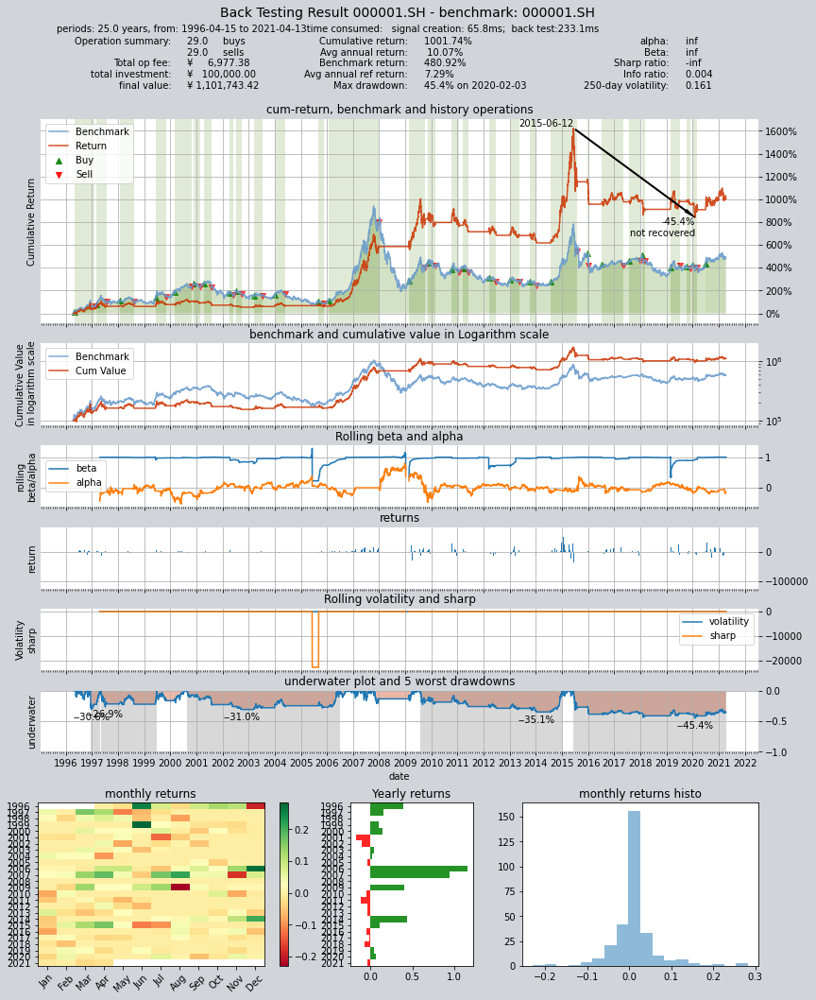
    


```python
op = qt.Operator(timing_types=['macd'])
res = qt.run(op, mode=1)
```

    Progress: [########################################] 1/1. 100.0%  Extracting data local files
         ====================================
         |                                  |
         |       BACK TESTING RESULT        |
         |                                  |
         ====================================
    
    qteasy running mode: 1 - History back testing
    time consumption for operate signal creation: 100.3ms
    time consumption for operation back looping:  217.7ms
    
    investment starts on      1996-04-15 00:00:00
    ends on                   2021-04-13 00:00:00
    Total looped periods:     25.0 years.
    
    -------------operation summary:------------ 
                 sell    buy  total
    000001.SH  219.0  220.0  439.0
    Total operation fee:     ¥   68,706.47
    total investment amount: ¥  100,000.00
    final value:              ¥2,052,326.42
    Total return:                  1952.33% 
    Avg Yearly return:               12.84%
    Skewness:                         -0.09
    Kurtosis:                         13.61
    Benchmark return:               480.92% 
    Benchmark Yearly return:          7.29%
    
    ------strategy loop_results indicators------ 
    alpha:                            0.033
    Beta:                             1.008
    Sharp ratio:                      0.046
    Info ratio:                       0.012
    250 day volatility:               0.162
    Max drawdown:                    38.31% 
        peak / valley:        2008-01-14 / 2008-10-15
        recovered on:         2009-07-20
    
    
    ===========END OF REPORT=============
    


    
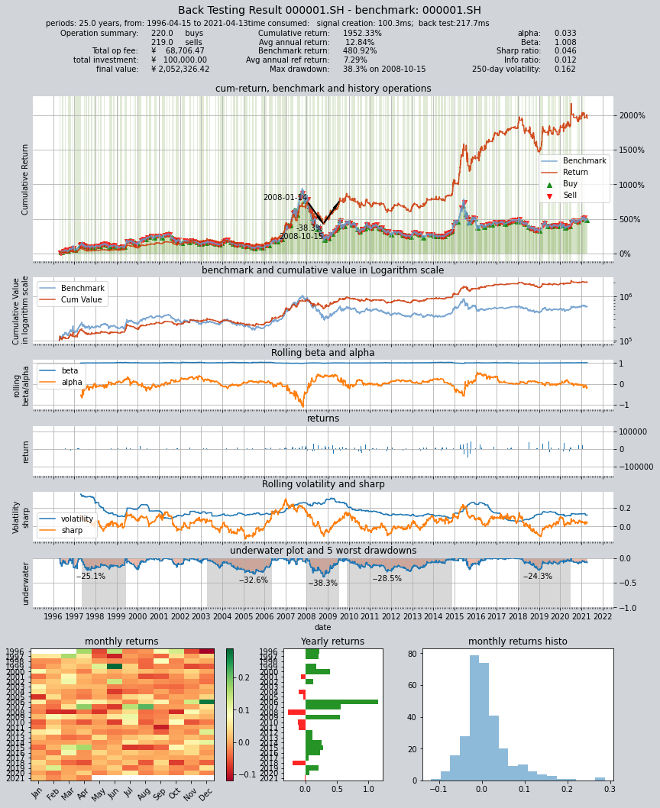
    


```python
op = qt.Operator(timing_types=['dma'])
res = qt.run(op, mode=1)
```

    Progress: [########################################] 1/1. 100.0%  Extracting data local files
         ====================================
         |                                  |
         |       BACK TESTING RESULT        |
         |                                  |
         ====================================
    
    qteasy running mode: 1 - History back testing
    time consumption for operate signal creation: 21.2ms
    time consumption for operation back looping:  201.4ms
    
    investment starts on      1996-04-15 00:00:00
    ends on                   2021-04-13 00:00:00
    Total looped periods:     25.0 years.
    
    -------------operation summary:------------ 
                 sell    buy  total
    000001.SH  209.0  210.0  419.0
    Total operation fee:     ¥   44,465.76
    total investment amount: ¥  100,000.00
    final value:              ¥1,228,955.07
    Total return:                  1128.96% 
    Avg Yearly return:               10.55%
    Skewness:                         -0.34
    Kurtosis:                         13.59
    Benchmark return:               480.92% 
    Benchmark Yearly return:          7.29%
    
    ------strategy loop_results indicators------ 
    alpha:                            0.003
    Beta:                             1.000
    Sharp ratio:                      0.037
    Info ratio:                       0.005
    250 day volatility:               0.162
    Max drawdown:                    41.97% 
        peak / valley:        2007-10-16 / 2009-01-15
        recovered on:         2015-03-23
    
    
    ===========END OF REPORT=============
    


    
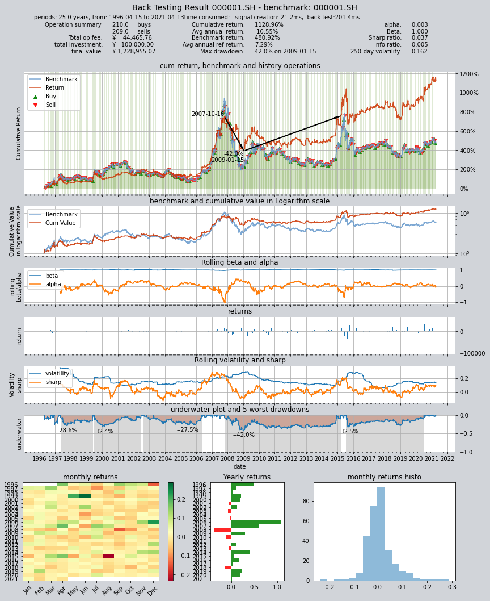
    


```python
op = qt.Operator(timing_types=['trix'])
res = qt.run(op, mode=1)
```

    Progress: [########################################] 1/1. 100.0%  Extracting data local files
         ====================================
         |                                  |
         |       BACK TESTING RESULT        |
         |                                  |
         ====================================
    
    qteasy running mode: 1 - History back testing
    time consumption for operate signal creation: 81.4ms
    time consumption for operation back looping:  195.1ms
    
    investment starts on      1996-04-15 00:00:00
    ends on                   2021-04-13 00:00:00
    Total looped periods:     25.0 years.
    
    -------------operation summary:------------ 
                sell   buy  total
    000001.SH  47.0  47.0   94.0
    Total operation fee:     ¥    7,005.28
    total investment amount: ¥  100,000.00
    final value:              ¥  701,802.93
    Total return:                   601.80% 
    Avg Yearly return:                8.10%
    Skewness:                         -0.85
    Kurtosis:                         12.08
    Benchmark return:               480.92% 
    Benchmark Yearly return:          7.29%
    
    ------strategy loop_results indicators------ 
    alpha:                           -0.020
    Beta:                             0.984
    Sharp ratio:                      0.024
    Info ratio:                      -0.003
    250 day volatility:               0.167
    Max drawdown:                    39.08% 
        peak / valley:        2015-06-12 / 2019-01-03
        recovered on:         NaT
    
    
    ===========END OF REPORT=============
    


    
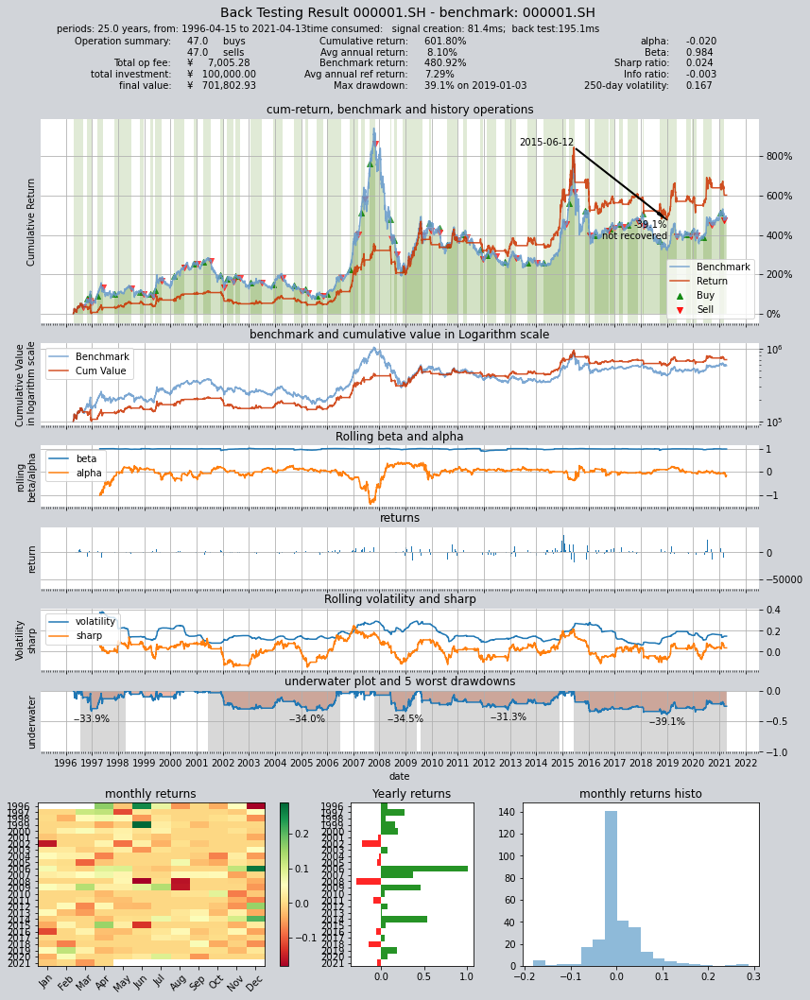
    


```python
op = qt.Operator(timing_types=['cdl'])
res = qt.run(op, mode=1)
```

    Progress: [########################################] 1/1. 100.0%  Extracting data local files
         ====================================
         |                                  |
         |       BACK TESTING RESULT        |
         |                                  |
         ====================================
    
    qteasy running mode: 1 - History back testing
    time consumption for operate signal creation: 111.3ms
    time consumption for operation back looping:  169.3ms
    
    investment starts on      1996-04-15 00:00:00
    ends on                   2021-04-13 00:00:00
    Total looped periods:     25.0 years.
    
    -------------operation summary:------------ 
                sell  buy  total
    000001.SH   0.0  1.0    1.0
    Total operation fee:     ¥       29.99
    total investment amount: ¥  100,000.00
    final value:              ¥  580,746.64
    Total return:                   480.75% 
    Avg Yearly return:                7.29%
    Skewness:                         -0.24
    Kurtosis:                          5.19
    Benchmark return:               480.92% 
    Benchmark Yearly return:          7.29%
    
    ------strategy loop_results indicators------ 
    alpha:                            0.000
    Beta:                             1.000
    Sharp ratio:                      0.021
    Info ratio:                      -0.012
    250 day volatility:               0.240
    Max drawdown:                    71.98% 
        peak / valley:        2007-10-16 / 2008-11-04
        recovered on:         NaT
    
    
    ===========END OF REPORT=============
    


    
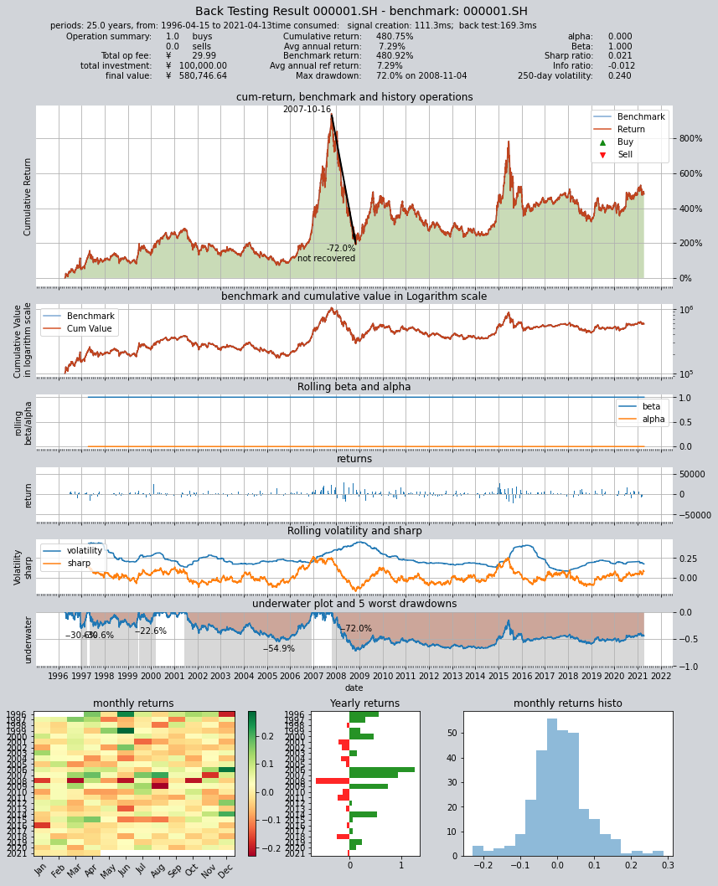
    


```python
op = qt.Operator(timing_types=['bband'])
res = qt.run(op, mode=1)
```

    Progress: [########################################] 1/1. 100.0%  Extracting data local files
         ====================================
         |                                  |
         |       BACK TESTING RESULT        |
         |                                  |
         ====================================
    
    qteasy running mode: 1 - History back testing
    time consumption for operate signal creation: 65.5ms
    time consumption for operation back looping:  252.6ms
    
    investment starts on      1996-04-15 00:00:00
    ends on                   2021-04-13 00:00:00
    Total looped periods:     25.0 years.
    
    -------------operation summary:------------ 
                 sell    buy  total
    000001.SH  271.0  269.0  540.0
    Total operation fee:     ¥   52,073.15
    total investment amount: ¥  100,000.00
    final value:              ¥  966,210.00
    Total return:                   866.21% 
    Avg Yearly return:                9.49%
    Skewness:                         -0.51
    Kurtosis:                         13.60
    Benchmark return:               480.92% 
    Benchmark Yearly return:          7.29%
    
    ------strategy loop_results indicators------ 
    alpha:                           -0.013
    Beta:                             0.998
    Sharp ratio:                      0.023
    Info ratio:                       0.002
    250 day volatility:               0.163
    Max drawdown:                    35.96% 
        peak / valley:        2015-12-22 / 2020-02-03
        recovered on:         NaT
    
    
    ===========END OF REPORT=============
    


    
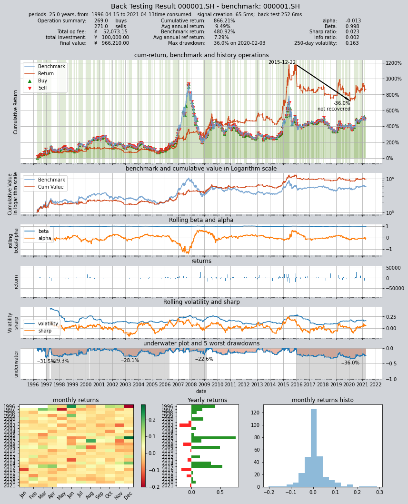
    


```python
op = qt.Operator(timing_types=['s-bband'])
res = qt.run(op, mode=1)
```

    Progress: [########################################] 1/1. 100.0%  Extracting data local files
         ====================================
         |                                  |
         |       BACK TESTING RESULT        |
         |                                  |
         ====================================
    
    qteasy running mode: 1 - History back testing
    time consumption for operate signal creation: 159.6ms
    time consumption for operation back looping:  681.4ms
    
    investment starts on      1996-04-15 00:00:00
    ends on                   2021-04-13 00:00:00
    Total looped periods:     25.0 years.
    
    -------------operation summary:------------ 
                 sell    buy  total
    000001.SH  271.0  269.0  540.0
    Total operation fee:     ¥   45,307.88
    total investment amount: ¥  100,000.00
    final value:              ¥  755,180.84
    Total return:                   655.18% 
    Avg Yearly return:                8.42%
    Skewness:                         -0.52
    Kurtosis:                         14.36
    Benchmark return:               480.92% 
    Benchmark Yearly return:          7.29%
    
    ------strategy loop_results indicators------ 
    alpha:                           -0.022
    Beta:                             0.991
    Sharp ratio:                      0.025
    Info ratio:                      -0.002
    250 day volatility:               0.166
    Max drawdown:                    30.47% 
        peak / valley:        1996-12-11 / 1996-12-24
        recovered on:         1997-04-03
    
    
    ===========END OF REPORT=============
    


    
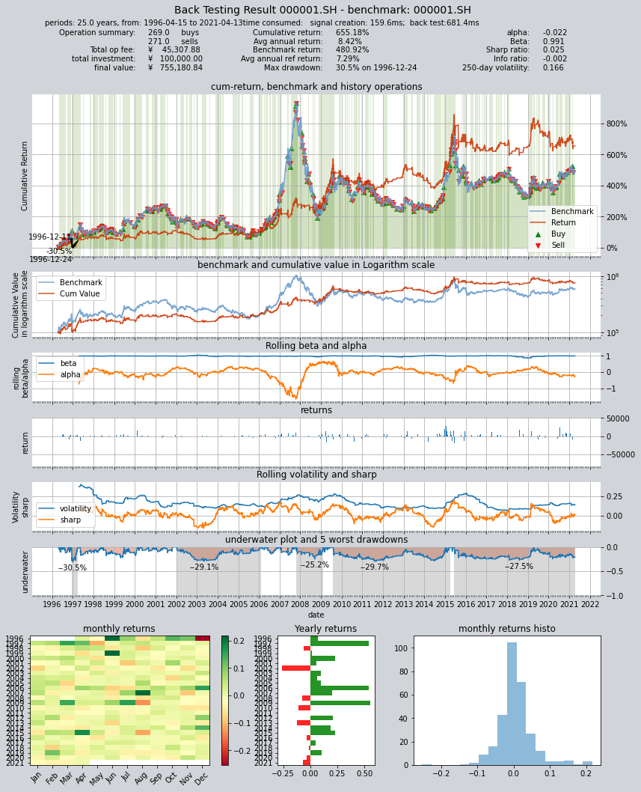
    


```python
op = qt.Operator(timing_types=['sarext'])
res = qt.run(op, mode=1)
```

    Progress: [########################################] 1/1. 100.0%  Extracting data local files
         ====================================
         |                                  |
         |       BACK TESTING RESULT        |
         |                                  |
         ====================================
    
    qteasy running mode: 1 - History back testing
    time consumption for operate signal creation: 86.3ms
    time consumption for operation back looping:  291.0ms
    
    investment starts on      1996-04-15 00:00:00
    ends on                   2021-04-13 00:00:00
    Total looped periods:     25.0 years.
    
    -------------operation summary:------------ 
                 sell    buy   total
    000001.SH  521.0  521.0  1042.0
    Total operation fee:     ¥   37,362.71
    total investment amount: ¥  100,000.00
    final value:              ¥  158,779.67
    Total return:                    58.78% 
    Avg Yearly return:                1.87%
    Skewness:                         -0.92
    Kurtosis:                         24.71
    Benchmark return:               480.92% 
    Benchmark Yearly return:          7.29%
    
    ------strategy loop_results indicators------ 
    alpha:                           -0.096
    Beta:                             0.984
    Sharp ratio:                      0.017
    Info ratio:                      -0.022
    250 day volatility:               0.119
    Max drawdown:                    50.55% 
        peak / valley:        2015-08-17 / 2020-02-03
        recovered on:         NaT
    
    
    ===========END OF REPORT=============
    


    
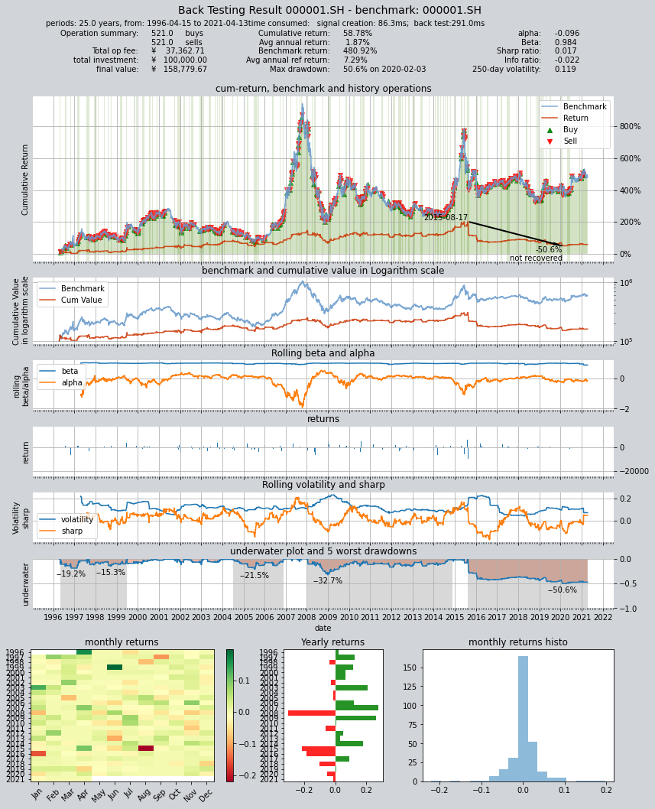
    


```python
op = qt.Operator(timing_types=['ssma'])
res = qt.run(op, mode=1)
```

    Progress: [########################################] 1/1. 100.0%  Extracting data local files
         ====================================
         |                                  |
         |       BACK TESTING RESULT        |
         |                                  |
         ====================================
    
    qteasy running mode: 1 - History back testing
    time consumption for operate signal creation: 50.2ms
    time consumption for operation back looping:  252.5ms
    
    investment starts on      1996-04-15 00:00:00
    ends on                   2021-04-13 00:00:00
    Total looped periods:     25.0 years.
    
    -------------operation summary:------------ 
                 sell    buy  total
    000001.SH  354.0  354.0  708.0
    Total operation fee:     ¥  303,657.97
    total investment amount: ¥  100,000.00
    final value:              ¥5,440,610.18
    Total return:                  5340.61% 
    Avg Yearly return:               17.33%
    Skewness:                         -0.22
    Kurtosis:                         12.72
    Benchmark return:               480.92% 
    Benchmark Yearly return:          7.29%
    
    ------strategy loop_results indicators------ 
    alpha:                            0.083
    Beta:                             1.016
    Sharp ratio:                      0.056
    Info ratio:                       0.025
    250 day volatility:               0.158
    Max drawdown:                    30.57% 
        peak / valley:        2007-10-16 / 2009-01-15
        recovered on:         2009-06-24
    
    
    ===========END OF REPORT=============
    


    
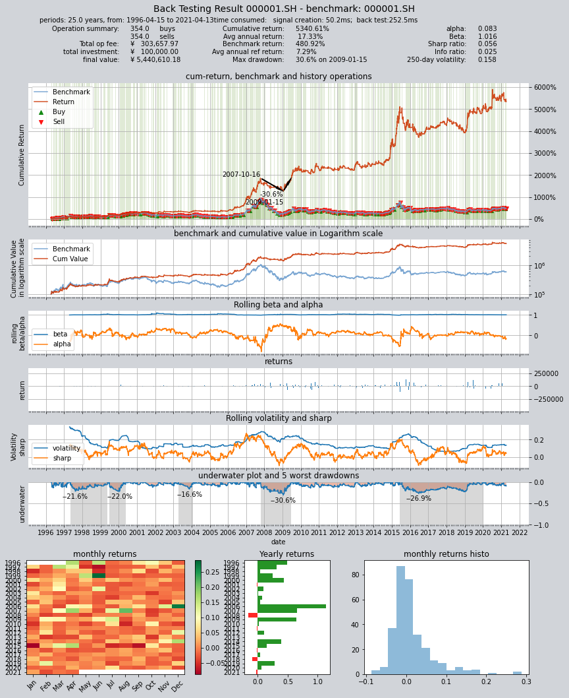
    


```python
op = qt.Operator(timing_types=['sdema'])
res = qt.run(op, mode=1)
```

    Progress: [########################################] 1/1. 100.0%  Extracting data local files
         ====================================
         |                                  |
         |       BACK TESTING RESULT        |
         |                                  |
         ====================================
    
    qteasy running mode: 1 - History back testing
    time consumption for operate signal creation: 68.7ms
    time consumption for operation back looping:  309.0ms
    
    investment starts on      1996-04-15 00:00:00
    ends on                   2021-04-13 00:00:00
    Total looped periods:     25.0 years.
    
    -------------operation summary:------------ 
                 sell    buy   total
    000001.SH  674.0  674.0  1348.0
    Total operation fee:     ¥  260,519.47
    total investment amount: ¥  100,000.00
    final value:              ¥2,006,911.57
    Total return:                  1906.91% 
    Avg Yearly return:               12.74%
    Skewness:                          0.25
    Kurtosis:                         14.52
    Benchmark return:               480.92% 
    Benchmark Yearly return:          7.29%
    
    ------strategy loop_results indicators------ 
    alpha:                            0.016
    Beta:                             1.007
    Sharp ratio:                      0.043
    Info ratio:                       0.011
    250 day volatility:               0.158
    Max drawdown:                    36.76% 
        peak / valley:        2007-10-16 / 2008-11-04
        recovered on:         2009-07-02
    
    
    ===========END OF REPORT=============
    


    
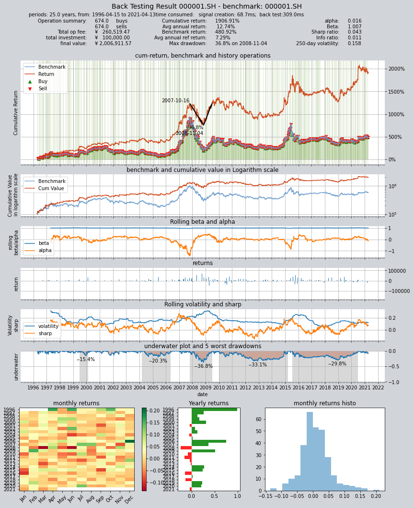
    


```python
op = qt.Operator(timing_types=['sema'])
res = qt.run(op, mode=1)
```

    Progress: [########################################] 1/1. 100.0%  Extracting data local files
         ====================================
         |                                  |
         |       BACK TESTING RESULT        |
         |                                  |
         ====================================
    
    qteasy running mode: 1 - History back testing
    time consumption for operate signal creation: 78.2ms
    time consumption for operation back looping:  1s 36.4ms
    
    investment starts on      1996-04-15 00:00:00
    ends on                   2021-04-13 00:00:00
    Total looped periods:     25.0 years.
    
    -------------operation summary:------------ 
                 sell    buy  total
    000001.SH  377.0  377.0  754.0
    Total operation fee:     ¥  375,361.50
    total investment amount: ¥  100,000.00
    final value:              ¥6,057,374.43
    Total return:                  5957.37% 
    Avg Yearly return:               17.83%
    Skewness:                         -0.29
    Kurtosis:                         12.79
    Benchmark return:               480.92% 
    Benchmark Yearly return:          7.29%
    
    ------strategy loop_results indicators------ 
    alpha:                            0.088
    Beta:                             1.018
    Sharp ratio:                      0.057
    Info ratio:                       0.026
    250 day volatility:               0.158
    Max drawdown:                    28.85% 
        peak / valley:        2007-10-16 / 2009-01-15
        recovered on:         2009-06-29
    
    
    ===========END OF REPORT=============
    


    
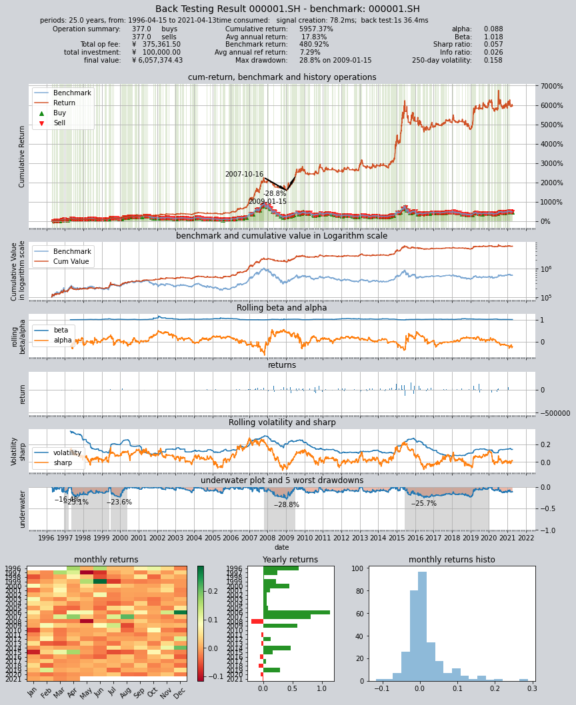
    


```python
op = qt.Operator(timing_types=['sht'])
res = qt.run(op, mode=1)
```

    Progress: [########################################] 1/1. 100.0%  Extracting data local files
         ====================================
         |                                  |
         |       BACK TESTING RESULT        |
         |                                  |
         ====================================
    
    qteasy running mode: 1 - History back testing
    time consumption for operate signal creation: 173.9ms
    time consumption for operation back looping:  264.1ms
    
    investment starts on      1996-04-15 00:00:00
    ends on                   2021-04-13 00:00:00
    Total looped periods:     25.0 years.
    
    -------------operation summary:------------ 
                 sell    buy  total
    000001.SH  246.0  246.0  492.0
    Total operation fee:     ¥  227,437.04
    total investment amount: ¥  100,000.00
    final value:              ¥5,709,997.92
    Total return:                  5610.00% 
    Avg Yearly return:               17.55%
    Skewness:                         -0.39
    Kurtosis:                         12.54
    Benchmark return:               480.92% 
    Benchmark Yearly return:          7.29%
    
    ------strategy loop_results indicators------ 
    alpha:                            0.082
    Beta:                             1.014
    Sharp ratio:                      0.054
    Info ratio:                       0.026
    250 day volatility:               0.161
    Max drawdown:                    22.16% 
        peak / valley:        1997-05-12 / 1997-12-18
        recovered on:         1999-05-27
    
    
    ===========END OF REPORT=============
    


    
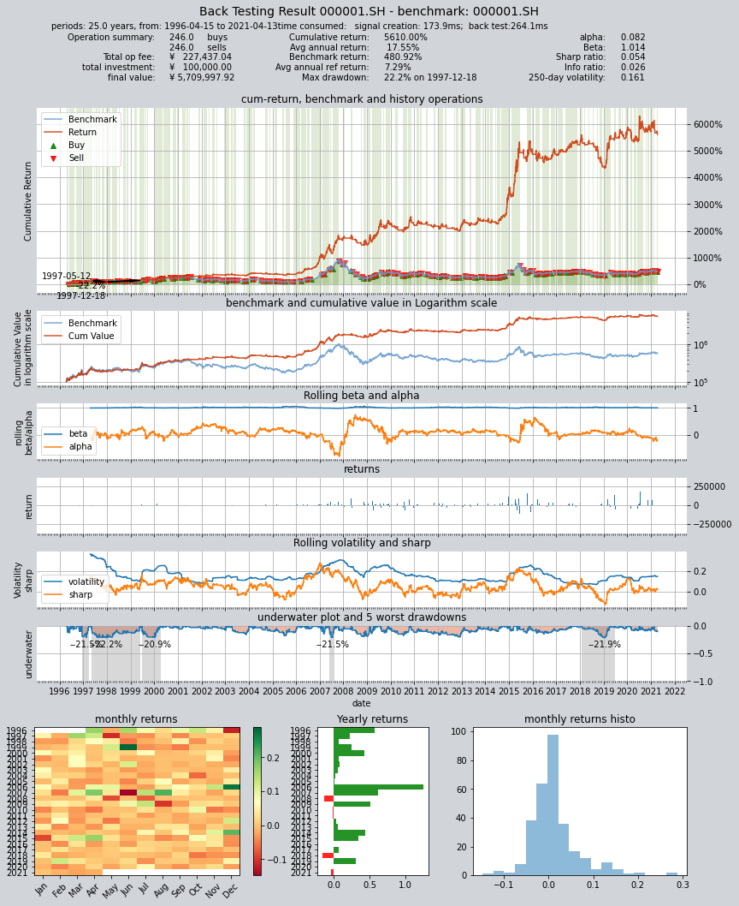
    


```python
op = qt.Operator(timing_types=['skama'])
res = qt.run(op, mode=1)
```

    Progress: [########################################] 1/1. 100.0%  Extracting data local files
         ====================================
         |                                  |
         |       BACK TESTING RESULT        |
         |                                  |
         ====================================
    
    qteasy running mode: 1 - History back testing
    time consumption for operate signal creation: 52.3ms
    time consumption for operation back looping:  239.7ms
    
    investment starts on      1996-04-15 00:00:00
    ends on                   2021-04-13 00:00:00
    Total looped periods:     25.0 years.
    
    -------------operation summary:------------ 
                 sell    buy  total
    000001.SH  331.0  331.0  662.0
    Total operation fee:     ¥  129,900.54
    total investment amount: ¥  100,000.00
    final value:              ¥1,676,767.63
    Total return:                  1576.77% 
    Avg Yearly return:               11.93%
    Skewness:                         -0.32
    Kurtosis:                         14.01
    Benchmark return:               480.92% 
    Benchmark Yearly return:          7.29%
    
    ------strategy loop_results indicators------ 
    alpha:                            0.018
    Beta:                             1.018
    Sharp ratio:                      0.039
    Info ratio:                       0.008
    250 day volatility:               0.154
    Max drawdown:                    34.35% 
        peak / valley:        2007-10-16 / 2008-11-11
        recovered on:         2009-07-15
    
    
    ===========END OF REPORT=============
    


    
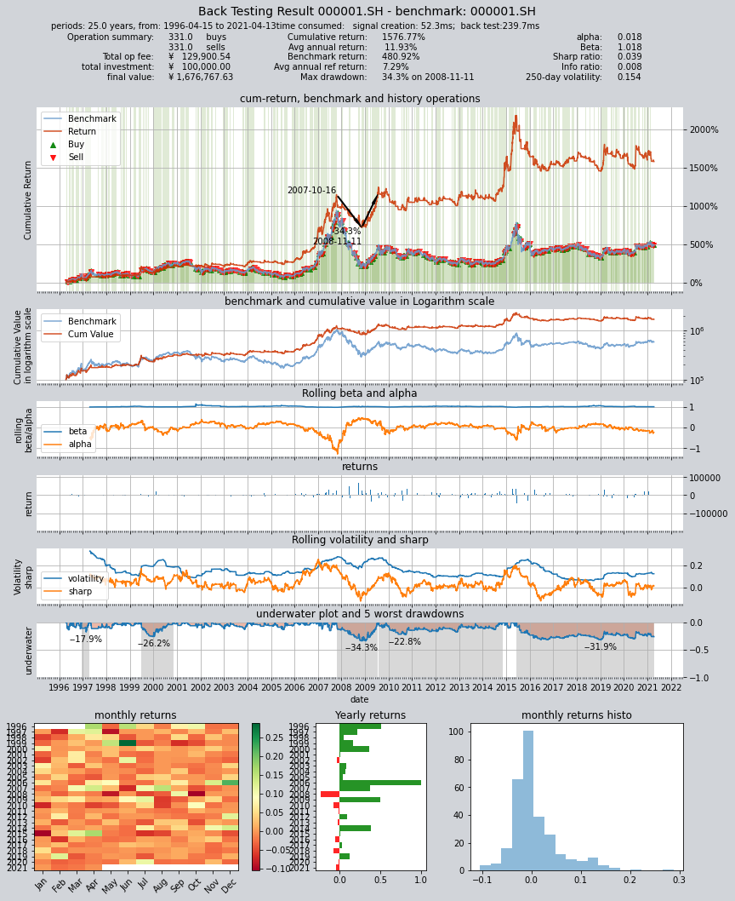
    


```python
op = qt.Operator(timing_types=['smama'])
res = qt.run(op, mode=1)
```

    Progress: [########################################] 1/1. 100.0%  Extracting data local files
         ====================================
         |                                  |
         |       BACK TESTING RESULT        |
         |                                  |
         ====================================
    
    qteasy running mode: 1 - History back testing
    time consumption for operate signal creation: 390.4ms
    time consumption for operation back looping:  745.4ms
    
    investment starts on      1996-04-15 00:00:00
    ends on                   2021-04-13 00:00:00
    Total looped periods:     25.0 years.
    
    -------------operation summary:------------ 
                 sell    buy  total
    000001.SH  494.0  494.0  988.0
    Total operation fee:     ¥  352,285.02
    total investment amount: ¥  100,000.00
    final value:              ¥4,176,033.30
    Total return:                  4076.03% 
    Avg Yearly return:               16.09%
    Skewness:                         -0.11
    Kurtosis:                         13.84
    Benchmark return:               480.92% 
    Benchmark Yearly return:          7.29%
    
    ------strategy loop_results indicators------ 
    alpha:                            0.060
    Beta:                             1.014
    Sharp ratio:                      0.050
    Info ratio:                       0.021
    250 day volatility:               0.157
    Max drawdown:                    24.66% 
        peak / valley:        2015-07-23 / 2018-12-14
        recovered on:         2020-07-06
    
    
    ===========END OF REPORT=============
    


    

    


```python
op = qt.Operator(timing_types=['sfama'])
res = qt.run(op, mode=1)
```

    Progress: [########################################] 1/1. 100.0%  Extracting data local files
         ====================================
         |                                  |
         |       BACK TESTING RESULT        |
         |                                  |
         ====================================
    
    qteasy running mode: 1 - History back testing
    time consumption for operate signal creation: 266.8ms
    time consumption for operation back looping:  393.2ms
    
    investment starts on      1996-04-15 00:00:00
    ends on                   2021-04-13 00:00:00
    Total looped periods:     25.0 years.
    
    -------------operation summary:------------ 
                 sell    buy  total
    000001.SH  269.0  269.0  538.0
    Total operation fee:     ¥  176,366.88
    total investment amount: ¥  100,000.00
    final value:              ¥3,578,401.38
    Total return:                  3478.40% 
    Avg Yearly return:               15.38%
    Skewness:                         -0.57
    Kurtosis:                         13.67
    Benchmark return:               480.92% 
    Benchmark Yearly return:          7.29%
    
    ------strategy loop_results indicators------ 
    alpha:                            0.057
    Beta:                             1.016
    Sharp ratio:                      0.047
    Info ratio:                       0.020
    250 day volatility:               0.159
    Max drawdown:                    34.38% 
        peak / valley:        2015-06-12 / 2016-06-24
        recovered on:         NaT
    
    
    ===========END OF REPORT=============
    


    
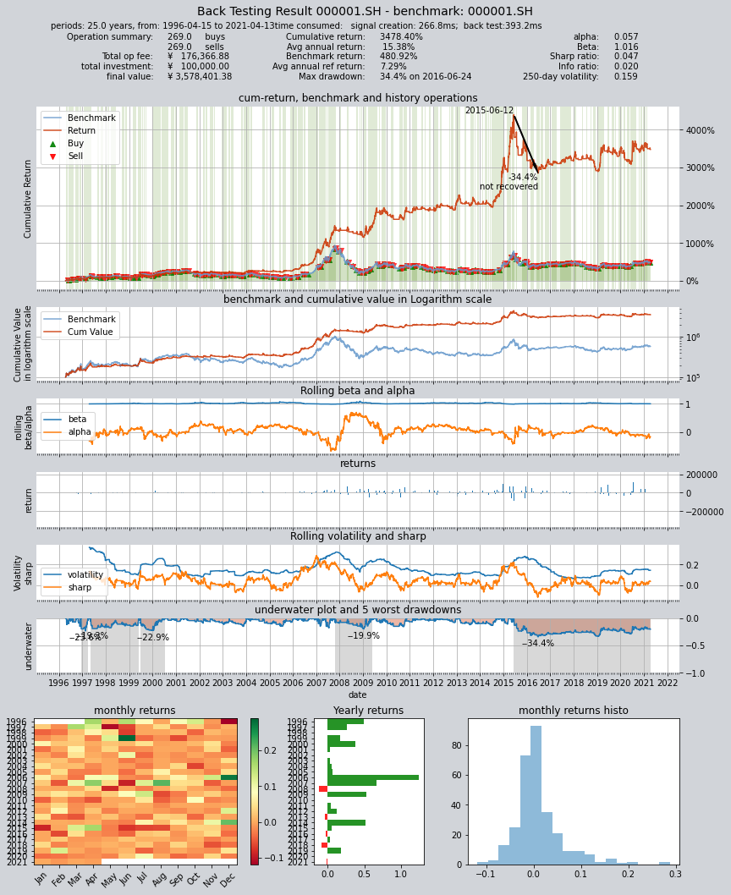
    


```python
op = qt.Operator(timing_types=['st3'])
res = qt.run(op, mode=1)
```

    Progress: [########################################] 1/1. 100.0%  Extracting data local files
         ====================================
         |                                  |
         |       BACK TESTING RESULT        |
         |                                  |
         ====================================
    
    qteasy running mode: 1 - History back testing
    time consumption for operate signal creation: 61.2ms
    time consumption for operation back looping:  289.2ms
    
    investment starts on      1996-04-15 00:00:00
    ends on                   2021-04-13 00:00:00
    Total looped periods:     25.0 years.
    
    -------------operation summary:------------ 
                 sell    buy  total
    000001.SH  292.0  292.0  584.0
    Total operation fee:     ¥  263,736.35
    total investment amount: ¥  100,000.00
    final value:              ¥4,940,400.57
    Total return:                  4840.40% 
    Avg Yearly return:               16.87%
    Skewness:                         -0.36
    Kurtosis:                         13.28
    Benchmark return:               480.92% 
    Benchmark Yearly return:          7.29%
    
    ------strategy loop_results indicators------ 
    alpha:                            0.080
    Beta:                             1.016
    Sharp ratio:                      0.055
    Info ratio:                       0.024
    250 day volatility:               0.158
    Max drawdown:                    28.01% 
        peak / valley:        2007-10-16 / 2009-01-15
        recovered on:         2009-06-18
    
    
    ===========END OF REPORT=============
    


    

    


```python
op = qt.Operator(timing_types=['stema'])
res = qt.run(op, mode=1)
```

    Progress: [########################################] 1/1. 100.0%  Extracting data local files
         ====================================
         |                                  |
         |       BACK TESTING RESULT        |
         |                                  |
         ====================================
    
    qteasy running mode: 1 - History back testing
    time consumption for operate signal creation: 82.0ms
    time consumption for operation back looping:  476.5ms
    
    investment starts on      1996-04-15 00:00:00
    ends on                   2021-04-13 00:00:00
    Total looped periods:     25.0 years.
    
    -------------operation summary:------------ 
                  sell     buy   total
    000001.SH  1110.0  1109.0  2219.0
    Total operation fee:     ¥  489,967.91
    total investment amount: ¥  100,000.00
    final value:              ¥3,888,141.56
    Total return:                  3788.14% 
    Avg Yearly return:               15.76%
    Skewness:                          0.26
    Kurtosis:                         13.93
    Benchmark return:               480.92% 
    Benchmark Yearly return:          7.29%
    
    ------strategy loop_results indicators------ 
    alpha:                            0.052
    Beta:                             1.001
    Sharp ratio:                      0.058
    Info ratio:                       0.021
    250 day volatility:               0.167
    Max drawdown:                    36.16% 
        peak / valley:        2008-01-18 / 2008-09-18
        recovered on:         2009-05-04
    
    
    ===========END OF REPORT=============
    


    
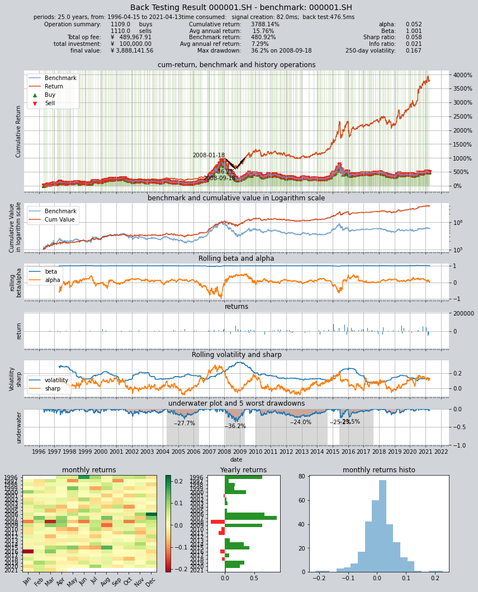
    


```python
op = qt.Operator(timing_types=['strima'])
res = qt.run(op, mode=1)
```

    Progress: [########################################] 1/1. 100.0%  Extracting data local files
         ====================================
         |                                  |
         |       BACK TESTING RESULT        |
         |                                  |
         ====================================
    
    qteasy running mode: 1 - History back testing
    time consumption for operate signal creation: 68.8ms
    time consumption for operation back looping:  324.6ms
    
    investment starts on      1996-04-15 00:00:00
    ends on                   2021-04-13 00:00:00
    Total looped periods:     25.0 years.
    
    -------------operation summary:------------ 
                 sell    buy  total
    000001.SH  387.0  387.0  774.0
    Total operation fee:     ¥  163,711.86
    total investment amount: ¥  100,000.00
    final value:              ¥2,088,052.84
    Total return:                  1988.05% 
    Avg Yearly return:               12.92%
    Skewness:                         -0.26
    Kurtosis:                         12.90
    Benchmark return:               480.92% 
    Benchmark Yearly return:          7.29%
    
    ------strategy loop_results indicators------ 
    alpha:                            0.036
    Beta:                             1.014
    Sharp ratio:                      0.039
    Info ratio:                       0.011
    250 day volatility:               0.157
    Max drawdown:                    41.13% 
        peak / valley:        2007-10-16 / 2009-01-15
        recovered on:         2014-11-10
    
    
    ===========END OF REPORT=============
    


    
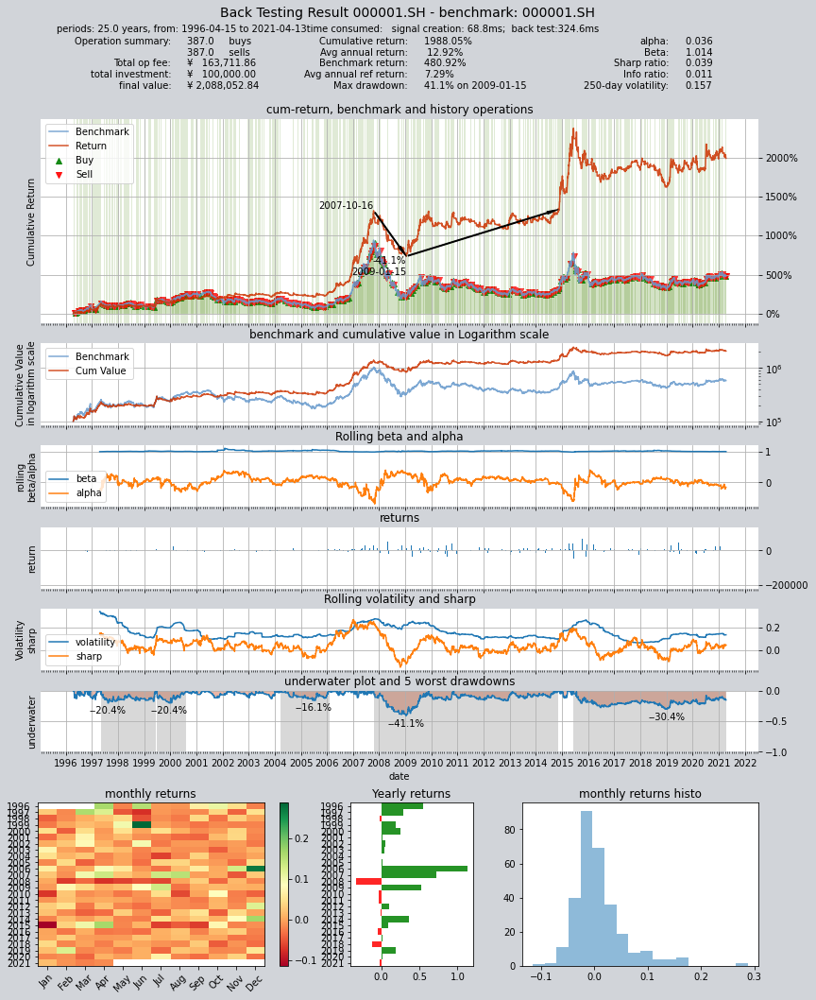
    


```python
op = qt.Operator(timing_types=['swma'])
res = qt.run(op, mode=1)
```

    Progress: [########################################] 1/1. 100.0%  Extracting data local files
         ====================================
         |                                  |
         |       BACK TESTING RESULT        |
         |                                  |
         ====================================
    
    qteasy running mode: 1 - History back testing
    time consumption for operate signal creation: 61.1ms
    time consumption for operation back looping:  347.3ms
    
    investment starts on      1996-04-15 00:00:00
    ends on                   2021-04-13 00:00:00
    Total looped periods:     25.0 years.
    
    -------------operation summary:------------ 
                 sell    buy  total
    000001.SH  497.0  497.0  994.0
    Total operation fee:     ¥  229,636.58
    total investment amount: ¥  100,000.00
    final value:              ¥2,516,272.31
    Total return:                  2416.27% 
    Avg Yearly return:               13.76%
    Skewness:                         -0.13
    Kurtosis:                         14.08
    Benchmark return:               480.92% 
    Benchmark Yearly return:          7.29%
    
    ------strategy loop_results indicators------ 
    alpha:                            0.035
    Beta:                             1.013
    Sharp ratio:                      0.041
    Info ratio:                       0.014
    250 day volatility:               0.157
    Max drawdown:                    30.72% 
        peak / valley:        2015-06-12 / 2018-12-14
        recovered on:         NaT
    
    
    ===========END OF REPORT=============
    


    
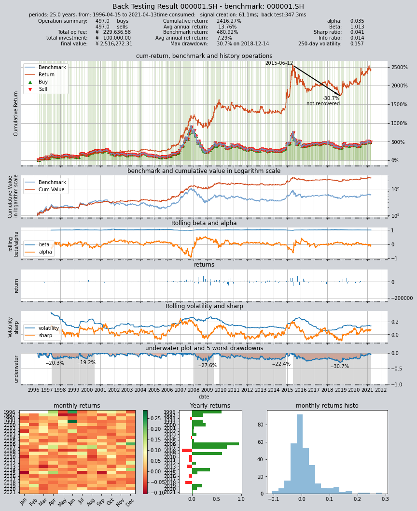
    


```python
op = qt.Operator(timing_types=['dsma'])
res = qt.run(op, mode=1)
```

    Progress: [########################################] 1/1. 100.0%  Extracting data local files
         ====================================
         |                                  |
         |       BACK TESTING RESULT        |
         |                                  |
         ====================================
    
    qteasy running mode: 1 - History back testing
    time consumption for operate signal creation: 68.4ms
    time consumption for operation back looping:  177.1ms
    
    investment starts on      1996-04-15 00:00:00
    ends on                   2021-04-13 00:00:00
    Total looped periods:     25.0 years.
    
    -------------operation summary:------------ 
                sell   buy  total
    000001.SH  34.0  33.0   67.0
    Total operation fee:     ¥    8,537.80
    total investment amount: ¥  100,000.00
    final value:              ¥1,384,010.68
    Total return:                  1284.01% 
    Avg Yearly return:               11.08%
    Skewness:                         -0.73
    Kurtosis:                         11.53
    Benchmark return:               480.92% 
    Benchmark Yearly return:          7.29%
    
    ------strategy loop_results indicators------ 
    alpha:                              inf
    Beta:                               inf
    Sharp ratio:                       -inf
    Info ratio:                       0.008
    250 day volatility:               0.166
    Max drawdown:                    37.59% 
        peak / valley:        2015-06-12 / 2016-01-07
        recovered on:         NaT
    
    
    ===========END OF REPORT=============
    


    
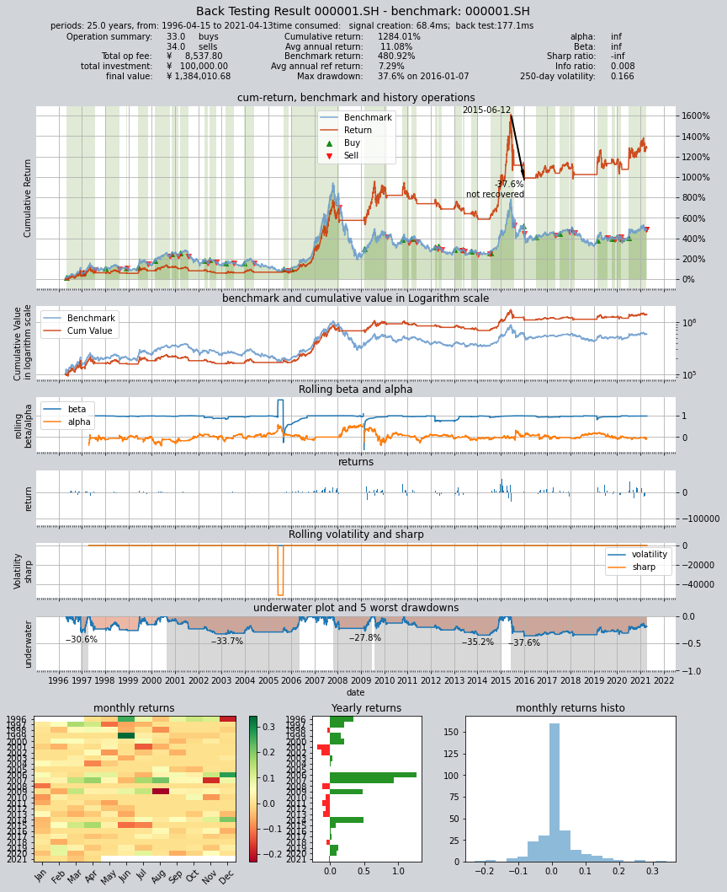
    


```python
op = qt.Operator(timing_types=['ddema'])
res = qt.run(op, mode=1)
```

    Progress: [########################################] 1/1. 100.0%  Extracting data local files
         ====================================
         |                                  |
         |       BACK TESTING RESULT        |
         |                                  |
         ====================================
    
    qteasy running mode: 1 - History back testing
    time consumption for operate signal creation: 169.5ms
    time consumption for operation back looping:  496.8ms
    
    investment starts on      1996-04-15 00:00:00
    ends on                   2021-04-13 00:00:00
    Total looped periods:     25.0 years.
    
    -------------operation summary:------------ 
                sell   buy  total
    000001.SH  62.0  62.0  124.0
    Total operation fee:     ¥   14,478.85
    total investment amount: ¥  100,000.00
    final value:              ¥1,008,240.46
    Total return:                   908.24% 
    Avg Yearly return:                9.68%
    Skewness:                         -0.61
    Kurtosis:                         12.17
    Benchmark return:               480.92% 
    Benchmark Yearly return:          7.29%
    
    ------strategy loop_results indicators------ 
    alpha:                            0.004
    Beta:                             0.991
    Sharp ratio:                      0.024
    Info ratio:                       0.002
    250 day volatility:               0.168
    Max drawdown:                    49.14% 
        peak / valley:        2007-10-16 / 2008-11-04
        recovered on:         2009-07-24
    
    
    ===========END OF REPORT=============
    


    
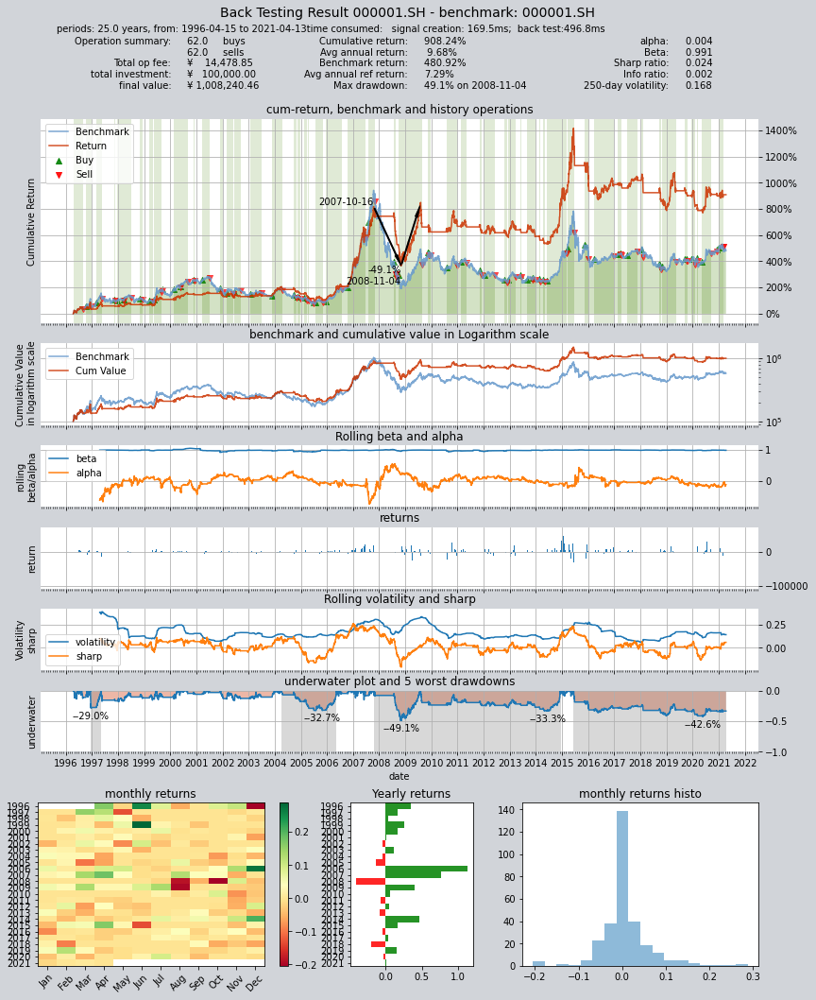
    


```python
op = qt.Operator(timing_types=['dema'])
res = qt.run(op, mode=1)
```

    Progress: [########################################] 1/1. 100.0%  Extracting data local files
         ====================================
         |                                  |
         |       BACK TESTING RESULT        |
         |                                  |
         ====================================
    
    qteasy running mode: 1 - History back testing
    time consumption for operate signal creation: 77.9ms
    time consumption for operation back looping:  240.2ms
    
    investment starts on      1996-04-15 00:00:00
    ends on                   2021-04-13 00:00:00
    Total looped periods:     25.0 years.
    
    -------------operation summary:------------ 
                 sell    buy  total
    000001.SH  152.0  152.0  304.0
    Total operation fee:     ¥   85,049.86
    total investment amount: ¥  100,000.00
    final value:              ¥2,983,583.01
    Total return:                  2883.58% 
    Avg Yearly return:               14.54%
    Skewness:                         -0.59
    Kurtosis:                         13.08
    Benchmark return:               480.92% 
    Benchmark Yearly return:          7.29%
    
    ------strategy loop_results indicators------ 
    alpha:                            0.052
    Beta:                             1.004
    Sharp ratio:                      0.044
    Info ratio:                       0.017
    250 day volatility:               0.162
    Max drawdown:                    31.07% 
        peak / valley:        1996-12-09 / 1997-02-19
        recovered on:         1997-05-05
    
    
    ===========END OF REPORT=============
    


    
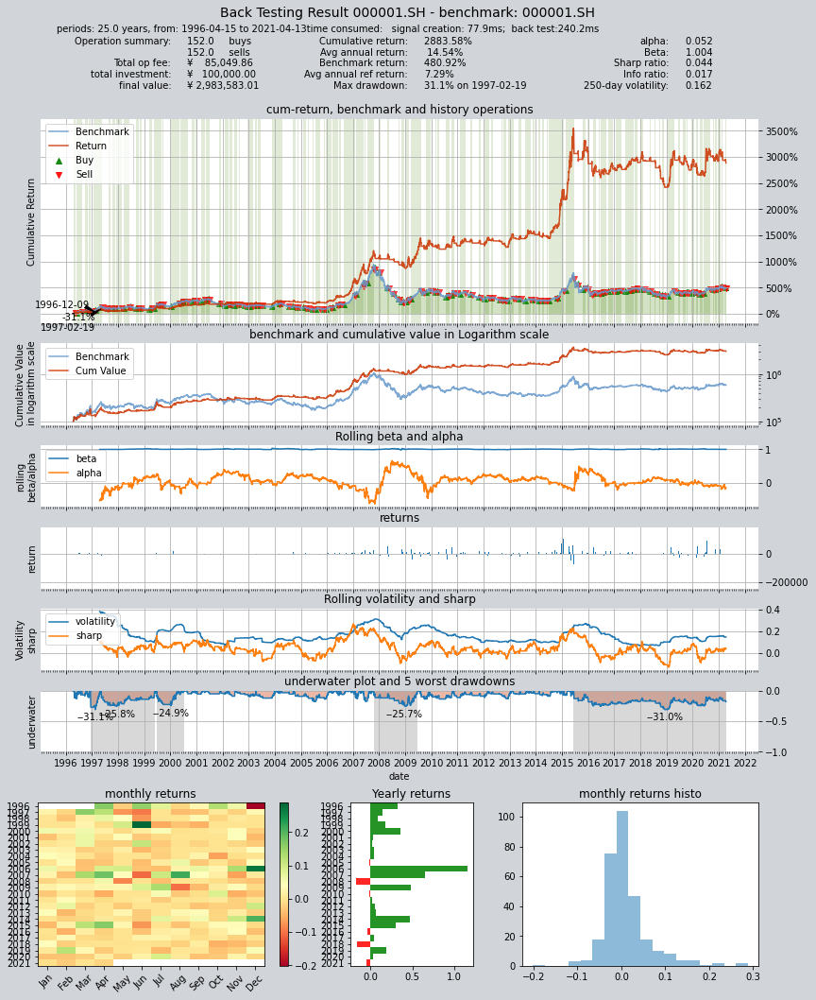
    


```python
op = qt.Operator(timing_types=['dkama'])
res = qt.run(op, mode=1)
```

    Progress: [########################################] 1/1. 100.0%  Extracting data local files
         ====================================
         |                                  |
         |       BACK TESTING RESULT        |
         |                                  |
         ====================================
    
    qteasy running mode: 1 - History back testing
    time consumption for operate signal creation: 76.8ms
    time consumption for operation back looping:  220.4ms
    
    investment starts on      1996-04-15 00:00:00
    ends on                   2021-04-13 00:00:00
    Total looped periods:     25.0 years.
    
    -------------operation summary:------------ 
                sell   buy  total
    000001.SH  45.0  45.0   90.0
    Total operation fee:     ¥    8,567.21
    total investment amount: ¥  100,000.00
    final value:              ¥1,158,158.00
    Total return:                  1058.16% 
    Avg Yearly return:               10.29%
    Skewness:                         -0.63
    Kurtosis:                         11.67
    Benchmark return:               480.92% 
    Benchmark Yearly return:          7.29%
    
    ------strategy loop_results indicators------ 
    alpha:                              inf
    Beta:                               inf
    Sharp ratio:                       -inf
    Info ratio:                       0.004
    250 day volatility:               0.161
    Max drawdown:                    38.90% 
        peak / valley:        2009-08-04 / 2013-12-26
        recovered on:         2015-01-06
    
    
    ===========END OF REPORT=============
    


    
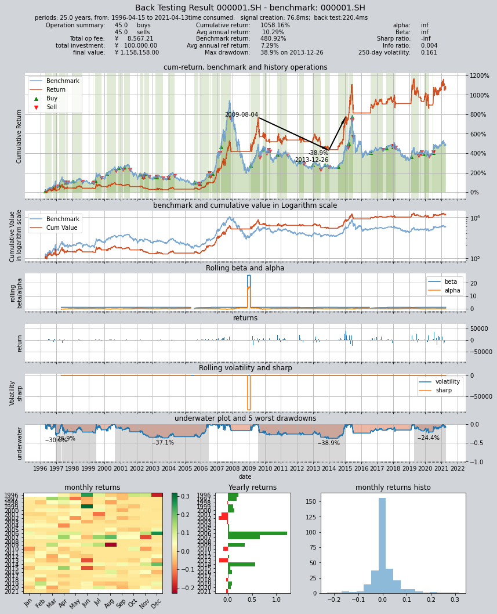
    


```python
op = qt.Operator(timing_types=['dmama'])
res = qt.run(op, mode=1)
```

    Progress: [########################################] 1/1. 100.0%  Extracting data local files
         ====================================
         |                                  |
         |       BACK TESTING RESULT        |
         |                                  |
         ====================================
    
    qteasy running mode: 1 - History back testing
    time consumption for operate signal creation: 403.9ms
    time consumption for operation back looping:  260.9ms
    
    investment starts on      1996-04-15 00:00:00
    ends on                   2021-04-13 00:00:00
    Total looped periods:     25.0 years.
    
    -------------operation summary:------------ 
                 sell    buy  total
    000001.SH  137.0  137.0  274.0
    Total operation fee:     ¥   86,077.71
    total investment amount: ¥  100,000.00
    final value:              ¥2,798,861.21
    Total return:                  2698.86% 
    Avg Yearly return:               14.25%
    Skewness:                         -0.69
    Kurtosis:                         13.31
    Benchmark return:               480.92% 
    Benchmark Yearly return:          7.29%
    
    ------strategy loop_results indicators------ 
    alpha:                            0.049
    Beta:                             1.003
    Sharp ratio:                      0.039
    Info ratio:                       0.017
    250 day volatility:               0.162
    Max drawdown:                    38.40% 
        peak / valley:        2015-06-12 / 2020-06-15
        recovered on:         NaT
    
    
    ===========END OF REPORT=============
    


    
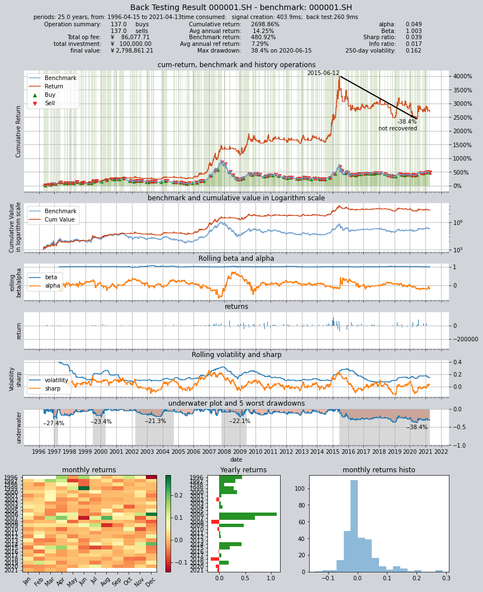
    


```python
op = qt.Operator(timing_types=['dfama'])
res = qt.run(op, mode=1)
```

    Progress: [########################################] 1/1. 100.0%  Extracting data local files
         ====================================
         |                                  |
         |       BACK TESTING RESULT        |
         |                                  |
         ====================================
    
    qteasy running mode: 1 - History back testing
    time consumption for operate signal creation: 437.2ms
    time consumption for operation back looping:  331.5ms
    
    investment starts on      1996-04-15 00:00:00
    ends on                   2021-04-13 00:00:00
    Total looped periods:     25.0 years.
    
    -------------operation summary:------------ 
                sell   buy  total
    000001.SH  58.0  58.0  116.0
    Total operation fee:     ¥   24,642.21
    total investment amount: ¥  100,000.00
    final value:              ¥1,909,535.98
    Total return:                  1809.54% 
    Avg Yearly return:               12.52%
    Skewness:                         -0.65
    Kurtosis:                         12.59
    Benchmark return:               480.92% 
    Benchmark Yearly return:          7.29%
    
    ------strategy loop_results indicators------ 
    alpha:                            0.034
    Beta:                             0.974
    Sharp ratio:                      0.028
    Info ratio:                       0.012
    250 day volatility:               0.162
    Max drawdown:                    45.03% 
        peak / valley:        2015-06-12 / 2020-06-15
        recovered on:         NaT
    
    
    ===========END OF REPORT=============
    


    
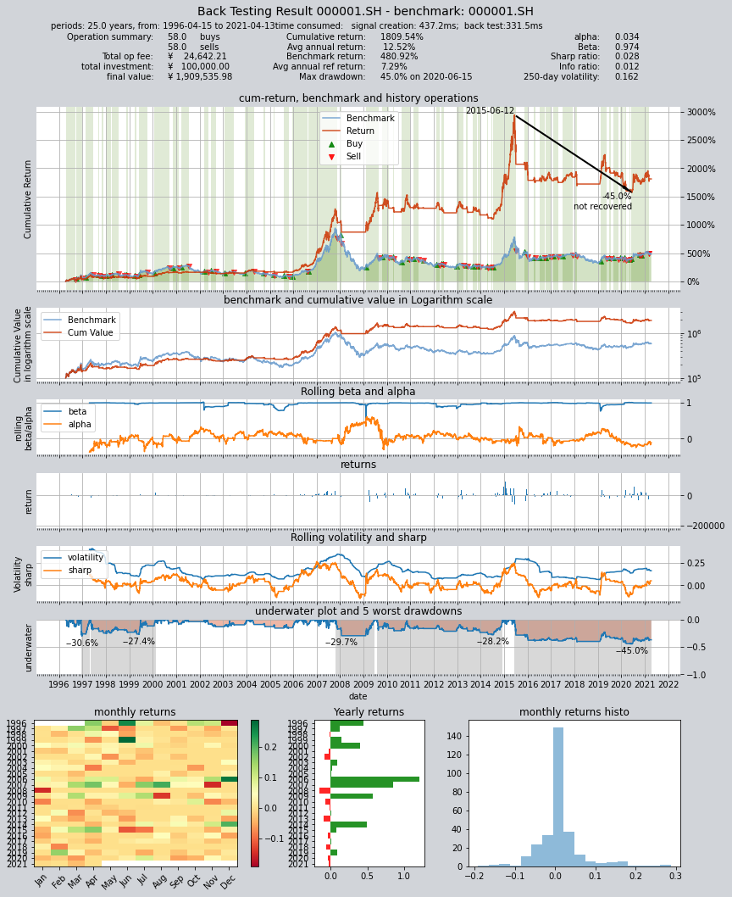
    


```python
op = qt.Operator(timing_types=['dt3'])
res = qt.run(op, mode=1)
```

    Progress: [########################################] 1/1. 100.0%  Extracting data local files
         ====================================
         |                                  |
         |       BACK TESTING RESULT        |
         |                                  |
         ====================================
    
    qteasy running mode: 1 - History back testing
    time consumption for operate signal creation: 85.9ms
    time consumption for operation back looping:  236.9ms
    
    investment starts on      1996-04-15 00:00:00
    ends on                   2021-04-13 00:00:00
    Total looped periods:     25.0 years.
    
    -------------operation summary:------------ 
                 sell    buy  total
    000001.SH  118.0  119.0  237.0
    Total operation fee:     ¥   34,469.84
    total investment amount: ¥  100,000.00
    final value:              ¥1,401,376.34
    Total return:                  1301.38% 
    Avg Yearly return:               11.13%
    Skewness:                         -0.73
    Kurtosis:                         13.07
    Benchmark return:               480.92% 
    Benchmark Yearly return:          7.29%
    
    ------strategy loop_results indicators------ 
    alpha:                            0.012
    Beta:                             0.993
    Sharp ratio:                      0.032
    Info ratio:                       0.007
    250 day volatility:               0.164
    Max drawdown:                    38.59% 
        peak / valley:        2007-10-16 / 2009-01-21
        recovered on:         2009-07-24
    
    
    ===========END OF REPORT=============
    


    
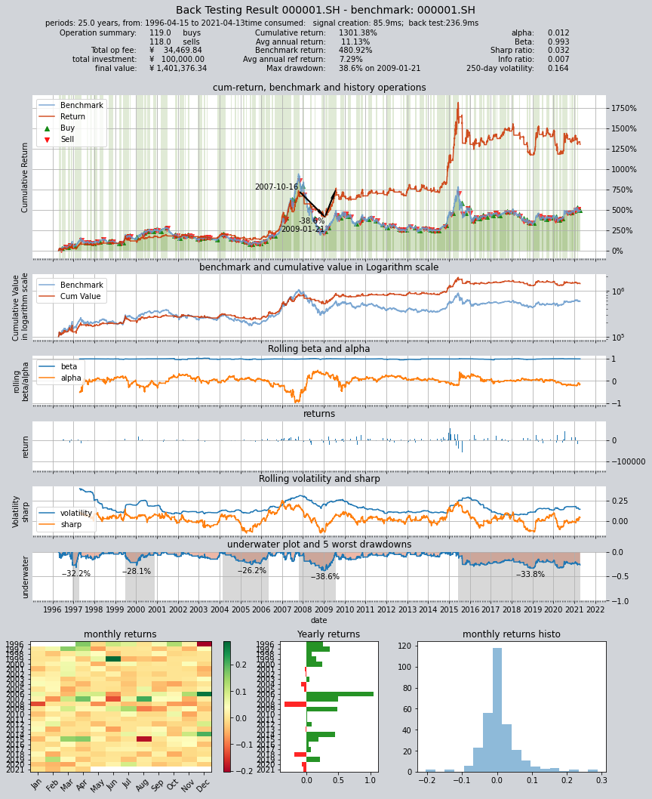
    


```python
op = qt.Operator(timing_types=['dtema'])
res = qt.run(op, mode=1)
```

    Progress: [########################################] 1/1. 100.0%  Extracting data local files
         ====================================
         |                                  |
         |       BACK TESTING RESULT        |
         |                                  |
         ====================================
    
    qteasy running mode: 1 - History back testing
    time consumption for operate signal creation: 110.9ms
    time consumption for operation back looping:  325.4ms
    
    investment starts on      1996-04-15 00:00:00
    ends on                   2021-04-13 00:00:00
    Total looped periods:     25.0 years.
    
    -------------operation summary:------------ 
                 sell    buy  total
    000001.SH  497.0  497.0  994.0
    Total operation fee:     ¥  154,485.52
    total investment amount: ¥  100,000.00
    final value:              ¥1,976,816.10
    Total return:                  1876.82% 
    Avg Yearly return:               12.67%
    Skewness:                          0.29
    Kurtosis:                         15.34
    Benchmark return:               480.92% 
    Benchmark Yearly return:          7.29%
    
    ------strategy loop_results indicators------ 
    alpha:                            0.006
    Beta:                             1.006
    Sharp ratio:                      0.046
    Info ratio:                       0.011
    250 day volatility:               0.158
    Max drawdown:                    43.82% 
        peak / valley:        2007-10-31 / 2008-11-04
        recovered on:         2011-02-11
    
    
    ===========END OF REPORT=============
    


    
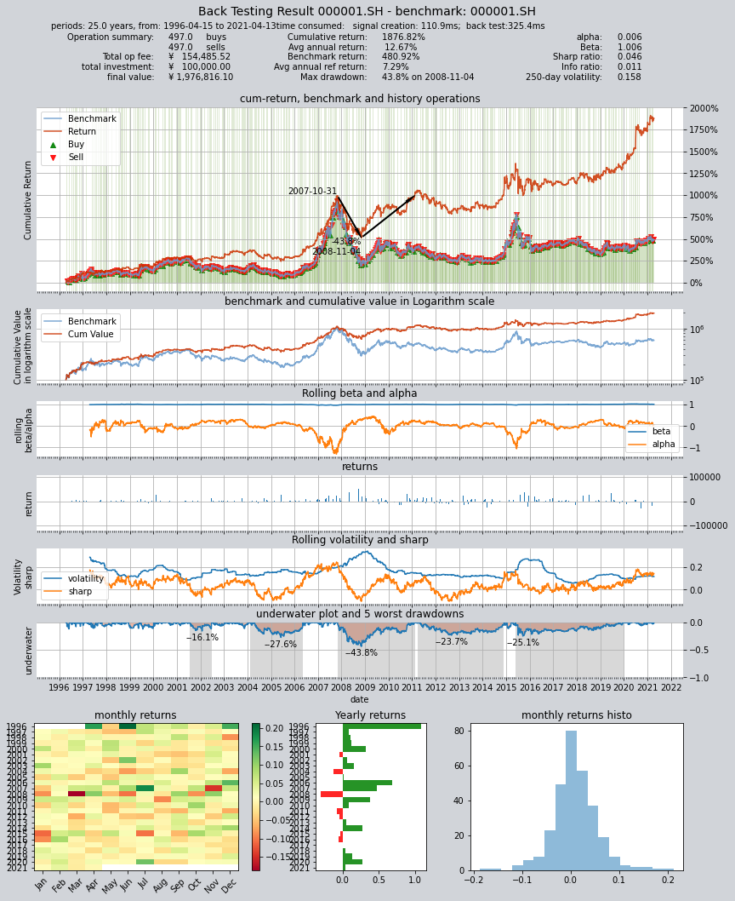
    


```python
op = qt.Operator(timing_types=['dtrima'])
res = qt.run(op, mode=1)
```

    Progress: [########################################] 1/1. 100.0%  Extracting data local files
         ====================================
         |                                  |
         |       BACK TESTING RESULT        |
         |                                  |
         ====================================
    
    qteasy running mode: 1 - History back testing
    time consumption for operate signal creation: 74.8ms
    time consumption for operation back looping:  209.2ms
    
    investment starts on      1996-04-15 00:00:00
    ends on                   2021-04-13 00:00:00
    Total looped periods:     25.0 years.
    
    -------------operation summary:------------ 
                sell   buy  total
    000001.SH  35.0  34.0   69.0
    Total operation fee:     ¥    9,946.86
    total investment amount: ¥  100,000.00
    final value:              ¥1,567,240.12
    Total return:                  1467.24% 
    Avg Yearly return:               11.63%
    Skewness:                         -0.62
    Kurtosis:                         11.51
    Benchmark return:               480.92% 
    Benchmark Yearly return:          7.29%
    
    ------strategy loop_results indicators------ 
    alpha:                            0.011
    Beta:                             0.905
    Sharp ratio:                   -346.535
    Info ratio:                       0.009
    250 day volatility:               0.163
    Max drawdown:                    38.95% 
        peak / valley:        2015-06-12 / 2020-03-23
        recovered on:         NaT
    
    
    ===========END OF REPORT=============
    


    
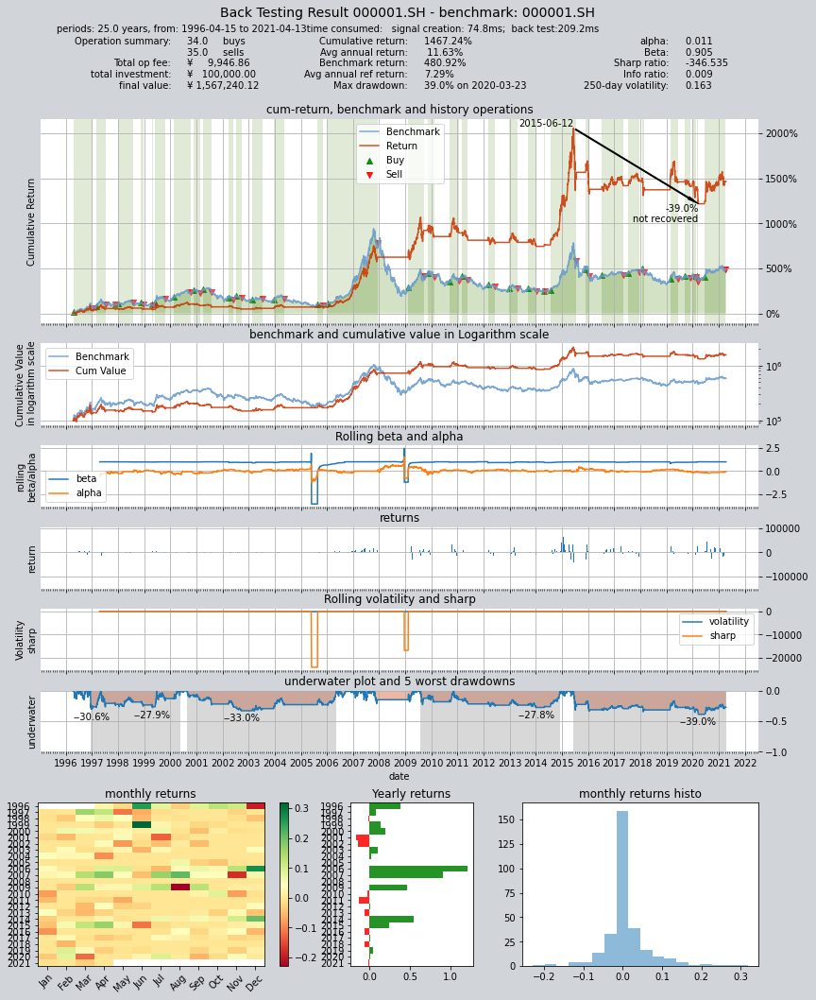
    


```python
op = qt.Operator(timing_types=['dwma'])
op.set_parameter('t-0', pars=(200, 22))
res = qt.run(op, mode=1)
```

    Progress: [########################################] 1/1. 100.0%  Extracting data local files
         ====================================
         |                                  |
         |       BACK TESTING RESULT        |
         |                                  |
         ====================================
    
    qteasy running mode: 1 - History back testing
    time consumption for operate signal creation: 152.7ms
    time consumption for operation back looping:  383.9ms
    
    investment starts on      1996-04-15 00:00:00
    ends on                   2021-04-13 00:00:00
    Total looped periods:     25.0 years.
    
    -------------operation summary:------------ 
                sell   buy  total
    000001.SH  34.0  34.0   68.0
    Total operation fee:     ¥    9,851.40
    total investment amount: ¥  100,000.00
    final value:              ¥1,555,773.05
    Total return:                  1455.77% 
    Avg Yearly return:               11.60%
    Skewness:                         -0.72
    Kurtosis:                         11.51
    Benchmark return:               480.92% 
    Benchmark Yearly return:          7.29%
    
    ------strategy loop_results indicators------ 
    alpha:                             -inf
    Beta:                              -inf
    Sharp ratio:                       -inf
    Info ratio:                       0.009
    250 day volatility:               0.164
    Max drawdown:                    35.14% 
        peak / valley:        2009-08-04 / 2013-12-26
        recovered on:         2014-12-22
    
    
    ===========END OF REPORT=============
    


    
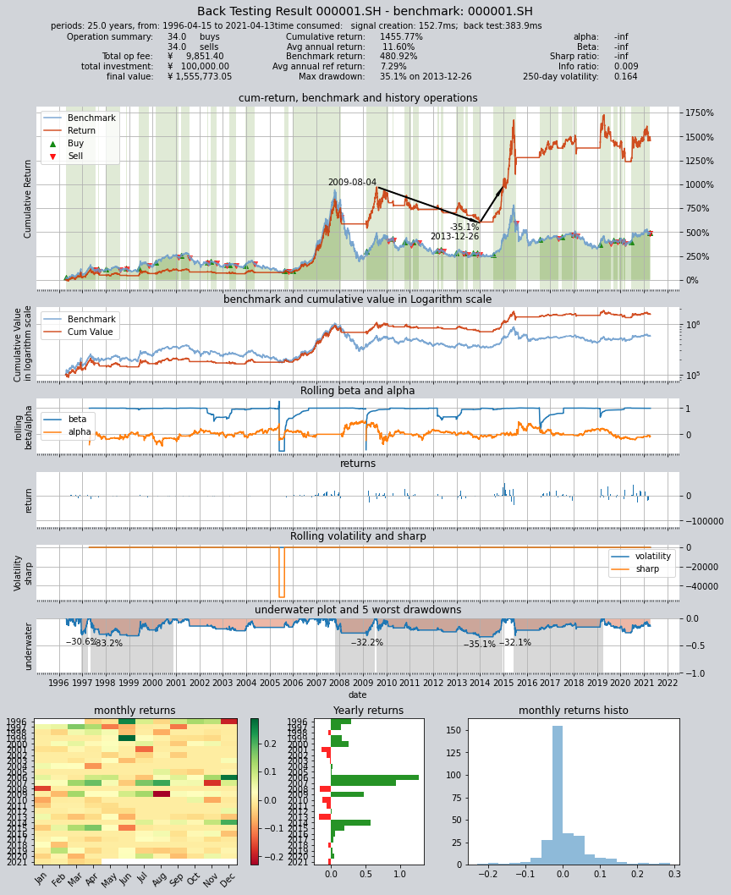
    


```python
op = qt.Operator(timing_types=['slsma'])
res = qt.run(op, mode=1)
```

    Progress: [########################################] 1/1. 100.0%  Extracting data local files
         ====================================
         |                                  |
         |       BACK TESTING RESULT        |
         |                                  |
         ====================================
    
    qteasy running mode: 1 - History back testing
    time consumption for operate signal creation: 77.6ms
    time consumption for operation back looping:  311.6ms
    
    investment starts on      1996-04-15 00:00:00
    ends on                   2021-04-13 00:00:00
    Total looped periods:     25.0 years.
    
    -------------operation summary:------------ 
                 sell    buy  total
    000001.SH  180.0  180.0  360.0
    Total operation fee:     ¥   81,760.65
    total investment amount: ¥  100,000.00
    final value:              ¥2,398,528.37
    Total return:                  2298.53% 
    Avg Yearly return:               13.55%
    Skewness:                         -0.64
    Kurtosis:                         12.72
    Benchmark return:               480.92% 
    Benchmark Yearly return:          7.29%
    
    ------strategy loop_results indicators------ 
    alpha:                            0.045
    Beta:                             1.005
    Sharp ratio:                      0.031
    Info ratio:                       0.014
    250 day volatility:               0.159
    Max drawdown:                    43.29% 
        peak / valley:        2010-11-08 / 2014-07-10
        recovered on:         2015-03-23
    
    
    ===========END OF REPORT=============
    


    
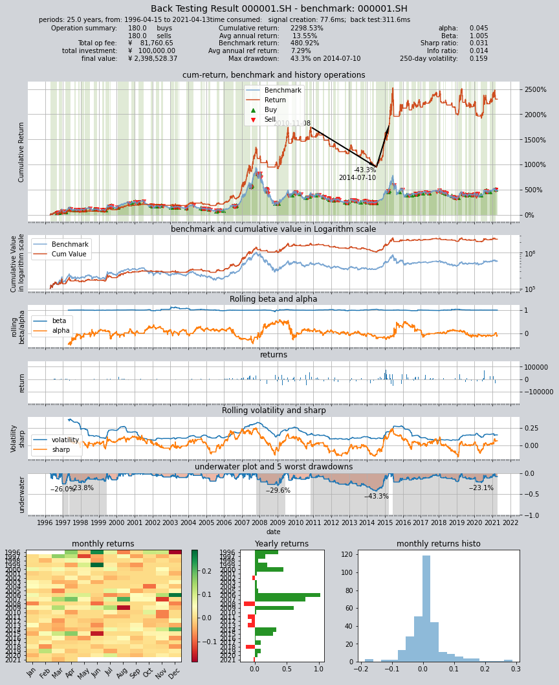
    


```python
op = qt.Operator(timing_types=['sldema'])
res = qt.run(op, mode=1)
```

    Progress: [########################################] 1/1. 100.0%  Extracting data local files
         ====================================
         |                                  |
         |       BACK TESTING RESULT        |
         |                                  |
         ====================================
    
    qteasy running mode: 1 - History back testing
    time consumption for operate signal creation: 55.7ms
    time consumption for operation back looping:  249.0ms
    
    investment starts on      1996-04-15 00:00:00
    ends on                   2021-04-13 00:00:00
    Total looped periods:     25.0 years.
    
    -------------operation summary:------------ 
                 sell    buy  total
    000001.SH  292.0  292.0  584.0
    Total operation fee:     ¥  344,268.15
    total investment amount: ¥  100,000.00
    final value:              ¥6,528,125.04
    Total return:                  6428.13% 
    Avg Yearly return:               18.18%
    Skewness:                         -0.32
    Kurtosis:                         12.98
    Benchmark return:               480.92% 
    Benchmark Yearly return:          7.29%
    
    ------strategy loop_results indicators------ 
    alpha:                            0.095
    Beta:                             1.018
    Sharp ratio:                      0.059
    Info ratio:                       0.028
    250 day volatility:               0.158
    Max drawdown:                    25.13% 
        peak / valley:        1997-05-12 / 1997-08-11
        recovered on:         1999-05-24
    
    
    ===========END OF REPORT=============
    


    
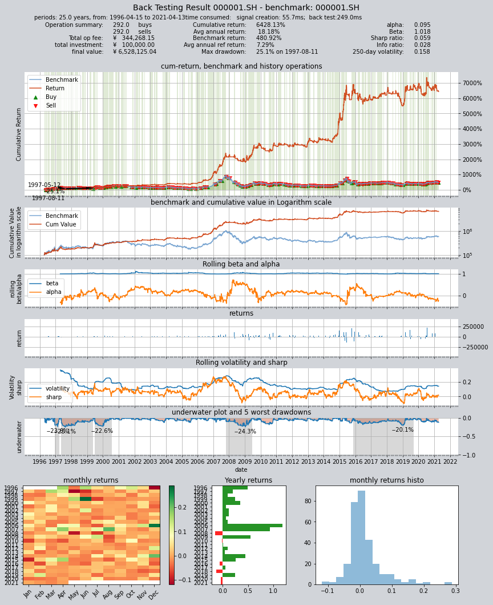
    


```python
op = qt.Operator(timing_types=['slema'])
res = qt.run(op, mode=1)
```

    Progress: [########################################] 1/1. 100.0%  Extracting data local files
         ====================================
         |                                  |
         |       BACK TESTING RESULT        |
         |                                  |
         ====================================
    
    qteasy running mode: 1 - History back testing
    time consumption for operate signal creation: 47.0ms
    time consumption for operation back looping:  232.8ms
    
    investment starts on      1996-04-15 00:00:00
    ends on                   2021-04-13 00:00:00
    Total looped periods:     25.0 years.
    
    -------------operation summary:------------ 
                 sell    buy  total
    000001.SH  232.0  232.0  464.0
    Total operation fee:     ¥  183,330.35
    total investment amount: ¥  100,000.00
    final value:              ¥4,423,320.97
    Total return:                  4323.32% 
    Avg Yearly return:               16.36%
    Skewness:                         -0.48
    Kurtosis:                         13.40
    Benchmark return:               480.92% 
    Benchmark Yearly return:          7.29%
    
    ------strategy loop_results indicators------ 
    alpha:                            0.073
    Beta:                             1.017
    Sharp ratio:                      0.047
    Info ratio:                       0.023
    250 day volatility:               0.157
    Max drawdown:                    26.29% 
        peak / valley:        2007-10-16 / 2009-01-16
        recovered on:         2009-06-18
    
    
    ===========END OF REPORT=============
    


    
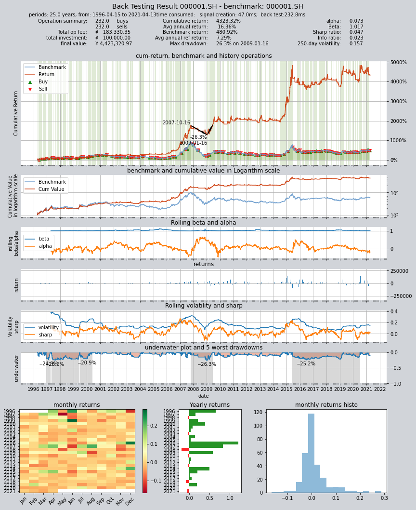
    


```python
op = qt.Operator(timing_types=['slht'])
res = qt.run(op, mode=1)
```

    Progress: [########################################] 1/1. 100.0%  Extracting data local files
         ====================================
         |                                  |
         |       BACK TESTING RESULT        |
         |                                  |
         ====================================
    
    qteasy running mode: 1 - History back testing
    time consumption for operate signal creation: 176.7ms
    time consumption for operation back looping:  243.3ms
    
    investment starts on      1996-04-15 00:00:00
    ends on                   2021-04-13 00:00:00
    Total looped periods:     25.0 years.
    
    -------------operation summary:------------ 
                 sell    buy  total
    000001.SH  186.0  186.0  372.0
    Total operation fee:     ¥   83,407.84
    total investment amount: ¥  100,000.00
    final value:              ¥2,518,882.13
    Total return:                  2418.88% 
    Avg Yearly return:               13.77%
    Skewness:                         -0.66
    Kurtosis:                         13.48
    Benchmark return:               480.92% 
    Benchmark Yearly return:          7.29%
    
    ------strategy loop_results indicators------ 
    alpha:                            0.046
    Beta:                             1.000
    Sharp ratio:                      0.040
    Info ratio:                       0.015
    250 day volatility:               0.163
    Max drawdown:                    31.31% 
        peak / valley:        2009-08-04 / 2012-11-07
        recovered on:         2014-11-28
    
    
    ===========END OF REPORT=============
    


    
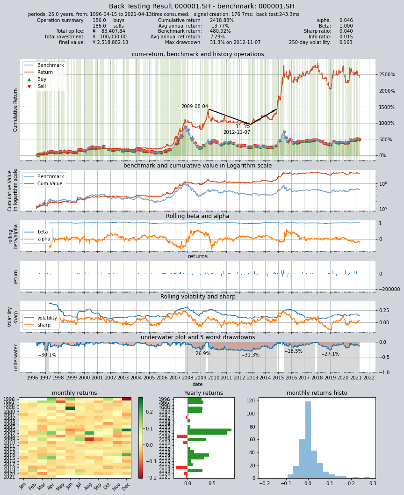
    


```python
op = qt.Operator(timing_types=['slkama'])
res = qt.run(op, mode=1)
```

    Progress: [########################################] 1/1. 100.0%  Extracting data local files
         ====================================
         |                                  |
         |       BACK TESTING RESULT        |
         |                                  |
         ====================================
    
    qteasy running mode: 1 - History back testing
    time consumption for operate signal creation: 49.9ms
    time consumption for operation back looping:  220.7ms
    
    investment starts on      1996-04-15 00:00:00
    ends on                   2021-04-13 00:00:00
    Total looped periods:     25.0 years.
    
    -------------operation summary:------------ 
                 sell    buy  total
    000001.SH  221.0  221.0  442.0
    Total operation fee:     ¥   98,125.72
    total investment amount: ¥  100,000.00
    final value:              ¥2,338,394.28
    Total return:                  2238.39% 
    Avg Yearly return:               13.43%
    Skewness:                         -0.36
    Kurtosis:                         14.02
    Benchmark return:               480.92% 
    Benchmark Yearly return:          7.29%
    
    ------strategy loop_results indicators------ 
    alpha:                            0.036
    Beta:                             1.018
    Sharp ratio:                      0.042
    Info ratio:                       0.012
    250 day volatility:               0.150
    Max drawdown:                    32.35% 
        peak / valley:        2007-10-16 / 2008-12-23
        recovered on:         2009-07-03
    
    
    ===========END OF REPORT=============
    


    

    


```python
op = qt.Operator(timing_types=['slmama'])
res = qt.run(op, mode=1)
```

    Progress: [########################################] 1/1. 100.0%  Extracting data local files
         ====================================
         |                                  |
         |       BACK TESTING RESULT        |
         |                                  |
         ====================================
    
    qteasy running mode: 1 - History back testing
    time consumption for operate signal creation: 164.8ms
    time consumption for operation back looping:  280.3ms
    
    investment starts on      1996-04-15 00:00:00
    ends on                   2021-04-13 00:00:00
    Total looped periods:     25.0 years.
    
    -------------operation summary:------------ 
                 sell    buy  total
    000001.SH  494.0  494.0  988.0
    Total operation fee:     ¥  352,285.02
    total investment amount: ¥  100,000.00
    final value:              ¥4,176,033.30
    Total return:                  4076.03% 
    Avg Yearly return:               16.09%
    Skewness:                         -0.11
    Kurtosis:                         13.84
    Benchmark return:               480.92% 
    Benchmark Yearly return:          7.29%
    
    ------strategy loop_results indicators------ 
    alpha:                            0.060
    Beta:                             1.014
    Sharp ratio:                      0.050
    Info ratio:                       0.021
    250 day volatility:               0.157
    Max drawdown:                    24.66% 
        peak / valley:        2015-07-23 / 2018-12-14
        recovered on:         2020-07-06
    
    
    ===========END OF REPORT=============
    


    

    


```python
op = qt.Operator(timing_types=['slfama'])
res = qt.run(op, mode=1)
```

    Progress: [########################################] 1/1. 100.0%  Extracting data local files
         ====================================
         |                                  |
         |       BACK TESTING RESULT        |
         |                                  |
         ====================================
    
    qteasy running mode: 1 - History back testing
    time consumption for operate signal creation: 185.3ms
    time consumption for operation back looping:  228.3ms
    
    investment starts on      1996-04-15 00:00:00
    ends on                   2021-04-13 00:00:00
    Total looped periods:     25.0 years.
    
    -------------operation summary:------------ 
                 sell    buy  total
    000001.SH  121.0  121.0  242.0
    Total operation fee:     ¥   36,685.50
    total investment amount: ¥  100,000.00
    final value:              ¥1,286,231.58
    Total return:                  1186.23% 
    Avg Yearly return:               10.75%
    Skewness:                         -0.74
    Kurtosis:                         13.19
    Benchmark return:               480.92% 
    Benchmark Yearly return:          7.29%
    
    ------strategy loop_results indicators------ 
    alpha:                            0.010
    Beta:                             0.998
    Sharp ratio:                      0.029
    Info ratio:                       0.006
    250 day volatility:               0.163
    Max drawdown:                    46.99% 
        peak / valley:        2015-06-12 / 2020-06-15
        recovered on:         NaT
    
    
    ===========END OF REPORT=============
    


    
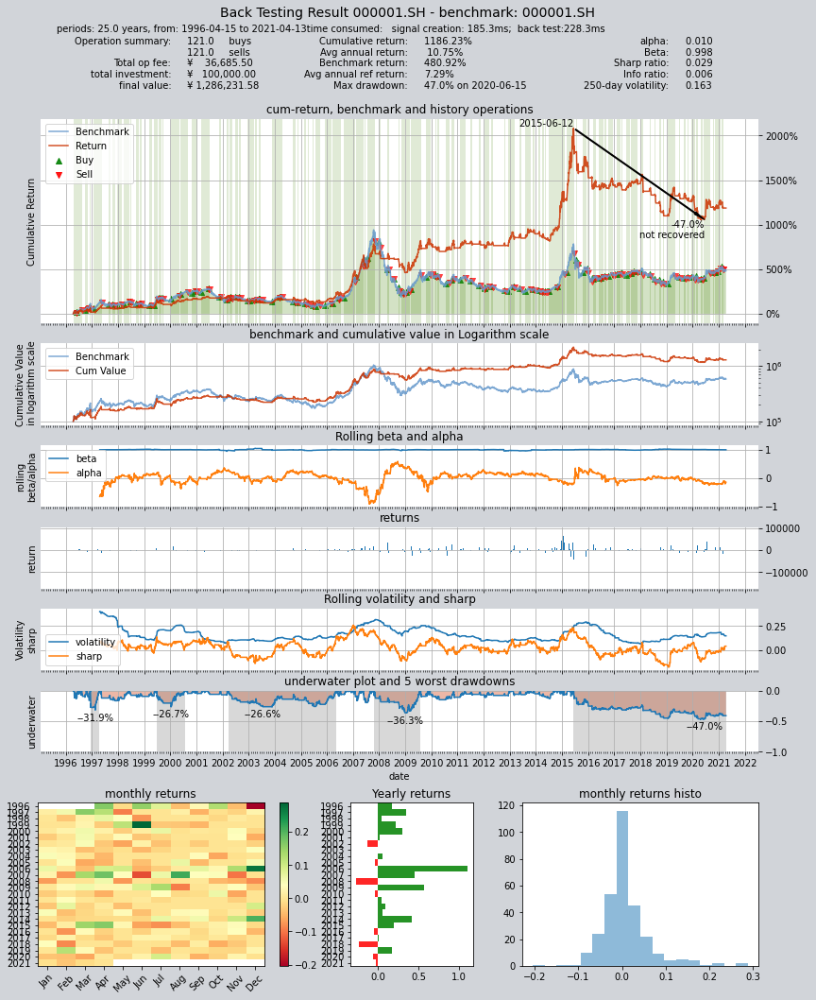
    


```python
op = qt.Operator(timing_types=['slt3'])
res = qt.run(op, mode=1)
```

    Progress: [########################################] 1/1. 100.0%  Extracting data local files
         ====================================
         |                                  |
         |       BACK TESTING RESULT        |
         |                                  |
         ====================================
    
    qteasy running mode: 1 - History back testing
    time consumption for operate signal creation: 97.0ms
    time consumption for operation back looping:  202.3ms
    
    investment starts on      1996-04-15 00:00:00
    ends on                   2021-04-13 00:00:00
    Total looped periods:     25.0 years.
    
    -------------operation summary:------------ 
                 sell    buy  total
    000001.SH  106.0  107.0  213.0
    Total operation fee:     ¥   24,825.15
    total investment amount: ¥  100,000.00
    final value:              ¥1,071,977.51
    Total return:                   971.98% 
    Avg Yearly return:                9.95%
    Skewness:                         -0.73
    Kurtosis:                         13.15
    Benchmark return:               480.92% 
    Benchmark Yearly return:          7.29%
    
    ------strategy loop_results indicators------ 
    alpha:                            0.002
    Beta:                             0.994
    Sharp ratio:                      0.029
    Info ratio:                       0.003
    250 day volatility:               0.164
    Max drawdown:                    35.26% 
        peak / valley:        2007-10-16 / 2009-01-21
        recovered on:         2009-07-14
    
    
    ===========END OF REPORT=============
    


    

    


```python
op = qt.Operator(timing_types=['sltema'])
res = qt.run(op, mode=1)
```

    Progress: [########################################] 1/1. 100.0%  Extracting data local files
         ====================================
         |                                  |
         |       BACK TESTING RESULT        |
         |                                  |
         ====================================
    
    qteasy running mode: 1 - History back testing
    time consumption for operate signal creation: 52.9ms
    time consumption for operation back looping:  489.7ms
    
    investment starts on      1996-04-15 00:00:00
    ends on                   2021-04-13 00:00:00
    Total looped periods:     25.0 years.
    
    -------------operation summary:------------ 
                 sell    buy   total
    000001.SH  637.0  637.0  1274.0
    Total operation fee:     ¥  287,584.99
    total investment amount: ¥  100,000.00
    final value:              ¥2,250,935.78
    Total return:                  2150.94% 
    Avg Yearly return:               13.26%
    Skewness:                         -0.07
    Kurtosis:                         13.76
    Benchmark return:               480.92% 
    Benchmark Yearly return:          7.29%
    
    ------strategy loop_results indicators------ 
    alpha:                            0.033
    Beta:                             1.010
    Sharp ratio:                      0.037
    Info ratio:                       0.013
    250 day volatility:               0.159
    Max drawdown:                    39.45% 
        peak / valley:        2015-07-13 / 2018-12-14
        recovered on:         NaT
    
    
    ===========END OF REPORT=============
    


    
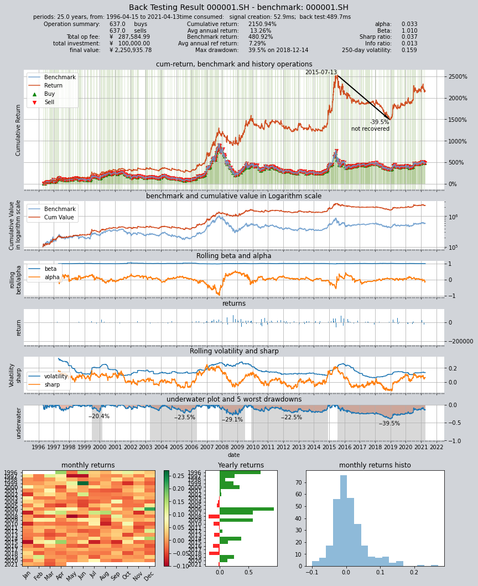
    


```python
op = qt.Operator(timing_types=['sltrima'])
res = qt.run(op, mode=1)
```

    Progress: [########################################] 1/1. 100.0%  Extracting data local files
         ====================================
         |                                  |
         |       BACK TESTING RESULT        |
         |                                  |
         ====================================
    
    qteasy running mode: 1 - History back testing
    time consumption for operate signal creation: 66.1ms
    time consumption for operation back looping:  1s 253.7ms
    
    investment starts on      1996-04-15 00:00:00
    ends on                   2021-04-13 00:00:00
    Total looped periods:     25.0 years.
    
    -------------operation summary:------------ 
                sell   buy  total
    000001.SH  84.0  84.0  168.0
    Total operation fee:     ¥   19,545.87
    total investment amount: ¥  100,000.00
    final value:              ¥1,216,540.82
    Total return:                  1116.54% 
    Avg Yearly return:               10.51%
    Skewness:                         -0.76
    Kurtosis:                         12.20
    Benchmark return:               480.92% 
    Benchmark Yearly return:          7.29%
    
    ------strategy loop_results indicators------ 
    alpha:                            0.005
    Beta:                             0.988
    Sharp ratio:                      0.024
    Info ratio:                       0.005
    250 day volatility:               0.167
    Max drawdown:                    39.56% 
        peak / valley:        2007-10-16 / 2008-12-31
        recovered on:         2010-10-19
    
    
    ===========END OF REPORT=============
    


    
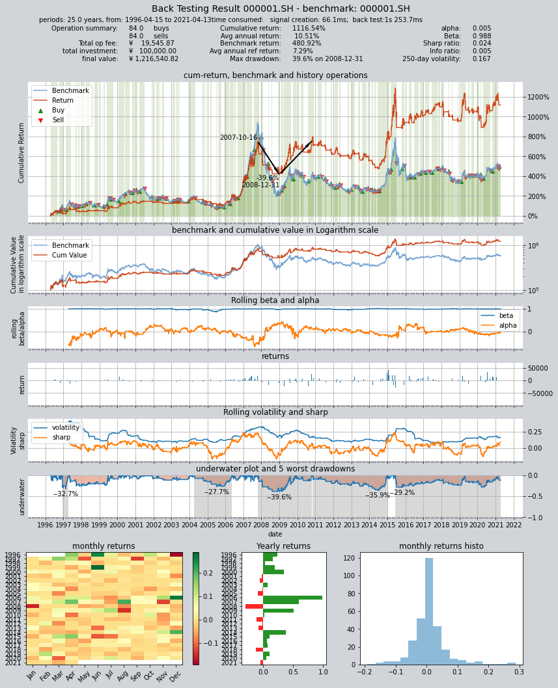
    


```python
op = qt.Operator(timing_types=['slwma'])
res = qt.run(op, mode=1)
```

    Progress: [########################################] 1/1. 100.0%  Extracting data local files
         ====================================
         |                                  |
         |       BACK TESTING RESULT        |
         |                                  |
         ====================================
    
    qteasy running mode: 1 - History back testing
    time consumption for operate signal creation: 58.9ms
    time consumption for operation back looping:  243.0ms
    
    investment starts on      1996-04-15 00:00:00
    ends on                   2021-04-13 00:00:00
    Total looped periods:     25.0 years.
    
    -------------operation summary:------------ 
                 sell    buy  total
    000001.SH  112.0  111.0  223.0
    Total operation fee:     ¥   35,426.95
    total investment amount: ¥  100,000.00
    final value:              ¥1,551,164.57
    Total return:                  1451.16% 
    Avg Yearly return:               11.58%
    Skewness:                         -0.65
    Kurtosis:                         12.42
    Benchmark return:               480.92% 
    Benchmark Yearly return:          7.29%
    
    ------strategy loop_results indicators------ 
    alpha:                            0.026
    Beta:                             0.986
    Sharp ratio:                      0.026
    Info ratio:                       0.009
    250 day volatility:               0.162
    Max drawdown:                    39.36% 
        peak / valley:        2015-06-12 / 2016-01-04
        recovered on:         NaT
    
    
    ===========END OF REPORT=============
    


    
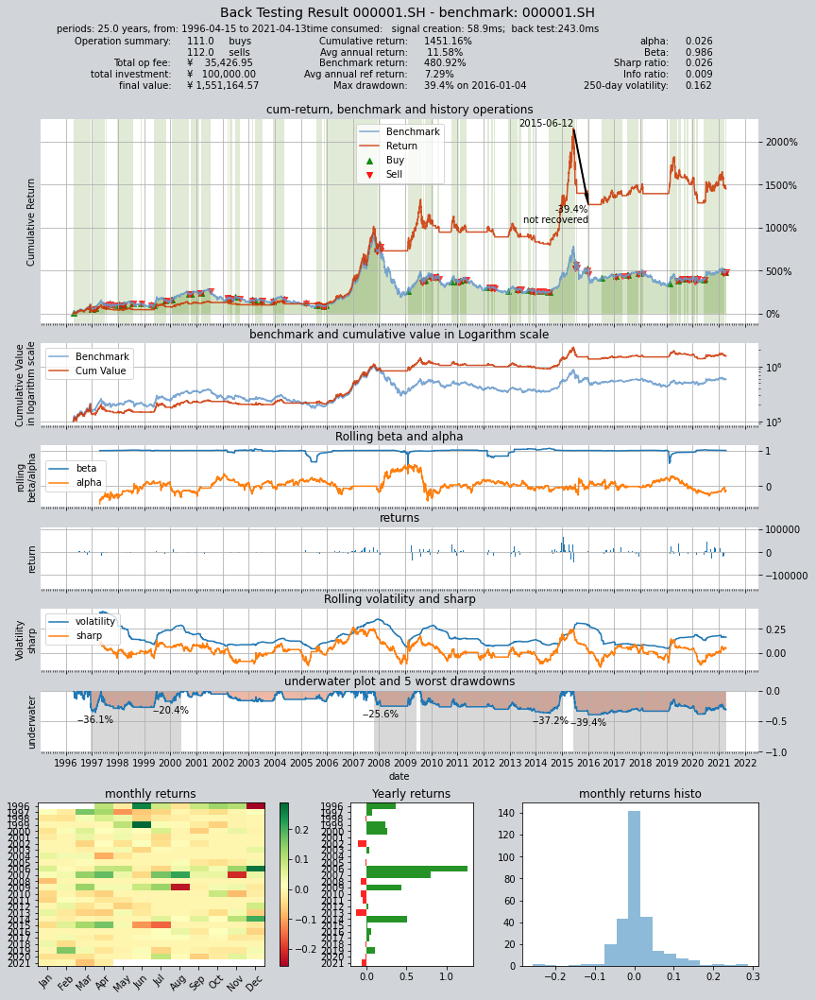
   