### 回测内置策略

测试内置的择时策略和选股策略
每种策略进行一次回测，回测区间苁1996年到2021年，测试使用默认策略参数，测试参数如下：

* 回测区间起止日期：1996-04-13 —— 2021-04-13，持续25年
* 测试投资标的： “000001.SH”上证指数
* 业绩参考标准： “000001.SH”上证指数


```python
import qteasy as qt
%matplotlib inline
```


```python
op = qt.Operator(strategies=['crossline'])
op.set_parameter(0, pars=(35, 120, 10, 'buy'))
qt.configure(mode=1,
             print_backtest_log=False,
             riskfree_ir=0.025,
             invest_start='19960413',
             invest_end='20210413',
             asset_pool='000001.SH',
             asset_type='I',
             reference_asset='000001.SH')
qt.configuration(up_to=5, default=True)
```

    Key                   Current        Default
    ------------------------------------------------
    mode:                 1              <1>
    asset_pool:           000001.SH      <000300.SH>
    asset_type:           I              <I>
    trade_batch_size:     0.0            <0.0>
    sell_batch_size:      0.0            <0.0>
    riskfree_ir:          0.025          <0.0035>
    parallel:             False          <False>
    hist_dnld_parallel:   16             <16>
    hist_dnld_delay:      None           <None>
    hist_dnld_delay_evy:  None           <None>
    hist_dnld_prog_bar:   None           <None>
    gpu:                  False          <False>
    hist_data_channel:    local          <local>
    print_backtest_log:   False          <False>
    reference_asset:      000001.SH      <000300.SH>
    ref_asset_type:       I              <I>
    ref_asset_dtype:      close          <close>
    visual:               True           <True>
    buy_sell_points:      True           <True>
    show_positions:       True           <True>
    cost_fixed_buy:       0              <0>
    cost_fixed_sell:      0              <0>
    cost_rate_buy:        0.0003         <0.0003>
    cost_rate_sell:       0.0001         <0.0001>
    cost_min_buy:         5.0            <5.0>
    cost_min_sell:        0.0            <0.0>
    cost_slippage:        0.0            <0.0>
    log:                  True           <True>
    trade_log:            True           <True>
    invest_start:         19960413       <20160405>
    invest_end:           20210413       <20210201>
    invest_cash_amounts:  [100000.0]     <[100000.0]>
    invest_cash_dates:    None           <None>
    allow_sell_short:     False          <False>
    maximize_cash_usage:  False          <False>
    PT_buy_threshold:     0.03           <0.03>
    PT_sell_threshold:    0.03           <0.03>
    price_priority_OHLC:  OHLC           <OHLC>
    price_priority_quote: normal         <normal>
    cash_deliver_period:  0              <0>
    stock_deliver_period: 1              <1>
    opti_start:           20160405       <20160405>
    opti_end:             20191231       <20191231>
    opti_cash_amounts:    [100000.0]     <[100000.0]>
    opti_cash_dates:      None           <None>
    opti_type:            single         <single>
    opti_sub_periods:     5              <5>
    opti_sub_prd_length:  0.6            <0.6>
    test_start:           20200106       <20200106>
    test_end:             20210201       <20210201>
    test_cash_amounts:    [100000.0]     <[100000.0]>
    test_cash_dates:      None           <None>
    test_type:            single         <single>
    test_indicators:      years,fv,return,mdd,v,ref,alpha,beta,sharp,info<years,fv,return,mdd,v,ref,alpha,beta,sharp,info>
    indicator_plot_type:  histo          <histo>
    test_sub_periods:     3              <3>
    test_sub_prd_length:  0.75           <0.75>
    test_cycle_count:     100            <100>
    optimize_target:      final_value    <final_value>
    maximize_target:      True           <True>
    opti_method:          1              <1>
    opti_grid_size:       1              <1>
    opti_sample_count:    256            <256>
    opti_r_sample_count:  16             <16>
    opti_reduce_ratio:    0.1            <0.1>
    opti_max_rounds:      5              <5>
    opti_min_volume:      1000           <1000>
    opti_population:      1000.0         <1000.0>
    opti_built-in_strategy_back_test/output_count:    30             <30>
    


```python
res = qt.run(op)
```

    Progress: [########################################] 1/1. 100.0%  Extracting data local files

    /Users/jackie/OneDrive/Projects/PycharmProjects/qteasy/qteasy/operator.py:1049: UserWarning: User-defined Signal blenders do not exist, default ones will be created!
      warnings.warn(f'User-defined Signal blenders do not exist, default ones will be created!', UserWarning)


    
         ====================================
         |                                  |
         |       BACK TESTING RESULT        |
         |                                  |
         ====================================
    
    qteasy running mode: 1 - History back testing
    time consumption for operate signal creation: 38.3ms
    time consumption for operation back looping:  589.4ms
    
    investment starts on      1996-04-15 00:00:00
    ends on                   2021-04-13 00:00:00
    Total looped periods:     25.0 years.
    
    -------------operation summary:------------
    
              Sell Cnt Buy Cnt Total Long pct Short pct Empty pct
    000001.SH    28       29     57   51.1%      0.0%     48.9%   
    
    Total operation fee:     ¥    6,589.95
    total investment amount: ¥  100,000.00
    final value:              ¥1,015,064.41
    Total return:                   915.06% 
    Avg Yearly return:                9.71%
    Skewness:                         -0.79
    Kurtosis:                         12.30
    Benchmark return:               480.92% 
    Benchmark Yearly return:          7.29%
    
    ------strategy loop_results indicators------ 
    alpha:                           -0.054
    Beta:                             0.851
    Sharp ratio:                      0.035
    Info ratio:                       0.002
    250 day volatility:               0.158
    Max drawdown:                    46.31% 
        peak / valley:        2015-06-12 / 2020-02-03
        recovered on:         Not recovered!
    
    
    ===========END OF REPORT=============
    


    
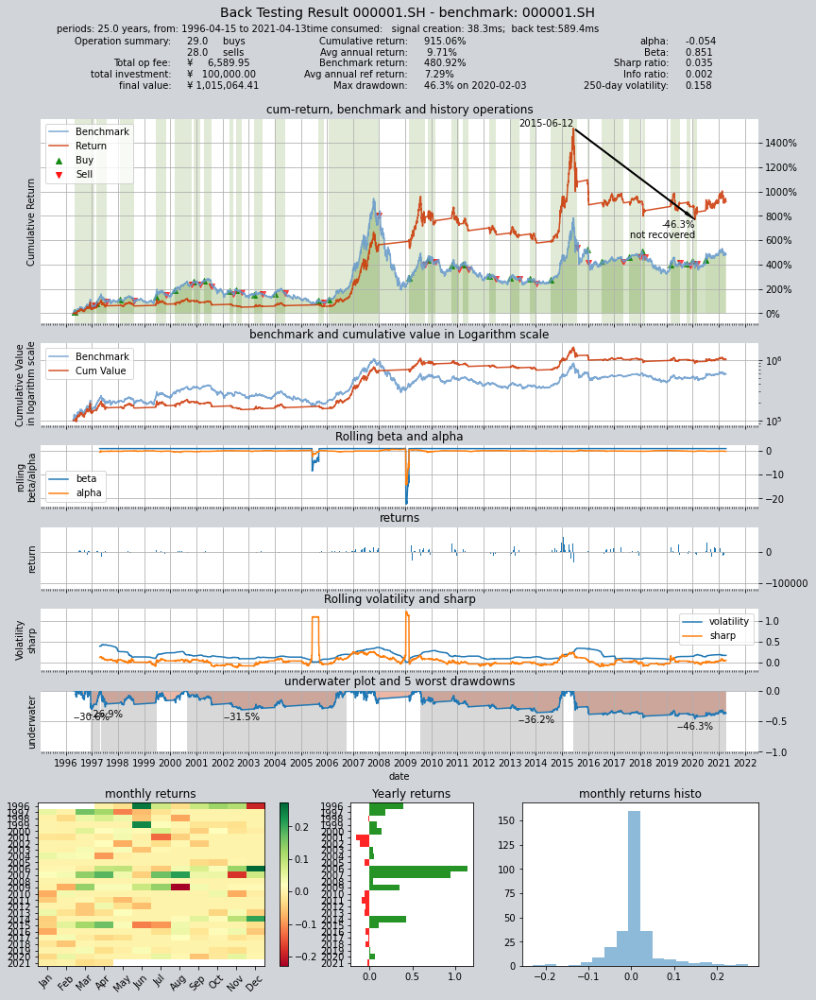
    


```python
op = qt.Operator(strategies=['macd'])
res = qt.run(op, mode=1)
```

    Progress: [########################################] 1/1. 100.0%  Extracting data local files

    /Users/jackie/OneDrive/Projects/PycharmProjects/qteasy/qteasy/operator.py:1049: UserWarning: User-defined Signal blenders do not exist, default ones will be created!
      warnings.warn(f'User-defined Signal blenders do not exist, default ones will be created!', UserWarning)


    
         ====================================
         |                                  |
         |       BACK TESTING RESULT        |
         |                                  |
         ====================================
    
    qteasy running mode: 1 - History back testing
    time consumption for operate signal creation: 69.8ms
    time consumption for operation back looping:  587.5ms
    
    investment starts on      1996-04-15 00:00:00
    ends on                   2021-04-13 00:00:00
    Total looped periods:     25.0 years.
    
    -------------operation summary:------------
    
              Sell Cnt Buy Cnt Total Long pct Short pct Empty pct
    000001.SH   219      219    438   52.3%      0.0%     47.7%   
    
    Total operation fee:     ¥   64,593.15
    total investment amount: ¥  100,000.00
    final value:              ¥1,882,579.16
    Total return:                  1782.58% 
    Avg Yearly return:               12.45%
    Skewness:                         -0.09
    Kurtosis:                         13.67
    Benchmark return:               480.92% 
    Benchmark Yearly return:          7.29%
    
    ------strategy loop_results indicators------ 
    alpha:                            0.029
    Beta:                             0.996
    Sharp ratio:                      0.044
    Info ratio:                       0.010
    250 day volatility:               0.161
    Max drawdown:                    38.50% 
        peak / valley:        2008-01-14 / 2008-10-15
        recovered on:         2009-07-20
    
    
    ===========END OF REPORT=============
    


    

    


```python
op = qt.Operator(strategies=['dma'])
res = qt.run(op, mode=1)
```

    Progress: [########################################] 1/1. 100.0%  Extracting data local files

    /Users/jackie/OneDrive/Projects/PycharmProjects/qteasy/qteasy/operator.py:1049: UserWarning: User-defined Signal blenders do not exist, default ones will be created!
      warnings.warn(f'User-defined Signal blenders do not exist, default ones will be created!', UserWarning)


    
         ====================================
         |                                  |
         |       BACK TESTING RESULT        |
         |                                  |
         ====================================
    
    qteasy running mode: 1 - History back testing
    time consumption for operate signal creation: 7.0ms
    time consumption for operation back looping:  572.0ms
    
    investment starts on      1996-04-15 00:00:00
    ends on                   2021-04-13 00:00:00
    Total looped periods:     25.0 years.
    
    -------------operation summary:------------
    
              Sell Cnt Buy Cnt Total Long pct Short pct Empty pct
    000001.SH   209      209    418   51.3%      0.0%     48.7%   
    
    Total operation fee:     ¥   41,939.60
    total investment amount: ¥  100,000.00
    final value:              ¥1,123,321.41
    Total return:                  1023.32% 
    Avg Yearly return:               10.15%
    Skewness:                         -0.34
    Kurtosis:                         13.64
    Benchmark return:               480.92% 
    Benchmark Yearly return:          7.29%
    
    ------strategy loop_results indicators------ 
    alpha:                           -0.002
    Beta:                             0.998
    Sharp ratio:                      0.035
    Info ratio:                       0.003
    250 day volatility:               0.162
    Max drawdown:                    42.24% 
        peak / valley:        2007-10-16 / 2009-01-15
        recovered on:         2015-03-30
    
    
    ===========END OF REPORT=============
    


    

    


```python
op = qt.Operator(strategies=['trix'])
res = qt.run(op, mode=1)
```

    Progress: [########################################] 1/1. 100.0%  Extracting data local files

    /Users/jackie/OneDrive/Projects/PycharmProjects/qteasy/qteasy/operator.py:1049: UserWarning: User-defined Signal blenders do not exist, default ones will be created!
      warnings.warn(f'User-defined Signal blenders do not exist, default ones will be created!', UserWarning)


    
         ====================================
         |                                  |
         |       BACK TESTING RESULT        |
         |                                  |
         ====================================
    
    qteasy running mode: 1 - History back testing
    time consumption for operate signal creation: 53.6ms
    time consumption for operation back looping:  568.4ms
    
    investment starts on      1996-04-15 00:00:00
    ends on                   2021-04-13 00:00:00
    Total looped periods:     25.0 years.
    
    -------------operation summary:------------
    
              Sell Cnt Buy Cnt Total Long pct Short pct Empty pct
    000001.SH    47       46     93   51.8%      0.0%     48.2%   
    
    Total operation fee:     ¥    6,628.99
    total investment amount: ¥  100,000.00
    final value:              ¥  647,405.62
    Total return:                   547.41% 
    Avg Yearly return:                7.75%
    Skewness:                         -0.87
    Kurtosis:                         12.33
    Benchmark return:               480.92% 
    Benchmark Yearly return:          7.29%
    
    ------strategy loop_results indicators------ 
    alpha:                           -0.022
    Beta:                             0.998
    Sharp ratio:                      0.023
    Info ratio:                      -0.004
    250 day volatility:               0.166
    Max drawdown:                    39.82% 
        peak / valley:        2015-06-12 / 2019-01-03
        recovered on:         Not recovered!
    
    
    ===========END OF REPORT=============
    


    
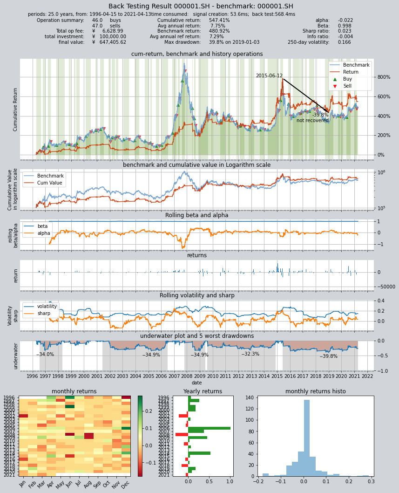
    


```python
op = qt.Operator(strategies=['cdl'])
res = qt.run(op, mode=1)
```

    Progress: [########################################] 1/1. 100.0%  Extracting data local filesHrom 19950531 to 20210413

    /Users/jackie/OneDrive/Projects/PycharmProjects/qteasy/qteasy/operator.py:1049: UserWarning: User-defined Signal blenders do not exist, default ones will be created!
      warnings.warn(f'User-defined Signal blenders do not exist, default ones will be created!', UserWarning)


    
         ====================================
         |                                  |
         |       BACK TESTING RESULT        |
         |                                  |
         ====================================
    
    qteasy running mode: 1 - History back testing
    time consumption for operate signal creation: 63.2ms
    time consumption for operation back looping:  705.2ms
    
    investment starts on      1996-04-15 00:00:00
    ends on                   2021-04-13 00:00:00
    Total looped periods:     25.0 years.
    
    -------------operation summary:------------
    
              Sell Cnt Buy Cnt Total Long pct Short pct Empty pct
    000001.SH    1        0      1    100.0%     0.0%      0.0%   
    
    Total operation fee:     ¥       29.99
    total investment amount: ¥  100,000.00
    final value:              ¥  580,746.64
    Total return:                   480.75% 
    Avg Yearly return:                7.29%
    Skewness:                         -0.24
    Kurtosis:                          5.19
    Benchmark return:               480.92% 
    Benchmark Yearly return:          7.29%
    
    ------strategy loop_results indicators------ 
    alpha:                           -0.000
    Beta:                             1.000
    Sharp ratio:                      0.021
    Info ratio:                      -0.003
    250 day volatility:               0.240
    Max drawdown:                    71.98% 
        peak / valley:        2007-10-16 / 2008-11-04
        recovered on:         Not recovered!
    
    
    ===========END OF REPORT=============
    


    
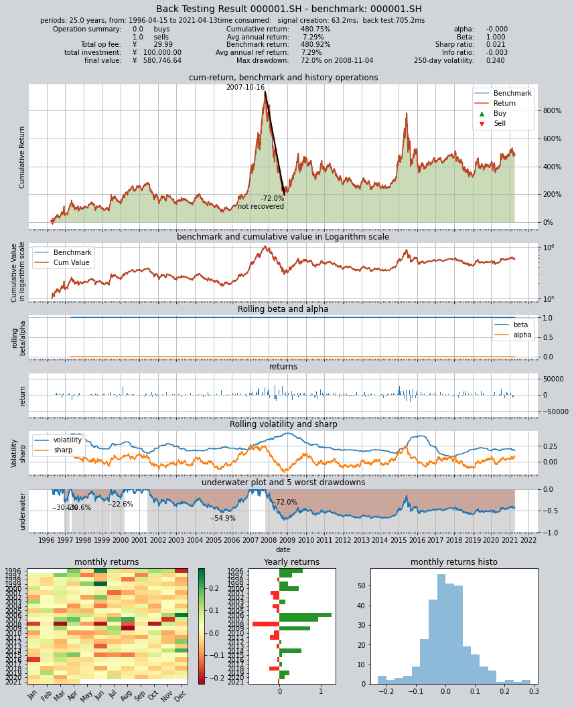
    


```python
op = qt.Operator(strategies=['bband'], signal_type='ps')
res = qt.run(op, mode=1)
```

    Progress: [########################################] 1/1. 100.0%  Extracting data local files

    /Users/jackie/OneDrive/Projects/PycharmProjects/qteasy/qteasy/operator.py:1049: UserWarning: User-defined Signal blenders do not exist, default ones will be created!
      warnings.warn(f'User-defined Signal blenders do not exist, default ones will be created!', UserWarning)


    
         ====================================
         |                                  |
         |       BACK TESTING RESULT        |
         |                                  |
         ====================================
    
    qteasy running mode: 1 - History back testing
    time consumption for operate signal creation: 31.9ms
    time consumption for operation back looping:  369.0ms
    
    investment starts on      1996-04-15 00:00:00
    ends on                   2021-04-13 00:00:00
    Total looped periods:     25.0 years.
    
    -------------operation summary:------------
    
              Sell Cnt Buy Cnt Total Long pct Short pct Empty pct
    000001.SH    91       62    153   49.4%      0.0%     50.6%   
    
    Total operation fee:     ¥   27,102.22
    total investment amount: ¥  100,000.00
    final value:              ¥2,648,108.21
    Total return:                  2548.11% 
    Avg Yearly return:               14.00%
    Skewness:                         -0.42
    Kurtosis:                         14.09
    Benchmark return:               480.92% 
    Benchmark Yearly return:          7.29%
    
    ------strategy loop_results indicators------ 
    alpha:                            0.036
    Beta:                             1.000
    Sharp ratio:                      0.039
    Info ratio:                       0.015
    250 day volatility:               0.156
    Max drawdown:                    30.62% 
        peak / valley:        1996-12-09 / 1996-12-24
        recovered on:         1997-04-04
    
    
    ===========END OF REPORT=============
    


    

    


```python
op = qt.Operator(strategies=['s-bband'], signal_type='ps')
res = qt.run(op, mode=1, print_backtest_log=False)
```

    Progress: [########################################] 1/1. 100.0%  Extracting data local files

    /Users/jackie/OneDrive/Projects/PycharmProjects/qteasy/qteasy/operator.py:1049: UserWarning: User-defined Signal blenders do not exist, default ones will be created!
      warnings.warn(f'User-defined Signal blenders do not exist, default ones will be created!', UserWarning)


    
         ====================================
         |                                  |
         |       BACK TESTING RESULT        |
         |                                  |
         ====================================
    
    qteasy running mode: 1 - History back testing
    time consumption for operate signal creation: 31.9ms
    time consumption for operation back looping:  413.1ms
    
    investment starts on      1996-04-15 00:00:00
    ends on                   2021-04-13 00:00:00
    Total looped periods:     25.0 years.
    
    -------------operation summary:------------
    
              Sell Cnt Buy Cnt Total Long pct Short pct Empty pct
    000001.SH   334      282    616   99.9%      0.0%      0.1%   
    
    Total operation fee:     ¥    6,741.51
    total investment amount: ¥  100,000.00
    final value:              ¥1,265,109.72
    Total return:                  1165.11% 
    Avg Yearly return:               10.68%
    Skewness:                         -0.97
    Kurtosis:                         21.03
    Benchmark return:               480.92% 
    Benchmark Yearly return:          7.29%
    
    ------strategy loop_results indicators------ 
    alpha:                            0.092
    Beta:                             1.941
    Sharp ratio:                      0.030
    Info ratio:                       0.004
    250 day volatility:               0.117
    Max drawdown:                    30.62% 
        peak / valley:        1996-12-09 / 1996-12-24
        recovered on:         1997-04-04
    
    
    ===========END OF REPORT=============
    


    
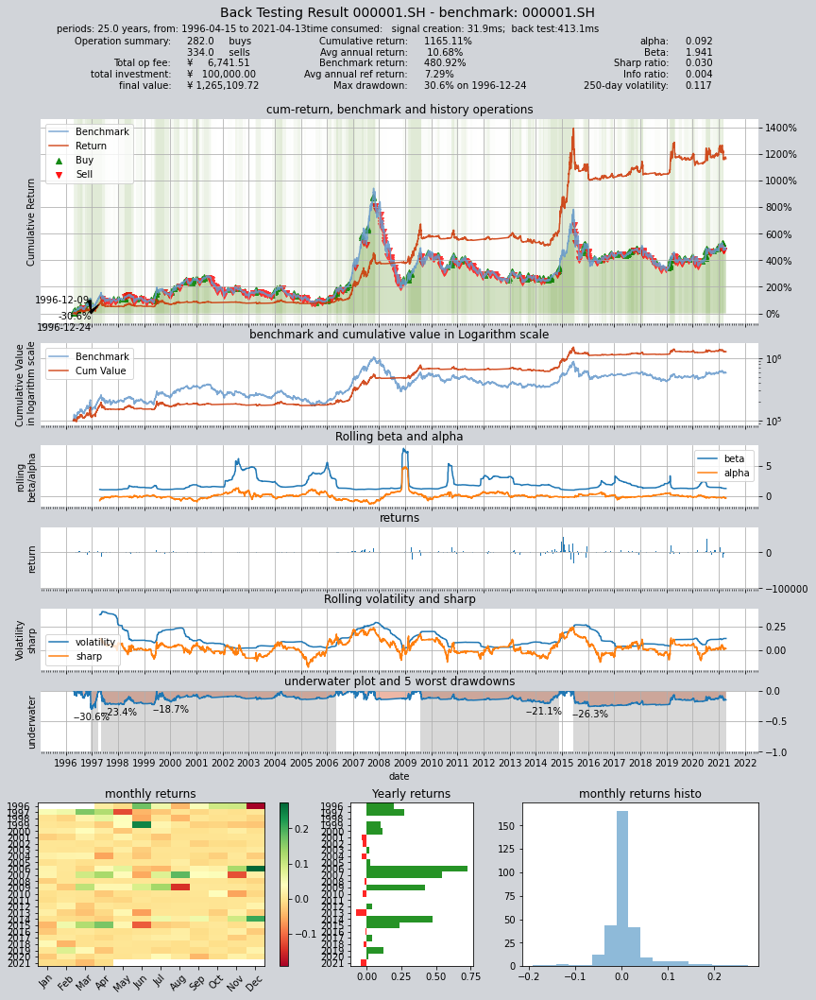
    


```python
op = qt.Operator(strategies=['sarext'])
qt.configuration()
```

    Key                   Current        
    -------------------------------------
    mode:                 1
    asset_pool:           000001.SH
    asset_type:           I
    invest_start:         19960413
    invest_end:           20210413
    opti_start:           20160405
    opti_end:             20191231
    test_start:           20200106
    test_end:             20210201
    


```python
op = qt.Operator(strategies=['ssma'])
res = qt.run(op, mode=1, printlog=True)
```

    Progress: [########################################] 1/1. 100.0%  Extracting data local files

    /Users/jackie/OneDrive/Projects/PycharmProjects/qteasy/qteasy/operator.py:1049: UserWarning: User-defined Signal blenders do not exist, default ones will be created!
      warnings.warn(f'User-defined Signal blenders do not exist, default ones will be created!', UserWarning)


    
         ====================================
         |                                  |
         |       BACK TESTING RESULT        |
         |                                  |
         ====================================
    
    qteasy running mode: 1 - History back testing
    time consumption for operate signal creation: 26.7ms
    time consumption for operation back looping:  568.0ms
    
    investment starts on      1996-04-15 00:00:00
    ends on                   2021-04-13 00:00:00
    Total looped periods:     25.0 years.
    
    -------------operation summary:------------
    
              Sell Cnt Buy Cnt Total Long pct Short pct Empty pct
    000001.SH   354      353    707   53.6%      0.0%     46.4%   
    
    Total operation fee:     ¥  284,858.42
    total investment amount: ¥  100,000.00
    final value:              ¥5,001,064.13
    Total return:                  4901.06% 
    Avg Yearly return:               16.93%
    Skewness:                         -0.22
    Kurtosis:                         12.77
    Benchmark return:               480.92% 
    Benchmark Yearly return:          7.29%
    
    ------strategy loop_results indicators------ 
    alpha:                            0.077
    Beta:                             0.993
    Sharp ratio:                      0.055
    Info ratio:                       0.023
    250 day volatility:               0.157
    Max drawdown:                    30.99% 
        peak / valley:        2007-10-16 / 2009-01-15
        recovered on:         2009-06-26
    
    
    ===========END OF REPORT=============
    


    

    


```python
op = qt.Operator(strategies=['sdema'])
res = qt.run(op, mode=1)
```

    Progress: [########################################] 1/1. 100.0%  Extracting data local files

    /Users/jackie/OneDrive/Projects/PycharmProjects/qteasy/qteasy/operator.py:1049: UserWarning: User-defined Signal blenders do not exist, default ones will be created!
      warnings.warn(f'User-defined Signal blenders do not exist, default ones will be created!', UserWarning)


    
         ====================================
         |                                  |
         |       BACK TESTING RESULT        |
         |                                  |
         ====================================
    
    qteasy running mode: 1 - History back testing
    time consumption for operate signal creation: 35.8ms
    time consumption for operation back looping:  574.1ms
    
    investment starts on      1996-04-15 00:00:00
    ends on                   2021-04-13 00:00:00
    Total looped periods:     25.0 years.
    
    -------------operation summary:------------
    
              Sell Cnt Buy Cnt Total Long pct Short pct Empty pct
    000001.SH   674      673    1347  52.4%      0.0%     47.6%   
    
    Total operation fee:     ¥  246,258.42
    total investment amount: ¥  100,000.00
    final value:              ¥1,842,314.74
    Total return:                  1742.31% 
    Avg Yearly return:               12.35%
    Skewness:                          0.26
    Kurtosis:                         14.54
    Benchmark return:               480.92% 
    Benchmark Yearly return:          7.29%
    
    ------strategy loop_results indicators------ 
    alpha:                            0.013
    Beta:                             0.990
    Sharp ratio:                      0.042
    Info ratio:                       0.010
    250 day volatility:               0.158
    Max drawdown:                    37.01% 
        peak / valley:        2007-10-16 / 2008-11-04
        recovered on:         2009-07-03
    
    
    ===========END OF REPORT=============
    


    
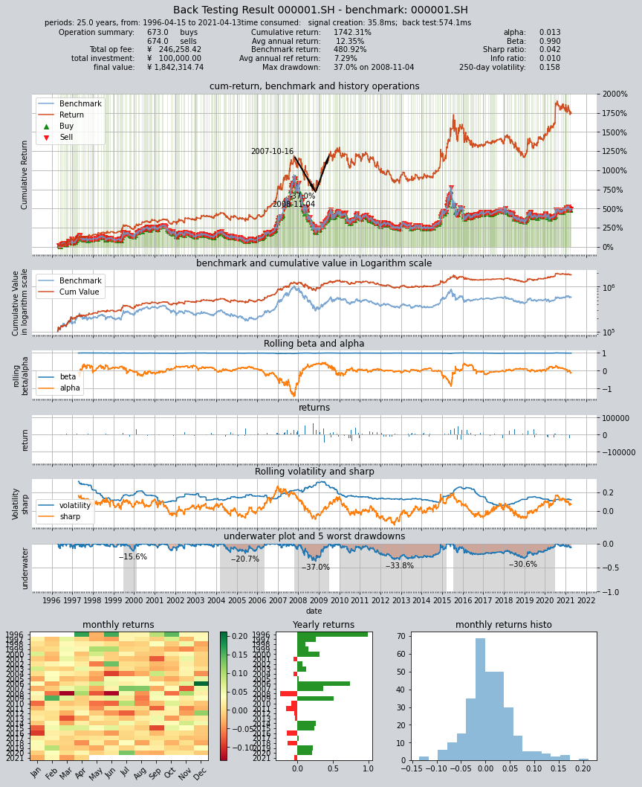
    


```python
op = qt.Operator(strategies=['sema'])
res = qt.run(op, mode=1)
```

    Progress: [########################################] 1/1. 100.0%  Extracting data local files

    /Users/jackie/OneDrive/Projects/PycharmProjects/qteasy/qteasy/operator.py:1049: UserWarning: User-defined Signal blenders do not exist, default ones will be created!
      warnings.warn(f'User-defined Signal blenders do not exist, default ones will be created!', UserWarning)


    
         ====================================
         |                                  |
         |       BACK TESTING RESULT        |
         |                                  |
         ====================================
    
    qteasy running mode: 1 - History back testing
    time consumption for operate signal creation: 28.2ms
    time consumption for operation back looping:  578.1ms
    
    investment starts on      1996-04-15 00:00:00
    ends on                   2021-04-13 00:00:00
    Total looped periods:     25.0 years.
    
    -------------operation summary:------------
    
              Sell Cnt Buy Cnt Total Long pct Short pct Empty pct
    000001.SH   377      376    753   53.6%      0.0%     46.4%   
    
    Total operation fee:     ¥  352,080.66
    total investment amount: ¥  100,000.00
    final value:              ¥5,568,823.83
    Total return:                  5468.82% 
    Avg Yearly return:               17.44%
    Skewness:                         -0.28
    Kurtosis:                         12.83
    Benchmark return:               480.92% 
    Benchmark Yearly return:          7.29%
    
    ------strategy loop_results indicators------ 
    alpha:                            0.082
    Beta:                             0.993
    Sharp ratio:                      0.055
    Info ratio:                       0.025
    250 day volatility:               0.158
    Max drawdown:                    29.29% 
        peak / valley:        2007-10-16 / 2009-01-15
        recovered on:         2009-06-29
    
    
    ===========END OF REPORT=============
    


    

    


```python
op = qt.Operator(strategies=['sht'])
res = qt.run(op, mode=1)
```

    Progress: [########################################] 1/1. 100.0%  Extracting data local files

    /Users/jackie/OneDrive/Projects/PycharmProjects/qteasy/qteasy/operator.py:1049: UserWarning: User-defined Signal blenders do not exist, default ones will be created!
      warnings.warn(f'User-defined Signal blenders do not exist, default ones will be created!', UserWarning)


    
         ====================================
         |                                  |
         |       BACK TESTING RESULT        |
         |                                  |
         ====================================
    
    qteasy running mode: 1 - History back testing
    time consumption for operate signal creation: 134.2ms
    time consumption for operation back looping:  580.6ms
    
    investment starts on      1996-04-15 00:00:00
    ends on                   2021-04-13 00:00:00
    Total looped periods:     25.0 years.
    
    -------------operation summary:------------
    
              Sell Cnt Buy Cnt Total Long pct Short pct Empty pct
    000001.SH   246      245    491   54.4%      0.0%     45.6%   
    
    Total operation fee:     ¥  213,484.06
    total investment amount: ¥  100,000.00
    final value:              ¥5,258,142.09
    Total return:                  5158.14% 
    Avg Yearly return:               17.17%
    Skewness:                         -0.39
    Kurtosis:                         12.61
    Benchmark return:               480.92% 
    Benchmark Yearly return:          7.29%
    
    ------strategy loop_results indicators------ 
    alpha:                            0.077
    Beta:                             0.995
    Sharp ratio:                      0.052
    Info ratio:                       0.025
    250 day volatility:               0.160
    Max drawdown:                    22.35% 
        peak / valley:        1997-05-12 / 1997-12-18
        recovered on:         1999-05-27
    
    
    ===========END OF REPORT=============
    


    
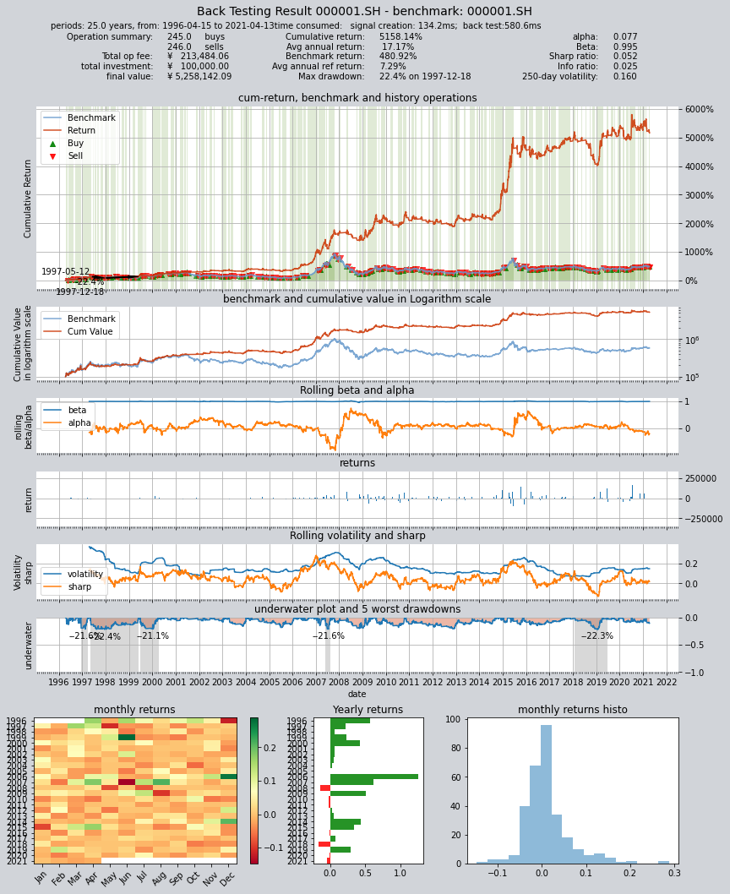
    


```python
op = qt.Operator(strategies=['skama'])
res = qt.run(op, mode=1)
```

    Progress: [########################################] 1/1. 100.0%  Extracting data local files

    /Users/jackie/OneDrive/Projects/PycharmProjects/qteasy/qteasy/operator.py:1049: UserWarning: User-defined Signal blenders do not exist, default ones will be created!
      warnings.warn(f'User-defined Signal blenders do not exist, default ones will be created!', UserWarning)


    
         ====================================
         |                                  |
         |       BACK TESTING RESULT        |
         |                                  |
         ====================================
    
    qteasy running mode: 1 - History back testing
    time consumption for operate signal creation: 30.9ms
    time consumption for operation back looping:  571.5ms
    
    investment starts on      1996-04-15 00:00:00
    ends on                   2021-04-13 00:00:00
    Total looped periods:     25.0 years.
    
    -------------operation summary:------------
    
              Sell Cnt Buy Cnt Total Long pct Short pct Empty pct
    000001.SH   331      330    661   50.7%      0.0%     49.3%   
    
    Total operation fee:     ¥  122,059.97
    total investment amount: ¥  100,000.00
    final value:              ¥1,534,788.53
    Total return:                  1434.79% 
    Avg Yearly return:               11.54%
    Skewness:                         -0.32
    Kurtosis:                         14.09
    Benchmark return:               480.92% 
    Benchmark Yearly return:          7.29%
    
    ------strategy loop_results indicators------ 
    alpha:                            0.012
    Beta:                             0.992
    Sharp ratio:                      0.037
    Info ratio:                       0.007
    250 day volatility:               0.154
    Max drawdown:                    34.72% 
        peak / valley:        2007-10-16 / 2008-11-11
        recovered on:         2009-07-20
    
    
    ===========END OF REPORT=============
    


    

    


```python
op = qt.Operator(strategies=['smama'])
res = qt.run(op, mode=1)
```

    Progress: [########################################] 1/1. 100.0%  Extracting data local files

    /Users/jackie/OneDrive/Projects/PycharmProjects/qteasy/qteasy/operator.py:1049: UserWarning: User-defined Signal blenders do not exist, default ones will be created!
      warnings.warn(f'User-defined Signal blenders do not exist, default ones will be created!', UserWarning)


    
         ====================================
         |                                  |
         |       BACK TESTING RESULT        |
         |                                  |
         ====================================
    
    qteasy running mode: 1 - History back testing
    time consumption for operate signal creation: 144.5ms
    time consumption for operation back looping:  615.7ms
    
    investment starts on      1996-04-15 00:00:00
    ends on                   2021-04-13 00:00:00
    Total looped periods:     25.0 years.
    
    -------------operation summary:------------
    
              Sell Cnt Buy Cnt Total Long pct Short pct Empty pct
    000001.SH   494      493    987   53.2%      0.0%     46.8%   
    
    Total operation fee:     ¥  331,123.13
    total investment amount: ¥  100,000.00
    final value:              ¥3,839,038.80
    Total return:                  3739.04% 
    Avg Yearly return:               15.70%
    Skewness:                         -0.11
    Kurtosis:                         13.87
    Benchmark return:               480.92% 
    Benchmark Yearly return:          7.29%
    
    ------strategy loop_results indicators------ 
    alpha:                            0.055
    Beta:                             0.990
    Sharp ratio:                      0.048
    Info ratio:                       0.019
    250 day volatility:               0.157
    Max drawdown:                    25.57% 
        peak / valley:        2015-07-23 / 2018-12-14
        recovered on:         2020-07-06
    
    
    ===========END OF REPORT=============
    


    

    


```python
op = qt.Operator(strategies=['sfama'])
res = qt.run(op, mode=1)
```

    Progress: [########################################] 1/1. 100.0%  Extracting data local files

    /Users/jackie/OneDrive/Projects/PycharmProjects/qteasy/qteasy/operator.py:1049: UserWarning: User-defined Signal blenders do not exist, default ones will be created!
      warnings.warn(f'User-defined Signal blenders do not exist, default ones will be created!', UserWarning)


    
         ====================================
         |                                  |
         |       BACK TESTING RESULT        |
         |                                  |
         ====================================
    
    qteasy running mode: 1 - History back testing
    time consumption for operate signal creation: 141.6ms
    time consumption for operation back looping:  576.0ms
    
    investment starts on      1996-04-15 00:00:00
    ends on                   2021-04-13 00:00:00
    Total looped periods:     25.0 years.
    
    -------------operation summary:------------
    
              Sell Cnt Buy Cnt Total Long pct Short pct Empty pct
    000001.SH   269      268    537   53.0%      0.0%     47.0%   
    
    Total operation fee:     ¥  165,473.25
    total investment amount: ¥  100,000.00
    final value:              ¥3,287,553.28
    Total return:                  3187.55% 
    Avg Yearly return:               14.99%
    Skewness:                         -0.57
    Kurtosis:                         13.75
    Benchmark return:               480.92% 
    Benchmark Yearly return:          7.29%
    
    ------strategy loop_results indicators------ 
    alpha:                            0.051
    Beta:                             0.994
    Sharp ratio:                      0.045
    Info ratio:                       0.018
    250 day volatility:               0.159
    Max drawdown:                    34.66% 
        peak / valley:        2015-06-12 / 2016-06-24
        recovered on:         Not recovered!
    
    
    ===========END OF REPORT=============
    


    

    


```python
op = qt.Operator(strategies=['st3'])
res = qt.run(op, mode=1)
```

    Progress: [########################################] 1/1. 100.0%  Extracting data local files

    /Users/jackie/OneDrive/Projects/PycharmProjects/qteasy/qteasy/operator.py:1049: UserWarning: User-defined Signal blenders do not exist, default ones will be created!
      warnings.warn(f'User-defined Signal blenders do not exist, default ones will be created!', UserWarning)


    
         ====================================
         |                                  |
         |       BACK TESTING RESULT        |
         |                                  |
         ====================================
    
    qteasy running mode: 1 - History back testing
    time consumption for operate signal creation: 29.9ms
    time consumption for operation back looping:  637.2ms
    
    investment starts on      1996-04-15 00:00:00
    ends on                   2021-04-13 00:00:00
    Total looped periods:     25.0 years.
    
    -------------operation summary:------------
    
              Sell Cnt Buy Cnt Total Long pct Short pct Empty pct
    000001.SH   292      291    583   53.6%      0.0%     46.4%   
    
    Total operation fee:     ¥  247,511.22
    total investment amount: ¥  100,000.00
    final value:              ¥4,541,825.83
    Total return:                  4441.83% 
    Avg Yearly return:               16.48%
    Skewness:                         -0.36
    Kurtosis:                         13.34
    Benchmark return:               480.92% 
    Benchmark Yearly return:          7.29%
    
    ------strategy loop_results indicators------ 
    alpha:                            0.075
    Beta:                             0.994
    Sharp ratio:                      0.054
    Info ratio:                       0.022
    250 day volatility:               0.158
    Max drawdown:                    28.46% 
        peak / valley:        2007-10-16 / 2009-01-15
        recovered on:         2009-06-18
    
    
    ===========END OF REPORT=============
    


    
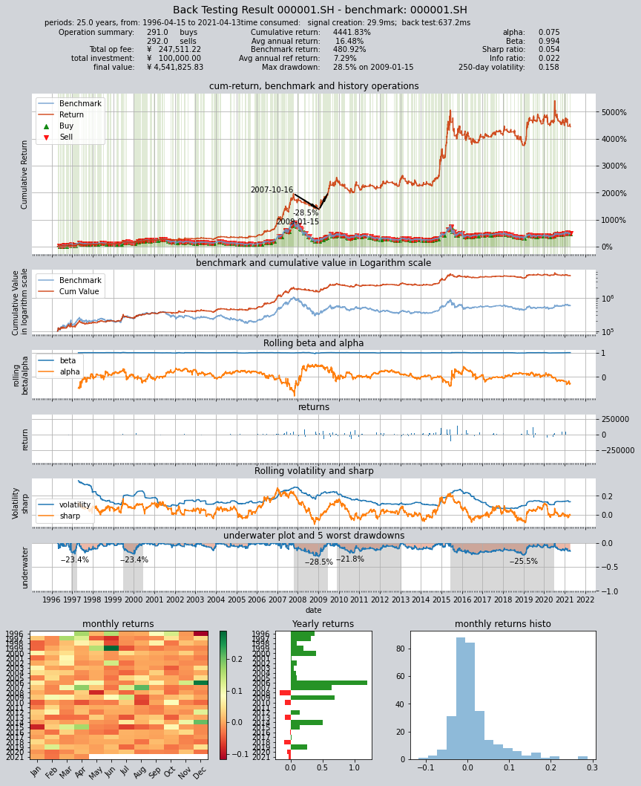
    


```python
op = qt.Operator(strategies=['stema'])
res = qt.run(op, mode=1)
```

    Progress: [########################################] 1/1. 100.0%  Extracting data local files

    /Users/jackie/OneDrive/Projects/PycharmProjects/qteasy/qteasy/operator.py:1049: UserWarning: User-defined Signal blenders do not exist, default ones will be created!
      warnings.warn(f'User-defined Signal blenders do not exist, default ones will be created!', UserWarning)


    
         ====================================
         |                                  |
         |       BACK TESTING RESULT        |
         |                                  |
         ====================================
    
    qteasy running mode: 1 - History back testing
    time consumption for operate signal creation: 40.6ms
    time consumption for operation back looping:  594.2ms
    
    investment starts on      1996-04-15 00:00:00
    ends on                   2021-04-13 00:00:00
    Total looped periods:     25.0 years.
    
    -------------operation summary:------------
    
              Sell Cnt Buy Cnt Total Long pct Short pct Empty pct
    000001.SH   1109     1109   2218  49.7%      0.0%     50.3%   
    
    Total operation fee:     ¥  459,406.79
    total investment amount: ¥  100,000.00
    final value:              ¥3,555,180.77
    Total return:                  3455.18% 
    Avg Yearly return:               15.35%
    Skewness:                          0.26
    Kurtosis:                         13.93
    Benchmark return:               480.92% 
    Benchmark Yearly return:          7.29%
    
    ------strategy loop_results indicators------ 
    alpha:                            0.049
    Beta:                             0.989
    Sharp ratio:                      0.056
    Info ratio:                       0.020
    250 day volatility:               0.167
    Max drawdown:                    36.31% 
        peak / valley:        2008-01-17 / 2008-09-18
        recovered on:         2009-05-04
    
    
    ===========END OF REPORT=============
    


    

    


```python
op = qt.Operator(strategies=['strima'])
res = qt.run(op, mode=1)
```

    Progress: [########################################] 1/1. 100.0%  Extracting data local files

    /Users/jackie/OneDrive/Projects/PycharmProjects/qteasy/qteasy/operator.py:1049: UserWarning: User-defined Signal blenders do not exist, default ones will be created!
      warnings.warn(f'User-defined Signal blenders do not exist, default ones will be created!', UserWarning)


    
         ====================================
         |                                  |
         |       BACK TESTING RESULT        |
         |                                  |
         ====================================
    
    qteasy running mode: 1 - History back testing
    time consumption for operate signal creation: 27.7ms
    time consumption for operation back looping:  575.1ms
    
    investment starts on      1996-04-15 00:00:00
    ends on                   2021-04-13 00:00:00
    Total looped periods:     25.0 years.
    
    -------------operation summary:------------
    
              Sell Cnt Buy Cnt Total Long pct Short pct Empty pct
    000001.SH   387      386    773   53.8%      0.0%     46.2%   
    
    Total operation fee:     ¥  154,195.86
    total investment amount: ¥  100,000.00
    final value:              ¥1,919,160.49
    Total return:                  1819.16% 
    Avg Yearly return:               12.54%
    Skewness:                         -0.25
    Kurtosis:                         12.93
    Benchmark return:               480.92% 
    Benchmark Yearly return:          7.29%
    
    ------strategy loop_results indicators------ 
    alpha:                            0.030
    Beta:                             0.991
    Sharp ratio:                      0.038
    Info ratio:                       0.010
    250 day volatility:               0.157
    Max drawdown:                    41.48% 
        peak / valley:        2007-10-16 / 2009-01-15
        recovered on:         2014-11-25
    
    
    ===========END OF REPORT=============
    


    

    


```python
op = qt.Operator(strategies=['swma'])
res = qt.run(op, mode=1)
```

    Progress: [########################################] 1/1. 100.0%  Extracting data local files

    /Users/jackie/OneDrive/Projects/PycharmProjects/qteasy/qteasy/operator.py:1049: UserWarning: User-defined Signal blenders do not exist, default ones will be created!
      warnings.warn(f'User-defined Signal blenders do not exist, default ones will be created!', UserWarning)


    
         ====================================
         |                                  |
         |       BACK TESTING RESULT        |
         |                                  |
         ====================================
    
    qteasy running mode: 1 - History back testing
    time consumption for operate signal creation: 26.5ms
    time consumption for operation back looping:  592.4ms
    
    investment starts on      1996-04-15 00:00:00
    ends on                   2021-04-13 00:00:00
    Total looped periods:     25.0 years.
    
    -------------operation summary:------------
    
              Sell Cnt Buy Cnt Total Long pct Short pct Empty pct
    000001.SH   497      496    993   53.1%      0.0%     46.9%   
    
    Total operation fee:     ¥  216,059.32
    total investment amount: ¥  100,000.00
    final value:              ¥2,310,899.63
    Total return:                  2210.90% 
    Avg Yearly return:               13.38%
    Skewness:                         -0.12
    Kurtosis:                         14.11
    Benchmark return:               480.92% 
    Benchmark Yearly return:          7.29%
    
    ------strategy loop_results indicators------ 
    alpha:                            0.030
    Beta:                             0.990
    Sharp ratio:                      0.039
    Info ratio:                       0.013
    250 day volatility:               0.157
    Max drawdown:                    31.63% 
        peak / valley:        2015-06-12 / 2018-12-14
        recovered on:         Not recovered!
    
    
    ===========END OF REPORT=============
    


    

    


```python
op = qt.Operator(strategies=['dsma'])
res = qt.run(op, mode=1)
```

    Progress: [########################################] 1/1. 100.0%  Extracting data local files

    /Users/jackie/OneDrive/Projects/PycharmProjects/qteasy/qteasy/operator.py:1049: UserWarning: User-defined Signal blenders do not exist, default ones will be created!
      warnings.warn(f'User-defined Signal blenders do not exist, default ones will be created!', UserWarning)


    
         ====================================
         |                                  |
         |       BACK TESTING RESULT        |
         |                                  |
         ====================================
    
    qteasy running mode: 1 - History back testing
    time consumption for operate signal creation: 38.5ms
    time consumption for operation back looping:  593.5ms
    
    investment starts on      1996-04-15 00:00:00
    ends on                   2021-04-13 00:00:00
    Total looped periods:     25.0 years.
    
    -------------operation summary:------------
    
              Sell Cnt Buy Cnt Total Long pct Short pct Empty pct
    000001.SH    33       33     66   54.1%      0.0%     45.9%   
    
    Total operation fee:     ¥    8,073.73
    total investment amount: ¥  100,000.00
    final value:              ¥1,282,102.43
    Total return:                  1182.10% 
    Avg Yearly return:               10.74%
    Skewness:                         -0.79
    Kurtosis:                         11.82
    Benchmark return:               480.92% 
    Benchmark Yearly return:          7.29%
    
    ------strategy loop_results indicators------ 
    alpha:                           -0.003
    Beta:                             0.918
    Sharp ratio:                      0.033
    Info ratio:                       0.006
    250 day volatility:               0.164
    Max drawdown:                    37.77% 
        peak / valley:        2015-06-12 / 2016-01-07
        recovered on:         Not recovered!
    
    
    ===========END OF REPORT=============
    


    

    


```python
op = qt.Operator(strategies=['ddema'])
res = qt.run(op, mode=1)
```

    Progress: [########################################] 1/1. 100.0%  Extracting data local files

    /Users/jackie/OneDrive/Projects/PycharmProjects/qteasy/qteasy/operator.py:1049: UserWarning: User-defined Signal blenders do not exist, default ones will be created!
      warnings.warn(f'User-defined Signal blenders do not exist, default ones will be created!', UserWarning)


    
         ====================================
         |                                  |
         |       BACK TESTING RESULT        |
         |                                  |
         ====================================
    
    qteasy running mode: 1 - History back testing
    time consumption for operate signal creation: 50.2ms
    time consumption for operation back looping:  576.0ms
    
    investment starts on      1996-04-15 00:00:00
    ends on                   2021-04-13 00:00:00
    Total looped periods:     25.0 years.
    
    -------------operation summary:------------
    
              Sell Cnt Buy Cnt Total Long pct Short pct Empty pct
    000001.SH    62       61    123   53.9%      0.0%     46.1%   
    
    Total operation fee:     ¥   13,708.33
    total investment amount: ¥  100,000.00
    final value:              ¥  934,220.81
    Total return:                   834.22% 
    Avg Yearly return:                9.35%
    Skewness:                         -0.63
    Kurtosis:                         12.39
    Benchmark return:               480.92% 
    Benchmark Yearly return:          7.29%
    
    ------strategy loop_results indicators------ 
    alpha:                            0.001
    Beta:                             0.998
    Sharp ratio:                      0.022
    Info ratio:                       0.001
    250 day volatility:               0.167
    Max drawdown:                    49.41% 
        peak / valley:        2007-10-16 / 2008-11-04
        recovered on:         2009-07-27
    
    
    ===========END OF REPORT=============
    


    
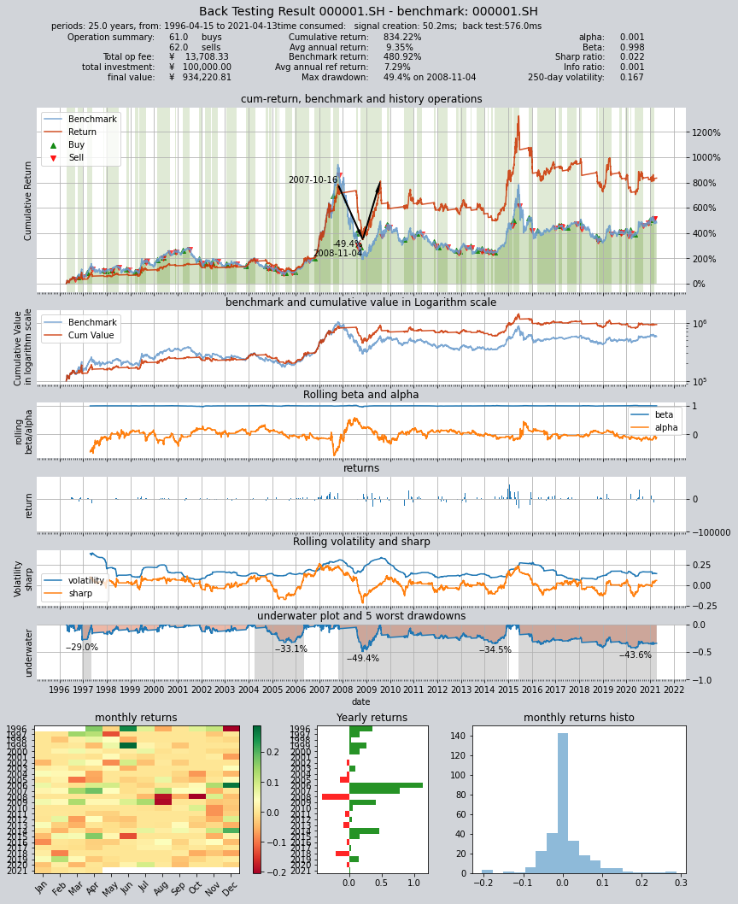
    


```python
op = qt.Operator(strategies=['dema'])
res = qt.run(op, mode=1)
```

    Progress: [########################################] 1/1. 100.0%  Extracting data local files

    /Users/jackie/OneDrive/Projects/PycharmProjects/qteasy/qteasy/operator.py:1049: UserWarning: User-defined Signal blenders do not exist, default ones will be created!
      warnings.warn(f'User-defined Signal blenders do not exist, default ones will be created!', UserWarning)


    
         ====================================
         |                                  |
         |       BACK TESTING RESULT        |
         |                                  |
         ====================================
    
    qteasy running mode: 1 - History back testing
    time consumption for operate signal creation: 40.9ms
    time consumption for operation back looping:  581.4ms
    
    investment starts on      1996-04-15 00:00:00
    ends on                   2021-04-13 00:00:00
    Total looped periods:     25.0 years.
    
    -------------operation summary:------------
    
              Sell Cnt Buy Cnt Total Long pct Short pct Empty pct
    000001.SH   152      151    303   53.5%      0.0%     46.5%   
    
    Total operation fee:     ¥   79,796.95
    total investment amount: ¥  100,000.00
    final value:              ¥2,743,507.81
    Total return:                  2643.51% 
    Avg Yearly return:               14.16%
    Skewness:                         -0.60
    Kurtosis:                         13.19
    Benchmark return:               480.92% 
    Benchmark Yearly return:          7.29%
    
    ------strategy loop_results indicators------ 
    alpha:                            0.047
    Beta:                             0.996
    Sharp ratio:                      0.043
    Info ratio:                       0.016
    250 day volatility:               0.161
    Max drawdown:                    31.93% 
        peak / valley:        2015-06-12 / 2019-01-17
        recovered on:         Not recovered!
    
    
    ===========END OF REPORT=============
    


    
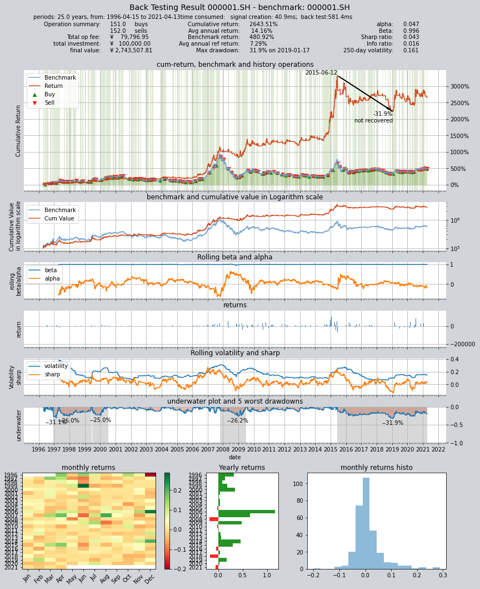
    


```python
op = qt.Operator(strategies=['dkama'])
res = qt.run(op, mode=1)
```

    Progress: [########################################] 1/1. 100.0%  Extracting data local files

    /Users/jackie/OneDrive/Projects/PycharmProjects/qteasy/qteasy/operator.py:1049: UserWarning: User-defined Signal blenders do not exist, default ones will be created!
      warnings.warn(f'User-defined Signal blenders do not exist, default ones will be created!', UserWarning)


    
         ====================================
         |                                  |
         |       BACK TESTING RESULT        |
         |                                  |
         ====================================
    
    qteasy running mode: 1 - History back testing
    time consumption for operate signal creation: 42.3ms
    time consumption for operation back looping:  585.2ms
    
    investment starts on      1996-04-15 00:00:00
    ends on                   2021-04-13 00:00:00
    Total looped periods:     25.0 years.
    
    -------------operation summary:------------
    
              Sell Cnt Buy Cnt Total Long pct Short pct Empty pct
    000001.SH    44       45     89   53.1%      0.0%     46.9%   
    
    Total operation fee:     ¥    8,105.82
    total investment amount: ¥  100,000.00
    final value:              ¥1,070,862.54
    Total return:                   970.86% 
    Avg Yearly return:                9.94%
    Skewness:                         -0.71
    Kurtosis:                         11.98
    Benchmark return:               480.92% 
    Benchmark Yearly return:          7.29%
    
    ------strategy loop_results indicators------ 
    alpha:                           -0.128
    Beta:                             0.724
    Sharp ratio:                      0.050
    Info ratio:                       0.003
    250 day volatility:               0.159
    Max drawdown:                    39.87% 
        peak / valley:        2009-08-04 / 2013-12-26
        recovered on:         2015-03-23
    
    
    ===========END OF REPORT=============
    


    
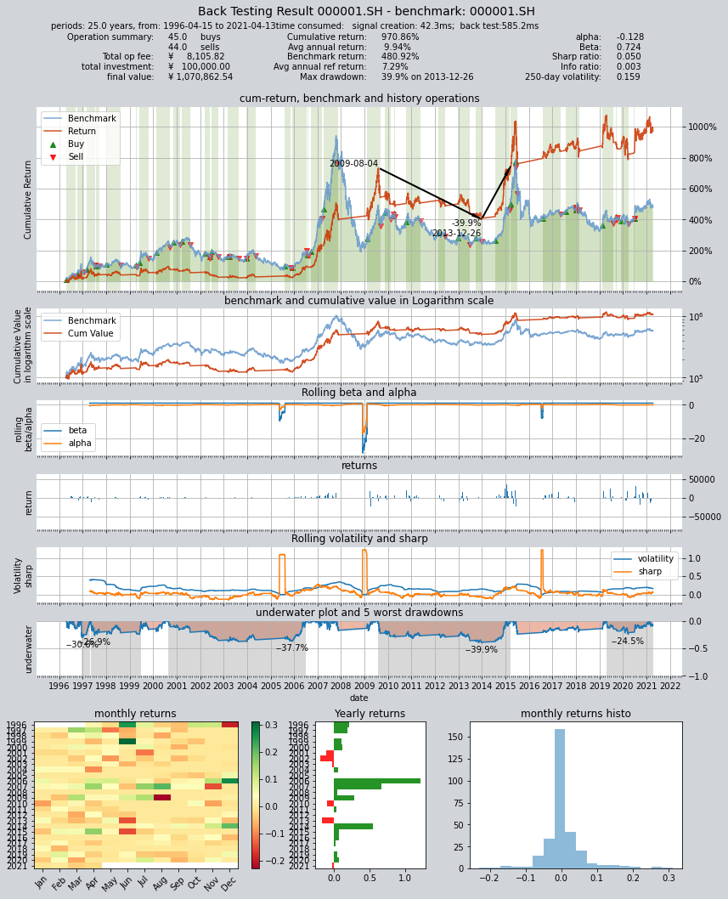
    


```python
op = qt.Operator(strategies=['dmama'])
res = qt.run(op, mode=1)
```

    Progress: [########################################] 1/1. 100.0%  Extracting data local files

    /Users/jackie/OneDrive/Projects/PycharmProjects/qteasy/qteasy/operator.py:1049: UserWarning: User-defined Signal blenders do not exist, default ones will be created!
      warnings.warn(f'User-defined Signal blenders do not exist, default ones will be created!', UserWarning)


    
         ====================================
         |                                  |
         |       BACK TESTING RESULT        |
         |                                  |
         ====================================
    
    qteasy running mode: 1 - History back testing
    time consumption for operate signal creation: 270.6ms
    time consumption for operation back looping:  580.8ms
    
    investment starts on      1996-04-15 00:00:00
    ends on                   2021-04-13 00:00:00
    Total looped periods:     25.0 years.
    
    -------------operation summary:------------
    
              Sell Cnt Buy Cnt Total Long pct Short pct Empty pct
    000001.SH   137      136    273   53.3%      0.0%     46.7%   
    
    Total operation fee:     ¥   80,851.94
    total investment amount: ¥  100,000.00
    final value:              ¥2,574,675.59
    Total return:                  2474.68% 
    Avg Yearly return:               13.87%
    Skewness:                         -0.70
    Kurtosis:                         13.43
    Benchmark return:               480.92% 
    Benchmark Yearly return:          7.29%
    
    ------strategy loop_results indicators------ 
    alpha:                            0.045
    Beta:                             0.997
    Sharp ratio:                      0.038
    Info ratio:                       0.015
    250 day volatility:               0.161
    Max drawdown:                    39.49% 
        peak / valley:        2015-06-12 / 2020-06-15
        recovered on:         Not recovered!
    
    
    ===========END OF REPORT=============
    


    

    


```python
op = qt.Operator(strategies=['dfama'])
res = qt.run(op, mode=1)
```

    Progress: [########################################] 1/1. 100.0%  Extracting data local files

    /Users/jackie/OneDrive/Projects/PycharmProjects/qteasy/qteasy/operator.py:1049: UserWarning: User-defined Signal blenders do not exist, default ones will be created!
      warnings.warn(f'User-defined Signal blenders do not exist, default ones will be created!', UserWarning)


    
         ====================================
         |                                  |
         |       BACK TESTING RESULT        |
         |                                  |
         ====================================
    
    qteasy running mode: 1 - History back testing
    time consumption for operate signal creation: 258.3ms
    time consumption for operation back looping:  547.5ms
    
    investment starts on      1996-04-15 00:00:00
    ends on                   2021-04-13 00:00:00
    Total looped periods:     25.0 years.
    
    -------------operation summary:------------
    
              Sell Cnt Buy Cnt Total Long pct Short pct Empty pct
    000001.SH    58       57    115   52.3%      0.0%     47.7%   
    
    Total operation fee:     ¥   23,184.64
    total investment amount: ¥  100,000.00
    final value:              ¥1,764,779.73
    Total return:                  1664.78% 
    Avg Yearly return:               12.16%
    Skewness:                         -0.69
    Kurtosis:                         12.85
    Benchmark return:               480.92% 
    Benchmark Yearly return:          7.29%
    
    ------strategy loop_results indicators------ 
    alpha:                            0.031
    Beta:                             0.997
    Sharp ratio:                      0.027
    Info ratio:                       0.010
    250 day volatility:               0.160
    Max drawdown:                    46.06% 
        peak / valley:        2015-06-12 / 2020-06-15
        recovered on:         Not recovered!
    
    
    ===========END OF REPORT=============
    


    
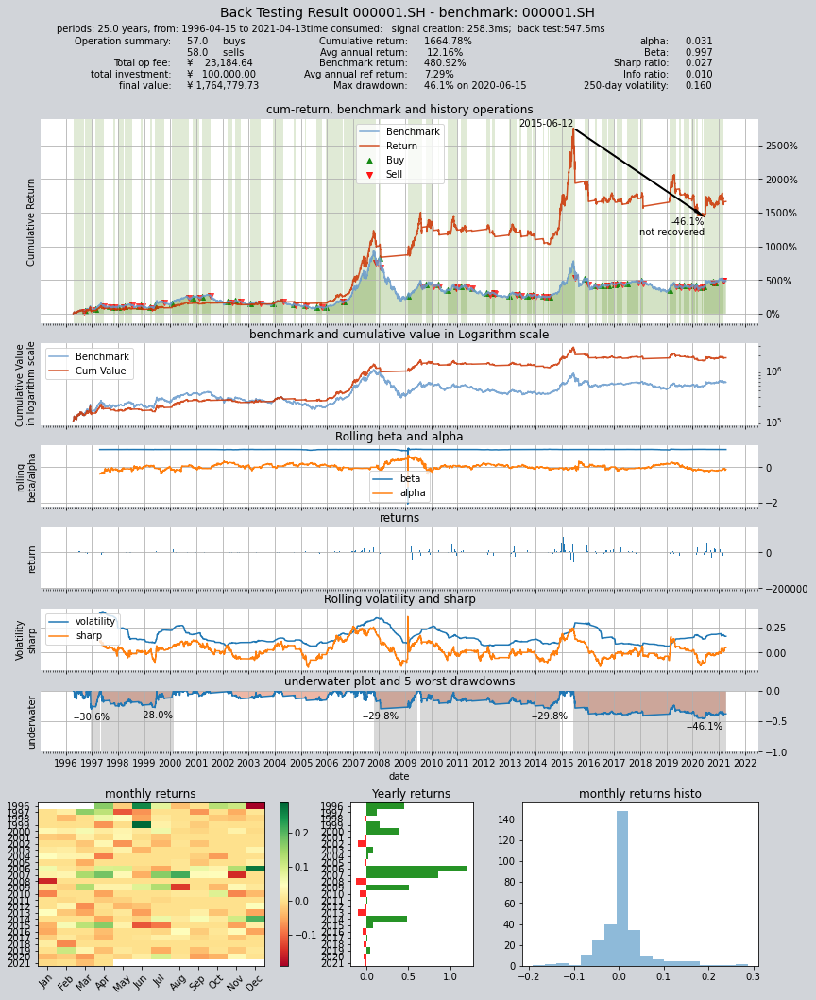
    


```python
op = qt.Operator(strategies=['dt3'])
res = qt.run(op, mode=1)
```

    Progress: [########################################] 1/1. 100.0%  Extracting data local files

    /Users/jackie/OneDrive/Projects/PycharmProjects/qteasy/qteasy/operator.py:1049: UserWarning: User-defined Signal blenders do not exist, default ones will be created!
      warnings.warn(f'User-defined Signal blenders do not exist, default ones will be created!', UserWarning)


    
         ====================================
         |                                  |
         |       BACK TESTING RESULT        |
         |                                  |
         ====================================
    
    qteasy running mode: 1 - History back testing
    time consumption for operate signal creation: 42.1ms
    time consumption for operation back looping:  572.4ms
    
    investment starts on      1996-04-15 00:00:00
    ends on                   2021-04-13 00:00:00
    Total looped periods:     25.0 years.
    
    -------------operation summary:------------
    
              Sell Cnt Buy Cnt Total Long pct Short pct Empty pct
    000001.SH   118      118    236   52.8%      0.0%     47.2%   
    
    Total operation fee:     ¥   32,440.65
    total investment amount: ¥  100,000.00
    final value:              ¥1,286,985.75
    Total return:                  1186.99% 
    Avg Yearly return:               10.76%
    Skewness:                         -0.73
    Kurtosis:                         13.19
    Benchmark return:               480.92% 
    Benchmark Yearly return:          7.29%
    
    ------strategy loop_results indicators------ 
    alpha:                            0.008
    Beta:                             0.997
    Sharp ratio:                      0.030
    Info ratio:                       0.006
    250 day volatility:               0.164
    Max drawdown:                    38.98% 
        peak / valley:        2007-10-16 / 2009-01-21
        recovered on:         2009-07-24
    
    
    ===========END OF REPORT=============
    


    
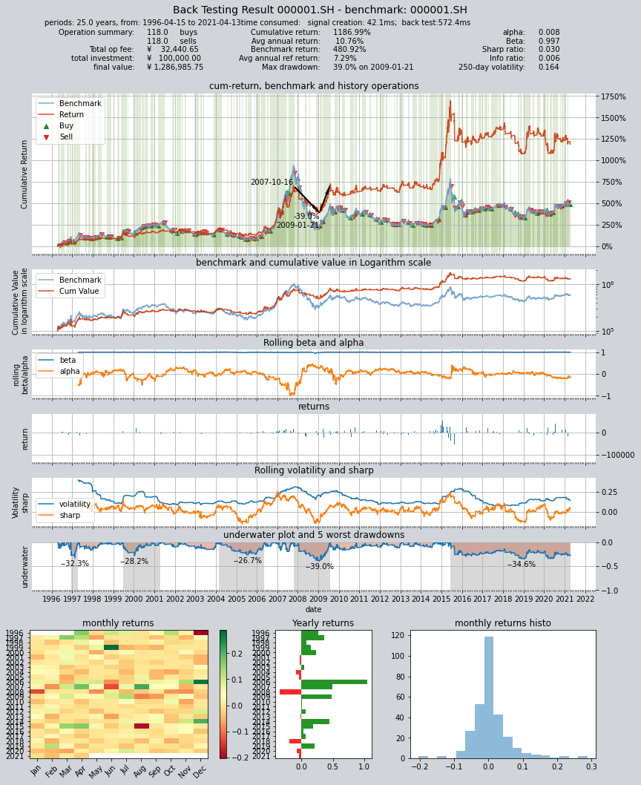
    


```python
op = qt.Operator(strategies=['dtema'])
res = qt.run(op, mode=1)
```

    Progress: [########################################] 1/1. 100.0%  Extracting data local files

    /Users/jackie/OneDrive/Projects/PycharmProjects/qteasy/qteasy/operator.py:1049: UserWarning: User-defined Signal blenders do not exist, default ones will be created!
      warnings.warn(f'User-defined Signal blenders do not exist, default ones will be created!', UserWarning)


    
         ====================================
         |                                  |
         |       BACK TESTING RESULT        |
         |                                  |
         ====================================
    
    qteasy running mode: 1 - History back testing
    time consumption for operate signal creation: 64.3ms
    time consumption for operation back looping:  585.0ms
    
    investment starts on      1996-04-15 00:00:00
    ends on                   2021-04-13 00:00:00
    Total looped periods:     25.0 years.
    
    -------------operation summary:------------
    
              Sell Cnt Buy Cnt Total Long pct Short pct Empty pct
    000001.SH   497      496    993   49.8%      0.0%     50.2%   
    
    Total operation fee:     ¥  145,631.11
    total investment amount: ¥  100,000.00
    final value:              ¥1,805,256.44
    Total return:                  1705.26% 
    Avg Yearly return:               12.26%
    Skewness:                          0.29
    Kurtosis:                         15.36
    Benchmark return:               480.92% 
    Benchmark Yearly return:          7.29%
    
    ------strategy loop_results indicators------ 
    alpha:                            0.003
    Beta:                             0.993
    Sharp ratio:                      0.044
    Info ratio:                       0.009
    250 day volatility:               0.158
    Max drawdown:                    44.01% 
        peak / valley:        2007-10-31 / 2008-11-04
        recovered on:         2011-02-14
    
    
    ===========END OF REPORT=============
    


    
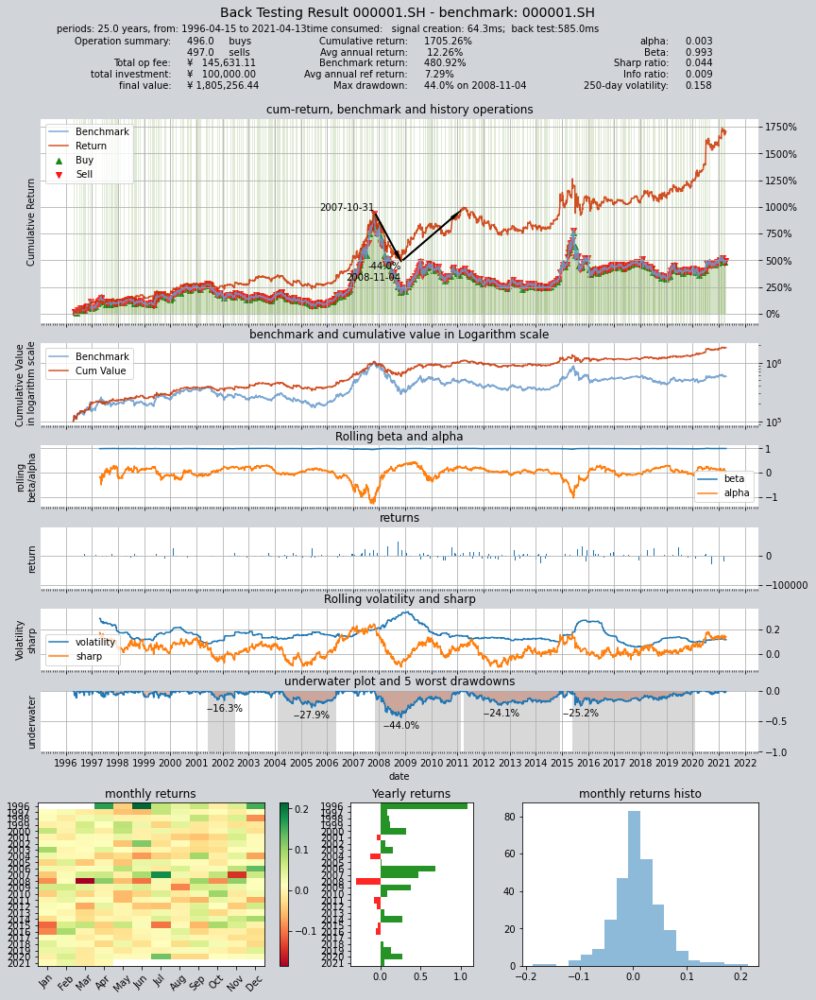
    


```python
op = qt.Operator(strategies=['dtrima'])
res = qt.run(op, mode=1)
```

    Progress: [########################################] 1/1. 100.0%  Extracting data local files

    /Users/jackie/OneDrive/Projects/PycharmProjects/qteasy/qteasy/operator.py:1049: UserWarning: User-defined Signal blenders do not exist, default ones will be created!
      warnings.warn(f'User-defined Signal blenders do not exist, default ones will be created!', UserWarning)


    
         ====================================
         |                                  |
         |       BACK TESTING RESULT        |
         |                                  |
         ====================================
    
    qteasy running mode: 1 - History back testing
    time consumption for operate signal creation: 38.3ms
    time consumption for operation back looping:  550.6ms
    
    investment starts on      1996-04-15 00:00:00
    ends on                   2021-04-13 00:00:00
    Total looped periods:     25.0 years.
    
    -------------operation summary:------------
    
              Sell Cnt Buy Cnt Total Long pct Short pct Empty pct
    000001.SH    34       34     68   52.3%      0.0%     47.7%   
    
    Total operation fee:     ¥    9,376.42
    total investment amount: ¥  100,000.00
    final value:              ¥1,448,674.20
    Total return:                  1348.67% 
    Avg Yearly return:               11.28%
    Skewness:                         -0.68
    Kurtosis:                         11.80
    Benchmark return:               480.92% 
    Benchmark Yearly return:          7.29%
    
    ------strategy loop_results indicators------ 
    alpha:                           -0.069
    Beta:                             0.805
    Sharp ratio:                      0.043
    Info ratio:                       0.008
    250 day volatility:               0.161
    Max drawdown:                    39.98% 
        peak / valley:        2015-06-12 / 2020-03-23
        recovered on:         Not recovered!
    
    
    ===========END OF REPORT=============
    


    

    


```python
op = qt.Operator(strategies=['dwma'])
op.set_parameter(0, pars=(200, 22))
res = qt.run(op, mode=1)
```

    Progress: [########################################] 1/1. 100.0%  Extracting data local files

    /Users/jackie/OneDrive/Projects/PycharmProjects/qteasy/qteasy/operator.py:1049: UserWarning: User-defined Signal blenders do not exist, default ones will be created!
      warnings.warn(f'User-defined Signal blenders do not exist, default ones will be created!', UserWarning)


    
         ====================================
         |                                  |
         |       BACK TESTING RESULT        |
         |                                  |
         ====================================
    
    qteasy running mode: 1 - History back testing
    time consumption for operate signal creation: 35.3ms
    time consumption for operation back looping:  556.8ms
    
    investment starts on      1996-04-15 00:00:00
    ends on                   2021-04-13 00:00:00
    Total looped periods:     25.0 years.
    
    -------------operation summary:------------
    
              Sell Cnt Buy Cnt Total Long pct Short pct Empty pct
    000001.SH    33       34     67   53.7%      0.0%     46.3%   
    
    Total operation fee:     ¥    9,293.27
    total investment amount: ¥  100,000.00
    final value:              ¥1,439,770.26
    Total return:                  1339.77% 
    Avg Yearly return:               11.25%
    Skewness:                         -0.79
    Kurtosis:                         11.81
    Benchmark return:               480.92% 
    Benchmark Yearly return:          7.29%
    
    ------strategy loop_results indicators------ 
    alpha:                            0.008
    Beta:                             0.924
    Sharp ratio:                      0.036
    Info ratio:                       0.008
    250 day volatility:               0.161
    Max drawdown:                    36.23% 
        peak / valley:        2009-08-04 / 2013-12-26
        recovered on:         2014-12-31
    
    
    ===========END OF REPORT=============
    


    
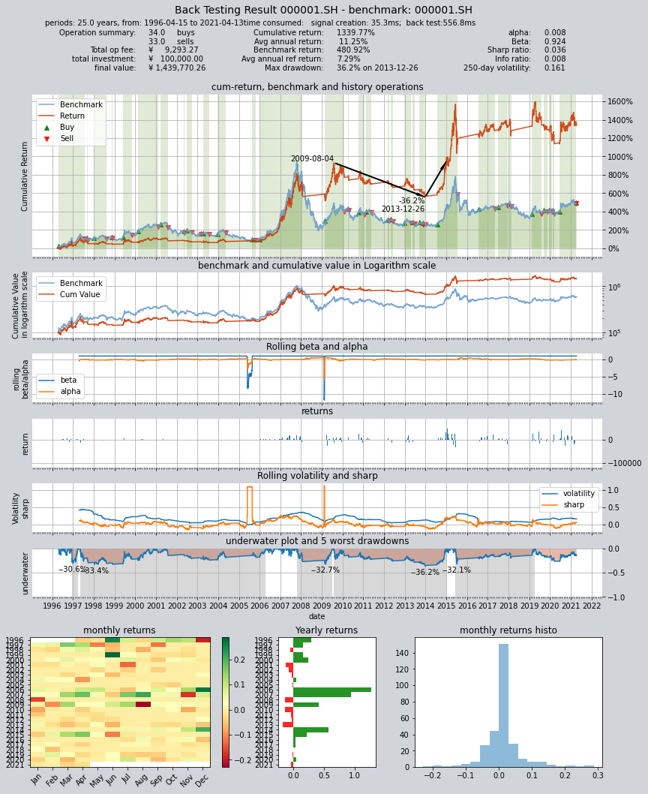
    


```python
op = qt.Operator(strategies=['slsma'])
res = qt.run(op, mode=1)
```

    Progress: [########################################] 1/1. 100.0%  Extracting data local files

    /Users/jackie/OneDrive/Projects/PycharmProjects/qteasy/qteasy/operator.py:1049: UserWarning: User-defined Signal blenders do not exist, default ones will be created!
      warnings.warn(f'User-defined Signal blenders do not exist, default ones will be created!', UserWarning)


    
         ====================================
         |                                  |
         |       BACK TESTING RESULT        |
         |                                  |
         ====================================
    
    qteasy running mode: 1 - History back testing
    time consumption for operate signal creation: 23.8ms
    time consumption for operation back looping:  572.2ms
    
    investment starts on      1996-04-15 00:00:00
    ends on                   2021-04-13 00:00:00
    Total looped periods:     25.0 years.
    
    -------------operation summary:------------
    
              Sell Cnt Buy Cnt Total Long pct Short pct Empty pct
    000001.SH   180      179    359   52.3%      0.0%     47.7%   
    
    Total operation fee:     ¥   76,876.35
    total investment amount: ¥  100,000.00
    final value:              ¥2,212,725.86
    Total return:                  2112.73% 
    Avg Yearly return:               13.18%
    Skewness:                         -0.65
    Kurtosis:                         12.88
    Benchmark return:               480.92% 
    Benchmark Yearly return:          7.29%
    
    ------strategy loop_results indicators------ 
    alpha:                            0.040
    Beta:                             0.996
    Sharp ratio:                      0.029
    Info ratio:                       0.013
    250 day volatility:               0.158
    Max drawdown:                    44.26% 
        peak / valley:        2009-08-04 / 2014-07-10
        recovered on:         2015-03-30
    
    
    ===========END OF REPORT=============
    


    

    


```python
op = qt.Operator(strategies=['sldema'])
res = qt.run(op, mode=1)
```

    Progress: [########################################] 1/1. 100.0%  Extracting data local files

    /Users/jackie/OneDrive/Projects/PycharmProjects/qteasy/qteasy/operator.py:1049: UserWarning: User-defined Signal blenders do not exist, default ones will be created!
      warnings.warn(f'User-defined Signal blenders do not exist, default ones will be created!', UserWarning)


    
         ====================================
         |                                  |
         |       BACK TESTING RESULT        |
         |                                  |
         ====================================
    
    qteasy running mode: 1 - History back testing
    time consumption for operate signal creation: 30.5ms
    time consumption for operation back looping:  574.3ms
    
    investment starts on      1996-04-15 00:00:00
    ends on                   2021-04-13 00:00:00
    Total looped periods:     25.0 years.
    
    -------------operation summary:------------
    
              Sell Cnt Buy Cnt Total Long pct Short pct Empty pct
    000001.SH   292      291    583   53.5%      0.0%     46.5%   
    
    Total operation fee:     ¥  322,499.81
    total investment amount: ¥  100,000.00
    final value:              ¥6,003,557.59
    Total return:                  5903.56% 
    Avg Yearly return:               17.79%
    Skewness:                         -0.32
    Kurtosis:                         13.04
    Benchmark return:               480.92% 
    Benchmark Yearly return:          7.29%
    
    ------strategy loop_results indicators------ 
    alpha:                            0.089
    Beta:                             0.994
    Sharp ratio:                      0.057
    Info ratio:                       0.026
    250 day volatility:               0.158
    Max drawdown:                    25.23% 
        peak / valley:        1997-05-12 / 1997-08-11
        recovered on:         1999-05-24
    
    
    ===========END OF REPORT=============
    


    

    


```python
op = qt.Operator(strategies=['slema'])
res = qt.run(op, mode=1)
```

    Progress: [########################################] 1/1. 100.0%  Extracting data local files

    /Users/jackie/OneDrive/Projects/PycharmProjects/qteasy/qteasy/operator.py:1049: UserWarning: User-defined Signal blenders do not exist, default ones will be created!
      warnings.warn(f'User-defined Signal blenders do not exist, default ones will be created!', UserWarning)


    
         ====================================
         |                                  |
         |       BACK TESTING RESULT        |
         |                                  |
         ====================================
    
    qteasy running mode: 1 - History back testing
    time consumption for operate signal creation: 25.4ms
    time consumption for operation back looping:  599.7ms
    
    investment starts on      1996-04-15 00:00:00
    ends on                   2021-04-13 00:00:00
    Total looped periods:     25.0 years.
    
    -------------operation summary:------------
    
              Sell Cnt Buy Cnt Total Long pct Short pct Empty pct
    000001.SH   232      231    463   53.3%      0.0%     46.7%   
    
    Total operation fee:     ¥  171,936.08
    total investment amount: ¥  100,000.00
    final value:              ¥4,069,320.46
    Total return:                  3969.32% 
    Avg Yearly return:               15.97%
    Skewness:                         -0.49
    Kurtosis:                         13.53
    Benchmark return:               480.92% 
    Benchmark Yearly return:          7.29%
    
    ------strategy loop_results indicators------ 
    alpha:                            0.067
    Beta:                             0.994
    Sharp ratio:                      0.046
    Info ratio:                       0.021
    250 day volatility:               0.156
    Max drawdown:                    26.81% 
        peak / valley:        2007-10-16 / 2009-01-16
        recovered on:         2009-06-18
    
    
    ===========END OF REPORT=============
    


    
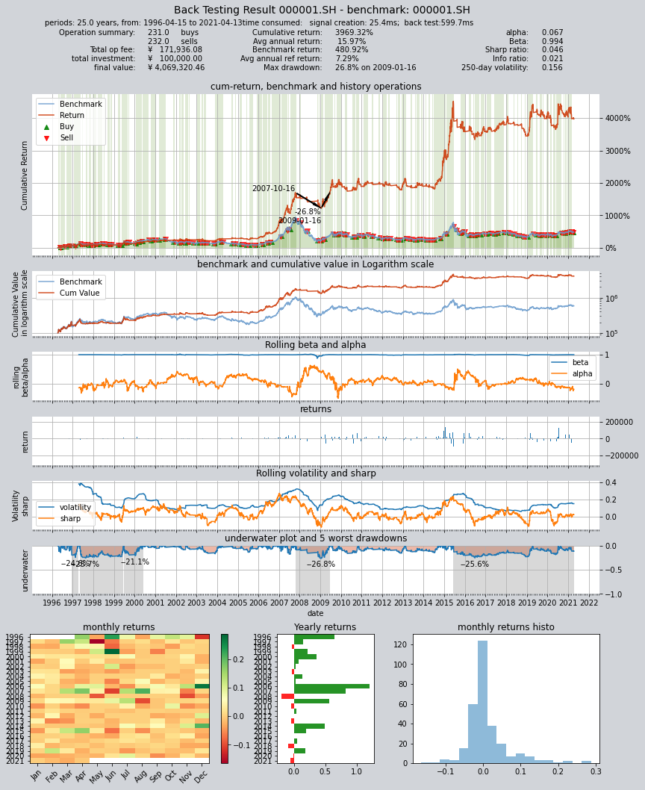
    


```python
op = qt.Operator(strategies=['slht'])
res = qt.run(op, mode=1)
```

    Progress: [########################################] 1/1. 100.0%  Extracting data local files

    /Users/jackie/OneDrive/Projects/PycharmProjects/qteasy/qteasy/operator.py:1049: UserWarning: User-defined Signal blenders do not exist, default ones will be created!
      warnings.warn(f'User-defined Signal blenders do not exist, default ones will be created!', UserWarning)


    
         ====================================
         |                                  |
         |       BACK TESTING RESULT        |
         |                                  |
         ====================================
    
    qteasy running mode: 1 - History back testing
    time consumption for operate signal creation: 129.4ms
    time consumption for operation back looping:  580.4ms
    
    investment starts on      1996-04-15 00:00:00
    ends on                   2021-04-13 00:00:00
    Total looped periods:     25.0 years.
    
    -------------operation summary:------------
    
              Sell Cnt Buy Cnt Total Long pct Short pct Empty pct
    000001.SH   186      185    371   53.1%      0.0%     46.9%   
    
    Total operation fee:     ¥   78,314.29
    total investment amount: ¥  100,000.00
    final value:              ¥2,313,301.46
    Total return:                  2213.30% 
    Avg Yearly return:               13.38%
    Skewness:                         -0.67
    Kurtosis:                         13.57
    Benchmark return:               480.92% 
    Benchmark Yearly return:          7.29%
    
    ------strategy loop_results indicators------ 
    alpha:                            0.042
    Beta:                             0.997
    Sharp ratio:                      0.038
    Info ratio:                       0.014
    250 day volatility:               0.162
    Max drawdown:                    32.27% 
        peak / valley:        2009-08-04 / 2012-11-07
        recovered on:         2014-12-02
    
    
    ===========END OF REPORT=============
    


    
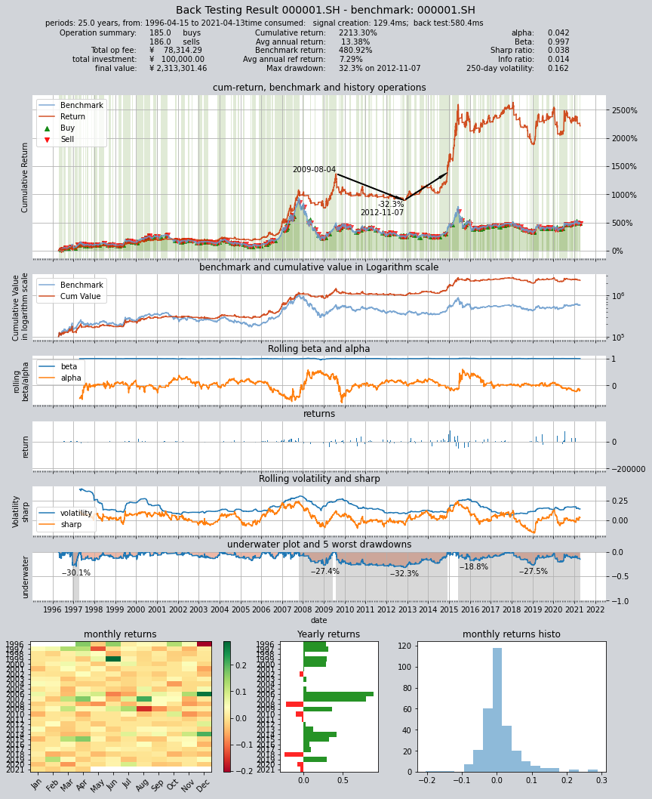
    


```python
op = qt.Operator(strategies=['slkama'])
res = qt.run(op, mode=1)
```

    Progress: [########################################] 1/1. 100.0%  Extracting data local files

    /Users/jackie/OneDrive/Projects/PycharmProjects/qteasy/qteasy/operator.py:1049: UserWarning: User-defined Signal blenders do not exist, default ones will be created!
      warnings.warn(f'User-defined Signal blenders do not exist, default ones will be created!', UserWarning)


    
         ====================================
         |                                  |
         |       BACK TESTING RESULT        |
         |                                  |
         ====================================
    
    qteasy running mode: 1 - History back testing
    time consumption for operate signal creation: 24.5ms
    time consumption for operation back looping:  566.7ms
    
    investment starts on      1996-04-15 00:00:00
    ends on                   2021-04-13 00:00:00
    Total looped periods:     25.0 years.
    
    -------------operation summary:------------
    
              Sell Cnt Buy Cnt Total Long pct Short pct Empty pct
    000001.SH   221      220    441   49.3%      0.0%     50.7%   
    
    Total operation fee:     ¥   91,979.22
    total investment amount: ¥  100,000.00
    final value:              ¥2,145,109.68
    Total return:                  2045.11% 
    Avg Yearly return:               13.04%
    Skewness:                         -0.36
    Kurtosis:                         14.19
    Benchmark return:               480.92% 
    Benchmark Yearly return:          7.29%
    
    ------strategy loop_results indicators------ 
    alpha:                            0.029
    Beta:                             0.993
    Sharp ratio:                      0.040
    Info ratio:                       0.011
    250 day volatility:               0.150
    Max drawdown:                    32.78% 
        peak / valley:        2007-10-16 / 2008-12-23
        recovered on:         2009-07-06
    
    
    ===========END OF REPORT=============
    


    
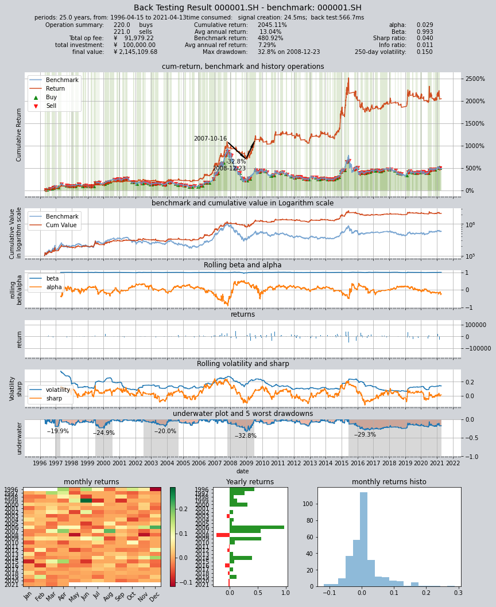
    


```python
op = qt.Operator(strategies=['slmama'])
res = qt.run(op, mode=1)
```

    Progress: [########################################] 1/1. 100.0%  Extracting data local files

    /Users/jackie/OneDrive/Projects/PycharmProjects/qteasy/qteasy/operator.py:1049: UserWarning: User-defined Signal blenders do not exist, default ones will be created!
      warnings.warn(f'User-defined Signal blenders do not exist, default ones will be created!', UserWarning)


    
         ====================================
         |                                  |
         |       BACK TESTING RESULT        |
         |                                  |
         ====================================
    
    qteasy running mode: 1 - History back testing
    time consumption for operate signal creation: 133.8ms
    time consumption for operation back looping:  578.8ms
    
    investment starts on      1996-04-15 00:00:00
    ends on                   2021-04-13 00:00:00
    Total looped periods:     25.0 years.
    
    -------------operation summary:------------
    
              Sell Cnt Buy Cnt Total Long pct Short pct Empty pct
    000001.SH   494      493    987   53.2%      0.0%     46.8%   
    
    Total operation fee:     ¥  331,123.13
    total investment amount: ¥  100,000.00
    final value:              ¥3,839,038.80
    Total return:                  3739.04% 
    Avg Yearly return:               15.70%
    Skewness:                         -0.11
    Kurtosis:                         13.87
    Benchmark return:               480.92% 
    Benchmark Yearly return:          7.29%
    
    ------strategy loop_results indicators------ 
    alpha:                            0.055
    Beta:                             0.990
    Sharp ratio:                      0.048
    Info ratio:                       0.019
    250 day volatility:               0.157
    Max drawdown:                    25.57% 
        peak / valley:        2015-07-23 / 2018-12-14
        recovered on:         2020-07-06
    
    
    ===========END OF REPORT=============
    


    
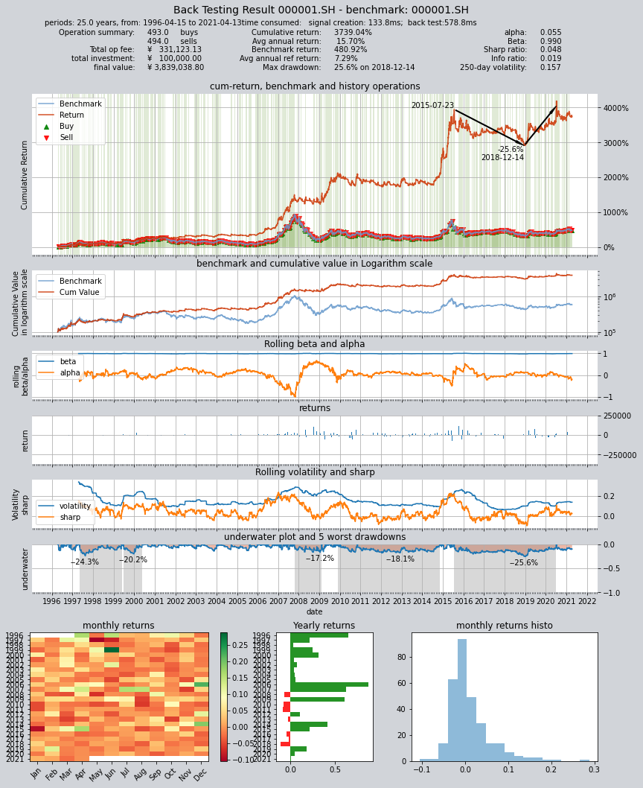
    


```python
op = qt.Operator(strategies=['slfama'])
res = qt.run(op, mode=1)
```

    Progress: [########################################] 1/1. 100.0%  Extracting data local files

    /Users/jackie/OneDrive/Projects/PycharmProjects/qteasy/qteasy/operator.py:1049: UserWarning: User-defined Signal blenders do not exist, default ones will be created!
      warnings.warn(f'User-defined Signal blenders do not exist, default ones will be created!', UserWarning)


    
         ====================================
         |                                  |
         |       BACK TESTING RESULT        |
         |                                  |
         ====================================
    
    qteasy running mode: 1 - History back testing
    time consumption for operate signal creation: 139.5ms
    time consumption for operation back looping:  588.8ms
    
    investment starts on      1996-04-15 00:00:00
    ends on                   2021-04-13 00:00:00
    Total looped periods:     25.0 years.
    
    -------------operation summary:------------
    
              Sell Cnt Buy Cnt Total Long pct Short pct Empty pct
    000001.SH   121      120    241   52.9%      0.0%     47.1%   
    
    Total operation fee:     ¥   34,547.45
    total investment amount: ¥  100,000.00
    final value:              ¥1,187,917.00
    Total return:                  1087.92% 
    Avg Yearly return:               10.40%
    Skewness:                         -0.75
    Kurtosis:                         13.33
    Benchmark return:               480.92% 
    Benchmark Yearly return:          7.29%
    
    ------strategy loop_results indicators------ 
    alpha:                            0.007
    Beta:                             0.997
    Sharp ratio:                      0.027
    Info ratio:                       0.004
    250 day volatility:               0.163
    Max drawdown:                    47.92% 
        peak / valley:        2015-06-12 / 2020-06-15
        recovered on:         Not recovered!
    
    
    ===========END OF REPORT=============
    


    

    


```python
op = qt.Operator(strategies=['slt3'])
res = qt.run(op, mode=1)
```

    Progress: [########################################] 1/1. 100.0%  Extracting data local files

    /Users/jackie/OneDrive/Projects/PycharmProjects/qteasy/qteasy/operator.py:1049: UserWarning: User-defined Signal blenders do not exist, default ones will be created!
      warnings.warn(f'User-defined Signal blenders do not exist, default ones will be created!', UserWarning)


    
         ====================================
         |                                  |
         |       BACK TESTING RESULT        |
         |                                  |
         ====================================
    
    qteasy running mode: 1 - History back testing
    time consumption for operate signal creation: 24.6ms
    time consumption for operation back looping:  554.0ms
    
    investment starts on      1996-04-15 00:00:00
    ends on                   2021-04-13 00:00:00
    Total looped periods:     25.0 years.
    
    -------------operation summary:------------
    
              Sell Cnt Buy Cnt Total Long pct Short pct Empty pct
    000001.SH   106      106    212   53.1%      0.0%     46.9%   
    
    Total operation fee:     ¥   23,376.58
    total investment amount: ¥  100,000.00
    final value:              ¥  984,738.14
    Total return:                   884.74% 
    Avg Yearly return:                9.58%
    Skewness:                         -0.73
    Kurtosis:                         13.29
    Benchmark return:               480.92% 
    Benchmark Yearly return:          7.29%
    
    ------strategy loop_results indicators------ 
    alpha:                           -0.002
    Beta:                             0.997
    Sharp ratio:                      0.027
    Info ratio:                       0.002
    250 day volatility:               0.163
    Max drawdown:                    35.69% 
        peak / valley:        2007-10-16 / 2009-01-21
        recovered on:         2009-07-15
    
    
    ===========END OF REPORT=============
    


    
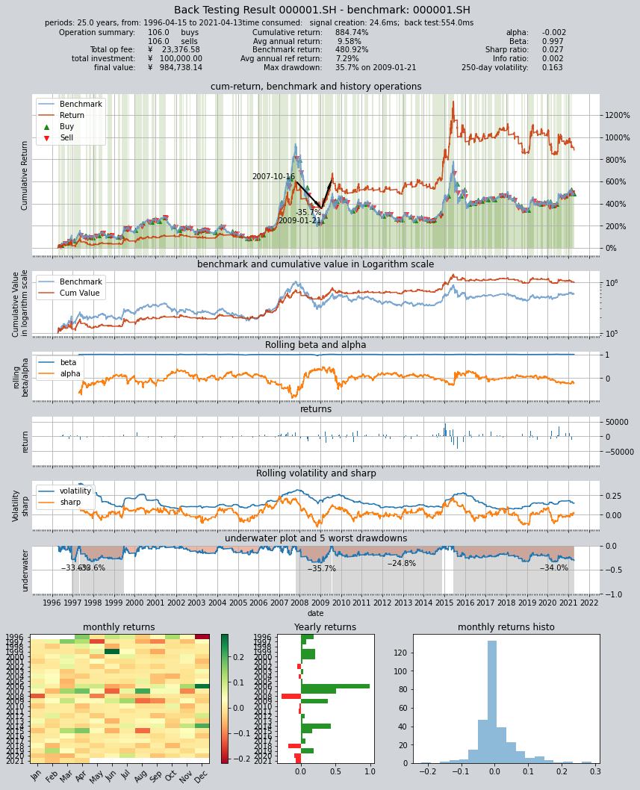
    


```python
op = qt.Operator(strategies=['sltema'])
res = qt.run(op, mode=1)
```

    Progress: [########################################] 1/1. 100.0%  Extracting data local files

    /Users/jackie/OneDrive/Projects/PycharmProjects/qteasy/qteasy/operator.py:1049: UserWarning: User-defined Signal blenders do not exist, default ones will be created!
      warnings.warn(f'User-defined Signal blenders do not exist, default ones will be created!', UserWarning)


    
         ====================================
         |                                  |
         |       BACK TESTING RESULT        |
         |                                  |
         ====================================
    
    qteasy running mode: 1 - History back testing
    time consumption for operate signal creation: 25.1ms
    time consumption for operation back looping:  627.7ms
    
    investment starts on      1996-04-15 00:00:00
    ends on                   2021-04-13 00:00:00
    Total looped periods:     25.0 years.
    
    -------------operation summary:------------
    
              Sell Cnt Buy Cnt Total Long pct Short pct Empty pct
    000001.SH   637      636    1273  53.4%      0.0%     46.6%   
    
    Total operation fee:     ¥  271,491.57
    total investment amount: ¥  100,000.00
    final value:              ¥2,071,418.67
    Total return:                  1971.42% 
    Avg Yearly return:               12.88%
    Skewness:                         -0.07
    Kurtosis:                         13.77
    Benchmark return:               480.92% 
    Benchmark Yearly return:          7.29%
    
    ------strategy loop_results indicators------ 
    alpha:                            0.028
    Beta:                             0.989
    Sharp ratio:                      0.035
    Info ratio:                       0.011
    250 day volatility:               0.159
    Max drawdown:                    40.19% 
        peak / valley:        2015-07-13 / 2018-12-14
        recovered on:         Not recovered!
    
    
    ===========END OF REPORT=============
    


    

    


```python
op = qt.Operator(strategies=['sltrima'])
res = qt.run(op, mode=1)
```

    Progress: [########################################] 1/1. 100.0%  Extracting data local files

    /Users/jackie/OneDrive/Projects/PycharmProjects/qteasy/qteasy/operator.py:1049: UserWarning: User-defined Signal blenders do not exist, default ones will be created!
      warnings.warn(f'User-defined Signal blenders do not exist, default ones will be created!', UserWarning)


    
         ====================================
         |                                  |
         |       BACK TESTING RESULT        |
         |                                  |
         ====================================
    
    qteasy running mode: 1 - History back testing
    time consumption for operate signal creation: 23.8ms
    time consumption for operation back looping:  554.7ms
    
    investment starts on      1996-04-15 00:00:00
    ends on                   2021-04-13 00:00:00
    Total looped periods:     25.0 years.
    
    -------------operation summary:------------
    
              Sell Cnt Buy Cnt Total Long pct Short pct Empty pct
    000001.SH    84       83    167   53.7%      0.0%     46.3%   
    
    Total operation fee:     ¥   18,479.00
    total investment amount: ¥  100,000.00
    final value:              ¥1,124,468.69
    Total return:                  1024.47% 
    Avg Yearly return:               10.16%
    Skewness:                         -0.77
    Kurtosis:                         12.34
    Benchmark return:               480.92% 
    Benchmark Yearly return:          7.29%
    
    ------strategy loop_results indicators------ 
    alpha:                            0.002
    Beta:                             0.997
    Sharp ratio:                      0.023
    Info ratio:                       0.004
    250 day volatility:               0.166
    Max drawdown:                    39.94% 
        peak / valley:        2007-10-16 / 2008-12-31
        recovered on:         2010-10-25
    
    
    ===========END OF REPORT=============
    


    

    


```python
op = qt.Operator(strategies=['slwma'])
res = qt.run(op, mode=1)
```

    Progress: [########################################] 1/1. 100.0%  Extracting data local files

    /Users/jackie/OneDrive/Projects/PycharmProjects/qteasy/qteasy/operator.py:1049: UserWarning: User-defined Signal blenders do not exist, default ones will be created!
      warnings.warn(f'User-defined Signal blenders do not exist, default ones will be created!', UserWarning)


    
         ====================================
         |                                  |
         |       BACK TESTING RESULT        |
         |                                  |
         ====================================
    
    qteasy running mode: 1 - History back testing
    time consumption for operate signal creation: 23.2ms
    time consumption for operation back looping:  601.8ms
    
    investment starts on      1996-04-15 00:00:00
    ends on                   2021-04-13 00:00:00
    Total looped periods:     25.0 years.
    
    -------------operation summary:------------
    
              Sell Cnt Buy Cnt Total Long pct Short pct Empty pct
    000001.SH   111      111    222   54.0%      0.0%     46.0%   
    
    Total operation fee:     ¥   33,484.92
    total investment amount: ¥  100,000.00
    final value:              ¥1,433,746.89
    Total return:                  1333.75% 
    Avg Yearly return:               11.23%
    Skewness:                         -0.69
    Kurtosis:                         12.70
    Benchmark return:               480.92% 
    Benchmark Yearly return:          7.29%
    
    ------strategy loop_results indicators------ 
    alpha:                            0.022
    Beta:                             0.991
    Sharp ratio:                      0.025
    Info ratio:                       0.008
    250 day volatility:               0.160
    Max drawdown:                    39.66% 
        peak / valley:        2015-06-12 / 2020-06-16
        recovered on:         Not recovered!
    
    
    ===========END OF REPORT=============
    


    
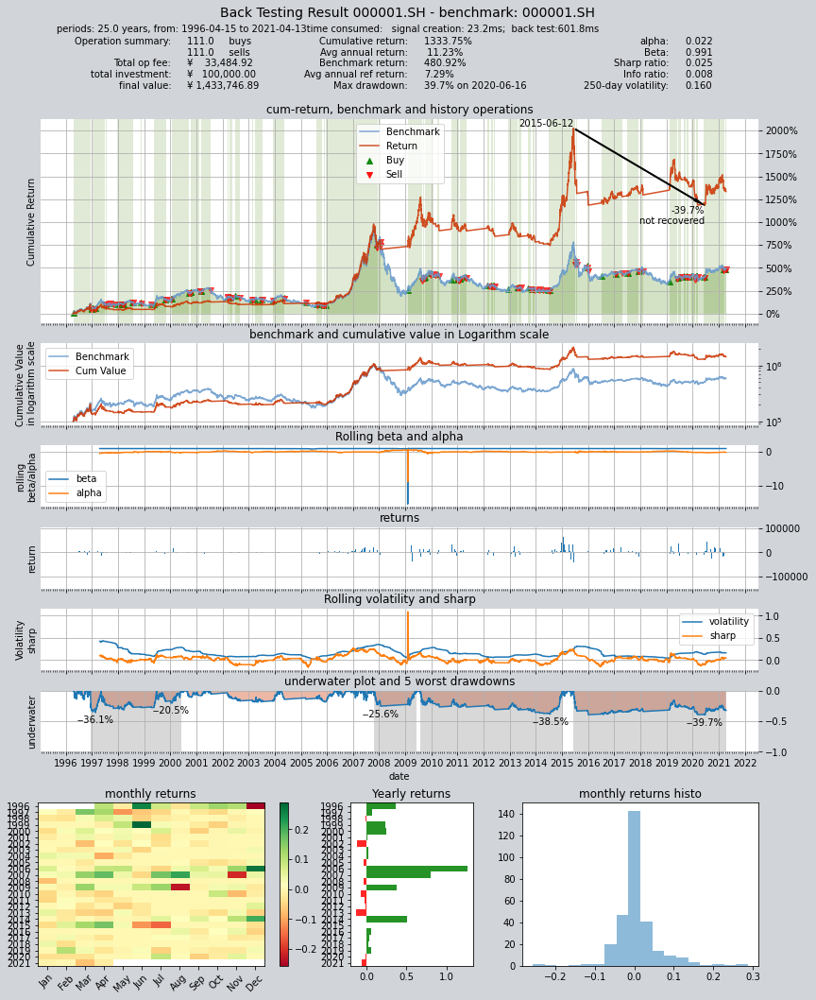
    


```python

```
